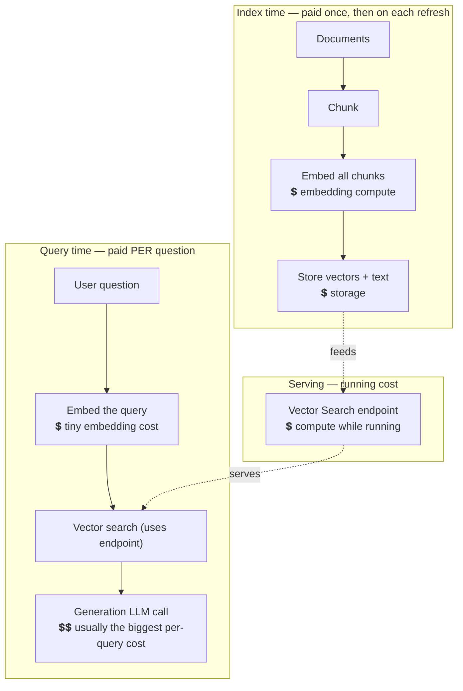
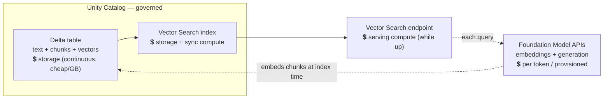

# RAG Cost & Storage: What You Pay For and How to Save

> A RAG system is like a library you build and then keep open to the public. There's a
> one-time cost to catalog every book (index your documents), a running cost to keep the
> lights on and a librarian at the desk (the Vector Search endpoint), a rent bill for the
> shelves (storage), and a per-visitor cost every time someone asks the librarian to read
> passages aloud and summarize them (the generation call). If your bill is a surprise,
> it's almost always because one of these four was bigger than you pictured.

You've built a RAG pipeline: chunk, embed, index, retrieve, generate. It works. Now the
question every data engineer eventually gets from their manager: *"What is this going to
cost, and can we make it cheaper?"* This lesson answers both — plainly, with the numbers
broken down so you always know which knob to turn.

Take a breath. There's no scary finance here. If you can reason about the cost of an ETL
job — compute while it runs, storage for what it lands — you can reason about RAG. It's
the same instincts, applied to four moving parts.

## Learning Objectives

By the end of this lesson, you will be able to:

- Name the **four cost centers** of a RAG system and explain what drives each.
- Separate **one-time / index-time** costs from **per-query** costs, and say which usually dominates.
- Estimate **storage** for a vector index (the ~4 KB-per-vector math) and reason about how it grows.
- Explain how `chunk size`, `overlap`, `top_k`, the embedding model, and the sync mode each move the bill.
- Apply a concrete **cost-saving playbook** across indexing, storage, retrieval, and generation — without wrecking quality.
- Do a back-of-the-envelope cost decomposition for a realistic RAG workload.

## Prerequisites

- [What Is RAG?](/docs/rag-and-ai-search/what-is-rag) — the retrieve-then-generate flow whose pieces we're now pricing.
- [Chunking](/docs/rag-and-ai-search/chunking) and [Vector Search Index](/docs/rag-and-ai-search/vector-search-index) — the two biggest levers on both cost and storage.
- Helpful: [Embeddings](/docs/llm-foundations/embeddings) (the ~4 KB-per-vector fact) and [Tokens & Tokenization](/docs/llm-foundations/tokens-and-tokenization) (tokens are the unit you pay in).

## Estimated Reading Time

About 25 to 30 minutes. There's nothing to install. The goal is a durable mental model of
RAG economics, not memorized prices — those change, and we'll tell you where to check.

:::warning[Prices change — reason in ratios, not dollars]
Every dollar figure here is **illustrative**, to build intuition about *relative* size.
Databricks and foundation-model pricing changes; always confirm current numbers on the
[Databricks pricing page](https://www.databricks.com/product/pricing) and in the
[Foundation Model APIs docs](https://docs.databricks.com/aws/en/machine-learning/foundation-model-apis/)
before you budget for real.
:::

## Business Motivation

**Northwind Trust** shipped their internal policy assistant. Advisors love it. Then the
first monthly bill arrives and the finance team asks the data engineering team — that's
you — three questions:

1. *"Why did we pay for embeddings twice this month?"*
2. *"The Vector Search endpoint is billing even at 3 a.m. when nobody's asking anything. Why?"*
3. *"If usage doubles, does our cost double — or worse?"*

None of these are hard once you can see the system as **four separate meters** instead of
one mysterious number. A team that understands the meters makes calm, specific decisions:
switch the index to on-demand sync, only re-embed changed rows, send the model three
sharp chunks instead of ten mediocre ones. A team that doesn't understand them either
overspends quietly or panics and rips out a feature that was actually cheap. This lesson
makes you the first kind of team.

## Intuition

Here's the whole cost picture in one diagram. Money enters at four points. Two of them are
paid **once (or occasionally)** when you build and refresh the index; two are paid **every
time someone asks a question**.



*The four meters: (1) embedding at index time, (2) storage, (3) the always-on endpoint,
(4) the per-query generation call. Notice the generation call carries two money signs — for
most interactive RAG systems, it's the largest per-question cost.*

The single most useful instinct: **index-time costs scale with the size of your corpus;
per-query costs scale with your traffic.** A giant document set with light traffic has a
very different bill from a small set hammered by thousands of users. Know which world
you're in and you know where to optimize.

## Theory

Let's define the four cost centers precisely.

**1. Embedding compute (index time).** Every chunk must be turned into a vector at least
once. If you have 2 million chunks, that's 2 million embedding calls up front. You pay
again for any chunk you **re-embed** (on a full rebuild, or when its source text changes
and the index re-syncs). Embedding is priced per token or per call depending on the
endpoint; either way it scales with *total chunk tokens processed*.

**2. Storage.** Vectors, the source text you keep beside them, and metadata all live in
Delta and in the index. Storage is cheap per gigabyte but grows with corpus size and with
your embedding dimensionality (more dimensions = bigger vectors).

**3. The Vector Search endpoint (serving compute).** To answer queries fast, the index is
served from an endpoint that consumes compute **while it's up** — often close to
around-the-clock for an interactive app. This is the cost that surprises people, because
it accrues even when no one is querying. Sync mode matters too: `CONTINUOUS` keeps compute
running to stay fresh; `TRIGGERED` only spins up compute when you refresh.

**4. The generation call (query time).** Each question sends a prompt — your instructions
**plus the retrieved chunks** — to a generation model, which returns an answer. You pay
for **input tokens** (prompt + chunks) and **output tokens** (the answer). Output tokens
are typically the priciest per token, and the retrieved chunks are usually the largest
part of the input. This is why `top_k` and chunk size show up on your bill.

:::note[Two pricing shapes to know]
Foundation models on Databricks are commonly billed **pay-per-token** (you pay for exactly
the tokens you use — great for spiky or low volume) or via **provisioned throughput** (you
reserve capacity for a steady price — cheaper at high, predictable volume). Vector Search
endpoints bill for the **serving compute** they use while running, plus storage. Match the
pricing shape to your traffic pattern; verify current specifics in the docs.
:::

## Deep Dive

### Which cost dominates?

It depends entirely on the **ratio of corpus size to query volume** — and the answer tells
you where to spend your optimization effort.

| Situation | Dominant cost | Where to optimize first |
|---|---|---|
| Huge corpus, light traffic | Index-time embedding + storage | Incremental re-embedding, smaller vectors, TRIGGERED sync |
| Small corpus, heavy traffic | Per-query generation + endpoint | Smaller `k`, cheaper model, caching, prompt trimming |
| Steady app, moderate both | The always-on **endpoint** quietly adds up | Shared endpoints, right-sizing, sync mode |
| One-off / prototype | Usually trivial | Don't over-engineer; just don't leave a CONTINUOUS endpoint running |

For most **interactive** RAG apps at Northwind Trust's scale, the ranking is usually:
**generation call ≥ endpoint > storage > query embedding**, with index-time embedding a
periodic spike rather than a daily cost. Your mileage varies — measure before you assume.

### The per-query cost, made concrete

A single question costs roughly:

```text
query_cost ≈ embed(query)                 # tiny: one short text
           + vector_search(endpoint)       # amortized in the endpoint's running cost
           + generate(prompt + k chunks)   # the big one: scales with tokens in + out
```

The generation term is where `top_k` bites. If each chunk is ~500 tokens and you retrieve
`k = 8`, that's ~4,000 tokens of context **every single question**, before your
instructions and the user's text. Drop to `k = 3` with a reranker keeping quality, and you
just cut the largest part of your per-query input by more than half.

## Architecture

Here's where each meter physically sits on Databricks, and which ones bill continuously vs.
per event.



*Storage bills quietly and continuously but is cheap per gigabyte. The endpoint bills for
compute while it's up. The Foundation Model APIs bill per token — at index time (bulk
embedding) and at query time (query embedding + generation).*

## Internal Working: the storage math

Storage is the easiest cost to estimate exactly, so let's do it — this is the number
managers most often want.

A vector is `dimensions × 4 bytes` (float32). For a common 1024-dimensional embedding:

```text
1 vector  = 1024 × 4 bytes ≈ 4 KB
1,000,000 chunks ≈ 4 GB      (vectors alone)
10,000,000 chunks ≈ 40 GB    (vectors alone)
```

Then add, per row:

- **The source text** you keep beside the vector (needed for display and for the prompt) — often *larger* than the vector itself for long chunks.
- **Metadata** — ids, titles, source paths, timestamps, filter columns.
- **Index overhead** — the approximate-nearest-neighbor structure adds some bytes on top of the raw vectors.
- **Delta history** — old file versions retained until you `VACUUM`.

A useful rule of thumb: **budget roughly 2–3× the raw-vector size** once you include text,
metadata, and index overhead. So 10M chunks of moderate-length text land in the ballpark
of ~100 GB, not 40 GB. Storage is cheap per gigabyte, but this is why *chunk count* (driven
by chunk size and overlap) quietly sets your storage floor.

:::tip[Dimensionality is a storage dial]
Halving embedding dimensions (e.g. a model that outputs 512 instead of 1024) roughly
**halves** the vector storage and shrinks every similarity computation. If a smaller model
meets your retrieval quality, that's a permanent, compounding saving across storage *and*
query compute. Measure recall before committing — see [RAG Quality](/docs/rag-and-ai-search/rag-quality).
:::

## Step-by-Step Walkthrough: decomposing a bill

Let's price Northwind Trust's assistant end to end, in the order the money is spent. Numbers
are illustrative — the point is the *method*.

1. **Corpus.** 200,000 policy chunks, ~500 tokens each ≈ 100M tokens to embed once.
2. **Initial embedding (one-time).** 100M tokens through an embedding endpoint. A periodic
   spike, not a daily cost. Batch it (see [Embeddings](/docs/llm-foundations/embeddings)) so it's fast and cheap.
3. **Storage (continuous).** 200k × 1024-dim ≈ 0.8 GB of vectors; with text + metadata +
   overhead, call it ~2 GB. Pennies-scale per month. Not the problem.
4. **Endpoint (continuous).** One Vector Search endpoint, serving compute while up. If it's
   on 24/7 for the app, this is a *steady monthly line item* regardless of traffic.
5. **Re-embedding (periodic).** Only chunks whose text changed get re-embedded on sync. If
   5% of policies change monthly, that's ~5M tokens/month — small, *if* you're incremental.
   Rebuild-everything-nightly would instead re-embed all 100M tokens every night. That's
   the "why did we pay for embeddings twice" bug.
6. **Per query.** Embed the question (tiny) + vector search (amortized in the endpoint) +
   generation over ~`k` chunks. At `k=5`, ~2,500 tokens of context per question plus the
   answer. Multiply by monthly question volume — this is what scales with usage.

Add them up and the story is usually: **a steady endpoint line, a traffic-driven generation
line, a small storage line, and an occasional embedding spike.** Now questions 1–3 from the
finance team answer themselves.

## Hands-on Examples

You don't need new code to control cost — you need the *right settings* on code you've
already written. Here are the highest-leverage ones, tied to earlier lessons.

- **Incremental re-embedding** — embed only changed rows, keyed on a content hash. This is the single biggest index-time saver. (Pattern in [Embeddings](/docs/llm-foundations/embeddings).)
- **TRIGGERED sync** — refresh on a schedule instead of continuously. (Set in [Vector Search Index](/docs/rag-and-ai-search/vector-search-index).)
- **Modest `top_k` + reranking** — retrieve fewer, better chunks so the prompt is smaller. (See [Retrieval](/docs/rag-and-ai-search/retrieval) and [RAG Quality](/docs/rag-and-ai-search/rag-quality).)

## Code Examples

**Only re-embed what changed (index-time saving).** Use a content hash as a change key so
unchanged rows are never re-embedded on a refresh.

```sql
-- Merge only NEW or CHANGED chunks into the embedded table.
-- Unchanged rows keep their existing vector -> no re-embedding cost.
MERGE INTO northwind.silver.policy_chunks_embedded AS tgt
USING (
  SELECT chunk_id, body, sha2(body, 256) AS text_hash
  FROM   northwind.silver.policy_chunks
) AS src
ON tgt.chunk_id = src.chunk_id
WHEN MATCHED AND tgt.text_hash <> src.text_hash THEN
  UPDATE SET body = src.body,
             text_hash = src.text_hash,
             embedding = ai_query('databricks-gte-large-en', src.body)  -- re-embed ONLY changed
WHEN NOT MATCHED THEN
  INSERT (chunk_id, body, text_hash, embedding)
  VALUES (src.chunk_id, src.body, src.text_hash,
          ai_query('databricks-gte-large-en', src.body));
```

**Cheaper sync and a smaller prompt (endpoint + generation saving).**

```python
# 1) TRIGGERED sync: pay for sync compute only when you refresh, not 24/7.
index = client.create_delta_sync_index(
    endpoint_name="northwind-vs",
    index_name="northwind.silver.policy_idx",
    pipeline_type="TRIGGERED",          # vs "CONTINUOUS" — start here
    primary_key="chunk_id",
    embedding_source_column="body",
    embedding_model_endpoint_name="databricks-gte-large-en",
)

# 2) Retrieve FEWER, BETTER chunks -> fewer input tokens per question.
hits = index.similarity_search(
    query_text=question,
    columns=["chunk_id", "body"],
    num_results=3,          # small k; rerank upstream if you fetched more
)

# 3) Cap the answer length -> bounded output-token cost.
answer = generate(prompt, max_tokens=400)
```

Every line above maps to a meter: the MERGE controls embedding cost, `TRIGGERED` controls
endpoint/sync cost, `num_results` and `max_tokens` control generation cost.

## Production Considerations

- **Tag and attribute cost.** Put the RAG resources under a clear catalog/schema and use tags so you can actually *see* the four meters separately in billing. You can't optimize what you can't attribute.
- **Watch the always-on endpoint.** In non-prod, don't leave a `CONTINUOUS` endpoint (or any idle endpoint) running overnight and on weekends. It's the classic silent line item.
- **Make re-embedding incremental and idempotent.** A nightly full rebuild is the most common accidental cost multiplier. Key on a content hash so only changed chunks cost anything.
- **Set alerts/budgets.** Use budget policies so a runaway job or a traffic spike pages you before it surprises finance — see [Cost & Budgets](/docs/governance/cost-and-budgets).

## Performance Considerations

Cost and performance pull in the *same* direction here — the cheap choice is usually also
the fast one:

- **Fewer input tokens = cheaper *and* faster.** Small `k`, tight chunks, and reranking cut both the bill and the latency of every question.
- **Batch index-time embedding.** Set-based `ai_query` over a column parallelizes and is far cheaper per row than one call per row.
- **Cache repeated questions.** Identical/near-identical queries are common; caching retrieval and even answers saves the generation call entirely — the priciest per-query step.
- **Right-size the endpoint.** Over-provisioning burns money for latency you don't need; under-provisioning throttles. Measure real query throughput and match it.

## Security Considerations

- **Don't let cost-cutting break governance.** It can be tempting to copy vectors to a cheaper, ungoverned external store. Don't — vectors are derived from (possibly sensitive) source text and belong under the same Unity Catalog controls. Cheaper is not cheaper if it fails an audit.
- **Caching respects permissions.** If you cache answers or retrievals, make sure the cache key includes the *user's access scope*, so a cached answer never leaks a passage a different user isn't allowed to see.
- **Least-privilege endpoints.** Run indexing and serving under a service principal, and grant only the access each needs — this also keeps cost attribution clean.

## Common Mistakes

- **Nightly full re-embed.** Re-embedding the entire corpus when only a few rows changed. The #1 accidental cost multiplier. Go incremental.
- **A `CONTINUOUS` endpoint you didn't need.** Paying for near-real-time freshness when daily is fine. Start `TRIGGERED`.
- **Cranking `top_k` "to be safe."** More chunks means more input tokens on *every* question — more cost, more latency, often *worse* answers. Retrieve fewer, better.
- **One endpoint per index by reflex.** Underused endpoints each bill for compute. Group related indexes on a shared endpoint.
- **Forgetting `VACUUM`.** Delta history piles up storage. Set retention and vacuum old versions.
- **Budgeting in dollars from a blog post.** Prices change and vary by region/commitment. Budget from your *own* measured token and storage volumes.
- **Ignoring output tokens.** Uncapped `max_tokens` lets a chatty model run up the priciest token type. Cap answer length.

## Best Practices

- **Think in four meters:** embedding, storage, endpoint, generation. Optimize the one that dominates *your* ratio of corpus-size to traffic.
- **Incremental everything** at index time — content-hash change keys, MERGE, batched `ai_query`.
- **Start cheap, upgrade deliberately:** `TRIGGERED` sync, modest `k`, a smaller embedding model, a right-sized model for generation. Raise each only when a measured quality need justifies it.
- **Send fewer, better chunks** — reranking pays for itself by shrinking the prompt.
- **Cache** repeated retrievals/answers (with access-aware keys).
- **Attribute and alert:** tag resources, watch idle endpoints, set budgets.
- **Re-measure after every change.** Cost and quality both; a cheaper setting that tanks recall isn't a saving.

## Interview Questions

**1. What are the main cost components of a RAG system, and which usually dominates?**
Four: index-time embedding, storage, the (often always-on) Vector Search endpoint, and the
per-query generation call. For interactive apps, the generation call and the endpoint
usually dominate; index-time embedding is a periodic spike. It ultimately depends on the
ratio of corpus size to query volume.

**2. A RAG bill jumped even though traffic was flat. What do you check first?**
Index-time costs. The classic cause is a full re-embed of the whole corpus (e.g. a nightly
rebuild) instead of incremental re-embedding of only changed chunks. Also check whether an
endpoint switched to `CONTINUOUS` or was left running idle.

**3. How does `top_k` affect cost, and why?**
Each retrieved chunk becomes input tokens in the generation prompt, and you pay per token —
on *every* query. Higher `k` means a bigger prompt: more money and more latency each
question, sometimes with worse answers from the added noise. Retrieve fewer, better chunks
(rerank) to control it.

**4. Estimate the storage for 5 million 768-dimensional chunks, and name what else adds to it.**
Raw vectors: 768 × 4 bytes ≈ 3 KB each → ~15 GB. Add source text (often larger than the
vector), metadata, index overhead, and unvacuumed Delta history — budget roughly 2–3× the
raw-vector size. So plan for tens of GB, not 15.

**5. Give three concrete ways to cut RAG cost without hurting answer quality.**
Incremental re-embedding (content-hash change key) instead of full rebuilds; `TRIGGERED`
sync and shared endpoints instead of always-on `CONTINUOUS`; and reranking so you can send
a small `k` of high-quality chunks (smaller prompt) — plus caching repeated questions. A
smaller embedding model also saves storage and compute *if* recall holds.

## Quiz

**Q1.** Which RAG cost is paid on **every single question**, and which is paid **once (plus on refreshes)**?

<details>
<summary>Show answer</summary>

Paid **per question**: embedding the query (tiny) and the **generation call** (the big
one). Paid **once, then on refreshes**: **embedding the whole corpus**. Storage and the
serving endpoint bill **continuously** regardless of individual questions.

</details>

**Q2.** Your monthly embedding cost is huge but your documents barely change. What's the likely cause and fix?

<details>
<summary>Show answer</summary>

You're almost certainly **re-embedding everything** on a schedule (e.g. a nightly full
rebuild) instead of only changed rows. Fix it with **incremental re-embedding** keyed on a
content hash (`sha2(text,256)`) via a MERGE, so unchanged chunks are never re-embedded.

</details>

**Q3.** Roughly how much storage do 2 million 1024-dimensional vectors take — vectors alone — and why should you budget more?

<details>
<summary>Show answer</summary>

1024 × 4 bytes ≈ 4 KB per vector, so ~**8 GB** for the vectors alone. Budget more (roughly
2–3×) because you also store the **source text**, **metadata**, **index overhead**, and
retained **Delta history** until you `VACUUM`.

</details>

**Q4.** Why is a `CONTINUOUS`-sync endpoint left running overnight a common cost surprise?

<details>
<summary>Show answer</summary>

The Vector Search endpoint bills for **serving/sync compute while it's up**, and
`CONTINUOUS` keeps compute running to stay fresh — so it accrues cost **even when nobody is
querying** (like 3 a.m.). If some staleness is acceptable, `TRIGGERED` sync only spends
compute when you refresh.

</details>

## Key Takeaways

- **Four meters:** embedding (index time), storage, the always-on endpoint, and per-query generation.
- **Index-time cost scales with corpus size; per-query cost scales with traffic.** Optimize the one that dominates yours.
- **Generation is usually the biggest per-query cost;** `top_k` and chunk size set the prompt size that drives it.
- **Storage ≈ `dims × 4 bytes` per vector, then ~2–3×** for text, metadata, index overhead, and Delta history.
- **Biggest savers:** incremental re-embedding, `TRIGGERED` sync, shared/right-sized endpoints, small `k` + reranking, smaller embedding model, caching, capped output.
- **Don't trade governance for cost;** keep vectors in Unity Catalog and make caches access-aware.
- **Reason in ratios and your own measured volumes — not blog-post dollars.**

## Glossary

- **Cost center / meter:** One of the four places a RAG system spends — embedding, storage, endpoint, generation.
- **Index-time cost:** Money spent building/refreshing the index (mainly embedding); scales with corpus size.
- **Per-query cost:** Money spent answering one question (query embedding + generation); scales with traffic.
- **Provisioned throughput:** Reserved model capacity for a steady price — cheaper at high, predictable volume.
- **Pay-per-token:** Billing for exactly the tokens used — good for spiky or low volume.
- **TRIGGERED / CONTINUOUS sync:** Refresh the index on demand/schedule (cheaper) vs. continuously in near real time (fresher, pricier).
- **Incremental re-embedding:** Re-embedding only chunks whose source text changed, keyed on a content hash.
- **VACUUM:** The Delta operation that removes old file versions to reclaim storage.

## Further Reading

- [Databricks pricing](https://www.databricks.com/product/pricing) — the authoritative, current numbers.
- [Foundation Model APIs](https://docs.databricks.com/aws/en/machine-learning/foundation-model-apis/) — pay-per-token vs. provisioned throughput for embeddings and generation.
- [Mosaic AI Vector Search](https://docs.databricks.com/aws/en/generative-ai/vector-search) — endpoint types, sync modes, and how billing works.
- Related lessons: [Serving — Performance & Cost](/docs/serving/performance-and-cost) and [Governance — Cost & Budgets](/docs/governance/cost-and-budgets).

## Next Lesson

You can now build a RAG system, make it good, *and* explain what it costs. Time to lock it
all in and get ready to talk about it with confidence.

➡️ [Part 2 · Interview Prep](/docs/rag-and-ai-search/interview-prep)
