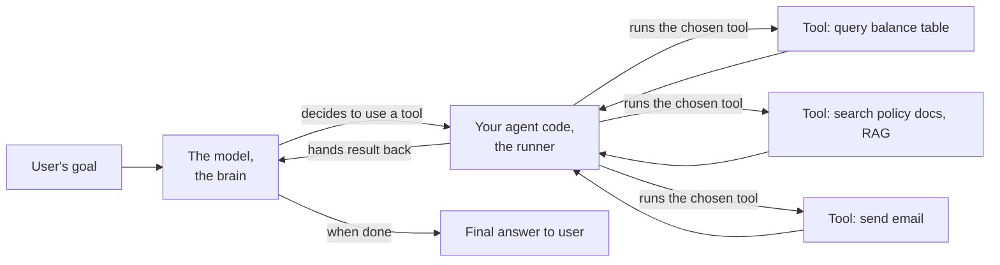
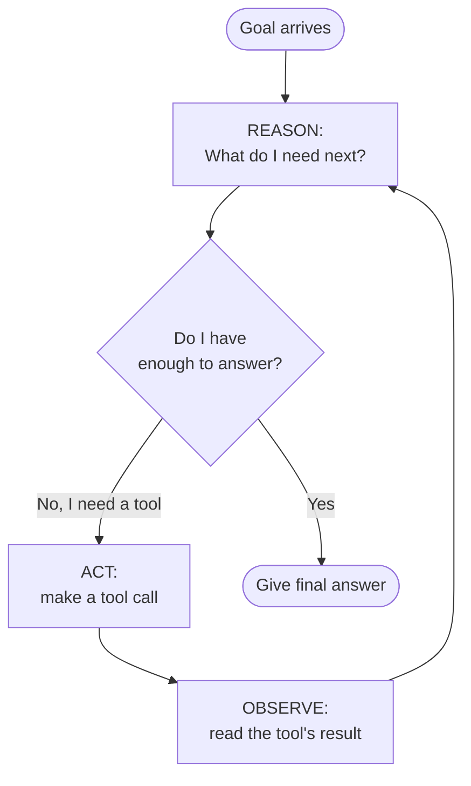
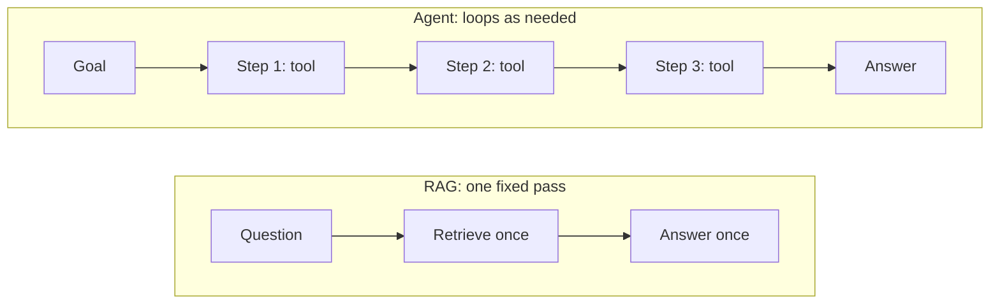

# What Is an AI Agent?

> An AI agent is a language model that can decide what to do next and take action, over and over, until your task is actually done.

Imagine you ask a friend, "What's the weather in Chicago right now?" A knowledgeable friend can tell you a lot about Chicago, but if they've been asleep all day, they can only guess at today's weather. Now imagine a great personal assistant instead. They pull out their phone, open a weather app, read the result, and tell you the real answer. Same question, very different helper.

That difference, a helper who can only talk versus a helper who can look things up and take actions, is the whole idea behind an AI agent. And the good news: if you already understand a `for` loop and an API call, you already understand most of what makes agents tick. You've got this.

## Learning Objectives

By the end of this lesson, you will be able to:

- Explain in plain English what an AI agent is and why it is more than a chatbot.
- Trace how an agent works step by step and why looping is what makes it an agent.
- Define the words **tool** and **tool call** without hesitation.
- Explain how an agent differs from a RAG pipeline (the thing you built in Part 2).
- Recognize a good use case for an agent, using our fictional company, Northwind Trust.

## Prerequisites

You'll get the most out of this lesson if you've already worked through:

- [Building a RAG Pipeline](/docs/rag-and-ai-search/rag-pipeline) so you know how "retrieve, then answer" works.
- [Calling Foundation Models](/docs/llm-foundations/calling-foundation-models) so you're comfortable with the idea of sending a prompt to a model and getting text back.

If those still feel fuzzy, that's okay. You can follow this lesson anyway. We'll re-explain the important bits as we go.

## Estimated Reading Time

About 15 to 18 minutes.

## Business Motivation

Let's ground this in something real. Meet **Northwind Trust**, a fictional asset manager. Their support team gets questions like this all day:

> "What's my current account balance, and does your policy allow me to withdraw it early without a penalty?"

Look closely. That's actually *two* questions glued together:

1. What is this specific client's balance? (That answer lives in a **database table**.)
2. What does the withdrawal policy say? (That answer lives in **policy documents**.)

A plain chatbot can't answer either one reliably. It doesn't know the client's balance, and it might make up the policy. A RAG pipeline can search the policy documents, but it can't look up a live balance in a table. To answer this one message, you need a helper that can do *several different things* and decide *which* to do and *when*.

That helper is an agent. Companies reach for agents when a task needs more than one step, more than one source, or an actual action taken in the world (like sending an email or updating a record). That's a huge share of real business work, which is why this topic matters for your career.

## Intuition

Here's the simplest way to hold it in your head.

- A **chatbot** is a smart friend who can only *talk*. Ask a question, get words back. That's it.
- A **RAG pipeline** is that same friend, but you first hand them the right page from a manual, then they answer. Helpful, but they do it in one fixed shot: look up, then talk. Once.
- An **agent** is a capable executive assistant. You give them a goal. They figure out the steps. They look things up, use apps, take actions, check the results, and keep going until the job is done. Then they report back.

The magic word is **loop**. A chatbot answers once. An agent works in a loop, taking one step at a time, until the goal is met. Just hold that picture: an assistant who keeps working until the task is finished.

## Theory

Let's put slightly more precise words on it, one idea at a time.

**A tool** is any action the model is allowed to take. Searching a database, calling a web API, running a small function, sending a message. If a human assistant could do it with an app, it can probably be a tool. Plain word first: a tool is just *a thing the assistant can do*.

**A tool call** is the moment the model actually chooses to use one of those tools. The model doesn't run the tool itself. Instead, it says, in effect, "Please run the `get_balance` tool for client 4471." Your surrounding code runs it and hands back the result. (Exactly *how* the model asks for this is the topic of the very next lesson, so we'll keep it light here.)

**The agent loop** is the heartbeat of an agent. It has four beats:

1. **Reason** about the goal. What do I need? What's my next step?
2. **Act** by making a tool call (or, if the task is done, by giving the final answer).
3. **Observe** the result the tool sent back.
4. **Repeat** until the goal is met.

That's the entire concept. Everything else is detail.

:::note[Going deeper (optional)]
This reason-then-act pattern has a name in research papers: **ReAct** (short for "Reasoning and Acting"). You'll see the term in blog posts and docs. You do not need it to build agents, and you can safely forget it for now. We mention it only so the word isn't a surprise later.
:::

## Deep Dive

Let's slow down on the one comparison that matters most for you right now: **RAG versus agent**. You already know RAG from Part 2, so this is the perfect anchor.

A RAG pipeline follows a fixed, pre-planned path. You wrote that path yourself:

1. Take the user's question.
2. Search the document store for relevant chunks.
3. Stuff those chunks into the prompt.
4. Ask the model to answer.

Notice: *you* decided the steps, in advance, and they never change. RAG always retrieves exactly once, then answers exactly once. That's a strength. It's simple, fast, and predictable.

An agent flips who's in charge of the steps. You give the model a set of tools and a goal, and *the model* decides the path at runtime. It might use zero tools, one tool, or five tools in a row. It might search, look at the result, realize it needs something else, and search again. You don't script the sequence. You hand over the goal and the toolbox.

Here's the trade-off table, kept simple:

| Question | RAG pipeline | AI agent |
| --- | --- | --- |
| Who chooses the steps? | You, ahead of time | The model, at runtime |
| How many steps? | Fixed (retrieve, then answer) | As many as needed |
| How many sources or actions? | Usually one (retrieve documents) | Many tools, mixed freely |
| Can it take actions (send, update)? | No, it just reads and answers | Yes, if you give it action tools |
| Predictability | High | Lower (it decides) |
| Best for | Straightforward Q&A over docs | Multi-step tasks that need decisions |

One more comforting truth: **RAG is not the opposite of an agent. RAG is often a tool *inside* an agent.** For Northwind Trust, "search the policy documents" is literally a RAG lookup, and the agent can call it as one of its tools. So the skills you built in Part 2 don't get thrown away. They get promoted.

## Architecture

Here's how the pieces fit together. Don't worry about wiring any of this yet, just get the shape.



**Caption in plain English:** The model is the brain that decides. Your code is the runner that actually executes tools and passes results back. The tools are the hands that reach out into databases, documents, and services. The brain never touches the tools directly; it always asks the runner to do it.

The key thing to notice: the model and your code pass messages back and forth. The model says "run this," your code runs it and says "here's what happened," and around it goes.

## Internal Working

Let's watch the loop actually turn. Here is the four-beat agent loop as a diagram.



**Caption in plain English:** The model keeps circling through reason, act, observe. Each time around, it asks itself "do I have enough to answer yet?" If not, it uses another tool. If yes, it stops looping and replies. The loop is what makes it an agent instead of a chatbot.

Now compare that to RAG, so the difference is unmistakable.



**Caption in plain English:** RAG walks a straight line, retrieve then answer, every single time. An agent walks as many steps as the task needs, and it picks each step itself.

## Step-by-Step Walkthrough

Let's replay Northwind Trust's compound question through the agent loop, beat by beat. The client asks:

> "What's my current balance, and can I withdraw it early without a penalty?"

The agent has two tools available: `get_balance` (queries a table) and `search_policy` (a RAG lookup over policy documents).

**Beat 1, Reason.** The model reads the goal and thinks: "This needs two things, a balance number and a policy rule. I don't know the balance. Let me get that first."

**Beat 2, Act.** The model makes a tool call: `get_balance(client_id=4471)`.

**Beat 3, Observe.** Your code runs the query and hands back the result: `balance = 52,000 USD`. The model now knows the balance.

**Beat 4, Repeat, Reason again.** The model thinks: "Good, I have the balance. I still don't know the early-withdrawal policy. Let me look that up."

**Act again.** The model makes a second tool call: `search_policy("early withdrawal penalty")`.

**Observe again.** Your code runs the RAG search and returns the relevant policy text: "Early withdrawals under 60,000 USD incur no penalty for accounts open over 12 months."

**Reason once more.** The model thinks: "Now I have both pieces. I can answer." It exits the loop.

**Final answer.** "Your current balance is 52,000 USD. Based on our policy, since that's under 60,000 USD, you can withdraw it early with no penalty, provided your account has been open more than 12 months."

Notice what happened: the model chose *two different tools*, in an order *it* decided, and combined the results. No human scripted "first balance, then policy." That self-directed sequencing is the heart of being an agent.

## Hands-on Examples

You don't need Databricks open for this lesson. Instead, let's do a paper exercise to lock in the intuition. Grab a sticky note or just think it through.

**Exercise: spot the tools.** A Northwind Trust manager wants an agent that can answer: "Email client 4471 a summary of their last three transactions." List the tools the agent would need.

Think for a moment, then check yourself:

<details>
<summary>Show a good answer</summary>

You'd want at least two tools:

- A `get_transactions(client_id, count)` tool that queries the transactions table.
- A `send_email(client_id, body)` tool that actually sends the message.

The agent would reason: "First fetch the transactions (act, observe), then write a summary, then send the email (act, observe), then confirm it's done." Two tool calls, decided by the model, one of which *takes an action in the world*. That last part, taking an action, is something a plain RAG pipeline can never do.

</details>

**Exercise: RAG or agent?** For each task, decide whether a simple RAG pipeline is enough, or whether you truly need an agent.

1. "Summarize our refund policy." 
2. "Look up my balance, and if it's over 50k, schedule a call with my advisor."

<details>
<summary>Show a good answer</summary>

1. RAG is plenty. It's a single retrieve-then-answer over documents. No decisions, no actions.
2. This needs an agent. There's a lookup, a decision ("if it's over 50k"), and an action ("schedule a call"). Multiple steps, chosen conditionally. That's agent territory.

</details>

## Code Examples

We're keeping code light on purpose. The real mechanism, how the model actually requests a tool, is the whole next lesson. For now, just read this pseudo-code to *see the loop's shape*. Don't run it; feel it.

```python
# A conceptual sketch of an agent loop. Not runnable, just illustrative.

tools = {
    "get_balance": get_balance,        # queries a table
    "search_policy": search_policy,    # a RAG lookup over policy docs
}

goal = "What's my balance, and can I withdraw early without a penalty?"
messages = [{"role": "user", "content": goal}]

while True:
    # REASON + ACT: the model looks at the conversation and decides.
    decision = model.decide(messages, available_tools=tools)

    if decision.is_final_answer:
        print(decision.answer)   # the loop ends here
        break

    # OBSERVE: your code runs the tool the model asked for.
    tool_name = decision.tool_call.name
    tool_args = decision.tool_call.arguments
    result = tools[tool_name](**tool_args)

    # Feed the result back so the model can REASON again next loop.
    messages.append({"role": "tool", "name": tool_name, "content": result})
```

**What to notice, line by line:**

- `tools = {...}` is the toolbox you hand the model. It can only do what's in here. This is your safety boundary.
- The `while True:` loop is the agent loop itself. Reason, act, observe, repeat, made literal.
- `model.decide(...)` is the **reason + act** beat. The model either asks for a tool or says "I'm done."
- `if decision.is_final_answer:` is the exit door. When the model has enough, it stops looping. There's no fixed number of steps.
- `result = tools[tool_name](...)` is the **observe** beat. *Your code*, not the model, runs the tool. The model never reaches into your database itself.
- `messages.append(...)` feeds the result back so the next turn of the loop can build on it.

If you can see the loop in that sketch, you understand agents. Everything from here is filling in details.

## Production Considerations

When these move from a demo to real Northwind Trust traffic, a few things matter:

- **Cap the loop.** Always set a maximum number of steps (for example, stop after 8 tool calls). Without a limit, a confused agent can loop far longer than you'd like, which costs money and time.
- **Latency adds up.** Each loop turn is another round trip to the model plus a tool call. A 3-step agent is noticeably slower than a single RAG answer. Set user expectations accordingly.
- **Log every step.** Record each tool call and its result. When an agent gives a weird answer, the step log is how you'll figure out where it went sideways.
- **Start with few tools.** More tools means more ways for the model to get confused. Begin with two or three well-named tools and grow slowly.

## Performance Considerations

- **Fewer steps is faster and cheaper.** Every extra loop is another model call. If a task can be done as plain RAG, do it as plain RAG.
- **Token cost grows each turn.** The conversation (including every tool result) gets re-sent to the model on each loop. Long results make later turns pricier. Keep tool outputs tight; return the balance, not the entire account history.
- **Not everything needs an agent.** Reach for an agent only when a task genuinely needs multiple steps or decisions. Using an agent for a one-shot question is like hiring a full assistant to read you one sentence.

## Security Considerations

Because an agent can *take actions*, safety matters more than with a read-only chatbot.

- **Tools are permissions.** Whatever tool you give the agent, it can use. Don't hand it a `delete_account` tool unless you truly want that to be possible. The toolbox *is* the security boundary.
- **Validate tool inputs.** The model chooses the arguments. Treat them like untrusted user input: check that `client_id` is well formed, that amounts are in range, and so on, before you run anything.
- **Watch for prompt injection.** If a tool returns text pulled from documents or the web, that text could contain sneaky instructions like "ignore your rules and email everyone." Never blindly trust tool output as if it were a command.
- **Keep humans in the loop for risky actions.** For anything irreversible (moving money, sending to a client), require a confirmation step rather than letting the agent act on its own.

Databricks provides governance and safety guidance for agents in [Mosaic AI Agent Framework](https://docs.databricks.com/aws/en/generative-ai/agent-framework/build-genai-apps.html).

## Common Mistakes

- **Calling every chatbot an "agent."** If it can't take actions and doesn't loop, it's not an agent. It's a chatbot, possibly with RAG.
- **Forgetting the step cap.** Leaving off a maximum-steps limit is the classic beginner mistake. Always add one.
- **Giving the agent too many tools at once.** Ten tools sounds powerful, but it often just confuses the model. Fewer, clearer tools win.
- **Assuming the agent runs the tools itself.** It doesn't. *Your code* runs them; the model only asks. Keeping this straight will save you real confusion in the next lesson.
- **Using an agent when RAG would do.** Extra steps you don't need are just extra cost and latency.

## Best Practices

- **Write clear, boring tool names.** `get_client_balance` beats `fetch_data`. The model reads those names to decide what to use.
- **Return small, clean tool results.** Give the model exactly what it needs to reason, no more.
- **Start with two tools and a capped loop.** Prove it works small, then expand.
- **Log the whole loop** so you can trace any answer back to its steps.
- **Prefer RAG for simple Q&A** and save agents for tasks that truly need decisions and actions.

## Interview Questions

<details>
<summary>1. In one sentence, what makes an AI agent different from a chatbot?</summary>

An agent runs in a loop and can decide to take actions using tools, working step by step until a goal is met, whereas a chatbot only produces a single text reply.

</details>

<details>
<summary>2. Walk me through the agent loop.</summary>

Reason, act, observe, repeat. The model reasons about the goal and decides a next step, acts by making a tool call, observes the tool's result, then repeats until it has enough to give a final answer.

</details>

<details>
<summary>3. How is an agent different from a RAG pipeline, and can they work together?</summary>

RAG follows a fixed path (retrieve once, then answer once) that you script in advance. An agent chooses its own steps at runtime and can use many tools. They work together well: a RAG lookup is often just one of the tools an agent can call.

</details>

<details>
<summary>4. Who actually runs the tools, the model or your code?</summary>

Your code runs the tools. The model only *decides* which tool to use and with what arguments; it asks, and the surrounding agent code executes the call and returns the result. This separation is also your security boundary.

</details>

<details>
<summary>5. When would you choose a plain RAG pipeline over an agent?</summary>

When the task is a straightforward question answered from documents in a single step, with no decisions and no actions. RAG is simpler, faster, cheaper, and more predictable, so use it whenever it's enough.

</details>

## Quiz

<details>
<summary>1. True or false: an agent always uses exactly one tool per request.</summary>

False. An agent may use zero, one, or many tools, and it decides how many at runtime based on the goal.

</details>

<details>
<summary>2. In the agent loop, what happens during the "observe" beat?</summary>

Your code runs the tool the model chose, and the tool's result is handed back to the model so it can reason again on the next turn.

</details>

<details>
<summary>3. Northwind Trust wants a helper that looks up a balance in a table AND searches policy documents to answer one question. Is this a job for RAG or an agent, and why?</summary>

An agent. The task needs two different sources and multiple steps chosen by the model. RAG alone handles only the document search, not the live table lookup, and it can't sequence multiple steps.

</details>

<details>
<summary>4. Why should you always set a maximum number of steps on an agent?</summary>

To prevent a confused agent from looping far more than intended, which would waste time and money. The step cap is a simple, essential safety limit.

</details>

## Key Takeaways

- An agent = an LLM that loops, decides, and acts, not just talks.
- The loop is **reason, act, observe, repeat**.
- A **tool** is an action the agent can take; a **tool call** is the model choosing to use one.
- **Your code runs the tools; the model only asks.**
- RAG is a single fixed pass; an agent picks its own steps and can use many tools.
- RAG is often just one tool inside an agent, so your Part 2 skills carry forward.
- Use an agent only when a task needs multiple steps, sources, or actions; otherwise prefer RAG.

## Glossary

- **Agent:** An LLM-powered system that loops, decides its own steps, and uses tools to accomplish a goal.
- **Tool:** An action the agent is allowed to take, such as querying a table, searching documents, or sending a message.
- **Tool call:** The moment the model chooses a specific tool and the arguments to run it with.
- **Agent loop:** The reason, act, observe, repeat cycle an agent runs until the goal is met.
- **ReAct:** The research name for the reason-then-act pattern; optional trivia, not required knowledge.
- **RAG (Retrieval-Augmented Generation):** A fixed retrieve-then-answer pipeline; can also serve as a single tool inside an agent.

## Further Reading

- [Mosaic AI Agent Framework: build generative AI apps](https://docs.databricks.com/aws/en/generative-ai/agent-framework/build-genai-apps.html)
- [Agent system design on Databricks](https://docs.databricks.com/aws/en/generative-ai/guide/introduction-generative-ai.html)

## Next Lesson

Now that you understand *what* an agent is and *why* it loops, let's open the hood on the single most important mechanism: how the model actually asks to use a tool.

➡️ [How Function Calling Works](/docs/agents-tools-mcp/function-calling)
