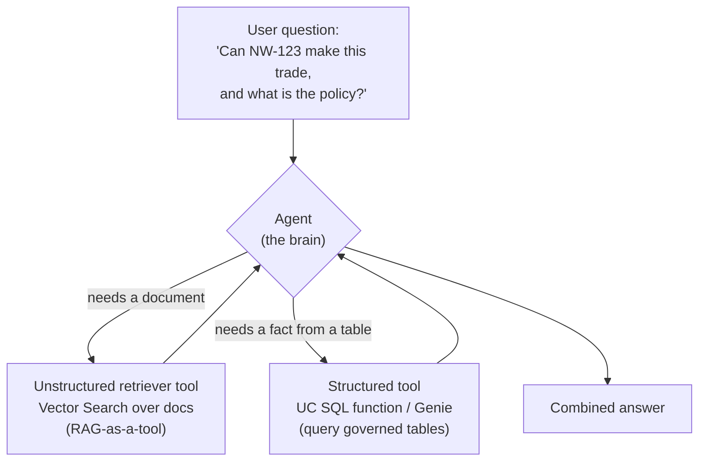
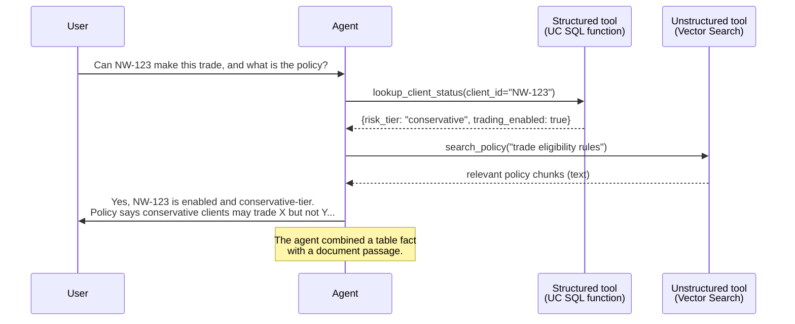
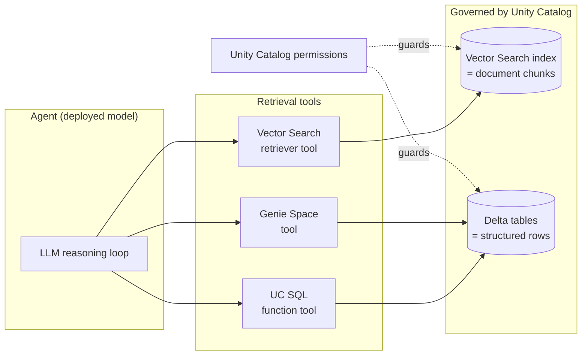

# Retrieval Tools: Documents and Data

> Picture the best assistant you have ever worked with. When you ask a hard question, they do two things without missing a beat. They flip open the big policy binder and find the exact paragraph you need. Then they turn to the computer, pull up the client's account, and read you the numbers. Same assistant, two very different skills. Today you will give your agent both.

So far your agent could call functions that *do* things. Now we teach it to *look things up*. And there are two flavors of looking things up, because facts live in two very different places.

Take a breath. You already know more of this than you think. If you have followed the RAG lessons, you have already built one of these two tools. Today we just give it a friend.

## Learning Objectives

By the end of this lesson, you will be able to:

- Explain the difference between **unstructured** retrieval (searching documents) and **structured** retrieval (querying tables).
- See how RAG becomes just *one tool* an agent can choose to use, rather than the whole application.
- Wire a **Vector Search retriever tool** into an agent so it can do RAG on demand.
- Create a **Unity Catalog SQL function tool** that runs a governed, parameterized query.
- Describe how a **Genie Space** lets an agent ask natural-language questions over tables.
- Reason about how Unity Catalog permissions keep both kinds of retrieval safe.

## Prerequisites

- [Tools from Unity Catalog Functions](/docs/agents-tools-mcp/unity-catalog-tools) — how a function becomes a tool the agent can call.
- [Building a RAG Pipeline](/docs/rag-and-ai-search/rag-pipeline) — you built a Vector Search index and retrieved chunks. That pipeline is about to become a *tool*.

If you have not done these yet, that is okay. You can still follow the ideas here. But the code will feel more natural once you have.

## Estimated Reading Time

About 22 minutes.

## Business Motivation

Let's ground this in a real question. Meet **Northwind Trust**, a wealth-management firm. A relationship manager types this into the chat:

> "Is client NW-123 allowed to make this trade, and what's our policy on it?"

Read that question again. It is really *two* questions wearing one coat.

- **"Is client NW-123 allowed to make this trade?"** — This lives in a **table**. It is the client's current status, their risk tier, their account flags. Structured data, one row, exact values.
- **"What's our policy on it?"** — This lives in a **document**. A compliance PDF, a policy binder, pages of prose. Unstructured data, the answer is buried in a paragraph somewhere.

A plain RAG app could answer the second half. A plain SQL query could answer the first. But the human asked *both at once*, in one sentence. To help them, your agent needs to reach into the filing cabinet *and* the database, then combine the answers.

That is exactly what retrieval tools are for. They turn "I can only search documents" into "I can find whatever the answer needs, wherever it lives."

## Intuition

Here is the whole idea in one picture.



*Figure 1: The agent sits in the middle and decides which tool fits each part of the question. It can call both, in any order, as many times as needed.*

Two kinds of facts, two kinds of tools:

- **Unstructured retriever tool** — for **documents**. Think policies, manuals, contracts, wikis, PDFs. The tool searches by *meaning* using Vector Search and hands back the most relevant chunks of text.
- **Structured tool** — for **tables**. Think accounts, orders, balances, statuses. The tool runs a query against governed Unity Catalog tables and hands back exact rows.

The agent reads the question, notices which kind of fact it needs, and picks the right tool. You do not write a big pile of if-statements. The model decides.

:::note[Going deeper (optional)]
"Unstructured" and "structured" are just data-world words. Unstructured means text with no fixed shape — a paragraph could say anything. Structured means data with columns and types — a row in a table. The retrieval technique differs because the data differs: you *search* documents by similarity, but you *query* tables by exact conditions.
:::

## Theory

Let's name the two tools properly.

### 1. Unstructured retrieval = RAG-as-a-tool

In Part 2 you built a RAG pipeline. It took a question, embedded it, searched a Vector Search index, and returned relevant chunks. That whole flow was the *center* of your app.

Now flip your mental model. That same retrieval flow becomes **one tool in the agent's toolbox**. The agent calls it *only when a question needs documents*. If a question is purely about a client's balance, the agent skips it entirely.

This is a big, freeing shift. RAG is no longer "the app." It is a capability the agent reaches for on demand.

On Databricks you get this with the **`VectorSearchRetrieverTool`** class from the `databricks-langchain` package (there is a matching one in `databricks-openai`). You point it at a Vector Search index, and it becomes a callable tool.

### 2. Structured retrieval = query governed tables

For tables, you have two main options:

- **A Unity Catalog SQL function tool.** You write a SQL function with a `WHERE` clause and a parameter. The agent supplies the parameter. Use this when *you know the query ahead of time* and the agent only fills in the blank (like a client ID).
- **A Genie Space used as a tool.** Genie lets the agent ask a question in *plain English* over a set of governed tables. Genie generates the SQL for you. Use this when questions are open-ended and you cannot pre-write every query.

### How the agent chooses

The agent chooses based on each tool's **name** and **description**. That description is not decoration — it is the instruction manual the model reads to decide when to call a tool. Vague descriptions lead to wrong choices. We will come back to this in Best Practices.

## Deep Dive

Let's slow down on the compound Northwind Trust question and watch the agent work through it.



*Figure 2: The agent split one question into two lookups, called a different tool for each, then merged the results into a single answer.*

Notice three things:

1. The agent made the split by itself. You did not tell it "call the SQL tool first." It read the question and reasoned.
2. Each tool did one clean job. The SQL tool returned exact values. The Vector Search tool returned relevant text.
3. The final answer *cites both*. The status came from the table, the reasoning came from the policy.

This is the payoff of retrieval tools: the agent handles messy, real-world questions that cross the line between documents and data.

## Architecture

Here is how the pieces sit together on Databricks.



*Figure 3: Both flavors of retrieval sit behind Unity Catalog. The index and the tables are governed the same way the rest of your lakehouse is.*

The key insight for a data engineer: **there is no separate governance system for AI.** The Vector Search index is a Unity Catalog object. The Delta tables are Unity Catalog objects. The same `SELECT` grants you already understand control what the agent can see.

## Internal Working

What actually happens when the agent calls each tool?

**Unstructured (Vector Search retriever tool):**

1. The agent passes a `query` string (for example, `"trade eligibility policy"`).
2. The query is embedded into a vector.
3. Vector Search finds the nearest chunks in the index — by meaning, not keywords.
4. The tool returns the top `num_results` chunks, each with `page_content` and `metadata` (like the source document URI). This shape follows the MLflow retriever schema, which is what lets tracing and review tools display citations nicely.

**Structured (UC SQL function tool):**

1. The agent passes parameters (for example, `client_id="NW-123"`).
2. Databricks runs your predefined SQL with those parameters filled in.
3. The `WHERE` clause filters to matching rows.
4. The tool returns those rows as the result.

**Structured (Genie tool):**

1. The agent passes a natural-language question.
2. Genie generates SQL against its configured set of tables (up to 25 tables in a Genie Space).
3. The SQL runs, and results come back.

In all three cases, execution happens *inside Databricks* under a governed identity. The agent never touches raw storage directly.

## Step-by-Step Walkthrough

Here is the recipe you will follow for the code below.

1. **Build the unstructured tool.** Create a `VectorSearchRetrieverTool` pointed at your Vector Search index. Give it a clear name and description.
2. **Build the structured tool.** Write a UC SQL function with a parameter and a `WHERE` clause. Wrap it with `UCFunctionToolkit`.
3. **Give both tools to the agent.** Combine the tool lists and pass them to your agent.
4. **Ask a compound question.** Watch the agent pick the right tool for each part.
5. **Optionally, add Genie.** For open-ended table questions, connect a Genie Space instead of hand-writing SQL.

## Hands-on Examples

Let's imagine what a Northwind Trust engineer sees. They ask the agent:

> "What was client NW-123's account balance last month, and does our fee policy allow a discount at that tier?"

- The agent calls the **structured tool** with `client_id="NW-123"` and gets the balance and tier.
- The agent calls the **unstructured tool** with a query like `"fee discount policy by tier"` and gets the policy text.
- The agent replies with both, tied together.

You did not orchestrate that. You just gave the agent two good tools and clear descriptions. Confidence boost: this is genuinely most of the work. Good tools plus good descriptions equals a capable agent.

## Code Examples

Let's build both tools. We will keep the code minimal and focus on the shapes.

### Example 1: A Vector Search retriever tool (unstructured)

```python
from databricks_langchain import VectorSearchRetrieverTool

# Point the tool at an existing Vector Search index.
# The name and description are what the agent reads to decide when to use it.
policy_search_tool = VectorSearchRetrieverTool(
    index_name="northwind.compliance.policy_docs_index",
    num_results=5,
    query_type="HYBRID",  # blends semantic + keyword matching
    tool_name="search_compliance_policy",
    tool_description=(
        "Search Northwind Trust compliance and trading policy documents. "
        "Use this for questions about rules, eligibility, and procedures."
    ),
)
```

Let's narrate that. We imported `VectorSearchRetrieverTool` from `databricks-langchain`. We pointed it at a Vector Search index by its full three-level name (`catalog.schema.index`). We asked for the top 5 chunks and chose `HYBRID` search so both meaning and exact keywords count. Most importantly, we gave it a plain-English `tool_description` — that sentence is how the agent knows this tool is for *policy documents*, not account data.

:::note[Going deeper (optional)]
There is an older approach where you wrap the `vector_search()` SQL function inside a Unity Catalog function and expose it with `UCFunctionToolkit`. It works and gives you a single governance surface, but Databricks now recommends the `VectorSearchRetrieverTool` class (or an AI Search MCP server) for new work. Same idea, friendlier packaging.
:::

### Example 2: A structured Unity Catalog SQL function tool

First, create the SQL function in Unity Catalog. This is plain SQL — comfortable territory for you.

```sql
CREATE OR REPLACE FUNCTION northwind.clients.lookup_client_status(
  client_id_input STRING
  COMMENT 'The client identifier, e.g. NW-123'
)
RETURNS TABLE (risk_tier STRING, trading_enabled BOOLEAN, balance DECIMAL(18,2))
COMMENT 'Returns the risk tier, trading flag, and balance for one client.'
RETURN
  SELECT risk_tier, trading_enabled, balance
  FROM northwind.clients.accounts
  WHERE client_id = client_id_input;
```

Let's narrate. We made a function that takes one parameter, `client_id_input`. It returns a small table with exactly the columns the agent needs. The `WHERE` clause locks it to one client. Notice the `COMMENT` on both the parameter and the function — again, that text is what the agent reads to use the tool correctly. This is a *governed, predictable* query. The agent can only supply the client id; it cannot rewrite the SQL.

Now expose that function to the agent as a tool:

```python
from unitycatalog.ai.langchain.toolkit import UCFunctionToolkit

toolkit = UCFunctionToolkit(
    function_names=["northwind.clients.lookup_client_status"]
)
client_status_tools = toolkit.tools
```

Let's narrate. `UCFunctionToolkit` takes the fully qualified function name and turns it into an agent-ready tool (with MLflow tracing wired in automatically). `toolkit.tools` gives you a list you can hand to the agent.

### Example 3: Give both tools to the agent

```python
from databricks_langchain import ChatDatabricks
from langgraph.prebuilt import create_react_agent

llm = ChatDatabricks(endpoint="databricks-meta-llama-3-3-70b-instruct")

# Combine unstructured + structured tools into one toolbox.
all_tools = [policy_search_tool] + client_status_tools

agent = create_react_agent(llm, all_tools)

result = agent.invoke({
    "messages": [{
        "role": "user",
        "content": "Is client NW-123 allowed to make this trade, and what is the policy?",
    }]
})
```

Let's narrate. We picked a model endpoint, then built a single `all_tools` list holding *both* the document search tool and the client-status tool. `create_react_agent` gives the model a reasoning loop where it can call any of those tools. When we invoke it with the compound question, the agent decides on its own to call `lookup_client_status` for the status and `search_compliance_policy` for the policy — then writes one combined answer.

### Example 4 (brief): Genie as a tool

When questions over tables are open-ended, connect a Genie Space instead of writing SQL yourself. Genie is exposed through a managed MCP server URL of the form `https://&lt;workspace-hostname&gt;/api/2.0/mcp/genie/&lt;genie_space_id&gt;`. You attach it to the agent much like any other tool. The agent then asks Genie questions in plain English, and Genie generates the SQL over the tables in that space (up to 25 tables). We cover the MCP wiring in the next lesson, so we will keep this short here.

## Production Considerations

- **Tool descriptions are production config.** When the agent picks the wrong tool, the fix is almost always a clearer description, not more code.
- **Keep SQL functions narrow.** One function, one job, a tight `WHERE` clause. Narrow tools are predictable and safe.
- **Set sensible `num_results`.** Too few chunks and the agent misses context; too many and you waste tokens and add noise. Start around 3 to 5.
- **Log and trace everything.** MLflow tracing shows which tool the agent called and what came back. This is your window into "why did it answer that?"
- **Version your tools.** Functions and indexes evolve. Track which version an agent was tested against before you deploy.

## Performance Considerations

- **Each tool call is a round trip.** A compound question may fire several. Fewer, well-scoped tools usually beat many overlapping ones.
- **Vector Search latency** depends on index size and `query_type`. `HYBRID` is richer but a touch heavier than pure `ANN`. Measure with your real data.
- **SQL function speed** is ordinary Databricks SQL performance. Index or partition the underlying tables on the columns you filter (like `client_id`).
- **Return only the columns you need.** Skinny result tables mean fewer tokens for the model to read, which is faster and cheaper.

## Security Considerations

This is the part to take seriously, so let's be plain about it.

- **Both tool types respect Unity Catalog permissions.** The Vector Search index needs a `SELECT` grant; the tables and SQL functions need their own grants. No grant, no data.
- **Per-user identity matters.** When an agent runs on behalf of a user, retrieval should reflect *that user's* permissions. A relationship manager should not see a client they are not assigned to, even by asking the agent nicely.
- **Genie inherits table grants.** A Genie Space can only query tables the calling identity is allowed to read. It cannot invent access.
- **Parameterized SQL blocks injection.** Because the agent only fills a parameter and cannot rewrite the query body, it cannot craft a malicious statement. This is a real safety win over letting a model write raw SQL freely.
- **Filter sensitive documents.** Use the retriever tool's `filters` and row/column governance so the agent never retrieves chunks a user should not see.

The reassuring truth: you are not inventing a new security model for AI. You are reusing the Unity Catalog governance you already run your lakehouse with.

## Common Mistakes

- **Vague tool descriptions.** "Search stuff" tells the agent nothing. Say *what* it searches and *when* to use it.
- **Overlapping tools.** Two tools that both "look up clients" confuse the agent. Make each tool distinct.
- **Letting the model write free-form SQL.** Tempting, but risky. Prefer parameterized functions, or use Genie which runs under governance.
- **Skipping permissions in dev, then breaking in prod.** If you test as an admin, everything works. Test with a realistic, limited identity too.
- **Dumping raw table columns as text.** Return tidy, named columns. The model reads results as text, so clarity helps accuracy.
- **Forgetting that RAG is now just one tool.** Beginners keep trying to make RAG do everything. Let the structured tool handle the numbers.

## Best Practices

- **Write descriptions for the model, not for humans.** One or two sentences: what it does, and when to reach for it.
- **One tool, one responsibility.** Small tools compose well.
- **Match the tool to the data.** Documents to Vector Search, exact facts to SQL functions, open-ended table questions to Genie.
- **Return the MLflow retriever schema** (`page_content` + `metadata`) from document tools so citations and tracing just work.
- **Test the routing.** Ask compound questions and confirm the agent calls the *right* tools in a sensible order.
- **Govern first, deploy second.** Set grants and per-user filters before anyone tries the agent for real.

## Interview Questions

1. **What is the difference between an unstructured retrieval tool and a structured retrieval tool, and when would you use each?**
   Unstructured tools search documents by meaning using Vector Search (RAG-as-a-tool); use them for policies, manuals, and prose. Structured tools query governed tables for exact values; use them for accounts, statuses, and numbers.

2. **How does an agent decide which retrieval tool to call?**
   It reads each tool's name and description and reasons about the question. Clear, distinct descriptions are essential — they are effectively the routing logic.

3. **Why is a parameterized Unity Catalog SQL function safer than letting the model write raw SQL?**
   The agent can only supply parameter values, not rewrite the query. This prevents injection and keeps the query predictable and governed.

4. **How are Unity Catalog permissions enforced for retrieval tools?**
   Both the Vector Search index and the underlying tables/functions are Unity Catalog securables. The calling identity needs `SELECT` (or the relevant grant); without it, the tool returns nothing. Genie inherits the same table grants.

5. **When would you choose a Genie Space over a hand-written SQL function tool?**
   Choose Genie for open-ended, natural-language questions over a set of tables where you cannot pre-write every query. Choose a SQL function when the query is known ahead of time and the agent only supplies parameters.

## Quiz

**Q1. A user asks, "What's client NW-123's current balance?" Which tool should the agent use?**

<details>
<summary>Show answer</summary>

The **structured tool** (UC SQL function or Genie). A balance is an exact fact stored in a table, not something to search for in documents.

</details>

**Q2. True or false: Once you add a Vector Search retriever tool to an agent, RAG is still the center of the application.**

<details>
<summary>Show answer</summary>

**False.** RAG becomes just *one tool* the agent may or may not call. The agent decides, per question, whether documents are even needed.

</details>

**Q3. Your agent keeps calling the document search tool for questions about account numbers. What is the most likely fix?**

<details>
<summary>Show answer</summary>

Improve the **tool descriptions** so each tool clearly states what it is for and when to use it. The descriptions are how the agent routes questions.

</details>

**Q4. Which two things must be true for an agent to successfully read from a Vector Search index and a Delta table?**

<details>
<summary>Show answer</summary>

The calling identity needs the right **Unity Catalog grants** on *both* the index and the table (for example, `SELECT`), and each must be exposed to the agent as a properly described **tool**. No grant means no data; no tool means the agent cannot reach it.

</details>

## Key Takeaways

An agent gets far more useful the moment it can fetch facts on its own — and those facts live in two places, so there are two kinds of retrieval tools.

- Retrieval tools let an agent **look things up**: documents *and* data.
- **Unstructured = documents via Vector Search** (`VectorSearchRetrieverTool`), which is RAG-as-a-tool.
- **Structured = governed tables** via a **UC SQL function** (known query, agent supplies parameters) or **Genie** (open-ended natural-language questions).
- The agent **chooses the tool** from its name and description — write those descriptions carefully.
- A compound question can trigger **both tools**, and the agent merges the results.
- **Unity Catalog permissions** guard both the index and the tables; there is no separate AI governance to invent.

## Glossary

- **Unstructured data** — Text with no fixed shape (policies, PDFs, wikis). Searched by meaning.
- **Structured data** — Data with columns and types (tables). Queried by exact conditions.
- **Vector Search retriever tool** — A tool that searches a Vector Search index and returns relevant document chunks; RAG-as-a-tool.
- **`VectorSearchRetrieverTool`** — The `databricks-langchain` class that packages a Vector Search index as an agent tool.
- **UC SQL function tool** — A Unity Catalog SQL function (with a parameter and `WHERE` clause) exposed as an agent tool.
- **Genie Space** — A managed feature that lets an agent ask natural-language questions over a set of governed tables; Genie generates the SQL.
- **MLflow retriever schema** — The `page_content` + `metadata` result shape that enables clean tracing and citations.
- **Unity Catalog** — Databricks' governance layer; the same grants control what the agent can retrieve.

## Further Reading

- [Unstructured retrieval tools (Databricks docs)](https://docs.databricks.com/aws/en/generative-ai/agent-framework/unstructured-retrieval-tools)
- [Structured retrieval tools (Databricks docs)](https://docs.databricks.com/aws/en/generative-ai/agent-framework/structured-retrieval-tools)

## Next Lesson

You have given your agent tools by hand. Next you will meet a standard way to plug *any* tool into *any* agent — a universal connector.

➡️ [MCP: A Universal Plug for Tools](/docs/agents-tools-mcp/mcp)
