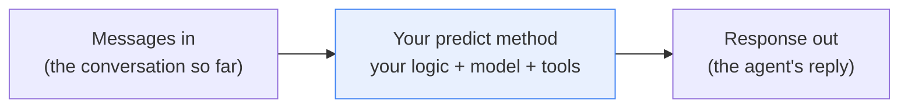
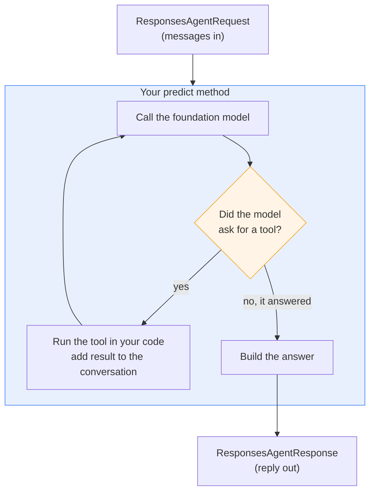
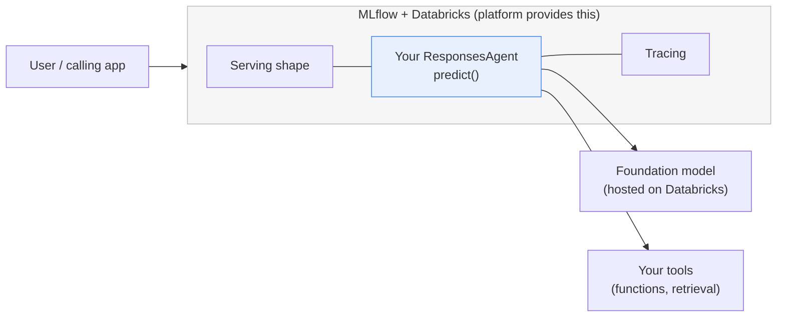

# Authoring an Agent with ResponsesAgent

> You already know how to write a function that follows a signature. Someone hands you an input in an agreed shape, you do your work, and you hand back an output in an agreed shape. That's the entire trick to writing an AI agent on Databricks. You fill in one well-defined method, and the platform takes care of the rest.

Take a breath. This is a code-heavy lesson, and that's a good thing, because writing an agent turns out to be less mysterious than it sounds. There's no magic here. You'll implement one class, one method, and everything else is plumbing that Databricks and MLflow handle for you. We'll go slowly, narrate every code block, and you'll finish with a real (if small) working agent. You've got this.

## Learning Objectives

By the end of this lesson, you will be able to:

- Explain what `ResponsesAgent` is and why it's a standard interface.
- Describe the one method you must implement, `predict`, and its input and output shapes.
- Write a minimal but real agent that calls a foundation model and returns an answer.
- Add a single tool to your agent using the function-calling idea you already know.
- Turn on MLflow tracing so every run is observable.
- Log your agent as an MLflow model and test it locally, before any deployment.
- Decide when to hand-write an agent versus reaching for the low-code option.

## Prerequisites

Before this lesson, it helps to have read:

- [The Agent Development Lifecycle](/docs/building-agents/agent-dev-lifecycle) — the big picture of how an agent goes from idea to production.
- [How Function Calling Works](/docs/agents-tools-mcp/function-calling) — how a model asks to use a tool and your code answers.
- [Retrieval Tools](/docs/agents-tools-mcp/retrieval-tools) — how an agent pulls in real context.

If you've seen those, you're in great shape. If not, this lesson still stands on its own, so don't worry.

## Estimated Reading Time

About 30 minutes.

## Business Motivation

Let's start with why anyone hand-writes an agent at all.

Imagine a fictional bank, **Northwind Trust**. Their support team answers the same questions all day: "What's my balance?", "How do I reset my card PIN?", "Why was I charged a fee?" A plain language model can chat about banking in general, but it can't see a real account, and it can't follow Northwind's specific policies.

What the team wants is a support agent that can hold a conversation, look up a real balance when asked, and answer in Northwind's voice. That means custom logic: their prompt, their tools, their rules.

You could try to bolt all of that together yourself, then figure out how to serve it, monitor it, and deploy it. That's a lot of undifferentiated work. The **Mosaic AI Agent Framework** exists so you don't have to. It's the code-first way to build agents on Databricks, and it asks only one thing of you: follow a standard interface. Do that, and you get serving, tracing, evaluation, and one-step deployment almost for free.

That standard interface is MLflow's `ResponsesAgent`. This lesson is about writing one.

## Intuition

Let's build the mental model before any code.

Think about plugging a new appliance into a wall socket. You don't rewire your house. You just make sure your appliance has the standard plug. Because the plug shape is agreed on, the appliance works, and the electrical grid behind the wall does its enormous job without you thinking about it.

Writing an agent is the same. `ResponsesAgent` is the standard plug. Your job is to build something with that plug shape. The moment you do, the whole Databricks "grid" behind the wall, serving, tracing, deployment, lights up around your agent.

Here's the shape of the plug, in plain words:

- **In:** the conversation so far (the messages between the user and the agent).
- **Your logic:** you decide what to do. Call a model. Maybe call a tool. Maybe look something up.
- **Out:** a response, in the agreed shape.

That's the whole interface. One well-defined method, `predict`, that takes messages in and gives a response out.



*Figure 1: The ResponsesAgent interface at a glance. Messages come in, your `predict` method does the work, a response goes out. That agreed shape is the entire contract.*

## Theory

Let's name the pieces properly, so the code later feels familiar.

`ResponsesAgent` is a class provided by MLflow. You don't use it directly. Instead, you **subclass** it, meaning you write your own class that builds on top of it. Your class inherits the standard behavior and adds your custom logic.

The one method you must implement is `predict`. Its signature looks like this in words: it takes a request object (the conversation) and returns a response object (the reply).

- The input is a `ResponsesAgentRequest`. It carries the conversation history: the list of messages so far.
- The output is a `ResponsesAgentResponse`. It carries the agent's reply, structured in a standard way.

There's also an optional method called `predict_stream`. It does the same job but streams the answer out in small chunks, so the user sees words appear as they're generated instead of waiting for the whole thing. You don't need it to get started, so we'll treat it as a bonus.

:::note[Going deeper (optional)]
`ResponsesAgent` is the interface Databricks now recommends. You may see an older interface called `ChatAgent` in tutorials and forum posts. It still works, but `ResponsesAgent` is the preferred choice for new agents because it handles multi-step tool calls and streaming more cleanly, and MLflow can automatically aggregate streamed output into a single trace. If you're starting fresh, start here.
:::

Why does a standard interface matter so much? Three reasons, and they're worth remembering:

1. **Portability.** As long as your class follows the interface, you can build the *inside* however you like, plain Python, the OpenAI-compatible client, or a third-party agent framework. The outside stays the same.
2. **Observability.** Because MLflow knows the shape, it can automatically trace what happens inside each run. You get to see every step.
3. **One-step deployment.** Because the shape is standard, deploying later is close to a single command. You'll see that in a later part of this course. (Deployment is Part 8, not this lesson.)

## Deep Dive

Let's look more closely at what actually happens *inside* `predict`. This is where your agent earns its keep.

When a request arrives, your `predict` method typically does some version of this:

1. Read the messages out of the request.
2. Send those messages to a **foundation model** (a large language model hosted on Databricks) using an OpenAI-compatible client.
3. Look at what the model says. If the model just answered, great, return that answer.
4. If instead the model asks to use a **tool** (function calling), your code runs the tool, adds the result to the conversation, and asks the model again.
5. Return the final answer in a `ResponsesAgentResponse`.

Steps 3 and 4 are the function-calling loop you met in an earlier lesson. The model never runs anything itself. It only *asks*. Your code decides whether and how to run the tool. That separation is what keeps your agent safe and predictable.

A key point that trips up beginners: the foundation model and your agent are not the same thing. The model is one ingredient. Your agent is the recipe that uses the model, plus tools, plus your rules, and wraps it all in the standard interface.



*Figure 2: Inside predict. The model may answer directly, or it may ask for a tool. If it asks, your code runs the tool and loops back to the model. When the model is done, you return the response.*

## Architecture

Let's zoom out and see where your agent sits in the bigger picture.

Your `ResponsesAgent` class is a small, self-contained unit. Around it, MLflow and Databricks provide the scaffolding. You write the middle box; the platform provides everything else.



*Figure 3: The architecture. You author only the blue box. Because it follows the `ResponsesAgent` interface, MLflow wraps it with a standard serving shape and tracing, and it can reach the hosted foundation model and your tools.*

The important takeaway: you are responsible for a surprisingly small surface. The interface is the seam between "your code" and "the platform's code." Keep your side clean, and the platform does the heavy lifting.

## Internal Working

How does MLflow actually "wrap" your class? Here's the gentle version.

When you **log** your agent (we'll do this soon), MLflow saves it as an MLflow model using an approach called **models-from-code**. That means MLflow saves your Python file and remembers that the object inside it is a `ResponsesAgent`. This is called the `ResponsesAgent` *flavor*, a flavor is just MLflow's word for "what kind of model this is."

Because MLflow knows the flavor, it knows exactly how to call your agent later: build a `ResponsesAgentRequest`, hand it to `predict`, read the `ResponsesAgentResponse` back. That knowledge is what makes serving and deployment automatic.

Tracing works the same way. Because MLflow understands the interface, it can wrap `predict` and record each internal step, the model call, the tool call, timings, inputs, and outputs, as a **trace**. You turn this on with a single line, and then every run becomes something you can inspect and debug.

:::note[Going deeper (optional)]
"Models-from-code" means MLflow logs the *source file* that defines your agent, rather than trying to pickle a live Python object. This is more robust for agents, which often hold references to clients and tools that don't serialize cleanly. You point MLflow at your script and tell it which object is the agent. We'll do exactly that below.
:::

## Step-by-Step Walkthrough

Here's the plan for the rest of the lesson. We'll build the Northwind Trust support agent in four small steps:

1. **Write the class.** A minimal `ResponsesAgent` subclass whose `predict` calls a foundation model.
2. **Add a tool.** Give it one function, `get_account_balance`, using function calling.
3. **Turn on tracing.** One line, so every run is observable.
4. **Log and test.** Save it as an MLflow model and call it locally.

None of these steps is large. Take them one at a time.

## Hands-on Examples

Before the full code, let's do a tiny dry run in words, so the code has something to hang onto.

A customer types: *"What's the balance on account 123?"*

- Your `predict` reads that message.
- It sends the message, plus a description of the `get_account_balance` tool, to the foundation model.
- The model replies, "I'd like to call `get_account_balance` with account 123."
- Your code runs `get_account_balance("123")`, which returns `$4,200.00`.
- Your code adds that result to the conversation and asks the model again.
- The model now writes a friendly answer: *"Your balance on account 123 is $4,200.00."*
- Your `predict` returns that as a `ResponsesAgentResponse`.

That's the whole journey. Now let's write it.

## Code Examples

We'll build this up piece by piece. Read each block, then read the narration under it before moving on.

### Step 1: A minimal ResponsesAgent

First, the smallest agent that does something real: it calls a foundation model and returns the reply. No tools yet.

```python
# northwind_agent.py
from mlflow.pyfunc import ResponsesAgent
from mlflow.types.responses import ResponsesAgentRequest, ResponsesAgentResponse
from openai import OpenAI

# The Databricks workspace client, speaking the OpenAI-compatible protocol.
# When running on Databricks, this connects to your hosted foundation models.
client = OpenAI()

LLM_ENDPOINT = "databricks-meta-llama-3-3-70b-instruct"

SYSTEM_PROMPT = (
    "You are the support assistant for Northwind Trust, a bank. "
    "Be warm, clear, and concise. Never invent account details."
)


class NorthwindAgent(ResponsesAgent):
    def predict(self, request: ResponsesAgentRequest) -> ResponsesAgentResponse:
        # 1. Read the conversation out of the request.
        messages = [{"role": "system", "content": SYSTEM_PROMPT}]
        messages += [m.model_dump() for m in request.input]

        # 2. Ask the foundation model.
        completion = client.chat.completions.create(
            model=LLM_ENDPOINT,
            messages=messages,
        )
        answer = completion.choices[0].message.content

        # 3. Return the reply in the standard shape.
        return ResponsesAgentResponse(
            output=[
                {
                    "type": "message",
                    "role": "assistant",
                    "content": [{"type": "output_text", "text": answer}],
                }
            ]
        )
```

Let's walk through what you just wrote.

- The imports bring in the three things you need: the `ResponsesAgent` base class, the request and response types, and an OpenAI-compatible client. On Databricks, that client talks to the hosted foundation models for you.
- `LLM_ENDPOINT` names the model you're calling. Databricks hosts several; this is just a string naming one of them.
- `SYSTEM_PROMPT` is Northwind's voice and rules, given to the model on every turn.
- Your class `NorthwindAgent` subclasses `ResponsesAgent`. That single word, `ResponsesAgent` in the parentheses, is what makes it "plug-shaped."
- Inside `predict`, step 1 reads the incoming messages. `request.input` is the conversation history; we convert each message to a plain dictionary the model client understands, and prepend the system prompt.
- Step 2 sends everything to the model and pulls out the text answer.
- Step 3 wraps that text in a `ResponsesAgentResponse`. The nested shape looks fussy, but it's just the standard envelope: a message, from the assistant, containing output text.

That's a complete, working agent. It won't look anything up yet, but it holds a real conversation.

### Step 2: Add a tool

Now let's give the agent the ability to look up a balance. This is the function-calling idea from the earlier lesson, applied inside `predict`.

```python
import json

# The tool itself: plain Python. In real life this would query a database.
def get_account_balance(account_id: str) -> str:
    fake_balances = {"123": "$4,200.00", "456": "$18.50"}
    return fake_balances.get(account_id, "account not found")

# The tool's description, so the model knows it exists and how to call it.
TOOLS = [
    {
        "type": "function",
        "function": {
            "name": "get_account_balance",
            "description": "Look up the current balance for a Northwind account.",
            "parameters": {
                "type": "object",
                "properties": {
                    "account_id": {
                        "type": "string",
                        "description": "The account number, e.g. '123'.",
                    }
                },
                "required": ["account_id"],
            },
        },
    }
]
```

Here we've defined two things.

- `get_account_balance` is the real work: ordinary Python. Today it reads from a fake dictionary. Tomorrow it would query Northwind's database. The model never runs this, your code does.
- `TOOLS` is the *description* of that function: its name, what it does, and what arguments it takes, written as a JSON schema. This is the "labeled request form" the model reads so it knows the tool exists.

Now let's use the tool inside `predict`:

```python
class NorthwindAgent(ResponsesAgent):
    def predict(self, request: ResponsesAgentRequest) -> ResponsesAgentResponse:
        messages = [{"role": "system", "content": SYSTEM_PROMPT}]
        messages += [m.model_dump() for m in request.input]

        # First model call: the model may answer, or ask for the tool.
        completion = client.chat.completions.create(
            model=LLM_ENDPOINT,
            messages=messages,
            tools=TOOLS,
        )
        choice = completion.choices[0].message

        # If the model asked for a tool, run it and ask again.
        if choice.tool_calls:
            messages.append(choice.model_dump())
            for call in choice.tool_calls:
                args = json.loads(call.function.arguments)
                result = get_account_balance(args["account_id"])
                messages.append(
                    {
                        "role": "tool",
                        "tool_call_id": call.id,
                        "content": result,
                    }
                )
            # Second model call: now it has the real number to answer with.
            completion = client.chat.completions.create(
                model=LLM_ENDPOINT,
                messages=messages,
            )
            choice = completion.choices[0].message

        return ResponsesAgentResponse(
            output=[
                {
                    "type": "message",
                    "role": "assistant",
                    "content": [{"type": "output_text", "text": choice.content}],
                }
            ]
        )
```

Let's narrate the new part carefully, because this is the heart of the agent.

- The first model call now passes `tools=TOOLS`, so the model knows the balance lookup exists.
- We check `choice.tool_calls`. If it's empty, the model just answered, and we skip straight to returning.
- If it's not empty, the model wants a tool. We append the model's request to the conversation, then loop over each requested call. For each one, we parse the arguments, run the real Python function, and append the result back into the conversation as a `tool` message.
- Then we call the model a *second* time. This time it has the real balance in front of it, so it writes a proper answer.
- Finally we return that answer in the same standard envelope as before.

Notice the pattern: model asks, your code acts, model answers. That loop is the entire relationship between the model and your tools.

### Step 3: Turn on tracing

Observability is one line. Add this near the top of your file.

```python
import mlflow

mlflow.openai.autolog()
```

That's it. `mlflow.openai.autolog()` tells MLflow to automatically record every call your agent makes through the OpenAI-compatible client, the prompts, the tool calls, the responses, and timings, as a **trace**. Now, when you run your agent, you can open the trace and see exactly what happened at each step. This is your best friend when something goes wrong.

### Step 4: Tell MLflow which object is the agent

At the very bottom of `northwind_agent.py`, add one line so models-from-code knows what to save.

```python
from mlflow.models import set_model

set_model(NorthwindAgent())
```

`set_model` points a flag at your agent instance. When MLflow logs this file, it reads that flag and knows: *this* is the agent to serve. You define the class above; this single line marks the object to use.

### Step 5: Log the agent as an MLflow model

Now, in a separate notebook or script (not inside `northwind_agent.py`), log the file as an MLflow model.

```python
import mlflow

with mlflow.start_run():
    logged_agent = mlflow.pyfunc.log_model(
        name="northwind_agent",
        python_model="northwind_agent.py",   # models-from-code: point at the file
        pip_requirements=["mlflow", "openai"],
    )

print(logged_agent.model_uri)
```

Here's what happened.

- `mlflow.start_run()` opens an MLflow run, a labeled container for this attempt.
- `log_model` saves your agent. The key argument is `python_model="northwind_agent.py"`: instead of handing MLflow a live object, you hand it the *file*. That's models-from-code. MLflow saves the script and remembers the object you marked with `set_model`.
- `pip_requirements` lists what the agent needs to run, so it can be rebuilt anywhere.
- `logged_agent.model_uri` is the address of your saved model. You'll use it to load and test the agent, and later to register and deploy it.

Your agent is now a real, saved MLflow model. That's a milestone worth pausing on.

### Step 6: Test it locally

Before deploying anything, load your logged agent and call it, right on your machine.

```python
loaded = mlflow.pyfunc.load_model(logged_agent.model_uri)

response = loaded.predict(
    {
        "input": [
            {"role": "user", "content": "What's the balance on account 123?"}
        ]
    }
)

print(response)
```

Let's read this.

- `load_model` loads the agent back from the URI you just printed. This is the same load step the platform will do when serving it, so if it loads here, you're in good shape.
- `predict` calls your agent with a request in the standard shape: an `input` list holding one user message.
- The printed `response` should contain the assistant's answer, and because the question mentions account 123, the agent should have called your tool and reported `$4,200.00`.

If you see that answer, congratulations, you've authored, logged, and tested a real agent. Everything after this (registering it in Unity Catalog, deploying it to a serving endpoint) builds on exactly this artifact.

## Production Considerations

A few things to keep in mind when your agent grows past a demo:

- **Externalize configuration.** Don't hard-code the model endpoint or prompt deep in your logic. Keep them where they're easy to change, so you can swap models without rewriting the agent.
- **Manage tools through Unity Catalog.** In production, tools are often governed functions, not local Python. That gives you permissions and auditability. (See the retrieval and Unity Catalog tools lessons.)
- **Version everything through MLflow.** Every log is a new version. That's your history and your rollback path.
- **Set a sensible turn limit.** The tool loop can, in principle, run many times. Cap it so a confused model can't loop forever.

## Performance Considerations

- **Each model call costs time and money.** A tool round-trip means at least two model calls. Keep tools focused so the model doesn't need many hops.
- **Stream for responsiveness.** For chat-style experiences, implementing `predict_stream` lets users see the answer appear word by word instead of waiting. It doesn't make the work faster, but it feels much faster.
- **Keep the conversation lean.** Long histories mean more tokens per call, which is slower and pricier. Trim or summarize old turns when you can.
- **Cache what's stable.** If a tool result rarely changes, caching it avoids repeated lookups.

## Security Considerations

- **Your code guards the tools, not the model.** The model only *asks*. Validate arguments and check permissions in your Python before doing anything real. Never assume the model's requested arguments are safe.
- **Least privilege for lookups.** A support agent should read only what it needs. Don't wire it to a tool that can move money if all it needs is a balance.
- **Never leak secrets into prompts or traces.** Traces are wonderfully detailed, which means they can capture sensitive data. Keep credentials out of messages, and be mindful of what personal data lands in a trace.
- **Treat user input as untrusted.** A customer message could try to talk the model into misbehaving (prompt injection). Your tool-side checks are the real safety net.

## Common Mistakes

- **Confusing the model with the agent.** The foundation model is one ingredient. Your agent is the whole recipe, including tools and rules.
- **Forgetting `set_model`.** Without it, models-from-code doesn't know which object to serve, and logging fails or serves the wrong thing.
- **Logging a live object instead of the file.** For agents, use models-from-code (point at the `.py` file). Pickling a live agent that holds clients and tools tends to break.
- **Running the tool inside the model's head.** The model never executes anything. If you expect it to "just do" the lookup, nothing happens. Your code must run the tool.
- **Skipping the second model call.** After running a tool, you must send the result back to the model. Otherwise you have data but no answer.
- **Testing straight in production.** Load and call the model locally first. It's faster and cheaper to find bugs there.

## Best Practices

- **Start minimal, then grow.** Get the no-tool version working first, then add one tool, then tracing. Small steps, each verified.
- **Turn on tracing early.** `mlflow.openai.autolog()` costs one line and saves hours of debugging.
- **Keep `predict` readable.** Read messages, call model, maybe run tools, return. If it gets tangled, factor helpers out.
- **Write clear tool descriptions.** The model chooses tools based on their descriptions. Vague descriptions cause wrong or missed calls.
- **Prefer `ResponsesAgent` for new work.** It's the recommended interface and plays best with streaming and tracing.
- **Log often.** Each version is cheap and gives you a clean history.

## Interview Questions

1. **What is `ResponsesAgent`, and why does Databricks recommend using it?**
   It's MLflow's standard interface for authoring agents. You subclass it and implement `predict`. Because the interface is standard, MLflow can wrap your agent with a serving shape, automatic tracing, and near one-step deployment. It's preferred over the older `ChatAgent` for new agents.

2. **Walk me through what happens inside `predict` when the user asks a question that needs a tool.**
   `predict` reads the messages, sends them plus tool descriptions to the foundation model. The model responds asking for a tool. Your code runs the tool, appends the result to the conversation, and calls the model again. The model then writes the final answer, which you return as a `ResponsesAgentResponse`.

3. **What does "models-from-code" mean, and why use it for agents?**
   It means MLflow logs the source file that defines the agent, rather than pickling a live object. Agents hold references (clients, tools) that don't serialize cleanly, so saving the code and marking the agent object with `set_model` is more robust.

4. **How do you make an agent's runs observable, and why does the interface make this possible?**
   You enable MLflow tracing (for example, `mlflow.openai.autolog()`). Because your agent follows the standard interface, MLflow understands its shape and can automatically record each internal step, model calls, tool calls, timings, as a trace.

5. **The model returned tool arguments. Should you trust and run them directly? Why or why not?**
   No. The model only proposes. Your code must validate the arguments and check permissions before running anything, because user input (and therefore the model's request) is untrusted and could be manipulated.

## Quiz

**Question 1:** Which single method must you implement to author a `ResponsesAgent`?

<details>

<summary>Show answer</summary>

`predict`. It takes a `ResponsesAgentRequest` (the conversation) and returns a `ResponsesAgentResponse` (the reply). Implementing `predict_stream` is optional and adds streaming.

</details>

**Question 2:** After the model asks to call a tool, what must your code do before you get a final answer?

<details>

<summary>Show answer</summary>

Run the tool in your own code, append its result to the conversation as a tool message, then call the model a second time so it can write the final answer using the real result.

</details>

**Question 3:** Why is following a standard interface valuable?

<details>

<summary>Show answer</summary>

Portability (you can build the inside however you like), observability (MLflow can auto-trace each run), and near one-step deployment (the platform knows exactly how to serve your agent).

</details>

**Question 4:** When would you choose the low-code option over hand-writing a `ResponsesAgent`?

<details>

<summary>Show answer</summary>

When you don't need fine-grained control over the logic. Low-code Agent Bricks (the next lesson) lets you build common agents quickly without writing the class. Hand-writing gives you full control when you need custom logic, tools, or behavior.

</details>

## Key Takeaways

- An agent is a class that subclasses `ResponsesAgent` and implements `predict`.
- `predict` takes a `ResponsesAgentRequest` and returns a `ResponsesAgentResponse`.
- The foundation model is one ingredient; your agent is the whole recipe.
- Tool use is a loop: model asks, your code runs the tool, model answers.
- One line, `mlflow.openai.autolog()`, gives you full tracing.
- Log with models-from-code (point at the file, mark the object with `set_model`), then load and test locally.
- Following the standard interface is what buys you portability, observability, and easy deployment.
- Reach for low-code Agent Bricks when you don't need this level of control.

## Glossary

- **Mosaic AI Agent Framework:** Databricks' code-first way to build agents.
- **ResponsesAgent:** MLflow's recommended standard interface for authoring agents. You subclass it and implement `predict`.
- **predict:** The method you implement. Takes the conversation, returns the reply.
- **predict_stream:** Optional method that streams the reply out in chunks.
- **ResponsesAgentRequest / ResponsesAgentResponse:** The standard input and output shapes for `predict`.
- **Foundation model:** A large language model hosted on Databricks that your agent calls.
- **Tool / function calling:** A function the model can ask your code to run; your code runs it and returns the result.
- **MLflow tracing:** Automatic recording of each step inside a run, for observability.
- **Models-from-code:** Logging an MLflow model by saving its source file rather than a pickled object.
- **Flavor:** MLflow's word for what kind of model something is (here, the `ResponsesAgent` flavor).
- **set_model:** The call that marks which object in your file is the agent to serve.
- **model_uri:** The address of a logged MLflow model, used to load, register, and deploy it.

## Further Reading

- [Author agents using MLflow ResponsesAgent (Databricks docs)](https://docs.databricks.com/aws/en/generative-ai/agent-framework/author-agent)
- [The Agent Development Lifecycle](/docs/building-agents/agent-dev-lifecycle)
- [How Function Calling Works](/docs/agents-tools-mcp/function-calling)
- [Retrieval Tools](/docs/agents-tools-mcp/retrieval-tools)

## Next Lesson

You've now hand-written an agent with full control. But sometimes you don't need all this control, you just want a good agent, fast. That's what the low-code option is for.

➡️ [Agent Bricks: Low-Code Agents](/docs/building-agents/agent-bricks)
