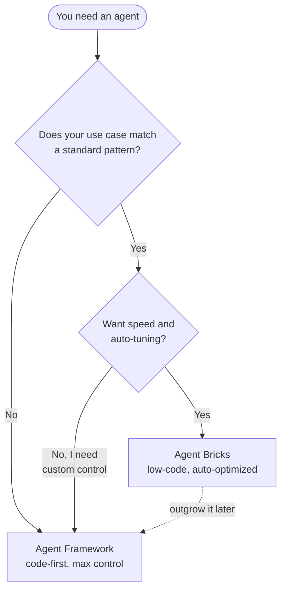
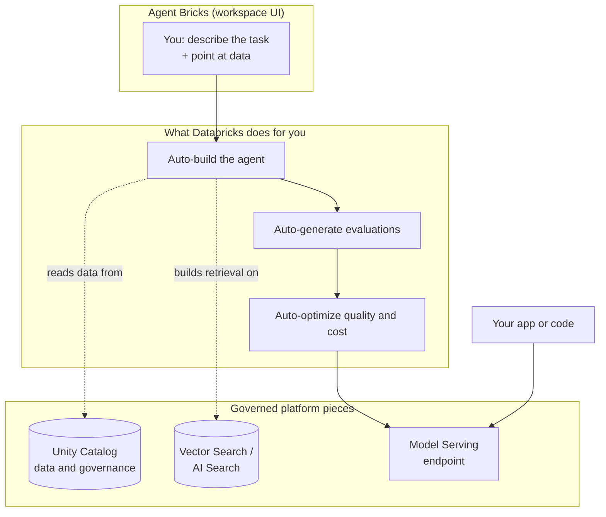
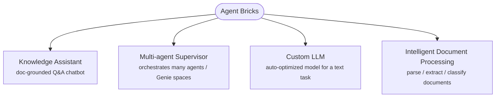

# Agent Bricks: Low-Code Agents

> Agent Bricks lets you build a good agent without writing the agent's code. You describe the task, point it at your data, and Databricks builds, evaluates, and tunes the agent for you.

Think about the last time you bought a really good appliance, maybe a modern oven. You didn't machine the heating element yourself, weld the frame, or write the temperature-control software. You picked a good machine, set it to "roast," and trusted the sensible defaults. It even self-adjusts to hit the temperature you asked for. You got a great result without becoming an appliance engineer.

Agent Bricks is that oven. In the previous lesson you learned to hand-build an agent in code with `ResponsesAgent`, which is like machining every part yourself. That skill is valuable, and sometimes it's exactly what you need. But often you don't need to build the machine. You just need the result. Agent Bricks gives you a beginner-safe on-ramp: describe what you want, give it data, and let Databricks do the heavy engineering. You've got this, and this lesson will feel easy.

## Learning Objectives

By the end of this lesson, you will be able to:

- Explain in plain English what Agent Bricks is and how it differs from the code-first Agent Framework.
- Name the four Agent Bricks offerings and say what each one is for.
- Describe what "auto-build," "auto-evaluate," and "auto-optimize" mean, without any jargon.
- Decide when to reach for Agent Bricks versus when to drop down to Agent Framework.
- Query a deployed Agent Bricks agent from code, even though you built it in the UI.

## Prerequisites

You'll get the most out of this lesson if you've already worked through:

- [Authoring an Agent with ResponsesAgent](/docs/building-agents/authoring-agents), so you've seen what the code-first path looks like. That contrast is the whole point of this lesson.

If that one still feels fuzzy, that's okay. You can follow along here anyway. The big idea, "let Databricks build it for you," stands on its own.

## Estimated Reading Time

About 15 to 18 minutes.

## Business Motivation

Let's ground this in a real decision. Meet **Northwind Trust**, a fictional asset manager. Their support team keeps getting the same kind of question all day:

> "I read something about early-withdrawal penalties. What does your policy actually say?"

The answer already lives in a pile of policy PDFs. Northwind wants a chatbot that reads those documents and answers accurately, with citations, so nobody has to dig through a 90-page PDF.

Here's the choice their engineers face. They could spend a couple of weeks hand-coding an agent: writing the retrieval logic, wiring up a vector index, tuning prompts, building an evaluation harness, and testing it all. Or they could recognize that "a chatbot grounded in our documents" is an extremely common, well-understood pattern, and let a tool that specializes in exactly that pattern build it for them in an afternoon.

When your use case matches a standard pattern, hand-building it from scratch is often wasted effort. Agent Bricks exists for exactly these moments: get a high-quality, production-ready agent fast, without a research project. That speed is worth real money and real weeks, which is why this matters for your career.

## Intuition

Here's the simplest way to hold it in your head.

- **Agent Framework** (last lesson) is like machining every part of a machine yourself. Total control. You choose every screw. It also takes skill and time.
- **Agent Bricks** is like buying a smart appliance with great defaults and auto-tuning. You tell it what you want and feed it your ingredients. It figures out the tricky settings and adjusts itself to get a good result.

Another everyday picture: Agent Bricks is a **low-code app builder**. You've probably seen tools where you drag a few things around, fill in some fields, and get a working app, no framework code required. Agent Bricks does that for agents. You fill in a form and get a working, deployed agent.

You don't give up quality by going low-code here. That's the surprising part. Because Databricks knows the common patterns deeply, its defaults are often *better* than a first hand-coded attempt, the same way a modern oven holds temperature better than most people can by eye.

## Theory

Let's put slightly more precise words on it, one idea at a time.

**Agent Bricks is low-code.** You work in the Databricks workspace UI. You describe the task in plain language, add your data sources, and click a button. You don't write the agent loop, wire tools, or manage prompts by hand.

Three things happen for you automatically. Hold onto these three words:

- **Auto-build.** Databricks assembles the agent, the retrieval, the prompts, and the serving endpoint from your description and data.
- **Auto-evaluate.** It generates evaluations for you, a way to measure whether the agent's answers are actually good, so you're not just eyeballing it.
- **Auto-optimize.** It tries different strategies behind the scenes and tunes the agent to balance quality and cost.

**It produces a real, deployable endpoint.** The output is not a toy. It's a governed model serving endpoint you can query from apps and code, just like an agent you'd build by hand.

**It's pattern-based.** Agent Bricks doesn't do *anything* you can imagine. It does a set of well-defined, common patterns extremely well. If your need matches one of those patterns, you win big. If it doesn't, you use Agent Framework instead. We'll tour those patterns next.

:::note[Going deeper (optional)]
"Auto-optimize" isn't magic. Under the hood, Databricks compares multiple optimization strategies, things like different prompt formulations and different underlying model choices, and evaluates each against the criteria it inferred from your data. It keeps what scores best. You don't have to understand or run any of this. It just means the defaults you get are tuned rather than arbitrary.
:::

## Deep Dive

Let's slow down on the one decision that matters most: **when to choose Agent Bricks versus Agent Framework.** This is a very common interview question and a very common real-world call.

Reach for **Agent Bricks** when:

- Your use case matches a supported pattern (a doc chatbot, a text-processing task, document parsing, or coordinating a few agents).
- You want speed and sensible, auto-tuned defaults.
- You're a beginner, or you just don't want to hand-maintain agent code.
- You want built-in evaluation without writing your own harness.

Drop down to **Agent Framework** when:

- You need custom control: a specific tool-calling flow, custom business logic, or an unusual orchestration.
- Your use case doesn't fit any Agent Bricks pattern.
- You need to integrate deeply with code that Agent Bricks doesn't expose.

Here's the reassuring part: these two are not enemies, and you don't have to pick a side forever. A great strategy is to **start with Agent Bricks**. If you outgrow it, you move to Agent Framework for the parts that need control. Many teams even do both, using an Agent Bricks agent as one piece inside a larger custom system. Starting simple is not a compromise. It's good engineering.



<p align="center"><em>Diagram 1: A simple decision guide. Start with Agent Bricks when the pattern fits; move to Agent Framework when you need custom control.</em></p>

The next table makes the contrast concrete.

| Question | Agent Framework (code-first) | Agent Bricks (low-code) |
| --- | --- | --- |
| Where do you work? | In notebooks and code | In the workspace UI |
| Who writes the agent logic? | You do | Databricks does |
| Who tunes prompts and quality? | You do | Auto-optimized for you |
| Who builds the evaluations? | You do | Auto-generated for you |
| How much control? | Maximum | Guided, within a pattern |
| How fast to a first version? | Slower, more effort | Fast, often an afternoon |
| Best when... | You need custom behavior | Your use case fits a pattern |

## Architecture

Where does Agent Bricks sit in the Databricks world you already know? It's not a separate island. It's a friendly front door onto the same platform pieces you've been learning about.



<p align="center"><em>Diagram 2: You fill in the UI. Databricks builds, evaluates, and optimizes on top of Unity Catalog, Vector Search, and Model Serving, the same governed pieces you met earlier in the course.</em></p>

The key takeaway: your data stays in **Unity Catalog**, retrieval uses the same **Vector Search / AI Search** you learned about in Part 2, and the result is a standard **Model Serving** endpoint. Agent Bricks just spares you from wiring those together by hand.

## Internal Working

You don't need to know the internals to use Agent Bricks. But a light peek helps the "auto" words feel less like magic. Here's roughly what happens after you click "Create."

1. **It reads your description and data.** From your plain-language task and your data sources, it figures out what kind of agent to assemble and what "a good answer" looks like.
2. **It infers evaluation criteria.** Instead of asking you to hand-write test cases, it derives criteria from your data and task, so it has a yardstick to measure quality.
3. **It builds a candidate agent.** It assembles retrieval, prompts, and a serving configuration.
4. **It tries multiple strategies and scores them.** This is auto-optimize: different prompt and model choices, each measured against the criteria from step 2. The best-scoring setup wins.
5. **It deploys an endpoint.** You get a governed, queryable Model Serving endpoint, plus a place in the UI to test and improve it.

:::note[Going deeper (optional)]
For the offering that processes text at scale (Custom LLM), Databricks recommends giving it a decent amount of example data, on the order of 100 or more inputs, so the optimizer has enough to learn from. More representative examples generally mean a better-tuned, more accurate agent. If you only have a handful of examples, you'll still get a result; it just won't be as finely tuned. You can safely start small and add more later.
:::

## Step-by-Step Walkthrough

Let's walk through what building an Agent Bricks agent *feels* like, using Northwind Trust's policy chatbot as the example. This is a UI flow, so imagine clicking along. No code yet.

1. **Open Agent Bricks in the workspace.** In the Databricks left navigation, you open the Agent Bricks area and pick an offering. For a doc chatbot, that's **Knowledge Assistant**.
2. **Describe the agent.** You give it a name (say, `northwind-policy-assistant`) and a short description of what it should do: answer client questions about Northwind's account policies.
3. **Add your knowledge sources.** You point it at where the documents live: files in a Unity Catalog volume, a Unity Catalog table, or an existing AI Search index. Northwind picks their volume of policy PDFs.
4. **Add optional response guidelines.** In plain language, you can tell it things like "always cite the source document" or "if the policy is unclear, say so rather than guessing."
5. **Click Create.** Databricks now auto-builds the agent behind the scenes. You wait a bit, not weeks.
6. **Test it in the Build tab.** You chat with the agent right there. You can click to view its reasoning and view the sources it cited, so you can see *why* it answered the way it did.
7. **Improve it.** In the Examples tab you add sample questions, give natural-language feedback, and invite subject-matter experts to try it. You re-test to see quality go up.
8. **Use the endpoint.** When you're happy, the agent is available as an endpoint that apps and code can call.

Notice what you did *not* do: no retrieval code, no prompt engineering loop, no evaluation harness written by hand. That's the low-code promise in action.

## Hands-on Examples

Here's the tour of the four Agent Bricks **offerings**, so you know which door to walk through for a given problem. The next two lessons go deep on the first two; this is your map.



<p align="center"><em>Diagram 3: The four Agent Bricks offerings. Match your problem to a door.</em></p>

Here is what each is for, in plain terms:

- **Knowledge Assistant** — a chatbot grounded in *your* documents. Ask a question, get an answer with citations, drawn from files, tables, or an AI Search index. This is the classic "chat with our docs" use case, and it's the right pick for Northwind's policy bot. *(Next lesson goes deep.)*
- **Multi-agent Supervisor** — a coordinator that orchestrates *multiple* agents and tools to handle a complex request. It can route to Genie spaces (conversational analytics), other agents, dashboards, Unity Catalog functions, MCP servers, and more, then combine the results. Reach for this when one question spans several specialties. *(The lesson after next goes deep.)*
- **Custom LLM** — an auto-optimized model for a single **text task**: classify, summarize, extract, or generate/transform text. Think "sort these support tickets by topic" or "summarize each call transcript." You give it examples; it tunes a model and deploys an endpoint.
- **Intelligent Document Processing (IDP)** — turns messy documents (PDFs, DOCX, images, slides) into clean, structured data. It can **parse** documents into text and tables, **extract** fields into a schema you define, and **classify** documents into categories, all governed inside Unity Catalog.

A quick way to remember it: **Knowledge Assistant** answers questions about docs, **Multi-agent Supervisor** coordinates helpers, **Custom LLM** does one text job well, and **IDP** cleans up documents into data.

## Code Examples

Wait, code? For a low-code tool? Here's the important distinction, and it trips up a lot of beginners:

> You **build** an Agent Bricks agent in the **UI**. But once it's deployed, you **query** it from code like any other endpoint.

So there's no "agent code" to show, that's the whole point. What you *do* write is the code that *calls* your deployed agent. Below are the two common ways. Both assume Northwind already built and deployed a Knowledge Assistant with an endpoint name like `northwind-policy-assistant`.

**Option A: Query it with SQL using `ai_query`.** This is lovely because you can call your agent right from a SQL cell or a data pipeline, no Python needed.

```sql
-- Ask the deployed Agent Bricks endpoint a question, straight from SQL.
SELECT ai_query(
  'northwind-policy-assistant',              -- the endpoint name from the UI
  'Does the policy allow early withdrawal without a penalty?'
) AS answer;
```

Step by step: `ai_query` takes the endpoint name as the first argument and your question as the second. Databricks sends the question to the agent and returns the answer as a normal column value. Because it's just SQL, you could run this over a whole *table* of questions at once.

**Option B: Query it with the OpenAI client from Python.** Agent Bricks endpoints speak the widely-used OpenAI chat format, so you can use the familiar OpenAI client pointed at your Databricks workspace.

```python
# Query the deployed Agent Bricks endpoint using the OpenAI-compatible client.
from openai import OpenAI

client = OpenAI(
    api_key="dapi-your-databricks-token",            # your Databricks token
    base_url="https://YOUR-WORKSPACE.databricks.com/serving-endpoints",
)

response = client.chat.completions.create(
    model="northwind-policy-assistant",              # the endpoint name from the UI
    messages=[
        {"role": "user",
         "content": "Does the policy allow early withdrawal without a penalty?"}
    ],
)

print(response.choices[0].message.content)
```

Narrating the Python: you create a `client` pointed at your workspace's `serving-endpoints` URL, set `model` to your agent's endpoint name, send your question in the `messages` list (the same chat format you saw in Part 1), and read the answer off `response.choices[0].message.content`. If you've called any chat model before, this looks identical, because to your code, an Agent Bricks agent is just another chat endpoint.

:::note[Going deeper (optional)]
The exact `base_url`, the token type, and whether you use a personal access token versus an OAuth machine identity depend on your workspace setup. Treat the values above as placeholders. Your team's Databricks admin can give you the real workspace URL and the right credential. The *shape* of the call, endpoint name plus messages, stays the same.
:::

## Production Considerations

Even though Agent Bricks does the heavy lifting, shipping to real users is still your job. A few things to keep in mind:

- **Test before you trust.** Use the Build and Examples tabs to try realistic questions and edge cases. Auto-evaluation is a great start, but you should still sanity-check answers with a human who knows the domain.
- **Keep your data fresh.** The agent answers from the data you gave it. If your policy PDFs change, you need to update the sources so answers stay correct.
- **Version and name things clearly.** Give endpoints stable, descriptive names (like `northwind-policy-assistant`) so the apps calling them don't break.
- **Plan for feedback.** Agent Bricks lets subject-matter experts give natural-language feedback to improve quality. Build that review loop into your rollout rather than launching and walking away.

## Performance Considerations

- **Auto-optimize already balances quality and cost.** It compares strategies so you don't have to hand-tune the trade-off. Trust it as a starting point, then measure.
- **More examples usually means better quality.** Especially for Custom LLM, giving it more representative examples (Databricks suggests around 100 or more) improves accuracy. Start with what you have and add more over time.
- **Batch when you can.** If you have many inputs to process, calling the endpoint over a table with `ai_query` is far more efficient than looping one call at a time in Python.
- **Watch your latency budget.** A doc-grounded answer with retrieval takes longer than a plain model call. If you're putting it behind a live chat UI, test the response time with real questions.

## Security Considerations

- **Governance comes along for free-ish.** Because Agent Bricks builds on Unity Catalog, your data access, lineage, and permissions are governed by the same system you already use. That's a big win over stitching tools together yourself.
- **Access controls flow through.** For Multi-agent Supervisor especially, built-in access controls help ensure users only reach the sub-agents and data they're authorized to use. Set those permissions deliberately.
- **Protect your tokens.** The token in the Python example is a secret. Never hard-code it in a notebook or commit it to git. Use Databricks secrets or a secure environment variable.
- **Mind what goes into the docs.** A doc-grounded chatbot will happily surface anything in its sources. Don't feed it documents containing data the asker shouldn't see.

## Common Mistakes

- **Forcing a use case that doesn't fit a pattern.** If your need is genuinely custom, bending Agent Bricks to fit is more painful than just using Agent Framework. Match the tool to the pattern.
- **Skipping evaluation because it's "auto."** Auto-generated evals are a starting point, not a final sign-off. A human who knows the domain should still spot-check.
- **Giving vague guidelines.** "Be helpful" tells the agent little. "Always cite the source document and say when the policy is unclear" tells it a lot. Be specific.
- **Feeding it stale or messy data.** Garbage in, garbage out still applies. If your sources are outdated or duplicated, the answers will be too.
- **Thinking low-code means low-quality.** It doesn't. The auto-tuned defaults are often better than a first hand-coded attempt. Don't dismiss it.

## Best Practices

- **Start with Agent Bricks; graduate to Agent Framework only when you must.** Simple first is good engineering.
- **Pick the right offering deliberately.** Doc Q&A → Knowledge Assistant. Coordinating helpers → Multi-agent Supervisor. One text job → Custom LLM. Messy docs into data → IDP.
- **Write clear, specific response guidelines.** They're your steering wheel.
- **Invite domain experts to test and give feedback.** Their natural-language corrections are the fastest path to quality.
- **Give endpoints stable names** so downstream apps and SQL don't break.
- **Keep data sources current** so answers stay trustworthy.

## Interview Questions

1. **What is Agent Bricks, and how does it differ from Agent Framework?**
   Agent Bricks is Databricks' low-code, auto-optimized way to build agents from the workspace UI: you describe the task and provide data, and Databricks auto-builds, auto-evaluates, and auto-optimizes the agent. Agent Framework is the code-first path that gives you maximum control but requires you to write and tune the agent yourself.

2. **Name the four Agent Bricks offerings and what each is for.**
   Knowledge Assistant (a document-grounded Q&A chatbot), Multi-agent Supervisor (orchestrates multiple agents, Genie spaces, and tools), Custom LLM (an auto-optimized model for a single text task like classify/summarize/extract/generate), and Intelligent Document Processing (parse, extract, and classify documents into structured data).

3. **When would you choose Agent Bricks over Agent Framework, and vice versa?**
   Choose Agent Bricks when your use case fits a supported pattern and you want speed plus auto-tuning. Drop to Agent Framework when you need custom control, custom logic, or your use case doesn't fit any Agent Bricks pattern. A common strategy is to start with Agent Bricks and move to Agent Framework only if you outgrow it.

4. **What do "auto-build," "auto-evaluate," and "auto-optimize" mean here?**
   Auto-build: Databricks assembles the agent, retrieval, prompts, and endpoint from your description and data. Auto-evaluate: it generates evaluation criteria from your data so quality can be measured. Auto-optimize: it compares multiple strategies and tunes for quality and cost, keeping the best-scoring setup.

5. **You built an Agent Bricks agent in the UI. How does an application actually use it?**
   The agent is deployed as a governed Model Serving endpoint. You query it from code by endpoint name, either with `ai_query` in SQL or with the OpenAI-compatible chat client from Python. The build is in the UI; the calling is in code.

## Quiz

**Question 1:** In one sentence, what is the core promise of Agent Bricks?

<details>
<summary>Show answer</summary>

You describe the task and provide data, and Databricks auto-builds, auto-evaluates, and auto-optimizes a deployable agent for you, no agent code required.

</details>

**Question 2:** Northwind Trust wants a chatbot that answers questions from its policy PDFs, with citations. Which Agent Bricks offering fits, and why?

<details>
<summary>Show answer</summary>

Knowledge Assistant. It's built exactly for document-grounded question answering: you point it at your files (or tables, or an AI Search index) and it returns answers with citations. That's a standard pattern, so the low-code path is a great fit.

</details>

**Question 3:** True or false: because Agent Bricks is low-code, you can never call the agent from your own code.

<details>
<summary>Show answer</summary>

False. You *build* it in the UI, but the result is a standard serving endpoint. You query it from code by its endpoint name, using `ai_query` in SQL or the OpenAI-compatible client in Python.

</details>

**Question 4:** Your use case needs a very specific, custom tool-calling flow that no Agent Bricks offering supports. What should you do?

<details>
<summary>Show answer</summary>

Use Agent Framework, the code-first path, which gives you the custom control you need. Agent Bricks shines for standard patterns; when the pattern doesn't fit, drop down to the framework.

</details>

## Summary

Agent Bricks is the low-code, auto-optimized way to build agents on Databricks. Instead of machining every part yourself in code, you describe the task in the workspace UI, point at your data, and let Databricks auto-build, auto-evaluate, and auto-optimize a deployable agent. It's a smart appliance with great defaults, not a research project. It shines when your use case matches one of its four offerings: Knowledge Assistant, Multi-agent Supervisor, Custom LLM, and Intelligent Document Processing. When you need custom control, you drop down to Agent Framework, and you can always start simple and graduate later. Once deployed, an Agent Bricks agent is just another endpoint you query from SQL or Python.

## Key Takeaways

- **Agent Bricks = low-code + auto-optimized.** Describe, feed data, click. Databricks does the building, evaluating, and tuning.
- **Four offerings:** Knowledge Assistant (doc Q&A), Multi-agent Supervisor (orchestration), Custom LLM (one text task), Intelligent Document Processing (docs into data).
- **Choose it when the pattern fits;** choose Agent Framework when you need custom control. Starting with Agent Bricks is smart, not a compromise.
- **Build in the UI, query from code.** The result is a governed Model Serving endpoint you can call with `ai_query` or the OpenAI client.
- **Low-code does not mean low-quality.** Tuned defaults often beat a first hand-coded attempt.

## Glossary

- **Agent Bricks** — Databricks' low-code, auto-optimized way to build agents from the workspace UI by describing the task and providing data.
- **Agent Framework** — the code-first path for building agents (previous lesson), giving maximum control at the cost of more effort.
- **Auto-build / auto-evaluate / auto-optimize** — Databricks automatically assembles the agent, generates evaluation criteria from your data, and tunes for quality and cost.
- **Knowledge Assistant** — an Agent Bricks offering: a document-grounded chatbot that answers with citations.
- **Multi-agent Supervisor** — an Agent Bricks offering that orchestrates multiple agents, Genie spaces, and tools.
- **Custom LLM** — an Agent Bricks offering: an auto-optimized model for a single text task (classify, summarize, extract, generate).
- **Intelligent Document Processing (IDP)** — an Agent Bricks offering that parses, extracts from, and classifies documents into structured, governed data.
- **`ai_query`** — a Databricks SQL function that sends a prompt to a serving endpoint (including an Agent Bricks agent) and returns the response.
- **Model Serving endpoint** — the deployed, queryable home of a model or agent on Databricks.

## Further Reading

- [Agent Bricks overview (Databricks docs)](https://docs.databricks.com/aws/en/generative-ai/agent-bricks/)
- [Knowledge Assistant (Databricks docs)](https://docs.databricks.com/aws/en/generative-ai/agent-bricks/knowledge-assistant)
- [Multi-agent Supervisor (Databricks docs)](https://docs.databricks.com/aws/en/generative-ai/agent-bricks/multi-agent-supervisor)
- [Custom LLM (Databricks docs)](https://docs.databricks.com/aws/en/generative-ai/agent-bricks/custom-llm)
- [Intelligent Document Processing (Databricks docs)](https://docs.databricks.com/aws/en/generative-ai/agent-bricks/intelligent-document-processing)

## Next Lesson

You now know the map. Time to walk through the first door in detail: building a document-grounded chatbot with the offering Northwind chose.

➡️ [Knowledge Assistant: A Doc-Grounded Chatbot](/docs/building-agents/knowledge-assistant)
