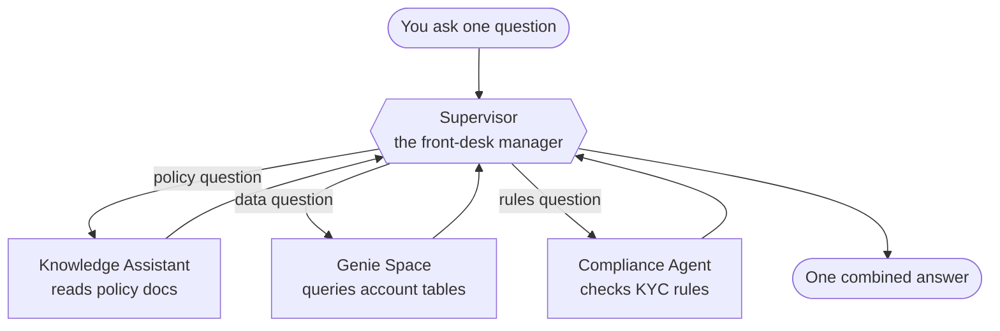
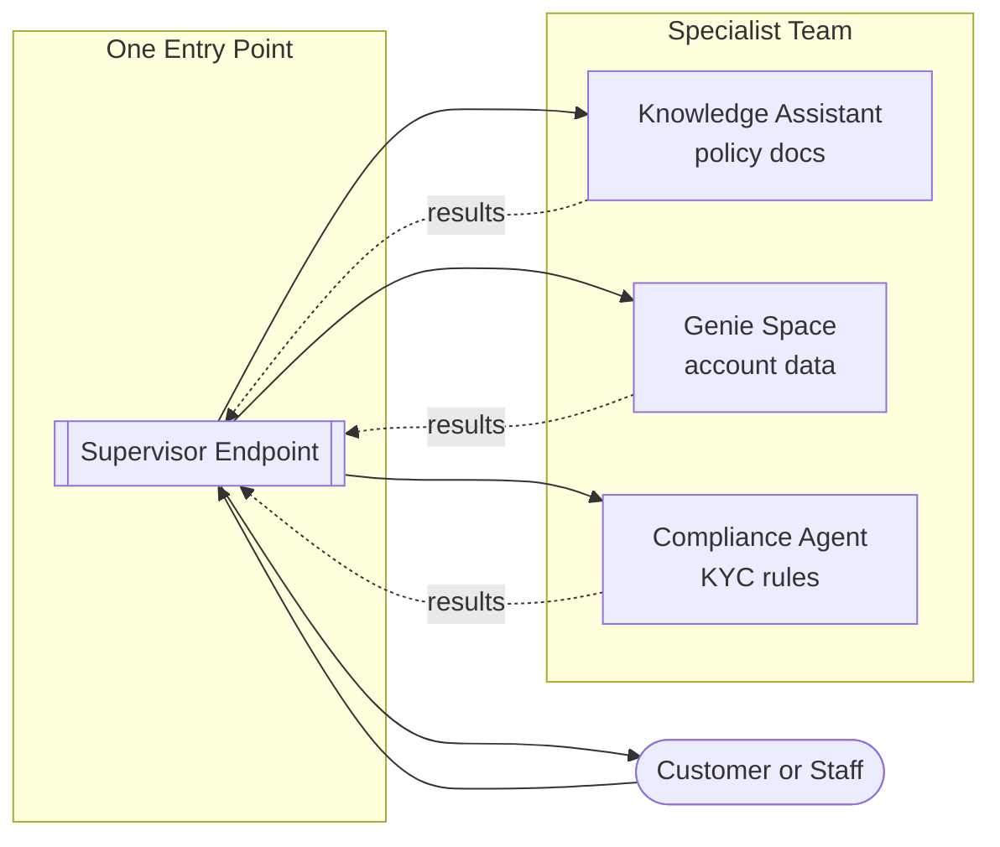
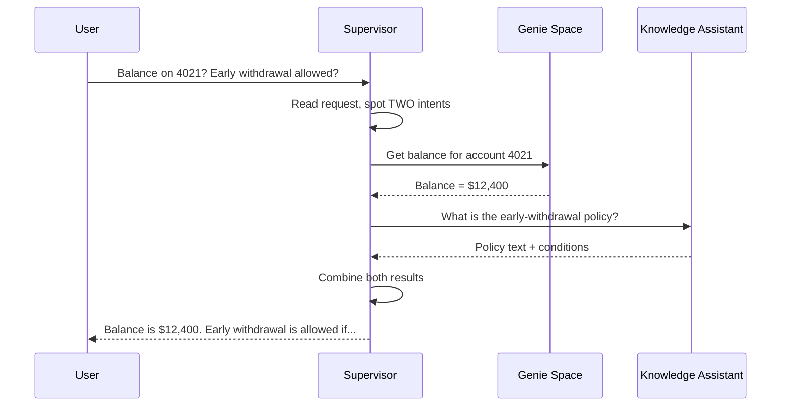

# Multi-Agent Supervisor

> You have built one agent, and it works. Then someone asks it to check a policy document, pull a customer's balance, and confirm a compliance rule — all in one question. Suddenly your single agent is trying to be an expert at everything. There is a calmer way, and this lesson shows it to you.

Take a breath. If you have followed the earlier lessons, you already know most of what you need. A Multi-Agent Supervisor does not ask you to learn a brand-new skill. It asks you to arrange the agents you already understand into a small team, with one friendly "front desk" in charge. That is the whole idea, and by the end of this page it will feel obvious.

## Learning Objectives

By the end of this lesson, you will be able to:

- Explain, in plain words, what a Multi-Agent Supervisor is and the problem it solves.
- Describe how a supervisor reads a request and routes it to the right specialist.
- Recognize when to use a supervisor instead of stuffing everything into one big agent.
- Point to the kinds of specialists a supervisor can coordinate (Knowledge Assistant, Genie space, custom agents, and more).
- Query a deployed supervisor endpoint from Python.
- Understand, at a high level, how this differs from writing multi-agent orchestration by hand.

## Prerequisites

You will get the most out of this lesson if you have already met these two friends:

- [Agent Bricks: Low-Code Agents](/docs/building-agents/agent-bricks) — the low-code family this supervisor belongs to.
- [Knowledge Assistant](/docs/building-agents/knowledge-assistant) — one of the specialists our supervisor will manage.

No AI background is assumed. If you can describe your job to a new coworker, you can configure a supervisor.

## Estimated Reading Time

About 18 to 22 minutes, plus a little time if you try the hands-on examples.

## Business Motivation

Let's start with a real place. Imagine **Northwind Trust**, a mid-sized financial firm. Their customers and staff ask questions all day long, and those questions fall into very different buckets:

- "What is our early-withdrawal policy for a fixed deposit?" — that lives in **policy documents**.
- "What is the current balance on account 4021, and how has it changed this quarter?" — that lives in a **data warehouse**.
- "Is this transaction allowed under our KYC rules?" — that needs a **compliance check**.

You could try to build one giant agent that does all three. But that agent would need to read documents, query tables, and apply compliance logic — while somehow knowing which one to do for each question. It becomes hard to build, hard to test, and hard to trust.

Northwind Trust wants one place to ask, and the right expert answering each time. That is exactly what a Multi-Agent Supervisor gives them: **one entry point, many specialists, correct routing every time.**

## Intuition

Here is the simplest way to picture it.

Think of a **front-desk manager** at a busy office. You walk in with a question. The manager does not personally handle taxes, legal advice, and IT support. Instead, the manager listens to what you need and says, "Ah, you want the billing department — right this way." If your question touches two departments, the manager coordinates both and hands you back a single, combined answer.

The Multi-Agent Supervisor is that manager. The specialists are the departments. You always talk to the front desk. The front desk figures out the rest.



*Figure 1: The supervisor sits between you and several specialists. You never pick the department yourself — the supervisor routes for you and assembles the reply.*

## Theory

Let's put a few gentle labels on what we just saw.

A **specialist agent** is an agent that is good at one job. A Knowledge Assistant is a specialist at answering from documents. A Genie space is a specialist at answering from tables. A compliance agent is a specialist at applying rules.

A **supervisor** is an agent whose job is not to answer directly, but to **coordinate**. It does three things:

1. **Read** the incoming request and understand its intent.
2. **Route** the request to the specialist (or specialists) best suited to handle it.
3. **Combine** the specialists' results into one clear answer for the user.

This pattern is often called **orchestration**. The supervisor orchestrates a small team, the way a conductor cues different sections of an orchestra without playing every instrument.

The key insight is this: each specialist stays **small and focused**. Small things are easier to build correctly, easier to test, and easier to trust. The supervisor keeps the "which expert?" decision in one tidy place, instead of tangled inside every agent.

:::note[Going deeper (optional)]
The supervisor's routing is itself powered by a language model. It reads the descriptions you write for each specialist and matches the user's request against them. This is why writing clear, honest descriptions for your specialists matters so much — the description is how the supervisor "knows" what each one is for. We will come back to this in Best Practices.
:::

## Deep Dive

On Databricks, the Multi-Agent Supervisor is part of the **Agent Bricks** family — the low-code offering you met in the prerequisites. You configure it in the UI, and Databricks handles the heavy machinery of orchestration for you.

A supervisor can coordinate more than just other agents. The specialists it manages can include:

- **Genie spaces** — for natural-language questions over your tables.
- **Knowledge Assistant endpoints** — for questions over documents.
- **Model serving endpoints** — any model you have deployed.
- **Published dashboards** — to surface curated views.
- **Unity Catalog functions, tables, volumes, and AI Search indexes** — governed data and tools.
- **Custom agents** — agents you built yourself in code.
- **External MCP servers** and even **nested supervisors** — a supervisor can manage another supervisor.
- A built-in **web search** capability, when you enable it.

You can add up to **50** such agents or tools to a single supervisor. For each one, you write a short description so the supervisor knows when to use it. You can also add natural-language instructions and guidelines to shape overall behavior.

Everything respects **Unity Catalog permissions**. If a user is not allowed to see a particular specialist or data source, the supervisor will not route them there. Access control is not an afterthought — it is enforced at the endpoint and specialist level.

## Architecture

Here is how the pieces fit together at Northwind Trust.



*Figure 2: Northwind Trust exposes one supervisor endpoint. Behind it, three specialists each do one job well. Adding a fourth specialist later does not change the entry point at all.*

Notice what this buys you. The customer sees **one** endpoint. Your team can improve, replace, or add specialists behind that endpoint without changing how anyone asks questions. The front door stays the same while the departments evolve.

## Internal Working

Let's slow down and watch the supervisor think, step by step, for a single question.

Suppose a staff member asks:

> "What is the balance on account 4021, and does our policy allow an early withdrawal on it?"



*Figure 3: One question, two intents. The supervisor splits the work, asks two specialists, waits for both, and stitches the answers together before replying.*

Walking through it:

1. **Read.** The supervisor notices the question has two parts — a data lookup and a policy lookup.
2. **Route.** It sends the balance part to the Genie space and the policy part to the Knowledge Assistant.
3. **Collect.** Each specialist answers only its own part.
4. **Combine.** The supervisor merges the two answers into one reply, in plain language.

The user never had to know there were two systems involved. That is the magic of the front desk.

## Step-by-Step Walkthrough

Here is how you would create the Northwind Trust supervisor in the Databricks UI. This is low-code — you are describing a team, not writing orchestration logic.

1. **Build the specialists first.** Create the Knowledge Assistant over your policy documents (you learned this in the prerequisite lesson) and set up a Genie space over your account tables. Have the compliance agent ready as a serving endpoint. Each one should work on its own before you wire them together.
2. **Open Agent Bricks and create a Multi-Agent Supervisor.** Give it a clear name, like `northwind-front-desk`.
3. **Add each specialist.** For every one, provide a short, honest **description** — for example, *"Answers questions about company policy documents such as withdrawal rules and account terms."* This description is what the supervisor uses to route.
4. **Write optional guidelines.** In plain English, add any overall rules — for instance, *"Always cite the policy section when answering policy questions."*
5. **Test in the built-in chat or the AI Playground.** Ask mixed questions and watch which specialist the supervisor picks. Adjust descriptions if it routes to the wrong place.
6. **Deploy.** Databricks generates a queryable **endpoint** for you automatically.

That's it. No orchestration code. You described the departments and the manager took over.

## Hands-on Examples

Let's narrate two quick scenarios so routing feels concrete.

**Scenario A — a pure policy question.**
A customer asks, *"How many days notice do I need to close a savings account?"* The supervisor reads it, sees it is about policy, and routes only to the **Knowledge Assistant**. Genie and compliance are never involved. One specialist, one clean answer.

**Scenario B — a mixed question.**
A staff member asks, *"Show me the top 5 accounts by balance, and flag any that fail our KYC review."* The supervisor spots two intents. It asks the **Genie space** for the top 5 accounts, then hands those accounts to the **compliance agent** for KYC flags, and finally combines the list with the flags into one table-like answer. Two specialists, one reply.

The lesson from both: you ask naturally, and the routing happens for you.

## Code Examples

You configure the supervisor in the UI, but you **query** it like any other Databricks serving endpoint. Once deployed, it exposes a standard API you can call with the Python SDK, `curl`, or the Playground.

Here is a Python example that sends a question to a deployed supervisor endpoint.

```python
from databricks.sdk import WorkspaceClient

# Connect to your workspace using your configured Databricks auth.
w = WorkspaceClient()

# The name of the endpoint the supervisor created when you deployed it.
ENDPOINT_NAME = "northwind-front-desk"

# Ask a mixed question. You do NOT tell it which specialist to use —
# the supervisor decides that for you.
response = w.serving_endpoints.query(
    name=ENDPOINT_NAME,
    messages=[
        {
            "role": "user",
            "content": (
                "What is the balance on account 4021, and does our "
                "policy allow an early withdrawal on it?"
            ),
        }
    ],
)

# The combined answer, assembled from whichever specialists were used.
print(response.choices[0].message.content)
```

Prefer `curl`? The same endpoint answers a plain HTTPS request.

```bash
curl -X POST \
  "https://<your-workspace-host>/serving-endpoints/northwind-front-desk/invocations" \
  -H "Authorization: Bearer $DATABRICKS_TOKEN" \
  -H "Content-Type: application/json" \
  -d '{
        "messages": [
          {"role": "user", "content": "How many days notice to close a savings account?"}
        ]
      }'
```

:::note[Going deeper (optional)]
Compare this with the code-first path. In the **Agent Framework**, you would write the orchestration yourself: define each specialist, write the logic that inspects a request, decide who handles it, call them in order, and merge the outputs by hand. That gives you total control, and it is the right choice for unusual routing logic. The Multi-Agent Supervisor trades some of that control for speed and simplicity — you describe the team and Databricks writes the orchestration. Many teams start with the supervisor and only drop to the framework when they hit something it cannot express.
:::

## Production Considerations

- **Start with working specialists.** A supervisor is only as good as its team. Make sure each specialist answers well on its own before you combine them.
- **Version your descriptions.** The routing descriptions are effectively configuration. Treat changes to them with the same care you would treat a code change.
- **Add labeled examples.** Databricks lets you improve routing by adding example questions with the correct specialist. Use this when you see mis-routing.
- **Watch cost and latency.** A mixed question may call several specialists and a routing model. That is more work than a single agent, so budget for it.

## Performance Considerations

- **Routing adds a hop.** Every request passes through the supervisor's decision step before reaching a specialist. It is usually small, but it is not free.
- **Parallel where possible.** When two specialists are independent (balance and policy), they can be worked in parallel rather than one-after-another, which keeps response time down.
- **Fewer, sharper specialists route faster.** If two specialists have overlapping descriptions, the supervisor spends more effort deciding between them. Clear, distinct roles route more quickly and more reliably.
- **Nested supervisors compound.** A supervisor calling another supervisor adds another routing hop. Nest only when the structure genuinely reflects your organization.

## Security Considerations

- **Permissions are enforced.** The supervisor respects Unity Catalog access. If a user cannot see a specialist or its data, the supervisor will not route them there and will steer the conversation away from it.
- **Least privilege still applies.** Give each specialist access only to the data it needs. The supervisor does not widen anyone's access.
- **Sensitive data crosses fewer hands.** Because each specialist is scoped, a policy question never touches account data, and vice versa. Small, focused specialists are also a security benefit.
- **Audit the endpoint.** The single entry point is a natural place to log and review who asked what.

## Common Mistakes

- **One giant do-everything agent.** If your single agent is growing a long list of unrelated jobs, that is the signal to split it and add a supervisor.
- **Vague specialist descriptions.** *"Handles questions"* tells the supervisor nothing. Say exactly what each specialist is for.
- **Overlapping specialists.** Two specialists that both claim to answer policy questions will confuse routing. Keep roles distinct.
- **Skipping the test step.** Always test mixed questions in the Playground before deploying. Routing surprises are easy to catch early.
- **Reaching for the code framework too soon.** If low-code routing covers your needs, use it. Save hand-written orchestration for the cases that truly require it.

## Best Practices

- **Write descriptions like you are onboarding a new hire.** Clear, specific, honest about scope.
- **Keep each specialist small.** One job, tested on its own.
- **Add guidelines for tone and citations.** Shape the combined answer with plain-English instructions.
- **Iterate with examples.** When routing slips, add a labeled example rather than rewriting everything.
- **Grow the team gradually.** Add specialists one at a time and re-test, so you always know what changed.

## Interview Questions

1. **What problem does a Multi-Agent Supervisor solve, and when would you reach for one?**
   When a single agent has to handle several unrelated kinds of work, it becomes hard to build, test, and trust. A supervisor lets you split the work into small specialists and route each request to the right one from a single entry point.

2. **How does the supervisor decide which specialist handles a request?**
   It uses a language model to read the request and match its intent against the descriptions you wrote for each specialist. Clear, distinct descriptions produce reliable routing.

3. **Name several kinds of specialists a Databricks supervisor can coordinate.**
   Genie spaces, Knowledge Assistant endpoints, model serving endpoints, published dashboards, Unity Catalog functions and indexes, custom agents, external MCP servers, nested supervisors, and built-in web search.

4. **How is a Multi-Agent Supervisor different from hand-writing orchestration in the Agent Framework?**
   The supervisor is low-code: you describe the team in the UI and Databricks handles orchestration. The framework is code-first: you write the routing and merging logic yourself, gaining full control at the cost of more effort.

5. **How does the supervisor handle a user who lacks access to one of the specialists?**
   It enforces Unity Catalog permissions. It will not route that user to the restricted specialist and steers the conversation away from resources they cannot access.

## Quiz

**Question 1:** In the front-desk analogy, what is the supervisor's main job?

<details>
<summary>Show answer</summary>

It reads each request and routes it to the right specialist (or specialists), then combines the results into one answer. It does not try to answer everything itself.

</details>

**Question 2:** Why is splitting work into several small specialists better than one giant agent?

<details>
<summary>Show answer</summary>

Small, focused specialists are easier to build correctly, easier to test, and easier to trust. The "which expert?" decision lives in one place — the supervisor — instead of being tangled inside every agent.

</details>

**Question 3:** True or false: you write the orchestration code for a Multi-Agent Supervisor by hand.

<details>
<summary>Show answer</summary>

False. The supervisor is low-code. You configure it in the UI by adding specialists and writing descriptions; Databricks handles the orchestration. Writing orchestration by hand is the Agent Framework path.

</details>

**Question 4:** A user asks one question that needs both account data and a policy rule. What does the supervisor do?

<details>
<summary>Show answer</summary>

It recognizes two intents, routes the data part to the Genie space and the policy part to the Knowledge Assistant, waits for both, and combines them into a single reply.

</details>

## Summary

A Multi-Agent Supervisor is a friendly front desk for your agents. When one agent is not enough, you build several small specialists, describe each one, and let the supervisor read every request and route it to the right place — combining results when a question spans more than one specialist. On Databricks it is low-code, it can coordinate Genie spaces, Knowledge Assistants, custom agents, and more, it respects your permissions, and it deploys as a single queryable endpoint. You get clarity, reliability, and one calm entry point.

## Key Takeaways

- Use a supervisor when a single agent has to juggle unrelated jobs.
- The supervisor **reads**, **routes**, and **combines** — it does not answer everything itself.
- Each specialist stays small, focused, and testable.
- Clear, distinct descriptions are what make routing work.
- It is low-code and UI-configured; deployment gives you one endpoint.
- Permissions are enforced, so users only reach specialists they are allowed to use.
- Reach for the Agent Framework only when you need routing logic the supervisor cannot express.

## Glossary

- **Multi-Agent Supervisor:** An Agent Bricks offering that coordinates multiple specialist agents and tools under one entry point, routing each request to the right specialist.
- **Specialist agent:** An agent focused on one job, such as answering from documents or querying tables.
- **Orchestration:** The act of coordinating multiple agents or tools to work together on a task.
- **Routing:** The supervisor's decision about which specialist should handle a given request.
- **Genie space:** A Databricks feature that answers natural-language questions over your tables.
- **Knowledge Assistant:** An Agent Bricks agent that answers questions from documents.
- **Endpoint:** A deployed, queryable API that clients call to use the supervisor.
- **Unity Catalog:** Databricks' governance layer that enforces who can access which data and tools.

## Further Reading

- [Multi-Agent Supervisor (Databricks docs)](https://docs.databricks.com/aws/en/generative-ai/agent-bricks/multi-agent-supervisor)
- [Agent Bricks (Databricks docs)](https://docs.databricks.com/aws/en/generative-ai/agent-bricks/)

## Next Lesson

You have seen how a supervisor routes to a Genie space for data questions. Next, let's meet Genie itself and learn how it turns plain-English questions into answers from your tables.

➡️ [Genie: Talk to Your Tables](/docs/building-agents/genie-agents)
