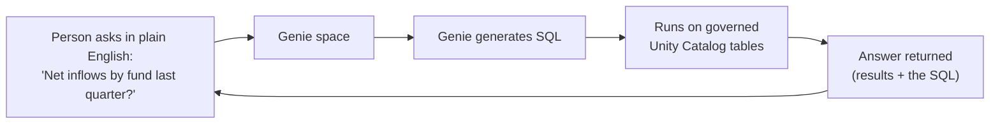
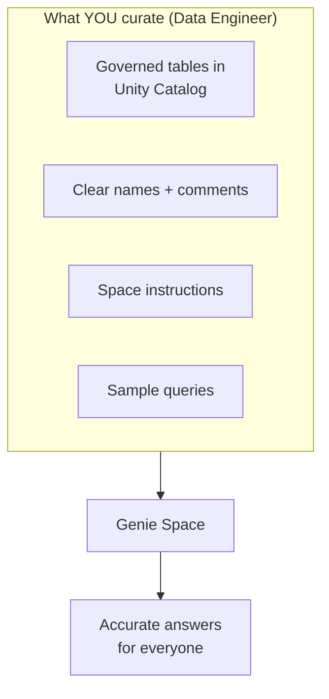
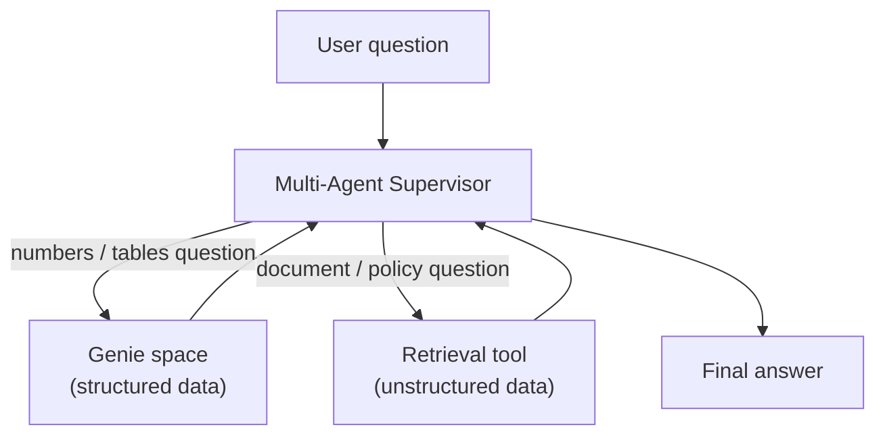

# Genie: Talk to Your Tables

> "Can someone just tell me the net inflows by fund last quarter?" You have heard that question a hundred times. You know it is a five-line SQL query. But the person asking does not write SQL, and you do not want to be a human report button forever. Genie is the fix: a friendly analyst that takes the plain-English question, writes the SQL for you, and answers it, safely, on the tables you already govern.

## Learning Objectives

By the end of this lesson, you will be able to:

- Explain, in plain words, what Databricks Genie is and what problem it solves.
- Describe how a plain-English question becomes SQL, runs on governed tables, and returns an answer.
- Set up the idea of a Genie **space**: which tables to include and what instructions to add.
- Explain why Genie's accuracy depends on **your** data modeling and curation, not magic.
- Plug a Genie space into an agent or a Multi-Agent Supervisor as a tool for structured data.
- Reason about the security model: Genie only queries data the user is allowed to see.

## Prerequisites

You will get the most out of this lesson if you have already seen:

- [Retrieval Tools](/docs/agents-tools-mcp/retrieval-tools) — how agents fetch information from **unstructured** sources (documents). Genie is the mirror image for **structured** data (tables).
- [Multi-Agent Supervisor](/docs/building-agents/multi-agent-supervisor) — how a coordinating agent hands work to specialist tools. Genie will be one of those tools.

You do **not** need any prior AI background. If you can read a SQL query, you are more than ready.

## Estimated Reading Time

About 20 minutes.

## Business Motivation

Let's start with a story you have lived.

At Northwind Trust, the analytics team is buried. Every day, portfolio managers, the compliance desk, and a few VPs ping the data engineers with questions like "What were net inflows by fund last quarter?" or "Which clients pulled money out in June?" Each question is easy for you. Each one is also an interruption, a context switch, and a small delay for the person waiting.

The business does not want a slower answer. It wants a **self-serve** answer. But you cannot just hand everyone a SQL editor. Most of them do not write SQL, and even if they did, you would lose sleep over who can see which client's data.

Genie sits exactly in that gap. It lets non-technical people ask questions in plain English and get answers from your governed tables, without you in the loop for every request, and without loosening a single permission. That frees your team to do the deep engineering work only you can do.

Here is the mental shift for a data engineer: Genie does not replace you. It **amplifies** the work you already do. The better your tables are modeled, named, and documented, the better Genie answers. Curation becomes your superpower.

## Intuition

Imagine you hired a really pleasant junior data analyst. You can walk up to their desk and say, in plain English:

> "What were net inflows by fund last quarter?"

They nod, quietly write the SQL, run it against the right tables, and hand you back a tidy table of numbers. If you ask, they will also show you the exact SQL they wrote, so you can double-check their work.

That analyst is Genie.

You do not talk to Genie in SQL. You talk to it the way you would talk to a helpful colleague. Genie figures out the query. And because you were the one who set up which tables it can see and how they connect, its answers stay grounded in **your** trusted data, not made-up numbers.

:::tip[Confidence boost]
If you can imagine explaining your data model to a smart new teammate, you already understand the core skill Genie needs from you. That is a data engineer's day job. You are not learning AI from scratch here; you are pointing a new tool at work you already do well.
:::

## Theory

Let's name the pieces, gently.

**Genie** is a *conversational analytics agent*. "Conversational" means you interact with it in natural language, back and forth, like a chat. "Analytics" means its job is answering questions about data. "Agent" means it can take an action on its own, here, writing and running SQL.

The unit you configure is a **Genie space**. Think of a space as a curated room. In that room you place:

- A set of **tables** from Unity Catalog (your governed data).
- **Instructions** — plain-English notes and rules that help Genie understand your data ("net inflows means deposits minus withdrawals").
- **Sample queries** — example question-and-SQL pairs that teach Genie your patterns.

When someone asks a question in that space, Genie uses the tables, the instructions, and the samples to generate SQL, run it, and return the answer along with the SQL it used.

Here is the key contrast to keep in your head:

| | Unstructured data | Structured data |
|---|---|---|
| Lives in | Documents, PDFs, wikis | Unity Catalog tables |
| You retrieve with | RAG / vector search | **Genie** |
| The tool produces | Relevant text passages | SQL results (a table) |

So Genie is the **structured-data counterpart to RAG**. RAG searches documents; Genie queries tables.

## Deep Dive

Let's slow down on the part that matters most to you as a data engineer: **why does Genie's accuracy depend on you?**

A large language model is very good with language, but it does not know your business. It does not know that `net_inflow` means deposits minus withdrawals, or that `fund_id = 7` is the flagship growth fund, or that "last quarter" at Northwind Trust means the fiscal quarter, not the calendar one. Left alone, it will guess. Guessing is how you get confident, wrong answers.

You close that gap with three levers, and all three are curation work you understand:

1. **Well-modeled tables.** Clear grain, sensible keys, tidy joins. If a human analyst would struggle to join two tables, so will Genie.
2. **Good names and comments.** A column called `amt` is a mystery. A column called `net_inflow_usd` with a comment "deposits minus withdrawals, in USD" is a gift. Unity Catalog lets you add comments on tables and columns, and Genie reads them.
3. **Space instructions and sample queries.** This is where you teach Genie your business vocabulary and your preferred query shapes. A single good sample query for "inflows by fund" can fix a whole category of questions.

:::note[Going deeper (optional)]
Under the hood, when Genie plans a query it assembles context: the schemas of the included tables, their comments, your instructions, and relevant sample queries. It sends that context to the model along with the user's question, and asks it to produce SQL. It may also verify the SQL is valid before running, and can iterate if there is an error. You do not have to manage any of this; you just make the inputs good. The takeaway: **garbage-in, garbage-out applies to metadata, not just data.**
:::

The happy consequence: the same effort that makes your warehouse pleasant for humans, clean names, real comments, documented business logic, is exactly what makes Genie accurate.

## Architecture

Here is the shape of the whole thing, end to end.



*Diagram 1: The core Genie loop. A plain-English question goes in; Genie writes SQL, runs it on your governed tables, and returns both the answer and the SQL for transparency.*

Notice two things. First, the loop closes back to the person: they can ask a follow-up ("now break that down by month"), and Genie keeps the context. Second, the SQL comes back with the answer. That transparency is what makes Genie trustworthy, anyone can inspect exactly how a number was produced.

Now, where does the data engineer's work live?



*Diagram 2: Everything on the left is curation you already know how to do. It flows into the Genie space and shows up as answer quality.*

## Internal Working

Let's narrate what happens on a single question, step by step, so the "magic" becomes mechanics.

1. A user opens a Genie space and types: *"What were net inflows by fund last quarter?"*
2. Genie gathers context: the schemas and comments of the tables in the space, your written instructions, and any sample queries that look relevant.
3. Genie sends the question plus that context to the language model, which drafts a SQL statement, something like a `GROUP BY fund` with a sum of net inflows, filtered to last quarter.
4. Genie runs that SQL on your Databricks SQL warehouse, **as the asking user**, so Unity Catalog permissions apply.
5. The results come back. Genie presents the answer (often as a table or chart) and shows the SQL it used.
6. If the user asks a follow-up, Genie keeps the conversation context and repeats from step 2.

That is the entire cycle. No step is mysterious once you see it laid out. The model's only job is the translation in step 3. Everything protecting correctness and safety, the schema, the comments, the permissions, is yours.

## Step-by-Step Walkthrough

Here is how you, the data engineer, would set up a Genie space for Northwind Trust. Most of this happens in the Databricks UI.

1. **Pick the tables.** In the Genie UI, create a new space and add the governed tables the space should cover, for example `northwind.finance.fund_flows` and `northwind.finance.funds`. Only include what the space needs; a focused space answers better than a kitchen-sink one.
2. **Check names and comments.** Before you rely on the space, make sure each column has a clear name and, where helpful, a comment in Unity Catalog. This is the highest-leverage step.
3. **Add instructions.** Write plain-English notes: "Net inflow = deposits minus withdrawals. A quarter is the fiscal quarter starting in February." These teach Genie your vocabulary.
4. **Add sample queries.** Give one or two example pairs, a question and the SQL that answers it correctly. Genie learns your join patterns from these.
5. **Test it.** Ask the space a few real questions. Read the SQL it produces. Where it stumbles, add another instruction or sample. This is a quick, iterative loop.
6. **Share it.** Grant access to the business users who need it. Because Unity Catalog governs the data, they only ever see rows they are permitted to see.

That is it. Notice that steps 2 through 5 are pure data-engineering craft. There is no model tuning, no AI expertise required.

## Hands-on Examples

Let's narrate one full question at Northwind Trust so you can picture the experience.

A portfolio manager, Dana, opens the "Fund Flows" Genie space. Dana types:

> "What were net inflows by fund last quarter?"

Genie thinks for a moment and replies with a small table:

| fund_name | net_inflows_usd |
|---|---|
| Growth Flagship | 4,210,000 |
| Balanced Income | 1,875,000 |
| Global Bond | -320,000 |

Below the table, Genie shows the SQL it wrote:

```sql
SELECT f.fund_name,
       SUM(ff.deposits - ff.withdrawals) AS net_inflows_usd
FROM northwind.finance.fund_flows ff
JOIN northwind.finance.funds f
  ON ff.fund_id = f.fund_id
WHERE ff.flow_date >= '2026-02-01'
  AND ff.flow_date <  '2026-05-01'
GROUP BY f.fund_name
ORDER BY net_inflows_usd DESC;
```

Dana can read that, nod, and trust it, or forward it to you if something looks off. Then Dana asks a follow-up:

> "Now just the Global Bond fund, broken down by month."

Genie keeps the context (it already knows "net inflows" and "last quarter"), rewrites the SQL with a monthly grouping and a filter on Global Bond, and returns the breakdown. Dana never wrote a line of SQL, and you were never interrupted.

That is the whole promise, made concrete.

## Code Examples

Most Genie setup happens in the UI, as above. But once a space exists, you can also talk to it programmatically, which is how you turn it into a tool for an agent. Below is a **simplified, illustrative** sketch. Treat it as the shape of the idea; check the current docs for exact parameter names.

Starting a conversation with a Genie space over its API:

```python
# Illustrative sketch. Confirm exact method names in current Databricks docs.
from databricks.sdk import WorkspaceClient

w = WorkspaceClient()

# A Genie space you created in the UI has an id.
space_id = "01ef...your-space-id"

# Ask a plain-English question. Genie writes and runs the SQL.
conversation = w.genie.start_conversation(
    space_id=space_id,
    content="What were net inflows by fund last quarter?",
)

# The result includes the answer data and the SQL Genie generated.
print(conversation.query_result)   # the returned rows
print(conversation.generated_sql)  # the SQL, for transparency
```

Using a Genie space **as a tool inside an agent**. This is the pattern that connects to the last lesson: the supervisor decides a question is about structured data and routes it to Genie.

```python
# Illustrative sketch of wiring Genie in as a structured-data tool.

def query_structured_data(question: str) -> str:
    """Answer questions about governed finance tables using Genie."""
    conversation = w.genie.start_conversation(
        space_id="01ef...your-space-id",
        content=question,
    )
    return conversation.query_result

# The agent / Multi-Agent Supervisor registers this as one of its tools.
# When a user asks a numbers question, the supervisor calls
# query_structured_data(...) instead of searching documents.
tools = [
    query_structured_data,   # structured data  -> Genie
    # search_documents,      # unstructured data -> RAG (from an earlier lesson)
]
```

Here is the payoff diagram: how Genie slots in beside a document-retrieval tool under a supervisor.



*Diagram 3: Genie and a retrieval tool are complementary specialists. The supervisor picks the right one based on the question.*

## Production Considerations

- **Start narrow, then grow.** A space with a handful of well-understood tables outperforms one with fifty. Add tables as real questions demand them.
- **Treat instructions and sample queries as living documentation.** When the business coins a new metric, add it to the space instructions the same way you would update a data dictionary.
- **Monitor the questions people actually ask.** The questions Genie handles poorly are a to-do list: usually a missing comment, instruction, or sample.
- **Version your curation.** Keep the space's instructions and sample queries somewhere you can review and track changes, just like code.
- **Set expectations.** Genie is excellent for exploratory and reporting questions. For a regulator-facing number, a human should still confirm the SQL. The transparency is there precisely to make that easy.

## Performance Considerations

- **Query cost lives in the warehouse.** Genie's SQL runs on a Databricks SQL warehouse, so normal warehouse tuning applies: right-sized clusters, partitioned and well-clustered tables, sensible file sizes.
- **Simpler models help.** If a question requires a six-table join, Genie (like a human) is more likely to fumble it. Pre-join or pre-aggregate common patterns into clean tables or views. A tidy `fund_flows_daily` table is faster **and** easier for Genie to query correctly.
- **Sample queries double as performance hints.** A sample that shows the efficient join path nudges Genie toward that same path.
- **Latency has two parts:** the model writing the SQL, and the warehouse running it. The second part is the one you tune with classic data-engineering skills.

## Security Considerations

This is the part that lets you sleep at night.

- **Unity Catalog permissions always apply.** Genie runs SQL as the asking user. If Dana cannot see another desk's client rows in a normal query, Dana cannot see them through Genie either. There is no back door.
- **Genie can only touch tables in its space.** It cannot wander off to tables you did not include.
- **Row and column filters are respected.** If you use Unity Catalog row filters or column masks, they apply to Genie's queries too, because it is the same governed SQL path.
- **The SQL is visible.** Because Genie returns the query it ran, security and audit teams can review exactly what was accessed.

:::note[Going deeper (optional)]
The important architectural fact is that Genie does not sit on top of a privileged service account that sees everything. It runs in the user's own permission context. So governance you already set up in Unity Catalog is automatically inherited. You do not configure permissions twice.
:::

## Common Mistakes

- **Expecting Genie to read your mind.** If "net inflow" is not defined anywhere, Genie will guess. Add the definition as an instruction.
- **Dumping every table into one space.** More tables means more ambiguity and worse answers. Curate.
- **Skipping column comments.** Cryptic names like `amt` and `dt` are the number-one cause of wrong SQL. Comments are cheap and powerful.
- **Never reading the generated SQL during setup.** The SQL is your feedback signal. If you do not read it while testing, you miss easy fixes.
- **Treating Genie as a replacement for governance.** Genie relies on Unity Catalog; it does not replace it. Model and permission your data properly first.

## Best Practices

- **Curate like you are onboarding a new analyst.** Names, comments, definitions, examples, everything you would give a new hire, give to the space.
- **One space per business domain.** Finance flows, marketing funnel, and operations each deserve a focused space.
- **Iterate with real questions.** Ship a small space, watch real usage, and patch weak spots with instructions and samples.
- **Keep a golden set of test questions.** Re-run them after changing a space so you notice regressions.
- **Pre-build clean, documented views** for the metrics people ask about most. They boost both accuracy and speed.
- **Pair Genie with RAG under a supervisor** so users get one front door for both numbers and documents.

## Interview Questions

1. **What is Databricks Genie, and what problem does it solve?**
   Genie is a conversational analytics agent. Users ask questions in plain English about governed Unity Catalog tables, and Genie generates and runs SQL to answer, returning both the results and the SQL. It solves the self-serve analytics problem: non-technical users get answers without writing SQL, and without data engineers being interrupted for every request.

2. **How is Genie related to RAG, and how does it differ?**
   Both are retrieval tools for agents. RAG retrieves from **unstructured** data (documents) via vector search and returns text passages. Genie retrieves from **structured** data (tables) by generating SQL and returns query results. Genie is the structured-data counterpart to RAG.

3. **As a data engineer, what determines Genie's accuracy, and what is your role?**
   Accuracy depends on well-modeled tables, clear column names and comments, and the instructions and sample queries added to the space. All of these are data-engineering curation tasks. The data engineer's role is to make those inputs excellent; that curation is the main lever on answer quality.

4. **How does Genie handle security and permissions?**
   Genie runs SQL in the asking user's own Unity Catalog permission context. Users only see data they are already allowed to see, including row filters and column masks. Genie can only query tables included in its space, and it exposes the SQL it ran for audit.

5. **How would you plug Genie into a multi-agent system?**
   Expose the Genie space as a tool (via its API) that takes a plain-English question and returns results. A supervisor agent routes structured-data questions to that Genie tool and unstructured-data questions to a retrieval/RAG tool, giving users a single entry point for both.

## Quiz

<details>
<summary>1. What does Genie return when it answers a question?</summary>

Both the **answer** (the query results, often as a table or chart) **and the SQL** it generated. The SQL is included for transparency so anyone can verify how the number was produced.

</details>

<details>
<summary>2. Genie is the counterpart of RAG for which kind of data?</summary>

**Structured** data, that is, governed tables in Unity Catalog. RAG handles unstructured data (documents); Genie handles structured data by writing SQL.

</details>

<details>
<summary>3. Name two things a data engineer curates in a Genie space to improve accuracy.</summary>

Any two of: the **tables** included, clear **column names and comments**, **space instructions** (business definitions and rules), and **sample queries** (example question-and-SQL pairs). All are curation work, not AI tuning.

</details>

<details>
<summary>4. If a user cannot see certain rows in a normal SQL query, can they see them through Genie?</summary>

**No.** Genie runs SQL in the user's own Unity Catalog permission context, so the same permissions, row filters, and column masks apply. There is no privileged back door.

</details>

## Key Takeaways

- Genie turns **plain-English questions into SQL** over **governed tables**, and shows its work.
- It is the **structured-data** partner to **RAG** (unstructured data).
- You configure a **Genie space**: tables + instructions + sample queries.
- **Accuracy is a curation problem**, well-modeled, well-commented tables win. That is a data engineer's superpower.
- **Unity Catalog permissions always apply**; users only query what they may see.
- A Genie space can be **standalone, embedded, or a tool** for an agent or Multi-Agent Supervisor.

## Glossary

- **Genie** — Databricks' conversational analytics agent that answers plain-English questions about tables by generating and running SQL.
- **Genie space** — A curated configuration of tables, instructions, and sample queries that scopes what a Genie experience can answer.
- **Structured data** — Data organized in rows and columns (tables), as opposed to free text or documents.
- **Unity Catalog** — Databricks' governance layer for data and AI assets, which defines who can access which tables, rows, and columns.
- **Instructions (in a space)** — Plain-English notes that teach Genie your business definitions and rules.
- **Sample queries** — Example question-and-SQL pairs that teach Genie your preferred query patterns.
- **RAG** — Retrieval-Augmented Generation; retrieving relevant **unstructured** text (documents) to ground an answer.

## Further Reading

- [Databricks Genie documentation](https://docs.databricks.com/aws/en/genie/)

## Next Lesson

➡️ [Shipping a Chat UI with Databricks Apps](/docs/building-agents/databricks-apps)
