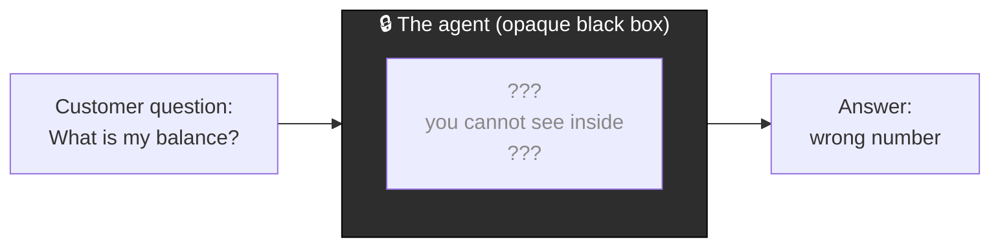
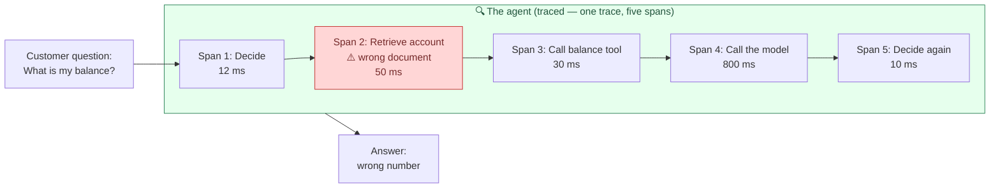

# Why Observability Matters for AI

> Picture this. It is Tuesday morning. A colleague pings you: "The support agent gave a customer the wrong account balance yesterday. Can you figure out why?" You open your laptop, ready to dig in — and then you realize you have nothing to dig into. No log, no plan, no stages. Just a question that went in and a wrong answer that came out. This lesson is about making sure that never happens to you.

Take a breath. You already know how to debug hard things. You have chased down a slow Spark job at 2 a.m. and won. The good news is that debugging an AI agent uses the exact same instinct you already have — you just need the AI version of the tools you already love. That is all observability is. By the end of this lesson you will know what it means, why AI needs it even more than a normal pipeline does, and the two words (trace and span) that unlock the rest of this Part.

## Learning Objectives

By the end of this lesson, you will be able to:

- Explain why an AI agent is nondeterministic and takes many hidden steps, unlike a deterministic SQL query.
- Define observability in plain language, and connect it to logs, query plans, and Spark UI stages you already use.
- Define a trace and a span, and describe what each span records.
- Describe why you cannot fix a wrong answer unless you can see what happened at each step.
- Recognize that turning on tracing is essentially one setting, and know that the how comes in the next lesson.

## Prerequisites

Before starting this lesson, you should understand:

- [What Is an AI Agent?](/docs/agents-tools-mcp/what-is-an-agent) — what an agent is and why it does more than a plain chatbot.
- [What Is Generative AI?](/docs/orientation/what-is-generative-ai) — the basics of how a language model produces text.

You do not need any prior AI or machine learning experience. Your data engineering background is exactly the right foundation.

## Estimated Reading Time

About 14 minutes.

## Business Motivation

Let us go back to **Northwind Trust**, our fictional mid-sized bank. Their team built an AI support agent that answers customer questions — balances, fees, card resets, and so on.

One afternoon, a customer asks, "What is my current balance?" The agent confidently replies with a number. The number is wrong. It belongs to a different account.

Now the team gathers to figure out what went wrong. And here is the painful part. Without observability, they are arguing in the dark.

- One engineer says, "The language model must have made up the number."
- Another says, "No, the tool that looks up balances returned bad data."
- A third says, "Maybe it looked up the wrong customer entirely."

They are all guessing. Nobody can prove anything. Hours pass. Trust in the whole project starts to wobble — and for a bank, a wrong balance is not a small bug. It is a serious problem.

Now imagine the same team, but this time tracing was switched on. They open the recording of that exact run and see it plainly: the step that searched for the customer's account returned the wrong document, and it did so in 50 milliseconds. The language model did nothing wrong — it faithfully reported a number it was handed. The bug is in retrieval, not the model.

Diagnosis time: about thirty seconds. That is the difference observability makes. It turns a room full of guesses into a single, obvious answer.

## Intuition

Here is the whole idea in one sentence: **observability means making the inside of a run visible, so you can see every step instead of guessing.**

You already live by this rule. Think about how you debug the things you build today.

- A pipeline fails? You open the **logs**.
- A query is slow? You read the **query plan** to see which join is the villain.
- A Spark job crawls? You open the **Spark UI** and stare at the **stages** until the skewed one confesses.

You would never, ever try to debug a slow job by just re-running it and hoping. You look inside. Observability for AI is the same habit, pointed at a new kind of program.

The twist is that an AI agent needs this visibility *even more* than a normal pipeline does. Let us see why.

## Theory

Start with something comfortable: a SQL query.

A SQL query is **deterministic**. Same input, same output, every single time. `SELECT balance FROM accounts WHERE id = 42` returns the same row today, tomorrow, and next year (until the data changes). If it is wrong, it is wrong in a repeatable way you can reproduce and reason about.

An AI agent is **nondeterministic** (its behavior can vary from run to run). Ask it the same question twice and it might phrase the answer differently, or even choose a different path to get there. That alone makes it harder to pin down.

But there is a second, bigger difference. A SQL query is basically **one step**: you send text, you get a table. An agent is **many hidden steps** chained together. A single "What is my balance?" request might unfold like this inside the agent:

1. **Decide** what to do with the question.
2. **Retrieve** relevant information (for example, search for the customer's account).
3. **Call a tool** (for example, a balance-lookup function).
4. **Call the model** (send everything gathered to the language model to compose an answer).
5. **Decide again** — is this answer good enough, or do I need another step?

Any one of those steps can go wrong. And from the outside, all you see is the question going in and the answer coming out. Everything in the middle is invisible unless you record it.

That recording is what observability gives you. And it comes in two neat pieces you will use constantly: **traces** and **spans**.

- A **trace** is the *whole run* — everything that happened from the question arriving to the answer leaving. Think of it as one complete story.
- A **span** is a *single step inside that story* — one decision, one retrieval, one tool call, one model call. Each span records its own **inputs** (what it received), **outputs** (what it produced), and **timing** (how long it took).

So a trace is the whole journey; spans are the individual stops along the way. When something goes wrong, you open the trace and read the spans one by one until you find the stop where things went sideways.

:::note[Going deeper (optional)]
The words "trace" and "span" are not invented for AI. They come from a broader field called **distributed tracing**, used for years to debug complicated systems made of many services talking to each other. AI observability borrows the same vocabulary because an agent is, in a sense, a little distributed system: several steps and services cooperating on one request. If you have ever looked at a request trace across microservices, this will feel familiar. If you have not, no problem — the trace-and-span idea is all you need here.
:::

## Deep Dive

Let us make the two analogies from the intro concrete, because they are the mental model that makes everything click.

**Analogy 1: the airplane black box (flight recorder).**

Every airplane carries a flight recorder — the famous "black box." While the plane flies, it quietly records what every instrument was doing, second by second. Nobody looks at it on a normal flight. But if something goes wrong, investigators can replay exactly what happened and find the cause instead of guessing.

A trace is your agent's flight recorder. It runs quietly in the background on every request. When an answer is wrong, you replay the recording and see precisely which instrument misbehaved.

**Analogy 2: the itemized receipt.**

Imagine you buy groceries and the total looks too high. A receipt that just says "TOTAL: $84.00" tells you nothing — you cannot argue with it. But an **itemized** receipt shows every single item and its price. Now you can scan down the list and spot the one line that is wrong ("wait, why is the milk $40?").

A trace is an itemized receipt for your agent's run. Instead of one opaque total ("the answer was wrong"), you get a line for every step, with its inputs, outputs, and cost in time. You scan the list and find the bad line.

Both analogies point at the same truth: **a single output is not debuggable; an itemized record of steps is.**

Here is why this matters so much for AI specifically. With a deterministic SQL query, even without a detailed log you can often just re-run it and watch. With a nondeterministic agent, the run you are trying to debug may never happen the exact same way again. If you did not record it while it happened, the evidence is gone. Observability is how you capture the evidence *the first time*, because there may not be a clean second time.

## Architecture

Let us look at the core picture of this whole lesson: the difference between an agent you cannot see into and one you can.

First, the situation Northwind was stuck in — the **black box**. You can see what goes in and what comes out, but the middle is sealed shut.



*Figure 1: A black-box agent. The question and the wrong answer are visible, but every step in the middle is hidden. Debugging this means guessing.*

Now the same agent with tracing switched on. The lid comes off. Every step is a visible span with its own inputs, outputs, and timing.



*Figure 2: The same agent with tracing on. The whole run is one trace; each step is a span you can open. The wrong document at Span 2 (highlighted) is now obvious — diagnosis in seconds, not hours.*

Notice how the second picture instantly answers the question the first one could not — the wrong retrieval announces itself the moment the lid comes off.

## Internal Working

You might wonder: how does the agent's inside become visible without you writing a logging line at every step? Here is the plain-language version.

- As the agent runs, an observability layer quietly **wraps each step** and takes notes: when the step started, what it received, what it returned, and when it finished.
- Each of those notes becomes a **span**.
- All the spans from one request are collected together under a single **trace**, usually with a shared trace ID so they stay linked as one story.
- The spans are also **nested** to show which step happened inside which. For example, "call the model" might sit inside "decide," the way a stage in the Spark UI sits inside a job. This nesting is how you see structure, not just a flat list.
- The finished trace is then **stored** somewhere you can open and read it later — a UI that looks a lot like the Spark UI stage view you already know.

On Databricks, that observability layer and that storage are provided by **MLflow** (an open-source platform for managing the machine learning lifecycle). You do not build the recorder yourself; you turn it on. Exactly how you turn it on is the whole next lesson — here you only need the concept.

## Step-by-Step Walkthrough

Let us walk through Northwind's wrong-balance incident twice: once without observability, once with. Same bug, very different days.

**Without observability:**

1. The customer reports a wrong balance. The team has the question and the wrong answer, nothing else.
2. They form theories: bad model, bad tool, wrong customer lookup. No evidence for any of them.
3. They try to reproduce it. Because the agent is nondeterministic, the next run behaves a little differently and does *not* reproduce the bug cleanly.
4. Hours later, they are still arguing. Confidence in the project drops.

**With observability:**

1. The customer reports a wrong balance. The team notes the time and finds the exact trace for that request.
2. They open the trace and read the spans in order, like an itemized receipt.
3. At **Span 2 (Retrieve account)** they see the inputs, the outputs, and the timing: it returned the *wrong* customer document, in 50 ms.
4. They keep reading. **Span 4 (Call the model)** faithfully turned that wrong document into a fluent answer — the model did its job correctly on bad input.
5. Diagnosis: the bug is in retrieval, not the model. They know exactly where to fix it. Total time: minutes.

The bug was identical in both stories. The only thing that changed was whether they could see inside. That is the entire case for observability, lived out.

## Hands-on Examples

There is no code to run in this lesson — the hands-on work starts in the next one. For now, practice the *mindset* with a quick exercise. For each symptom below, ask yourself: "Which span would I open first?"

- **Symptom:** the answer is fluent but factually wrong.
  *Likely span to check first:* the **retrieve** step — did it fetch the right information? (An eloquent answer built on the wrong document looks confident and is still wrong.)
- **Symptom:** the answer says "I could not find that information."
  *Likely span to check first:* the **tool call** — did the tool error out or return empty?
- **Symptom:** the whole request is painfully slow.
  *Likely span to check first:* whichever span has the **biggest timing** — usually a model call. Same instinct as finding the slow stage in the Spark UI.

If you can point at a likely span for each symptom, you already understand what observability is *for*. The tooling just makes those spans easy to open.

## Code Examples

We promised the code would be light here, and it will be. The point of this snippet is simply to show you that turning tracing on is not a giant project — it is essentially **one setting**.

```python
import mlflow

# Turn on automatic tracing for your agent.
# From here on, every run is recorded as a trace made of spans.
mlflow.langchain.autolog()   # one line: the "flight recorder" is now on
```

Let us narrate that single line, because it is doing more than it looks.

- `mlflow` is the observability backbone Databricks gives you.
- The `autolog()` call flips the recorder on. You did not have to add logging to each step by hand.
- After this line, when your agent runs, MLflow automatically captures a **trace** for the whole run and a **span** for each step inside it, with inputs, outputs, and timing — the itemized receipt, generated for free.

That is genuinely the whole idea at the code level for now: observability is closer to a switch than to a build project. The next lesson shows you exactly where that switch lives, how to open the traces it produces, and how to read them like a pro.

:::note[Going deeper (optional)]
The exact line depends on what your agent is built with — there are matching `autolog` switches for different agent libraries, and you can also record spans manually when you want fine control. Do not memorize any of this now. Just hold onto the takeaway: **tracing is something you enable, not something you hand-build.**
:::

## Production Considerations

- **Turn tracing on before you need it, not after.** Like a flight recorder, a trace is only useful if it was already running when the problem happened. A nondeterministic run may never repeat, so capture it the first time.
- **Traces are how you handle "the agent said something weird" tickets.** In production these arrive regularly. With traces you resolve them; without them you guess and stall.
- **Keep traces around long enough to be useful.** If a customer reports an issue from last week, you want last week's trace to still exist. Retention is a real planning decision, just like log retention for your pipelines.

## Performance Considerations

- **Recording adds a little overhead.** Taking notes on each step costs a small amount of time and storage — the same tiny tax you already accept for logging a pipeline. In almost every case the visibility is worth far more than the cost.
- **Timing data is a performance gift.** Because each span records how long it took, traces double as a profiler. The slowest span is usually the biggest model call, and now you can see it plainly instead of suspecting it.
- **Volume adds up.** A busy agent produces a lot of traces. At scale you may sample or set retention windows, exactly as you would for high-volume logs.

## Security Considerations

- **Traces can contain sensitive data.** A span's inputs and outputs may include the customer's question, their account details, and retrieved documents. For Northwind, that is real banking data. Treat traces as sensitive, not as throwaway debug text.
- **Control who can read traces.** The same governance instinct you apply to tables applies here — not everyone should be able to open a trace full of customer information.
- **Traces are also an audit trail.** For a regulated business, being able to show exactly what the agent did on a given request is not just convenient; it can be a compliance requirement. Observability supports that.

## Common Mistakes

- **Debugging by re-running and hoping.** With a nondeterministic agent this often fails to reproduce the bug. Read the recorded trace instead.
- **Waiting until something breaks to turn tracing on.** By then the run you care about is gone. Enable it up front.
- **Blaming the model first.** As Northwind learned, a wrong answer is frequently a *retrieval* or *tool* problem, and the model faithfully reported bad input. Read the spans before assigning blame.
- **Treating the single answer as the only evidence.** One opaque output is not debuggable. The itemized steps are.
- **Ignoring the timing in spans.** People check outputs and forget timing, missing easy performance wins that the spans hand them for free.

## Best Practices

- **Turn on tracing from day one.** Make it the default for every agent, the way logging is the default for every pipeline.
- **Read traces top to bottom, like a receipt.** Follow the story in order; the bad line usually announces itself.
- **Reach for the trace before the theory.** Let the evidence lead. It is faster and it ends arguments.
- **Lean on the span timings.** Use them to find your slowest step, just as you use the Spark UI to find your slowest stage.
- **Protect traces like the sensitive data they are.** Govern access and set sensible retention.

## Interview Questions

<details>
<summary>1. Why is an AI agent harder to debug than a deterministic SQL query?</summary>

Two reasons. First, an agent is **nondeterministic** — the same question can produce different wording or even a different path, so you cannot reliably reproduce a bad run. Second, an agent is not one step but **many hidden steps** (decide, retrieve, call a tool, call the model, decide again), and from the outside you only see the question going in and the answer coming out. A SQL query is deterministic and essentially one step, so it is far easier to reason about. This is exactly why agents need observability.

</details>

<details>
<summary>2. Define a trace and a span, and explain the relationship between them.</summary>

A **trace** is the recording of the whole run — everything that happened from the request arriving to the answer leaving. A **span** is a single step inside that run — one decision, one retrieval, one tool call, one model call — and it records that step's inputs, outputs, and timing. The relationship: a trace is the whole story, and spans are the individual steps within it. Spans are often nested to show which step happened inside which.

</details>

<details>
<summary>3. A user reports that the agent gave a fluent but factually wrong answer. How would you use tracing to diagnose it, and why is the model often not the culprit?</summary>

Open the exact trace for that request and read the spans in order. Check the **retrieve** span first: if it returned the wrong document, the model was simply handed bad input and faithfully turned it into a fluent, confident, wrong answer. In that case the bug is in retrieval, not the model. Tracing lets you prove this in seconds by showing each span's inputs and outputs, instead of guessing.

</details>

<details>
<summary>4. How does observability for AI connect to tools a data engineer already uses?</summary>

It is the same "look inside before you guess" habit applied to a new kind of program. Logs tell you what a pipeline did; a query plan shows which operation is slow; the Spark UI shows stages inside a job. A trace does all of that for an agent: it shows the steps (spans) inside a run, with their inputs, outputs, and timing, in a UI that resembles the Spark UI stage view. The instinct transfers directly.

</details>

<details>
<summary>5. Why should tracing be enabled before a problem occurs rather than after?</summary>

Because an agent is nondeterministic, the specific run that misbehaved may never repeat exactly. If tracing was not already recording when it happened, the evidence is gone — like an airplane's flight recorder that was switched off during the incident. Enabling tracing up front captures the run the first time, which may be the only time.

</details>

## Quiz

<details>
<summary>1. What is the difference between a trace and a span?</summary>

A **trace** is the whole run (the complete story), and a **span** is a single step inside it (one decision, retrieval, tool call, or model call). Each span records its own inputs, outputs, and timing.

</details>

<details>
<summary>2. In the Northwind wrong-balance story, which step turned out to be the problem, and how long did that step take?</summary>

The **retrieve** step (Span 2) returned the wrong customer document, and it did so in **50 milliseconds**. The language model was not at fault; it faithfully reported the bad input it was handed.

</details>

<details>
<summary>3. True or false: because an agent is nondeterministic, the best way to debug a wrong answer is to run it again and watch.</summary>

**False.** Because it is nondeterministic, re-running may not reproduce the bug. The reliable approach is to read the recorded trace of the original run.

</details>

<details>
<summary>4. Roughly how much effort is it to turn tracing on for an agent on Databricks?</summary>

Very little — it is essentially **one setting** (for example, a single `autolog()` call). You enable the recorder rather than hand-building logging into every step. The details come in the next lesson.

</details>

## Key Takeaways

- A SQL query is deterministic and one step; an AI agent is nondeterministic and many hidden steps.
- You cannot fix a wrong answer unless you can see what happened at each step.
- Observability means making the inside of a run visible.
- A trace is the whole run; a span is one step inside it, recording inputs, outputs, and timing.
- A trace is like an airplane black box and like an itemized receipt — an opaque single output is not debuggable.
- It is the same habit as logs, query plans, and Spark UI stages, applied to agents.
- Turning tracing on is essentially one setting; the how comes next lesson.

## Glossary

- **Deterministic** — always producing the same output for the same input; a normal SQL query is deterministic.
- **Nondeterministic** — behavior that can vary from run to run for the same input; AI agents are nondeterministic.
- **Observability** — making the inside of a run visible so you can see each step instead of guessing.
- **Trace** — a recording of a whole agent run, from request in to answer out.
- **Span** — a single step inside a trace, with its own inputs, outputs, and timing.
- **Retrieval** — the step where an agent searches for and fetches relevant information.
- **Tool call** — the step where an agent runs a function (for example, looking up a balance).
- **MLflow** — an open-source platform for managing the machine learning lifecycle; the observability backbone on Databricks.
- **Distributed tracing** — the broader practice of recording traces and spans across a system of cooperating steps or services.

## Further Reading

- [Mosaic AI Agent Framework tracing](https://docs.databricks.com/aws/en/mlflow/mlflow-tracing)
- [Agent development on Databricks (Mosaic AI Agent Framework)](https://docs.databricks.com/aws/en/generative-ai/agent-framework/build-genai-apps)
- [Monitor and observe generative AI applications](https://docs.databricks.com/aws/en/generative-ai/agent-evaluation/)

## Next Lesson

➡️ [MLflow Tracing: Your Agent's Flight Recorder](/docs/tracing/mlflow-tracing)
