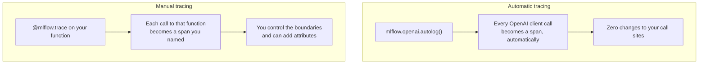
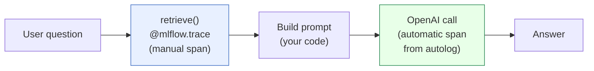
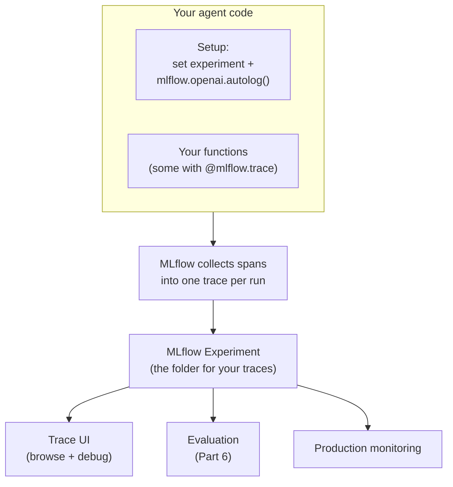

# Instrumenting Your Agent

> You have already seen what a trace looks like. Now comes the fun part: switching the recorder on for your own agent. Good news up front. This is usually one line of setup plus a decorator, not a weekend rewrite.

Take a breath. If the last lesson made traces feel useful but a little magical, this lesson makes them yours. By the end you will be able to point at your Northwind Trust agent and say, "every run gets recorded, and here are the exact steps I care about."

## Learning Objectives

By the end of this lesson, you will be able to:

- Explain the two ways to add tracing to an agent: automatic and manual.
- Turn on automatic tracing for a supported library with a single line.
- Wrap your own function as a span using the `@mlflow.trace` decorator.
- Add a custom attribute inside a span for extra detail.
- Combine automatic and manual tracing for full coverage.
- Point your traces at an MLflow experiment so they land somewhere you can find them.

## Prerequisites

- You have read [MLflow Tracing: Your Agent's Flight Recorder](/docs/tracing/mlflow-tracing). That lesson explains what a trace and a span are. This lesson assumes those words feel comfortable.
- You are comfortable reading a little Python. You do not need to be an expert.
- You have met the Northwind Trust agent from earlier lessons (the one that answers customer questions by retrieving policy documents and then calling a model).

If any of that feels shaky, that is completely fine. You can follow along and pick it up as you go.

## Estimated Reading Time

About 16 to 20 minutes, a bit more if you type the code out yourself. This one is code-heavy, so we will go slowly and narrate every block.

## Business Motivation

Here is the everyday version. Imagine a support call center. If nobody records the calls, you can never go back and ask, "why did that customer leave unhappy?" You are guessing. The moment you record calls, every problem becomes something you can replay, study, and fix.

Your agent is the same. Right now it might be answering questions well most of the time. But when it gives a weird answer, you have almost nothing to look at. Instrumenting your agent means every run leaves a record: what came in, which steps ran, how long each took, and what came out.

That record pays off in three concrete ways:

- **Debugging.** When a customer complains, you open the trace and see exactly where things went sideways.
- **Evaluation (Part 6).** You cannot grade answers you did not capture. Traces are the raw material for scoring quality.
- **Production monitoring.** Once the agent is live, traces let you watch cost, latency, and failures in real time.

So instrumenting is not busywork. It is the thing that turns "I hope it works" into "I can prove how it works."

## Intuition

Let us keep the recorder analogy going, because it works well here.

Picture a recording studio. There are two kinds of recording you can set up.

1. **Flip on the recorder for the standard equipment.** The studio already has microphones on the drums, the guitar amp, the piano. You press one button and all of that standard gear gets recorded automatically. You did not wire anything yourself. That is **automatic tracing**. Popular AI libraries (like the OpenAI client or LangChain) are the "standard equipment." One line tells MLflow, "record everything these libraries do."

2. **Add your own labeled checkpoints.** Maybe you have a custom step that the standard mics do not cover, like your own retrieval logic or a business rule. You place your own labeled microphone right there and press record. That is **manual tracing**. You mark a specific function of yours and say, "record this one, and call it what I named it."

Real studios use both. So do real agents. You flip on the recorder for the standard gear, and you add a few labeled checkpoints around your own custom work. Together you get the full session, nothing missing.

## Theory

Let us name the pieces cleanly.

**Automatic tracing (autologging).** MLflow ships with built-in integrations for common AI libraries. When you call something like `mlflow.openai.autolog()`, MLflow quietly wraps that library's calls. From then on, every time your code calls that library, a span is created for you. You write no extra code around the call. This is the "one line" mode.

**Manual tracing.** For code MLflow does not know about (your own functions), you tell MLflow explicitly. The simplest way is the decorator `@mlflow.trace`. You put it above one of your functions, and every call to that function becomes a span. The span captures the function's inputs and outputs automatically. If you want finer control, you can open a span yourself with `mlflow.start_span(...)` and add your own details inside it.

**Where do traces go?** Traces are attached to an **MLflow experiment**. Think of an experiment as the folder where all your runs are collected. You point tracing at an experiment once, and then every trace lands there for you to browse later.

:::note[Going deeper (optional)]
A span created by a decorated function can hold **attributes**: little labeled key/value notes you attach, like `customer_tier = "gold"` or `documents_found = 3`. Attributes do not change what your code does. They just make the trace richer and easier to filter later. We will show one in the code examples. You do not need this to get started.
:::

## Deep Dive

Let us compare the two modes side by side, because seeing them together is where it clicks.



*Figure 1: Automatic tracing covers library calls with one setup line. Manual tracing covers your own functions, one decorator at a time.*

The key difference is **who owns the code being traced**.

- If the code lives inside a **supported library**, automatic tracing handles it. You do not have access to edit that library, and you do not need to.
- If the code is **yours** (your retrieval step, your formatting step, your business rules), manual tracing lets you decide exactly which functions become spans and what they are called.

Neither one is "better." They cover different territory. That is why the recommended setup is both.



*Figure 2: In the Northwind Trust agent, a manual span wraps your retrieval, and an automatic span captures the model call. Two modes, one complete trace.*

## Architecture

Here is how instrumentation fits into the bigger picture you have been building.



*Figure 3: You instrument once. The traces flow into an experiment, which then feeds the UI, evaluation, and monitoring.*

Notice that instrumenting is the **source** step. Everything downstream, all the way to production monitoring, depends on you turning the recorder on here.

## Internal Working

You do not need this to use tracing, but a peek under the hood builds confidence.

When you call `mlflow.openai.autolog()`, MLflow patches the library's methods. "Patch" just means it wraps the original function so that, before and after the real call runs, MLflow starts and finishes a span around it. Your code calls the library exactly as before. MLflow is quietly bookkeeping on the side.

When you use `@mlflow.trace`, the decorator does something similar to one specific function: it opens a span when the function starts, records the arguments as inputs, records the return value as outputs, and closes the span when the function returns. If the function raises an error, that gets recorded too.

Spans nest naturally. If a traced function calls another traced function (or a traced library), the inner spans become children of the outer span. That is how you get the tidy tree view you saw in the last lesson, without wiring the tree by hand.

## Step-by-Step Walkthrough

Here is the whole flow, start to finish, before we look at code:

1. **Point tracing at an experiment.** Tell MLflow which folder should hold your traces.
2. **Turn on automatic tracing** for the library your agent uses (for example, the OpenAI client).
3. **Decorate your own key functions** with `@mlflow.trace` so they show up as named spans.
4. **(Optional) Add attributes** inside a span for extra context.
5. **Run your agent normally.** Traces are created automatically as it runs.
6. **Open the Trace UI** and confirm the run is recorded.

That is it. Most of the effort is in steps 1 to 3, and each is small.

## Hands-on Examples

Let us instrument the Northwind Trust agent. We will build it up in pieces so nothing feels overwhelming. Type along if you like, or just read.

We will assume the agent has two custom steps of its own (`retrieve` and `build_answer`) and one library call (the OpenAI model call).

## Code Examples

### Example 1: Turn on automatic tracing with one line

```python
import mlflow
from openai import OpenAI

# Step 1: point tracing at an experiment (the folder for your traces)
mlflow.set_experiment("/Users/you/northwind-trust-agent")

# Step 2: turn on automatic tracing for the OpenAI client
mlflow.openai.autolog()

client = OpenAI()

response = client.chat.completions.create(
    model="gpt-4o-mini",
    messages=[{"role": "user", "content": "What is Northwind Trust's refund window?"}],
)
```

Let us narrate this.

- `mlflow.set_experiment(...)` tells MLflow where to file the traces. If the experiment does not exist yet, MLflow creates it. Do this once near the top of your program.
- `mlflow.openai.autolog()` is the whole "flip on the recorder" step. From this point on, every call to the OpenAI client is traced automatically.
- The `client.chat.completions.create(...)` call looks completely normal. You did not add anything around it. Yet a span for this call now exists, capturing the prompt, the response, the model name, and the timing.

That is automatic tracing in full. One import, one experiment line, one autolog line. Notice you changed **zero** lines of your actual model-calling code.

:::note[Going deeper (optional)]
Other libraries have their own autolog calls, for example `mlflow.langchain.autolog()` if your agent is built with LangChain. The idea is identical: one call enables tracing for that library's operations. You can enable more than one if your agent mixes libraries.
:::

### Example 2: Wrap your own function as a span with @mlflow.trace

Automatic tracing covered the model call. But your `retrieve` step is your own code, so the library autolog does not know about it. Let us give it a labeled checkpoint.

```python
import mlflow

@mlflow.trace
def retrieve(question: str) -> list[str]:
    # your real retrieval logic goes here
    docs = policy_store.search(question, top_k=3)
    return [d.text for d in docs]

# calling it normally is all it takes
chunks = retrieve("What is Northwind Trust's refund window?")
```

Narrating this one:

- The `@mlflow.trace` line above the function is the entire manual instrumentation. That is the "add your own labeled checkpoint" moment.
- When `retrieve(...)` runs, MLflow opens a span named `retrieve`, records the `question` argument as the span's input, and records the returned list as the span's output.
- You call the function exactly as you always would. No `with` blocks, no extra arguments. The decorator does the work.

Now, in the Trace UI, you will see a span called `retrieve` sitting right next to the automatic OpenAI span. Your custom step is finally visible.

### Example 3: Add an attribute inside a span for extra detail

Sometimes the input and output are not enough. You want to jot a note on the span, like how many documents you found. Let us do that.

```python
import mlflow

@mlflow.trace
def retrieve(question: str) -> list[str]:
    docs = policy_store.search(question, top_k=3)

    # grab the current span and attach a labeled note
    span = mlflow.get_current_span()
    span.set_attribute("documents_found", len(docs))
    span.set_attribute("retriever", "policy_store_v2")

    return [d.text for d in docs]
```

Here is what is happening:

- `mlflow.get_current_span()` hands you the span that the decorator already opened for this function call. You do not create a new one.
- `span.set_attribute("documents_found", len(docs))` pins a labeled value onto the span. Later you can filter traces by it, for example to find every run where zero documents were retrieved.
- Attributes are optional extra context. They never change what your function returns. If you deleted these two lines, the agent would behave exactly the same.

This is the small detail that turns a good trace into a great one. When something goes wrong, `documents_found = 0` on the retrieve span often explains the whole bad answer at a glance.

:::note[Going deeper (optional)]
If you want a span around a block of code that is **not** a whole function, you can open one manually:

```python
with mlflow.start_span(name="rerank") as span:
    span.set_attribute("strategy", "cosine")
    ranked = rerank(chunks)
```

This gives you the same span features without needing a dedicated function. Reach for it only when the decorator does not fit. The decorator handles the vast majority of cases.
:::

### Putting it together: the recommended setup

```python
import mlflow
from openai import OpenAI

mlflow.set_experiment("/Users/you/northwind-trust-agent")
mlflow.openai.autolog()          # automatic: covers the model call
client = OpenAI()

@mlflow.trace                    # manual: covers your retrieval step
def retrieve(question: str) -> list[str]:
    docs = policy_store.search(question, top_k=3)
    mlflow.get_current_span().set_attribute("documents_found", len(docs))
    return [d.text for d in docs]

@mlflow.trace                    # manual: covers your answer-building step
def answer(question: str) -> str:
    chunks = retrieve(question)
    prompt = f"Use these policies:\n{chunks}\n\nQuestion: {question}"
    resp = client.chat.completions.create(
        model="gpt-4o-mini",
        messages=[{"role": "user", "content": prompt}],
    )
    return resp.choices[0].message.content

print(answer("What is Northwind Trust's refund window?"))
```

Narrating the combined version:

- The top three lines set up automatic tracing once. The model call inside `answer` gets recorded with no extra effort.
- `retrieve` and `answer` are your code, so each carries `@mlflow.trace`. They become named spans.
- Because `answer` calls `retrieve`, which then triggers the OpenAI call, MLflow nests them: `answer` is the parent, `retrieve` and the OpenAI span are its children.
- One run of this produces one complete trace, top to bottom. That is the full studio session, standard gear plus your labeled checkpoints.

:::note[Going deeper (optional)]
If you built your agent with the Databricks Agent Framework, you can enable tracing so that every `predict()` run is captured as a trace automatically. Same idea, wired in at the framework level. See the Databricks docs linked below.
:::

## Production Considerations

- **Set the experiment explicitly.** In production, do not rely on a default location. Point traces at a known experiment so your team can always find them.
- **Instrument once at startup.** Call `set_experiment` and your `autolog()` lines when the app boots, not inside a hot loop.
- **Trace the steps that matter, not every tiny helper.** A handful of well-named spans (retrieve, rerank, answer) is far more useful than fifty spans on trivial functions.
- **Traces feed monitoring.** Once this is on in production, you can watch latency and failures over time. Instrumentation is what makes that possible.

## Performance Considerations

- **Overhead is small.** Creating a span is cheap compared to a model call, which is almost always the slow part. Tracing your agent will not meaningfully slow it down.
- **Attributes are lightweight,** but do not attach huge blobs (like an entire document corpus) as an attribute value. Store a length or an ID instead.
- **Sampling exists for high volume.** If you are handling enormous traffic and want to trace only a fraction of runs, that is a supported pattern. Start by tracing everything; optimize later only if you measure a real cost.

## Security Considerations

- **Traces capture inputs and outputs.** That means they may capture sensitive customer data. Treat the experiment like the sensitive store it is, with proper access controls.
- **Be careful what you put in attributes.** Do not attach secrets, full credentials, or raw personal data as attribute values. Use IDs or redacted summaries.
- **Respect data-handling rules.** If your organization has retention or privacy requirements, apply them to your traces the same way you would to logs.

## Common Mistakes

- **Forgetting `set_experiment`.** Your traces still get created, but they may land somewhere you did not expect and are hard to find. Set the experiment on purpose.
- **Calling `autolog()` too late.** It only traces calls made **after** it runs. Put it in your setup, before any model calls.
- **Decorating everything.** Too many spans create noise. Trace the meaningful steps.
- **Expecting autolog to cover your own code.** Autolog only knows about the library. Your custom functions still need `@mlflow.trace`.
- **Creating a new span when one already exists.** Inside a decorated function, use `mlflow.get_current_span()` to add attributes. Do not open a second span for the same work.

## Best Practices

- **Use both modes.** Autolog the library calls, add manual spans around your own logic. That is the complete picture.
- **Name spans clearly.** The function name becomes the span name, so name your functions like you want them to read in the UI (`retrieve`, `rerank`, `answer`).
- **Add a few high-value attributes.** Things like `documents_found`, `model_used`, or `customer_tier` make debugging and filtering much faster.
- **Instrument early.** Turn tracing on while you are building, not after something breaks. Future-you will be grateful.
- **Keep setup in one place.** Group `set_experiment` and your `autolog()` calls so anyone reading the code sees the tracing setup at a glance.

## Interview Questions

1. **What are the two ways to add tracing to an agent, and when do you use each?** Automatic (autologging) covers supported library calls with one line; manual (`@mlflow.trace`) covers your own functions. Use automatic for library operations you do not own, manual for your custom logic, and both together for full coverage.

2. **What does `mlflow.openai.autolog()` actually do?** It patches the OpenAI client so that every subsequent call is automatically wrapped in a span, with no changes to your call sites. It only affects calls made after it runs.

3. **How does the `@mlflow.trace` decorator create a span?** It opens a span when the decorated function starts, records the arguments as inputs and the return value as outputs, and closes the span when the function returns (recording errors if one is raised).

4. **How do you add custom context to a span, and why?** Call `mlflow.get_current_span()` inside a traced function and use `set_attribute(key, value)`. It adds labeled notes (like `documents_found`) that make traces easier to filter and debug, without changing behavior.

5. **Why point tracing at an MLflow experiment, and what does that enable downstream?** The experiment is where traces are collected and found. It feeds the Trace UI for debugging, evaluation in Part 6, and production monitoring.

## Quiz

**Question 1:** You built your agent's retrieval step yourself. Which tracing mode makes it show up as a span?

<details>
<summary>Show answer</summary>

Manual tracing. Put `@mlflow.trace` on your `retrieve` function. Automatic autologging only covers supported library calls, not your own code.

</details>

**Question 2:** What is the effect of calling `mlflow.openai.autolog()` before your model calls?

<details>
<summary>Show answer</summary>

Every OpenAI client call after that line is automatically wrapped in a span, capturing the prompt, response, and timing. You do not change any of your call sites.

</details>

**Question 3:** You want to record how many documents your retriever found on each run. How?

<details>
<summary>Show answer</summary>

Inside the decorated `retrieve` function, call `mlflow.get_current_span()` and then `span.set_attribute("documents_found", len(docs))`. It adds a labeled note to the existing span.

</details>

**Question 4:** Why is combining automatic and manual tracing the recommended setup?

<details>
<summary>Show answer</summary>

Automatic covers library calls (like the model call) with one line, and manual covers your own custom steps. Together they produce one complete trace with nothing missing, which is exactly what you need for debugging, evaluation, and monitoring.

</details>

## Key Takeaways

- **Automatic** = one line (`mlflow.openai.autolog()`) covers library calls.
- **Manual** = `@mlflow.trace` on your functions covers your own logic.
- **Attributes** (`span.set_attribute(...)`) add labeled context for filtering and debugging.
- **Point traces at an experiment** so they land somewhere findable.
- **Use both modes together** for a complete trace.
- Instrumenting is small effort and it is the source that feeds evaluation and monitoring.

## Glossary

- **Automatic tracing (autologging):** Enabling tracing for a supported library with one call, so its operations are traced without extra code.
- **Manual tracing:** Explicitly marking your own code as a span, usually with the `@mlflow.trace` decorator.
- **Span:** A single recorded step within a trace, with inputs, outputs, timing, and optional attributes.
- **Attribute:** A labeled key/value note attached to a span for extra context.
- **Experiment:** The MLflow folder where traces are collected and browsed.
- **Autolog:** Short name for the automatic tracing call, for example `mlflow.openai.autolog()`.

## Further Reading

- [Databricks: Instrument your app for tracing (automatic and manual)](https://docs.databricks.com/aws/en/mlflow3/genai/tracing/app-instrumentation/)

## Next Lesson

➡️ [Part 5 · Interview Prep](/docs/tracing/interview-prep)
