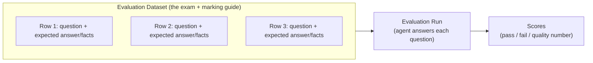
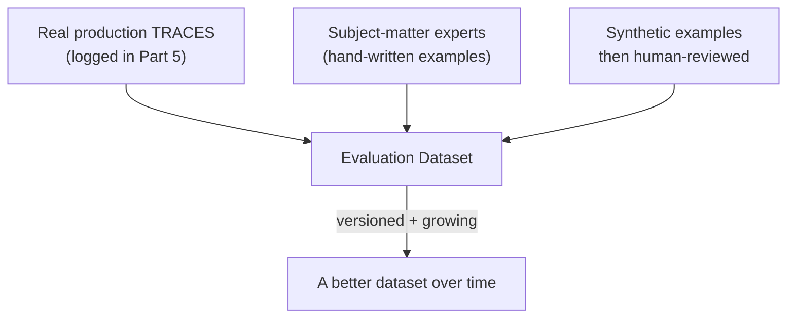
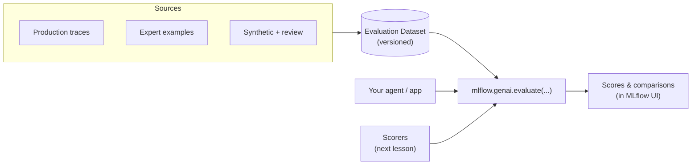

# Building Evaluation Datasets

> You already trust regression tests to catch broken code before it ships. In this lesson you build the same safety net for your AI agent: a fixed set of questions, with the answers you expect, that you can run again and again.

Take a breath. If you have ever written a suite of tests that run on every commit, you already understand the single most important idea here. An evaluation dataset is just that idea, pointed at answers instead of code. You do not need to be an AI expert. You need to be someone who likes knowing when things break, and you clearly are, because you are reading this.

## Learning Objectives

By the end of this lesson, you will be able to:

- Explain what an evaluation dataset is, in plain terms.
- Describe what goes in a single row: the input (question), an optional expected answer, and optional expected facts or context.
- List the three main places good examples come from: real production traces, subject-matter experts, and synthetic-then-reviewed examples.
- Explain why you version an evaluation dataset and grow it over time.
- Assemble a small evaluation dataset in Python for a sample policy agent.
- Describe how the dataset feeds an evaluation run.

## Prerequisites

- You have read [Why Evaluating AI Is Hard](/docs/evaluation/why-eval-is-hard).
- You are comfortable with Python lists and dictionaries.
- You have seen tracing in Part 5 (we will reuse those logged traces here). If you have not, that is fine - we will keep it gentle.

## Estimated Reading Time

About 20 minutes.

## Business Motivation

Here is the everyday problem. Someone tweaks the prompt on Friday afternoon to fix one annoying answer. On Monday, three other answers are quietly worse, and nobody notices until a customer complains.

You have felt this before with code. The fix is the same instinct: capture the behavior you care about as repeatable tests, and run them every time something changes.

For an AI agent, "something changes" happens constantly:

- You change the prompt.
- You swap the underlying model to a newer, cheaper one.
- You update the documents the agent retrieves from.
- A vendor updates the model behind the scenes.

Without an evaluation dataset, every one of these is a leap of faith. With one, you get a number you can compare before and after. That number is what lets you tell your manager, "the new model is 8 percent better on our real questions," instead of "it feels better, I think."

## Intuition

Think of a graded exam.

- The **exam paper** is a list of questions. That is your set of inputs.
- The **marking guide** (the answer key) says what a good answer looks like. That is your expected answers or expected facts.
- The **grader** reads each student's answer and compares it to the marking guide. That grader is a scorer, which is the next lesson.

An evaluation dataset is the exam paper plus the marking guide. It does not grade anything by itself. It is the fixed, agreed-upon set of questions and the notes on what a correct answer should contain.

The second analogy, closer to your world: it is a **regression test suite for answers**. Each row is a test case. The input is the "call," the expected answer or expected facts are the "assertion," and running the whole thing tells you whether your agent still passes.



<figcaption>Figure 1: An evaluation dataset is a set of rows. An evaluation run sends each question to your agent and produces scores. The dataset is the fixed part you reuse.</figcaption>

## Theory

An evaluation dataset is a **curated set of example inputs**, optionally paired with **expected outputs** and/or **expected retrieved facts or context**, used to measure agent quality repeatably.

Let us unpack the three pieces of a row.

1. **Input (the question).** Always present. This is what you send to the agent. For a chat agent it is usually the user's message. It can also include extra context the agent needs, like a customer ID.

2. **Expected answer (optional).** What a good answer should say. You do not always have this. Sometimes you only know what a good answer should *contain*, not its exact wording.

3. **Expected facts or expected context (optional).** The key points a correct answer must include, or the documents the agent should have retrieved. This is very useful for question-answering agents where wording varies but the facts must be right.

Why are two of the three optional? Because AI answers are open-ended. There is rarely one exact correct string. So instead of demanding an exact match, you often check "did the answer contain these facts?" or "did the agent pull the right policy document?" That flexibility is what makes evaluation datasets work for language, where a strict `assertEquals` would fail on wording alone.

:::note[Going deeper (optional)]
The reason we lean on "expected facts" rather than "expected exact answer" is that natural language has many correct phrasings. "You have 30 days to return an item" and "Returns are accepted within a month of purchase" mean the same thing. An exact-match test would fail the second one. A fact-based check asks whether the 30-day window is present, and passes both. You will see this pay off in the next lesson when a judge scores answers against these facts.
:::

## Deep Dive

### Where do good examples come from?

This is the question everyone gets stuck on. "I need a test suite, but I have no test cases." On Databricks, there are three well-worn sources, and you will usually blend all three.



<figcaption>Figure 2: Three sources feed one evaluation dataset. It is versioned and grows as you learn.</figcaption>

**1. Real production traces.** This is the best source, and you already started collecting it. In Part 5 you set up tracing, so every real interaction with your agent was logged as a trace. You can turn those logged traces into evaluation rows. The question is the real user question. The trace even tells you what the agent actually answered and what it retrieved, which helps you decide what the *expected* answer or facts should be. Real questions are gold because they are the questions your users actually ask, not the ones you imagined.

**2. Subject-matter experts.** People who know the domain write questions and mark up what a correct answer must contain. For a banking policy agent, that is a compliance officer writing, "If asked about early withdrawal penalties, the answer must mention the 90-day interest forfeit." Fewer rows, but very high quality.

**3. Synthetic, then human-reviewed.** You use an LLM to generate plausible questions (and draft expected answers) from your source documents, then a human checks them before they go in. This gets you volume fast. The human review step is not optional - unreviewed synthetic data can bake in the model's own mistakes.

### Synthetic evaluation sets

Here is a common chicken-and-egg problem. You want an evaluation dataset, but your agent is brand new, so you have no production traces yet, and your experts are busy. What do you do?

You bootstrap. A **synthetic evaluation set** is a set of candidate questions (and draft expected facts) that you auto-generate with an LLM from the documents and knowledge your agent already has. If your agent answers from a returns policy and a fees schedule, you can ask a model to read those documents and write the kinds of questions a customer might ask, along with the facts a correct answer should contain. In a few minutes you can go from zero rows to dozens.

The conceptual sketch is simple.

```python
# Conceptual: draft candidate eval rows from your own documents.
# The model reads a source document and proposes questions + expected facts.

def draft_eval_rows_from_doc(document_text, generate):
    prompt = (
        "Read the policy document below. Write 5 realistic customer "
        "questions it answers, and for each, list the key facts a correct "
        "answer must contain.\n\n" + document_text
    )
    # `generate` calls your LLM and returns structured question/fact pairs.
    return generate(prompt)  # <-- DRAFTS ONLY, not yet trusted

candidate_rows = draft_eval_rows_from_doc(returns_policy_text, generate)

# A human reviews candidate_rows: fixes shallow or wrong questions,
# corrects the expected facts, drops the duds. ONLY reviewed rows
# get appended to the real dataset.
```

The load-bearing word is *candidate*. Synthetic rows are drafts, never ground truth. An LLM asked to write questions about a document will happily produce shallow ones ("What is this document about?"), or invent an expected fact the document never stated. So the rule is the same one from the trace-mining example: **always have a human review synthetic examples before you trust them.** Used this way - generate fast, review honestly - synthetic sets are a great way to get a real dataset off the ground while you wait for real traffic to accumulate.

### Why version it and grow it?

Your evaluation dataset is a **versioned asset**, like a table or a model. You version it for the same reasons you version anything:

- So you can say "model v3 scored 82 percent on eval-dataset v5" and have that mean something later.
- So a teammate's edit does not silently change what "passing" means.
- So you can compare two model versions against the *exact same* questions.

And you grow it using one simple habit: **every real failure becomes a new test case.** A customer got a wrong answer? Add that question, with the correct expected facts, as a new row. Now that failure can never sneak back in unnoticed. This is exactly the regression-test habit you already have: found a bug, wrote a test for it. Same move.

## Architecture

Here is how the dataset fits into the wider evaluation picture on Databricks (MLflow 3 for GenAI).



<figcaption>Figure 3: The evaluation dataset is one of three inputs to an evaluation run. The other two are your app and your scorers.</figcaption>

The dataset sits in the middle: fed by your sources, feeding the evaluation run. The evaluation run itself takes three things - your dataset, your app (so it can answer the questions), and your scorers (so it can grade the answers). This lesson is about the dataset. The next lesson is about scorers.

## Internal Working

You do not need deep internals to be productive, but a little understanding helps.

When an evaluation run starts, it walks your dataset row by row. For each row it:

1. Reads the input (the question, plus any extra context).
2. Calls your agent with that input, producing a fresh answer and, if relevant, a fresh trace.
3. Hands the agent's answer, the input, and your expected answer or expected facts to each scorer.
4. Records the scores against that row.

The key insight: **the dataset is passive.** It does not run anything. It is a well-organized bag of questions and answer keys. The evaluation run is the active part that reads it. This is why the same dataset can be reused across many runs, many model versions, and many prompt tweaks. It is the fixed ruler you measure against.

Because the dataset is a versioned asset, MLflow tracks which version was used in each run. So months later you can still answer "what exactly did we test against back then?"

## Step-by-Step Walkthrough

Let us build the intuition for a concrete example: a policy agent for a fictional bank, **Northwind Trust**. It answers customer questions about accounts, returns, and fees.

**Step 1 - Decide what a row looks like.** For this agent, each row will have a `question` (what the customer asks) and `expected_facts` (the key points a correct answer must include). We will keep `expected_answer` optional because wording varies.

**Step 2 - Seed it with expert examples.** A compliance officer gives us a handful of must-get-right questions.

**Step 3 - Mine production traces.** We take a couple of real logged interactions from Part 5 and turn them into rows.

**Step 4 - Assemble the dataset in code.**

**Step 5 - Hand it to an evaluation run** (which we fully wire up in the next lesson).

Now let us see the code for steps 4 and 3.

## Hands-on Examples

We will build the dataset as a simple Python list of dictionaries first, because it is the easiest thing to read. Then we will show the same data as a Delta table, which is how you would store it for a team.

## Code Examples

### Example 1: A small evaluation dataset as a list of dicts

```python
# An evaluation dataset for the Northwind Trust policy agent.
# Each row = one exam question + a marking guide (expected_facts).

northwind_eval_dataset = [
    {
        "inputs": {"question": "How long do I have to return a debit card purchase?"},
        # The key points a correct answer MUST contain.
        "expected_facts": [
            "Return window is 30 days",
            "Item must be unused",
        ],
    },
    {
        "inputs": {"question": "What is the penalty for early CD withdrawal?"},
        "expected_facts": [
            "90 days of interest is forfeited",
            "Principal is not affected",
        ],
    },
    {
        "inputs": {"question": "Do you charge a monthly fee on student checking?"},
        # Here we happen to know the exact answer, so we include it too.
        "expected_response": "No. Student checking accounts have no monthly maintenance fee.",
        "expected_facts": ["No monthly maintenance fee for student checking"],
    },
]
```

Let us walk through what you just wrote.

- Each element of the list is one **row** - one test case.
- `inputs` holds the question. We nest it in a dict so we can add more context later (like a customer tier) without breaking older rows.
- `expected_facts` is a list of the points a correct answer must contain. This is our marking guide. Notice we do not demand exact wording - just that these facts show up.
- The third row also has `expected_response`, the exact answer, because for that simple question we happen to know it. Including it is optional; the facts do most of the work.

That is a real evaluation dataset. Small, but real. You could grow this to hundreds of rows the same way.

### Example 2: Turning a logged trace into an eval row (conceptually)

In Part 5 you logged traces. Here is the shape of the idea: read a trace, and lift its user question into a new eval row. You then decide the expected facts by looking at what a correct answer should have been.

```python
# Conceptual: turn recent production traces into eval rows.
# (Trace-reading API details are covered in the tracing lessons;
#  the point here is the SHAPE of the transformation.)

def trace_to_eval_row(trace):
    # Pull the user's question out of the logged trace.
    user_question = trace.inputs["question"]

    # We leave expected_facts EMPTY on purpose - a human fills these in.
    # Never trust the agent's own past answer as the ground truth.
    return {
        "inputs": {"question": user_question},
        "expected_facts": [],  # <-- to be reviewed and filled by a person
    }

# Imagine `recent_traces` came from your tracing store.
new_rows = [trace_to_eval_row(t) for t in recent_traces]

# A human reviews new_rows, fills in expected_facts, then appends
# them to northwind_eval_dataset. THAT human step is the important part.
```

Here is the narration for that block.

- We read the real `question` from the trace. That is the whole reason tracing was worth setting up - free, real test questions.
- We deliberately leave `expected_facts` empty. The agent's *past* answer might have been wrong, so we never copy it in as the "correct" answer. A person fills in what the answer *should* have contained.
- The comment on the human review step is the load-bearing part. Trace mining gives you questions cheaply; humans give you trustworthy answer keys.

### Example 3: The same dataset as a Delta table

For a team, you want this in a table so everyone shares one versioned source of truth.

```python
# Store the eval dataset as a Delta table so the whole team shares it.
from pyspark.sql import Row

rows = [
    Row(question="How long do I have to return a debit card purchase?",
        expected_facts=["Return window is 30 days", "Item must be unused"]),
    Row(question="What is the penalty for early CD withdrawal?",
        expected_facts=["90 days of interest is forfeited", "Principal is not affected"]),
]

df = spark.createDataFrame(rows)

# Save to Unity Catalog. Delta gives you versioning for free (time travel).
df.write.mode("overwrite").saveAsTable("main.evals.northwind_policy_eval")
```

And the narration.

- We build the same rows as a Spark DataFrame.
- We save it as a Delta table in Unity Catalog. Now it is a shared, governed, versioned asset - not a list living in one person's notebook.
- Delta's time travel means you can point back to exactly the version used in a past evaluation run.

:::note[Going deeper (optional)]
MLflow 3 for GenAI also provides a managed evaluation dataset concept, so you can register a dataset as a first-class, versioned object that the platform tracks alongside your runs. A Delta table and a Python list are perfectly good starting points; reach for the managed dataset when you want the platform to handle versioning and lineage for you. The exact API surface evolves, so check the current Databricks docs for the precise calls.
:::

## Production Considerations

- **Store it centrally.** A Delta table in Unity Catalog beats a list in a notebook. One source of truth, governed access, shared with the team.
- **Keep it representative.** Your dataset should look like your real traffic. If 40 percent of real questions are about fees, do not have a dataset that is 90 percent about returns. Mine traces to keep the mix honest.
- **Grow it deliberately.** Add every real failure as a row. Aim for coverage of the important cases, not thousands of near-duplicate rows.
- **Separate "smoke" from "full."** A small fast subset for every prompt tweak, and a larger thorough set for big changes like a model swap.

## Performance Considerations

- **Size costs money and time.** Every row means one agent call plus one or more scorer calls (often LLM calls) during a run. A 1,000-row dataset with an LLM judge is a lot of calls. Start with tens of rows, grow to hundreds, and only go to thousands when you have a clear reason.
- **Deduplicate.** Twenty phrasings of the same question waste budget without adding coverage.
- **Use a small subset for fast feedback.** Run the full dataset nightly or before release; run a 20-row subset on every change.

## Security Considerations

- **Real traces contain real data.** If you build rows from production traces, they may include personal or sensitive information (names, account numbers). Treat the evaluation dataset with the same care as production data: govern it in Unity Catalog, restrict access, and redact or mask sensitive fields before storing.
- **Watch what you send to external judges.** If a scorer sends rows to a model outside your boundary, make sure that is allowed for this data.
- **Version control is a security feature too.** Knowing exactly which data was in the dataset, and who changed it, matters for audits.

## Common Mistakes

- **No expected answer or facts at all.** A list of questions with no marking guide can only be graded on vague qualities. Add expected facts wherever you can.
- **Demanding exact string matches.** Language varies. Check for facts, not exact wording.
- **Copying the agent's past answer as the "correct" answer.** That past answer might be the very bug you are trying to catch. Have a human define the expected answer.
- **A dataset that never changes.** If it does not grow with each real failure, it slowly stops reflecting reality.
- **A dataset that is all easy questions.** Include the hard, ambiguous, and previously-broken cases. Those are the ones that catch regressions.
- **Skipping human review of synthetic data.** Unreviewed synthetic rows can bake the model's mistakes into your "ground truth."

## Best Practices

- Start small and real. Ten good rows beat a thousand guessed ones.
- Make "every bug becomes a test case" a team habit.
- Prefer expected facts over expected exact answers for open-ended questions.
- Version the dataset and store it centrally (a Delta table or a managed eval dataset).
- Keep the question mix representative of real traffic - mine your traces.
- Review synthetic and trace-derived rows with a human before trusting them.
- Keep a fast subset for quick checks and a full set for releases.

## Interview Questions

1. **What is an evaluation dataset, and how is it different from a scorer?**
   An evaluation dataset is a curated, versioned set of example inputs with optional expected answers or expected facts. It is passive data - the exam paper and marking guide. A scorer is the active grader that compares an agent's answer to the expected answer or facts and produces a number. The dataset defines *what* to test; the scorer defines *how* to grade.

2. **What can a single row contain, and why are some fields optional?**
   A row always has an input (the question). It optionally has an expected answer and/or expected facts or expected retrieved context. The latter two are optional because AI answers are open-ended: there is rarely one exact correct string, so we often check for required facts rather than exact wording, and sometimes we only have questions with no known answer yet.

3. **Where do good evaluation examples come from on Databricks?**
   Three sources: real production traces (turn logged interactions from tracing into eval rows), subject-matter experts (hand-curated high-quality examples), and synthetically generated examples that are then human-reviewed. In practice you blend all three.

4. **Why do you version an evaluation dataset?**
   So comparisons are meaningful and reproducible. Versioning lets you say "model v3 scored X on dataset v5," compare two models against the exact same questions, prevent silent changes to what "passing" means, and audit which data was used in a past run.

5. **How should an evaluation dataset grow over time?**
   By adding every real failure as a new row - the same regression-testing habit used in software. This keeps the dataset reflecting real usage and ensures past bugs cannot silently return. You also periodically refresh it from production traces to keep the question mix representative.

## Quiz

**Question 1:** What are the three parts of a single evaluation dataset row?

<details>
<summary>Show answer</summary>

The input (question) - always present - plus an optional expected answer and optional expected facts or expected retrieved context. Only the input is required.

</details>

**Question 2:** Why do we often use "expected facts" instead of an exact expected answer?

<details>
<summary>Show answer</summary>

Because language has many correct phrasings. An exact-match check would fail a correct answer that is worded differently. Checking that required facts appear in the answer passes any correct phrasing while still catching wrong answers.

</details>

**Question 3:** You mine a production trace to create a new eval row. Should you use the agent's past answer as the expected answer?

<details>
<summary>Show answer</summary>

No. The agent's past answer might be wrong - it could be the very bug you want to catch. Use the trace for the real question, but have a human define what the correct answer or facts should be.

</details>

**Question 4:** Name the three inputs an evaluation run needs.

<details>
<summary>Show answer</summary>

The evaluation dataset (the questions and expected answers/facts), your app or agent (so it can answer the questions), and your scorers (so it can grade the answers).

</details>

## Summary

An evaluation dataset is a regression test suite for your AI's answers: a curated, versioned set of questions, optionally paired with expected answers or expected facts. You build it from real production traces, expert examples, and reviewed synthetic data. You store it centrally, version it, and grow it by adding every real failure as a new row. It is passive - the active grading happens in an evaluation run, which combines your dataset, your app, and your scorers. Get the dataset right and every future change to your agent becomes measurable instead of a guess.

## Key Takeaways

- An evaluation dataset = exam paper + marking guide = a regression suite for answers.
- A row is: input (always), expected answer (optional), expected facts/context (optional).
- Prefer expected facts over exact answers for open-ended questions.
- Sources: production traces, subject-matter experts, synthetic-then-reviewed.
- Synthetic-then-reviewed eval sets bootstrap a dataset fast when you have no traffic yet - but a human must review the generated rows before you trust them.
- Version it, store it centrally (Delta table or managed eval dataset), and grow it with every real failure.
- The dataset is passive; the evaluation run reads it and produces scores.

## Glossary

- **Evaluation dataset:** A curated, versioned set of example inputs, optionally with expected outputs and/or expected facts, used to measure agent quality repeatably.
- **Row / example:** One test case in the dataset - a single input plus its optional expected answer and facts.
- **Input:** The question or request sent to the agent, plus any extra context it needs.
- **Expected answer (expected response):** What a good answer should say. Optional.
- **Expected facts:** The key points a correct answer must contain. Used instead of exact matching for open-ended answers.
- **Expected context / retrieved facts:** The documents or facts the agent should have retrieved to answer correctly.
- **Trace:** A logged record of a real agent interaction (from Part 5), reusable as a source of eval questions.
- **Scorer / judge:** The component that grades an answer against the expected answer or facts (next lesson).
- **Evaluation run:** The process that sends each dataset question to your agent and produces scores.
- **Synthetic data:** Machine-generated examples, reviewed by a human before use.
- **Synthetic evaluation set:** Candidate evaluation rows (questions and draft expected facts) auto-generated by an LLM from your own documents to bootstrap a dataset quickly, always human-reviewed before they are trusted.

## Further Reading

- Databricks - Evaluate and monitor GenAI apps (MLflow 3): [https://docs.databricks.com/aws/en/mlflow3/genai/eval-monitor/](https://docs.databricks.com/aws/en/mlflow3/genai/eval-monitor/)

## Next Lesson

Now that you have a set of questions and answer keys, you need something to do the grading. That is next.

➡️ [LLM Judges and Scorers](/docs/evaluation/llm-judges)
