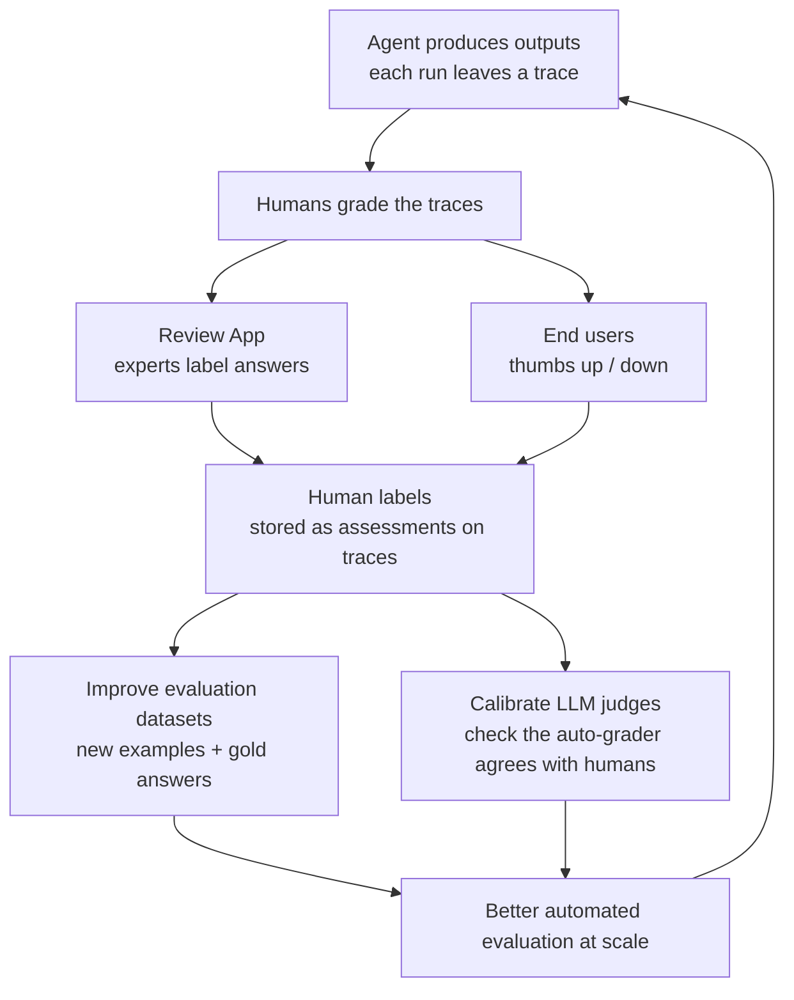
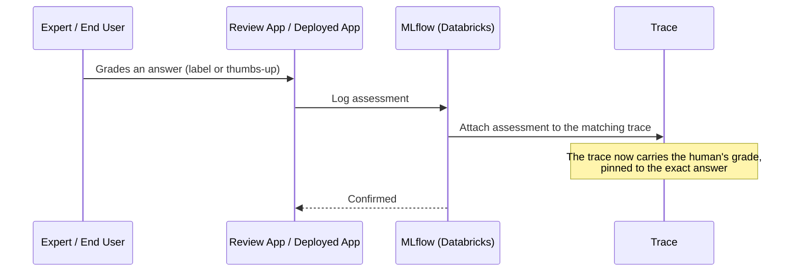

# Collecting Human Feedback

> Your automated judges are fast and tireless. But how do you know they are grading fairly? You ask the real experts to check their work. This lesson is about bringing humans back into the loop, in the smartest possible way.

Take a breath. You have done something impressive already. You built evaluation datasets, and you wired up LLM judges that score answers automatically. That is a lot. But there is one honest question left, and it is a good one to ask out loud: *how do we know the judge is any good?*

The answer is people. Real experts, and real users, whose grades become the yardstick everything else is measured against. Do not worry, this is the friendly part. Most of it happens in a point-and-click app, and the code is short.

## Learning Objectives

By the end of this lesson, you will be able to:

- Explain why human feedback is the "ground truth" that everything else is calibrated against.
- Describe the three ways Databricks collects human feedback: the Review App, labeling existing traces, and end-user feedback.
- Tell the difference between **feedback** (a grade on what the app produced) and an **expectation** (the correct answer it should have produced).
- Describe the virtuous loop: human labels improve your evaluation datasets *and* calibrate your LLM judges.
- Recognize where humans are irreplaceable, like a compliance officer confirming a policy answer.
- Attach a piece of feedback to a trace in code, and understand how an end-user thumbs-up is logged.

## Prerequisites

- You have read [LLM Judges and Scorers](/docs/evaluation/llm-judges). That lesson explains how automated grading works. This lesson explains how to check that the automated grading is trustworthy.
- You are comfortable with the idea of a **trace** from Part 5: the recording of one agent run.
- You have met the Northwind Trust agent, our example compliance assistant that answers customer questions about policies.

If any of that feels shaky, that is completely fine. You can follow along and pick the words up as you go.

## Estimated Reading Time

About 15 to 18 minutes. Most of this lesson is concepts and diagrams, with a little short code near the end. We will go slowly and narrate every block.

## Business Motivation

Here is the everyday version. Imagine a school with one teacher and ten thousand students. The teacher cannot possibly grade every essay. So the school buys an automatic essay grader. Faster, cheaper, never sleeps. Wonderful.

But you would never trust that machine blindly on day one. First you would take a stack of essays, have your best human teachers grade them, and then check: *does the machine agree with the teachers?* If it does, great, you can let it grade at scale. If it does not, you fix the machine.

Your AI system is exactly this school. The LLM judge is the automatic grader. Human feedback is the teachers' grades. You collect human grades not to grade everything forever, but to prove your automatic grader is fair, and to give it examples of what "good" looks like.

For Northwind Trust, the stakes are real. When a customer asks "can I withdraw early from my fixed-term savings without penalty?", a wrong answer is not just embarrassing, it is a compliance risk. A compliance officer, a human expert, is the only one who can say with authority "yes, that answer is correct and compliant." That confirmation is worth its weight in gold. This lesson is about capturing it.

## Intuition

Let us keep it simple. There are two groups of people who can grade your AI's homework, and they see different things.

- **Subject-matter experts.** These are your compliance officers, your senior analysts, your domain specialists. They can look at an answer and say "that is correct" or "that misstates the early-withdrawal policy." They know the *right* answer.
- **End users.** These are the customers using the deployed app. They usually cannot judge deep correctness, but they can tell you "this was helpful" or "this did not answer my question" with a simple thumbs-up or thumbs-down button.

Both are valuable, and they are complementary. Experts give you deep, authoritative grades on a smaller number of answers. End users give you a huge volume of shallow signal for free.

Now here is the key move, the one worth remembering. You do not just collect these grades and file them away. You feed them back into your system in two ways: they become new evaluation examples, and they check whether your auto-grader is fair. That is the loop this whole lesson builds toward.

## Theory

Let us name the pieces cleanly. On Databricks, MLflow 3 for GenAI stores every piece of human input as an **assessment** attached to a trace. There are two kinds of assessment, and the difference matters.

**Feedback.** This is a judgment about what the app *actually* produced. "This answer was correct." "The tone was too casual." "Thumbs down." Feedback grades the output you already have.

**Expectation.** This is the *correct* answer, the ground truth, what the app *should* have produced. If an expert writes out the ideal response to "can I withdraw early?", that is an expectation. Expectations are the gold answers you saw in the evaluation-datasets lesson.

Here is a plain way to hold the two apart:

| | What it answers | Example |
|---|---|---|
| **Feedback** | "How good was this actual answer?" | "Correct" / thumbs-up / "misstated the fee" |
| **Expectation** | "What was the right answer?" | "Early withdrawal incurs a 2% penalty unless..." |

Both attach to a **trace**, the recording of a single agent run. That is important: feedback is never floating in space. It is always pinned to a specific answer the agent gave, so you can always trace a grade back to exactly what was graded.

## Deep Dive

Databricks gives you three doorways to collect human feedback. They cover three different moments in your project's life.

**1. The Review App (experts review and label).**
The Review App is a purpose-built web app where subject-matter experts can interact with your agent and grade its answers, without touching a notebook or writing code. Two flavors:

- **Chat and vibe-check.** An expert chats with the agent live, like a customer would, and reacts to the answers. Good for early "does this feel right?" testing during development.
- **Label existing traces.** You send experts a batch of real traces (real agent runs you already captured), and they work through them, attaching labels. This is the structured, systematic way to build a graded dataset.

**2. Labeling existing traces.**
This flavor of the Review App deserves its own mention because it is so useful. Your agent has already run, in development or in production, and each run left a trace. Instead of making up test questions, you ask experts to label that *real* traffic after the fact, which keeps your evaluation grounded in what users actually ask.

**3. End-user feedback (thumbs up/down).**
When your agent is deployed to real users, you add a small feedback control to the app, usually a thumbs-up and thumbs-down button. When a user clicks it, your app logs that reaction as feedback attached to that run's trace. It costs the user one click and gives you a continuous stream of real-world signal.

:::note[Going deeper (optional)]
In the Review App, experts label according to a **labeling schema** you define, so everyone grades the same dimensions the same way (for example, a yes/no "Compliant?" question plus a free-text "Notes" field). Experts work through a **labeling session**, which is just a named batch of traces assigned to reviewers. You do not need these terms to understand the lesson, but you will see them in the Databricks UI.
:::

## Architecture

Here is how the pieces fit together. Notice that human feedback is not a dead end, it flows back in and makes your automated evaluation better.



*Figure 1: The virtuous feedback loop. Agent outputs are graded by humans in the Review App and by end users. Those human labels do double duty: they enrich your evaluation datasets and they calibrate your LLM judges, which makes your automated evaluation trustworthy enough to run at scale, on the next batch of agent outputs. Human labels are not just grades; they are the fuel that makes automated grading believable.*

## Internal Working

Let us slow down and watch what actually happens under the hood when feedback arrives.



*Figure 2: What happens when a human grades an answer. The grade travels from the app to MLflow, which attaches it as an assessment on the specific trace that produced the answer. Now the answer and its human grade live together, forever linked.*

Step by step:

1. A human looks at one answer and forms a judgment.
2. The app records that judgment, along with *who* gave it (an expert reviewer, or an anonymous end user) and, if useful, *why* (a written rationale).
3. MLflow attaches the judgment to the trace of that exact run as an assessment.
4. Later, when you build an evaluation dataset or check your judge, you can pull all traces that carry human labels and use them.

The "who gave it" part matters more than it looks. A compliance officer's "correct" is stronger evidence than an anonymous thumbs-up. Recording the source lets you weight them differently later.

## Step-by-Step Walkthrough

Here is the typical journey for a team like Northwind Trust, start to finish.

1. **Run the agent and capture traces.** You already do this from Part 5. Every run is recorded.
2. **Pick traces to review.** Maybe the ones your LLM judge scored low, or a random sample of production traffic, or answers about a sensitive topic like early withdrawals.
3. **Send them to experts in the Review App.** You create a labeling session, define what you want graded (for example, "Is this answer compliant? Yes/No, plus notes"), and assign it to your compliance officers.
4. **Experts label.** They work through the traces in the browser, marking each one. No code required from them.
5. **Collect the labels.** The grades come back attached to the traces as assessments.
6. **Use the labels twice.**
   - Add the clear, expert-approved answers to your **evaluation dataset** as gold examples.
   - Compare the experts' grades against your **LLM judge's** grades on the same traces. Do they agree? If yes, trust the judge. If no, fix the judge's prompt or examples.
7. **Meanwhile, collect end-user feedback continuously** from the deployed app, and use the thumbs-down cases to find fresh problems worth sending back to experts.

That last point closes the loop. End users flag pain, experts confirm ground truth, judges get calibrated, and the whole system gets more trustworthy over time.

## Hands-on Examples

Let us make the loop concrete with our example. Suppose a Northwind Trust customer asks:

> "Can I withdraw from my 12-month fixed savings early without a penalty?"

The agent answers:

> "Yes, you can withdraw at any time with no penalty."

That answer runs, and it leaves a trace. Now the humans get involved:

- A **compliance officer** opens the trace in the Review App and marks it **Incorrect**, with a note: "Early withdrawal from a fixed-term product incurs a 2% penalty. This answer is non-compliant." That is **feedback**. She may also write the correct answer, which becomes an **expectation**.
- Separately, the **customer** who received the answer clicks **thumbs-down** in the app, because the answer contradicted what a branch told them. That is **end-user feedback**.

Now you have two human signals on one trace. You add the officer's correct answer to your evaluation dataset. And you check: did your LLM judge also flag this answer as wrong? If the judge said "correct," you have just learned your judge needs work. That is the loop earning its keep.

## Code Examples

The Review App is mostly a UI, so most feedback collection needs no code from you. But it helps to see what happens underneath, and to know how to log feedback yourself, for example from your deployed app's thumbs-up button.

First, logging a piece of expert feedback on a trace:

```python
import mlflow
from mlflow.entities import AssessmentSource, AssessmentSourceType

# The compliance officer reviewed one answer and marked it incorrect.
mlflow.log_feedback(
    trace_id="tr-abc123",                 # the exact run being graded
    name="compliant",                     # what dimension we are grading
    value=False,                          # her verdict: not compliant
    rationale="Early withdrawal incurs a 2% penalty; answer is wrong.",
    source=AssessmentSource(
        source_type=AssessmentSourceType.HUMAN,
        source_id="officer.jane@northwind.example",
    ),
)
```

Let us narrate that. We call `log_feedback` and pin it to a specific `trace_id`, so the grade lands on the exact answer being reviewed. The `name` says which quality we are grading ("compliant"). The `value` is the verdict, here a simple `False`. The `rationale` captures *why*, which is priceless when you review this later. And `source` records that a human, specifically Jane, gave this grade, rather than an automated judge. That "who" is what lets you treat an expert's word as ground truth.

Next, capturing the *correct* answer as an expectation:

```python
# The officer also tells us what the answer SHOULD have said.
mlflow.log_expectation(
    trace_id="tr-abc123",
    name="expected_response",
    value="Early withdrawal from a fixed-term product incurs a 2% penalty.",
    source=AssessmentSource(
        source_type=AssessmentSourceType.HUMAN,
        source_id="officer.jane@northwind.example",
    ),
)
```

Same shape, different purpose. This time we log an **expectation**, the ground-truth answer the agent should have produced. Notice we are not grading the actual output here, we are recording the ideal one. This gold answer can now be dropped straight into an evaluation dataset, where future runs get compared against it.

Finally, the end-user thumbs-up, conceptually. When a customer clicks the button in your deployed app, your app runs something like this:

```python
# Called when a user clicks thumbs-up or thumbs-down in the app.
def on_user_feedback(trace_id: str, thumbs_up: bool):
    mlflow.log_feedback(
        trace_id=trace_id,
        name="user_helpful",
        value=thumbs_up,                  # True = thumbs-up, False = thumbs-down
        source=AssessmentSource(
            source_type=AssessmentSourceType.HUMAN,
            source_id="end_user",         # usually anonymous
        ),
    )
```

Here is the walkthrough. Your app already knows the `trace_id` of the answer it just showed (you captured it when the agent ran). When the user clicks, you call `log_feedback` with a boolean for the thumbs direction. The source is still `HUMAN`, but the `source_id` is a generic `end_user` rather than a named expert, because it is anonymous and lower-authority. One click, one durable signal, attached to the right trace.

:::note[Going deeper (optional)]
The exact class and function names can shift between MLflow versions, and the Review App handles most logging for you automatically, so you rarely write this by hand for experts. The pattern to remember is constant: an assessment (feedback or expectation) with a value, an optional rationale, and a source, attached to a trace. Check the [Databricks human feedback docs](https://docs.databricks.com/aws/en/mlflow3/genai/human-feedback/) for the current API surface before you build.
:::

## Production Considerations

- **Make the thumbs button effortless.** The easier it is to click, the more signal you get. Do not force users into a survey.
- **Sample, do not review everything.** Experts are expensive. Send them the traces that matter most: low judge scores, sensitive topics, or a random sample to keep you honest.
- **Route thumbs-down to experts.** A stream of end-user complaints is your best queue of "answers worth an expert's time."
- **Keep a standing calibration set.** Maintain a small, expert-graded set of traces and re-check your judges against it regularly, not just once.
- **Close the loop on time.** Feedback that sits ungraded for months goes stale. Build a rhythm: collect weekly, review weekly.

## Performance Considerations

Human feedback is slow and expensive compared to automated judging, and that is the whole point of the loop. You will never have humans grade every answer at production scale, and you should not try. The strategy is: humans grade a *representative sample*, that sample calibrates the judges, and the calibrated judges then grade at full volume cheaply. Spend your scarce human hours where they buy the most trust: hard cases, high-stakes topics, and calibration. Let the machine handle the routine bulk once you have earned confidence in it.

## Security Considerations

- **Who can see the traces?** Traces may contain customer data. Only authorized reviewers should have access to a labeling session. Use Databricks access controls to scope this.
- **Reviewer identity is data too.** You are recording *who* graded what. Treat reviewer identities with the same care as other personal data.
- **Redact where you can.** If a trace contains sensitive customer details that are not needed for grading, mask them before sending to reviewers.
- **End-user feedback is still user data.** A thumbs-down plus the original query can reveal a customer's situation. Store and govern it accordingly.

## Common Mistakes

- **Trusting the LLM judge without ever checking it against humans.** This is the big one. An uncalibrated judge is an opinion, not a measurement.
- **Only collecting end-user thumbs and calling it evaluation.** Thumbs tell you about satisfaction, not correctness. A confidently wrong compliance answer can still get a thumbs-up.
- **Letting feedback float free of a trace.** A grade with no link to the exact answer graded is nearly useless. Always attach to the trace.
- **Not recording the rationale.** "Incorrect" without "why" leaves future-you guessing.
- **Treating an anonymous thumbs-up as equal to a compliance officer's sign-off.** Weight by source authority.
- **Grading everything by hand forever.** You built judges to scale. Use humans to calibrate, not to do all the work.

## Best Practices

- **Define a clear labeling schema.** Tell reviewers exactly what to grade and how (for example, a yes/no "Compliant?" plus notes). Consistency beats cleverness.
- **Capture both feedback and expectations.** Grades tell you what went wrong; gold answers tell you what right looks like.
- **Always record the source.** Human vs. machine, expert vs. end user. This drives how much you trust each grade.
- **Prioritize high-stakes traces for experts.** Compliance, safety, and money questions first.
- **Use human labels for both jobs.** Enrich the dataset *and* calibrate the judges. That double use is the whole payoff.
- **Re-calibrate on a schedule.** Judges drift as your app and models change. Check them against humans regularly.

## Interview Questions

1. **Why do we still need human feedback if we already have automated LLM judges?**
   Because the judge is only trustworthy if it agrees with humans. Human feedback is the ground truth that calibrates and validates the judge. Without it, you are measuring against an opinion you never checked.

2. **What is the difference between feedback and an expectation in MLflow?**
   Feedback is a grade on what the app *actually* produced (correct, thumbs-up, too casual). An expectation is the *correct* answer it *should* have produced, the ground truth. Both attach to a trace.

3. **Describe the virtuous loop between human feedback and automated evaluation.**
   Agent outputs get graded by humans in the Review App and by end users. Those labels become new evaluation examples *and* are used to check whether the LLM judge agrees with humans. A calibrated judge can then grade at scale, on the next batch of outputs. Human labels are the fuel for trustworthy automation.

4. **Where is human feedback irreplaceable, and why?**
   Nuanced domain correctness. For example, a compliance officer confirming that a policy answer is accurate and compliant. A machine cannot authoritatively certify compliance, and the cost of being wrong is high, so a human expert is the ground truth.

5. **How would you collect feedback from thousands of production users without hiring thousands of reviewers?**
   Add a lightweight thumbs-up/down control to the deployed app for cheap, high-volume signal. Route thumbs-down cases to a small pool of experts for authoritative grading. Use that expert-graded sample to calibrate LLM judges, then let the judges score the full volume automatically.

## Quiz

**1. Human feedback is best described as...**

<details>
<summary>Show answer</summary>

The **ground truth** that calibrates and validates your automated evaluation. It is the standard your LLM judges are checked against.

</details>

**2. In MLflow, what is the difference between "feedback" and an "expectation"?**

<details>
<summary>Show answer</summary>

**Feedback** grades what the app actually produced (for example, "this answer is incorrect" or a thumbs-up). An **expectation** records the correct answer the app *should* have produced, the ground truth. Both are assessments attached to a trace.

</details>

**3. You collect thumbs-up/down from end users. Is that enough to evaluate a compliance agent?**

<details>
<summary>Show answer</summary>

No. Thumbs measure user satisfaction, not deep correctness. A confidently wrong compliance answer can still get a thumbs-up. You also need subject-matter experts (like compliance officers) to confirm nuanced domain correctness.

</details>

**4. Name the two jobs that human labels do once collected.**

<details>
<summary>Show answer</summary>

(1) They become new **evaluation examples** (grades and gold answers) that enrich your evaluation dataset. (2) They **calibrate and validate your LLM judges**, so you can trust the automated scores and run evaluation at scale.

</details>

## Key Takeaways

- Humans are the **ground truth**; automated judges are only trustworthy once calibrated against them.
- Three collection paths: **Review App**, **labeling existing traces**, **end-user feedback**.
- **Feedback** = grade on the actual output; **expectation** = the correct answer. Both attach to a **trace**.
- The virtuous loop: human labels improve datasets *and* calibrate judges, which enables cheap, trustworthy evaluation at scale.
- Spend scarce human time on high-stakes cases and calibration, not on grading everything.
- Always record the **source** of a grade, so you can weight an expert above an anonymous thumbs-up.

## Glossary

- **Human feedback:** Judgments from people (experts or end users) about your agent's answers, used as ground truth.
- **Ground truth:** The trusted correct answer or grade against which everything else is measured.
- **Review App:** A Databricks web app where subject-matter experts review and label agent outputs without code.
- **Assessment:** The stored form of a human (or automated) judgment on a trace. Two types: feedback and expectation.
- **Feedback:** An assessment grading what the app actually produced.
- **Expectation:** An assessment recording the correct answer the app should have produced (ground truth).
- **Trace:** The recording of a single agent run; feedback always attaches to one.
- **Labeling session:** A named batch of traces assigned to reviewers in the Review App.
- **Labeling schema:** The definition of what reviewers grade and how (the questions and answer types).
- **End-user feedback:** Lightweight signal from real users, typically thumbs-up/down, from a deployed app.
- **Calibration:** Checking that an LLM judge's grades agree with human grades, and fixing the judge if they do not.

## Further Reading

- [Databricks: Collect human feedback (MLflow 3 GenAI)](https://docs.databricks.com/aws/en/mlflow3/genai/human-feedback/)
- [Databricks: MLflow 3 for GenAI](https://docs.databricks.com/aws/en/mlflow3/genai/)

## Next Lesson

You now know how to gather the human ground truth that keeps your evaluation honest. The final step is putting all of this to work continuously, after your agent goes live.

➡️ [Monitoring Quality in Production](/docs/evaluation/production-monitoring)
