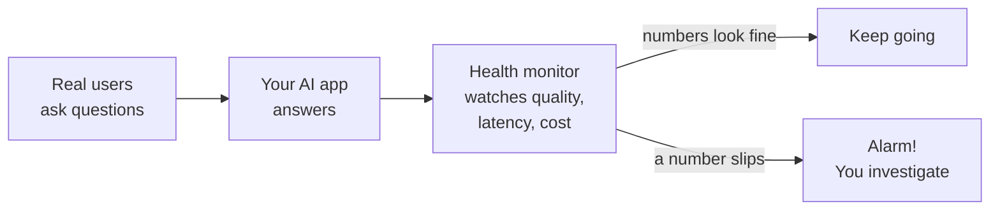
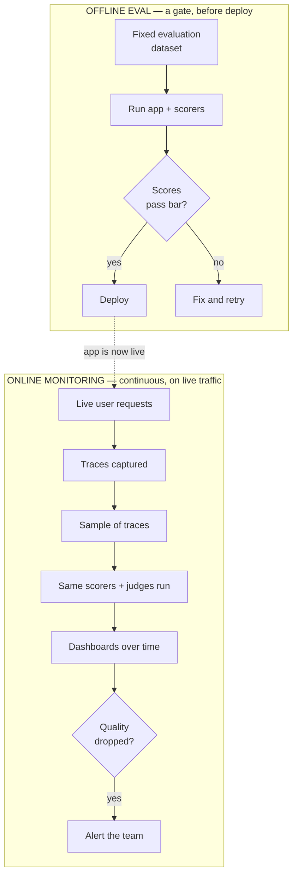
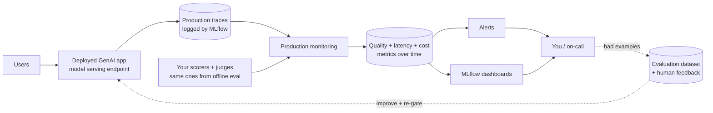

# Monitoring Quality in Production

> You launched your AI app. The demo went great, the offline scores looked good, everyone clapped. Two weeks later a customer asks something your test set never imagined, the model quietly gives a wrong answer, and nobody notices for days. How would you have caught that? The same way you catch a broken pipeline: by watching it, all the time.

Take a breath. You already know how to do most of this. As a data engineer, you don't ship a pipeline and walk away. You watch it. Is the data fresh? Did last night's job fail? Are row counts suddenly weird? That instinct, "keep an eye on the thing after it's live", is exactly what this lesson is about. We're just pointing it at AI quality instead of table freshness. If you can read a monitoring dashboard, you can do this.

## Learning Objectives

By the end of this lesson, you will be able to:

- Explain why evaluation continues **after** launch, and what can go wrong once real users show up.
- Tell the difference between **offline evaluation** (a gate before deploy) and **online monitoring** (ongoing, on live traffic).
- Describe how production monitoring reuses the **same scorers and judges** from offline eval, running them on a **sample** of production traces.
- List the three families of things to watch: **quality**, **operational metrics**, and **drift**.
- Set up a mental model for **alerting** on quality drops and feeding real examples back into your evaluation datasets.

## Prerequisites

- [LLM Judges and Scorers](/docs/evaluation/llm-judges) — the graders we'll reuse on live traffic.
- [MLflow Tracing](/docs/tracing/mlflow-tracing) — production monitoring reads the traces your app produces, so it helps to know what a trace is.

You do **not** need to have deployed anything yet. We'll keep the code light and lean on the concepts. Much of monitoring lives in dashboards and UI, and that's fine.

## Estimated Reading Time

About 16 minutes.

## Business Motivation

Let's be honest about why this matters, in plain business terms.

Offline evaluation answers one question: "Was the app good enough on the day we tested it?" That's a snapshot. Production is a movie. Three things change once real users arrive:

- **Users ask things your test set never had.** Your evaluation dataset is a few hundred questions you thought of. Real customers will ask thousands you didn't. Some of those expose weak spots.
- **The world changes.** New products launch, policies update, a document gets rewritten. The app that was correct in January can be quietly wrong by July.
- **You change things.** You swap in a newer model to save cost, tweak a prompt, update a retrieval index. Each change can help in general and hurt in a corner you didn't test.

The word for "quality slowly getting worse over time" is **drift**. Production monitoring exists to catch drift early, before your customers (or your auditor) catch it for you.

:::note
Throughout this lesson we'll use **Northwind Trust**, a fictional financial services company whose support agent answers customer questions about accounts and policies. It's a friendly stand-in so the examples feel real.
:::

## Intuition

Here's the whole idea in one picture you already understand: **a health monitor after surgery.**

When someone comes out of surgery, the operation going well is not the end of the story. They get wheeled into recovery and hooked up to a monitor. Heart rate, blood pressure, oxygen, all tracked continuously. If something starts to slip, an alarm goes off and a nurse comes running. Nobody says "the surgery was a success, so we don't need to watch them."

Your AI app is the same. Passing offline evaluation is the successful surgery. Production monitoring is the recovery-room monitor: it watches the live patient, tracks the vital signs, and raises an alarm when a number drifts out of the safe range.

And you have an even closer analogy from your day job: **a pipeline dashboard.** Production monitoring is that same dashboard you already stare at, with quality scores added as new "vital signs."



*Figure 1: Production monitoring is a health monitor on your live app. It watches the vital signs and raises an alarm when one slips.*

## Theory

Let's name the two modes clearly, because the whole lesson hinges on the contrast.

**Offline evaluation** is a *gate*. You run it on a **fixed dataset** (the evaluation dataset you built earlier in this Part), before you deploy. It answers "is this version good enough to ship?" You run it once per candidate version. If the scores pass your bar, the version goes out. If not, it doesn't. Same inputs every time, so results are comparable across versions.

**Online monitoring** is a *continuous watch*. It runs on **live traffic** (whatever real users actually send), all the time, after you deploy. It answers "is the app that's running right now still good?" The inputs are never the same twice, because real users are unpredictable.

Both use the **exact same scorers and judges**. That's the elegant part. A "groundedness" judge you wrote to grade your test set works just as well on a live customer question. You don't rebuild your graders for production. You point the ones you already have at real traffic.



*Figure 2: Offline evaluation is a one-time gate on a fixed dataset before deploy. Online monitoring runs continuously on a sample of live traffic after deploy. Same scorers, different job.*

## Deep Dive

How does monitoring actually get its hands on live traffic? Through **tracing**, which you met in Part 5.

Every time your deployed app answers a request, it produces a **trace**, the itemized receipt of what happened (the question, what the retriever pulled, the exact prompt, the model's answer, the latency, the token count). In production, those traces are captured automatically and stored.

Production monitoring sits on top of that stream of traces. Here's the loop, in plain terms:

1. Your app runs in production and emits traces, one per request.
2. Monitoring takes a **sample** of those traces (more on why a sample in a moment).
3. It runs your **scorers and judges** on each sampled trace, exactly as offline eval does, producing quality scores like correctness or groundedness.
4. It rolls those scores up, alongside operational numbers (latency, error rate, token cost), onto **dashboards** that show the trend over time.
5. You (or an automated **alert**) watch those trends. When a metric drops below a threshold, you're notified.

Why a **sample** and not every request? Running an LLM judge on a trace costs money and time (it's another model call). At scale, grading 100% of traffic could cost as much as serving it. So you grade a representative slice, say 5% or 10%. That's enough to spot a real trend without doubling your bill. This is the same reason you don't run full data-quality checks on every row of a billion-row table; you sample.

:::note[Going deeper (optional)]
Sampling introduces a trade-off you already understand from data QA. A smaller sample is cheaper but noisier: a quality dip in a small sample might just be luck. A larger sample is more sensitive but more expensive. In practice you tune the sample rate so the dashboard is stable enough to trust but cheap enough to run forever. You can also bias sampling toward interesting cases (for example, sample more heavily from requests where a user gave a thumbs-down). You don't need to master this now; just know the knob exists.
:::

### What to watch

There are three families of signals. Watch all three.

- **Quality scores.** From your judges and scorers: correctness, groundedness (is the answer actually supported by the retrieved documents?), relevance, safety. These are the "is it still *good*?" numbers.
- **Operational metrics.** Latency (how long answers take), error rate (how often the app throws or times out), and token cost (dollars per request). These are the "is it still *healthy and affordable*?" numbers. You watch these on pipelines already.
- **Drift.** The slow slide of any of the above over days and weeks. Not one bad answer, but a trend: groundedness drifting from 0.95 down to 0.88 over two weeks. Drift is the sneaky one, because no single day looks alarming.

## Architecture

Here's how the pieces fit together in a Databricks / MLflow 3 setup. Nothing new to build; it's your existing app plus a monitoring layer reading its traces.



*Figure 3: The monitoring layer reads production traces, runs your existing judges on a sample, and writes quality/latency/cost metrics to dashboards and alerts. Real-world failures loop back into your evaluation dataset.*

Notice the dashed loop at the bottom. This is the payoff of the whole Part fitting together. When monitoring surfaces a bad real-world answer, you don't just fix it once. You add that example to your **evaluation dataset** (and collect **human feedback** on it), so your offline gate gets smarter. Next time, that failure is caught *before* deploy. Production teaches your test set.

## Internal Working

A little more detail on what happens under the hood, kept gentle.

When you enable monitoring on a deployed app, MLflow attaches a scheduled job to the trace stream for that app. On a regular cadence, that job:

1. **Selects** the newly-arrived production traces since it last ran.
2. **Samples** them according to your configured rate.
3. **Feeds** each sampled trace into the scorers you assigned. A judge reads the trace's inputs and outputs (for example, the question and the answer, plus the retrieved context) and returns a score, often with a short written rationale.
4. **Writes** those scores back, attached to the trace and aggregated into time-series metrics.
5. **Compares** aggregates against any alert thresholds you set, and fires a notification if one is breached.

The traces already exist because your app is instrumented (Part 5). The judges already exist because you built them for offline eval (earlier this Part). Monitoring is mostly *wiring*: connect the graders to the trace stream, on a schedule, with a sample rate. That's why so much of it is configuration and dashboards rather than heavy code.

:::note[Going deeper (optional)]
Because a judge is itself an LLM call, monitoring inherits a subtle property: your quality metric has its own error bars. A judge might occasionally misgrade a fine answer as bad, or vice versa. That's normal. You don't treat a single monitored score as gospel; you watch the *trend* across many samples, where individual judge noise averages out. Same as you wouldn't page someone over one slightly-late file, but you would over a week of them.
:::

## Step-by-Step Walkthrough

Let's walk the life of one production request at Northwind Trust, end to end.

1. **A customer asks a question.** "Can I withdraw from my retirement account early without a penalty?" This exact wording was never in Northwind's test set.
2. **The app answers.** It retrieves the relevant policy documents and the model composes a reply. As it does, MLflow logs a trace: the question, the documents retrieved, the prompt, the answer, latency, tokens.
3. **Monitoring samples the trace.** Today this request happened to fall into the 10% sample.
4. **The groundedness judge runs.** It reads the answer and the retrieved policy docs and asks: "Is every claim in this answer actually supported by these documents?" It returns a score of 0.4 and a note: "The answer states there is no penalty before age 55, but the retrieved policy says age 59." That's a hallucination.
5. **The score lands on the dashboard.** Groundedness for today ticks down. On its own, one low score is just noise.
6. **The trend crosses a threshold.** Over the next day, more sampled answers score low on groundedness. The average drops from 0.95 to 0.82. That breaches Northwind's alert threshold.
7. **The team gets paged.** An engineer opens the dashboard, clicks through to the low-scoring traces, and sees they all started right after last week's model swap. The new model is faster and cheaper but worse at sticking to the documents.
8. **The loop closes.** The team rolls back the model, adds these real questions to the evaluation dataset, and re-runs the offline gate. Next time, this regression is caught before it ever reaches a customer.

That's monitoring doing its whole job: catch the drift, trace it to a cause, fix it, and learn from it.

## Hands-on Examples

You won't need a cluster for this. Read the code as illustration; the ideas are the point, and the real setup happens largely in the MLflow UI.

### Example: the same judge, two jobs

The single most important thing to feel is that offline and online use the *same grader*. Here's a scorer defined once.

```python
# A groundedness scorer, defined ONCE. We'll use it in both places.
# (Illustrative MLflow 3 GenAI style; exact API names may vary by version.)
import mlflow
from mlflow.genai.scorers import Guidelines

groundedness = Guidelines(
    name="groundedness",
    guidelines=(
        "The answer must be fully supported by the retrieved documents. "
        "If any claim is not backed by the documents, the answer fails."
    ),
)
```

We defined a `groundedness` scorer using a plain-English guideline. No AI expertise required to read it: it just says "the answer has to be backed by the documents." This one object is what we'll reuse. Notice we describe the *rule*, and the judge (an LLM behind the scenes) does the grading.

## Code Examples

Now the same scorer in each mode.

```python
# OFFLINE: a gate before deploy, on a FIXED dataset.
results = mlflow.genai.evaluate(
    data=eval_dataset,          # the fixed set of questions you curated
    predict_fn=northwind_app,   # your app
    scorers=[groundedness],     # the SAME scorer
)
# You look at results, decide pass/fail, and deploy (or don't).
```

This is offline evaluation, the gate. We hand `evaluate` a fixed dataset, our app, and the scorer. It runs everything once and gives back scores we use to decide whether to ship. Same inputs every run, so we can compare version to version.

```python
# ONLINE: continuous monitoring on LIVE traffic, after deploy.
# Attaches the SAME scorer to the production trace stream, on a sample.
from mlflow.genai import scorers as genai_scorers

genai_scorers.add_registered_scorer(
    name="groundedness-monitor",
    scorer=groundedness,        # the SAME scorer, again
    sample_rate=0.1,            # grade 10% of live traffic to control cost
)
# From here, MLflow runs it on sampled production traces on a schedule,
# and the scores show up on the monitoring dashboard over time.
```

This is online monitoring. We register the *same* `groundedness` scorer against production, with a `sample_rate` of 0.1 so we only grade 10% of live requests. After this, MLflow does the ongoing work for us: sampling traces, running the judge, and plotting the trend. The exact function names differ across MLflow versions, so treat this as the shape of the idea, not a line to copy verbatim. Check the [Databricks production monitoring docs](https://docs.databricks.com/aws/en/mlflow3/genai/eval-monitor/) for the current API.

```text
# What the dashboard trend looks like (sketch), one point per day:

groundedness
0.96  ● ● ● ●
0.90              ●
0.84                  ● ●   <-- model swapped here; drift begins
0.80                        ●  <-- alert threshold crossed -> page the team
      Mon Tue Wed Thu Fri Sat Sun
```

That sketch is the whole reason monitoring exists. No single day screams "broken," but the *trend* clearly slides after the model swap, and the alert fires when it crosses the line. You'd never see this from a one-time offline score.

## Production Considerations

- **Pick a sample rate you can afford forever.** Monitoring runs indefinitely. A 100% sample can cost as much as serving the app. Start small (5 to 10%) and raise it only if the signal is too noisy.
- **Choose a few scorers that matter, not all of them.** Every scorer is an extra LLM call per sampled trace. For a RAG app, groundedness and relevance usually earn their keep. Add safety if you're customer-facing.
- **Set thresholds from your offline baseline.** You know roughly what "good" looked like on your test set. Alert when live scores fall meaningfully below that, not at the first wobble.
- **Watch operational metrics too.** A perfect quality score means nothing if latency doubled or the error rate spiked. Quality, latency, and cost are one dashboard, not three separate concerns.
- **Close the loop.** Route low-scoring and thumbs-down traces back into your evaluation dataset. Monitoring that never feeds improvement is just an alarm nobody learns from.

## Performance Considerations

- **Judges add latency and cost, but off the critical path.** Monitoring grades traces *after* the fact, so it doesn't slow down the answer your user is waiting for. The cost is real but asynchronous.
- **Sampling is your main cost lever.** Halving the sample rate roughly halves the monitoring bill. Tune it deliberately.
- **Aggregation smooths noise.** Look at daily or hourly rollups, not individual scores. Trends are trustworthy; single points are not.
- **Cheaper judge models exist.** For monitoring at scale, some teams use a smaller, cheaper model as the judge than they'd use for the app itself. A slightly noisier grader is fine when you're watching a trend.

## Security Considerations

- **Traces contain real user data.** In production, questions and answers may include personal or financial information. Northwind Trust's traces could hold account details. Treat the trace store as sensitive data and apply the same access controls you'd put on a production table.
- **Judges see that data too.** An LLM judge reads the trace to grade it. Know where that judge runs and make sure it's within your governance boundary. Use Unity Catalog permissions to control who can view traces and monitoring results.
- **Alerts can leak content.** An alert that pastes the offending answer into a chat channel may expose sensitive text to people who shouldn't see it. Keep alert payloads minimal (metric and link), not full content.
- **Audit trail is a feature, not a risk.** For a regulated firm, being able to show exactly what the app answered and how it scored is compliance gold. Retain traces per your policy.

## Common Mistakes

- **Treating launch as the finish line.** The most common mistake of all. Offline scores age. Watch the live app.
- **Grading 100% of traffic.** Expensive and usually unnecessary. Sample.
- **Alerting on single scores.** You'll page people over judge noise and they'll start ignoring alerts. Alert on trends crossing a threshold.
- **Only watching quality, ignoring latency and cost.** A "correct" app that's now twice as slow or twice as expensive is still a production incident.
- **Building new graders for production.** Reuse your offline scorers. Different graders means offline and online scores aren't comparable, which defeats the point.
- **Never closing the loop.** Catching a bad answer and not adding it to your eval dataset means you'll catch the same class of bug again next month.

## Best Practices

- **Reuse the same scorers offline and online.** One definition, two jobs. Comparable numbers.
- **Monitor quality, latency, and cost together** on one dashboard.
- **Sample to control cost**, and bias the sample toward suspicious cases (thumbs-down, errors) when you can.
- **Alert on trends, not blips.** Set thresholds relative to your offline baseline.
- **Route real failures back into your evaluation dataset and human feedback.** Production is your best source of new test cases.
- **Version everything.** When quality drifts, "what changed?" is the first question. Knowing which model, prompt, and index version was live makes the answer instant.

## Interview Questions

**1. What's the difference between offline evaluation and online monitoring?**
Offline evaluation is a gate before deployment, run once per candidate version on a fixed dataset, to decide "is this good enough to ship?" Online monitoring runs continuously after deployment on a sample of live traffic, to answer "is the running app still good?" Both use the same scorers; the difference is when they run and on what data.

**2. Why sample production traffic instead of grading every request?**
Each judge run is an extra LLM call with real cost and latency. Grading 100% of traffic at scale can cost as much as serving it. A representative sample (say 5 to 10%) is enough to detect real trends at a fraction of the cost, the same reason you sample rows for data-quality checks on huge tables.

**3. What is drift, and why is it dangerous?**
Drift is quality slowly degrading over time, from changing user questions, a changing world, or your own changes (a model swap, a prompt tweak). It's dangerous because no single day looks alarming; the slide is only visible as a trend, which is exactly why you need continuous monitoring rather than a one-time check.

**4. What signals should production monitoring watch?**
Three families: quality scores from your judges (correctness, groundedness, relevance, safety); operational metrics (latency, error rate, token cost); and drift, the trend of any of those over time. A healthy app is good, fast, and affordable, and monitoring should cover all three.

**5. How does monitoring connect back to tracing and evaluation datasets?**
Monitoring reads the traces your instrumented app produces (from tracing), runs the same scorers you built for offline eval, and when it surfaces a real failure you feed that example back into your evaluation dataset and human feedback. That closes the loop: production teaches your offline gate, so the same bug is caught earlier next time.

## Quiz

<details>
<summary>1. You run your groundedness scorer on a fixed set of 300 curated questions before deploying a new version. Is that offline evaluation or online monitoring?</summary>

Offline evaluation. It's a gate: a one-time run on a fixed dataset, before deploy, to decide whether to ship. Online monitoring would be running that same scorer on a sample of live user traffic after deploy, continuously.

</details>

<details>
<summary>2. Your monitoring dashboard shows one answer today scored 0.3 on correctness, but the daily average is steady at 0.94. Should you page the on-call engineer?</summary>

No. A single low score is likely noise (real users ask odd things, and the judge itself has error bars). You alert on trends crossing a threshold, not individual scores. If the daily average started sliding over several days, that's when you act.

</details>

<details>
<summary>3. Why is it important to use the exact same scorer in production monitoring that you used in offline evaluation?</summary>

So the numbers are comparable. If offline groundedness was 0.95 and live groundedness is 0.82 measured by the same grader, you know quality genuinely dropped. Different graders would make offline and online scores incomparable, and you couldn't tell drift from a measurement change.

</details>

<details>
<summary>4. Monitoring catches a wrong answer to a real customer question your test set never included. Beyond fixing it, what should you do?</summary>

Add that question (and the correct expected behavior) to your evaluation dataset, and collect human feedback on it. That closes the loop: your offline gate now covers this case, so the same class of failure is caught before deploy next time. Production is your best source of new test cases.

</details>

## Key Takeaways

- **Launch is not the finish line.** Real users, a changing world, and your own changes all cause **drift**. Watch the live app.
- **Offline = gate, online = watch.** Offline runs once on a fixed dataset before deploy; online runs continuously on live traffic after deploy.
- **Reuse your graders.** The same scorers and judges from offline eval run in production. Same definitions, comparable numbers.
- **Sample to control cost.** Judges are LLM calls; grade a slice (say 10%), not everything.
- **Watch three things:** quality scores, operational metrics (latency, errors, cost), and drift.
- **Alert on trends, then close the loop** by feeding real failures back into your evaluation dataset and human feedback.

## Glossary

- **Offline evaluation** — Running scorers on a fixed dataset before deployment, as a pass/fail gate.
- **Online monitoring (production monitoring)** — Continuously running scorers on a sample of live production traffic after deployment.
- **Drift** — Quality (or cost, or latency) slowly degrading over time; visible as a trend, not a single event.
- **Scorer / judge** — An automated grader that scores a response against a rule; an LLM judge uses a model to do the grading. Reused from offline eval.
- **Sample rate** — The fraction of live requests that monitoring grades (e.g. 0.1 = 10%), used to control cost.
- **Operational metrics** — Latency, error rate, and token cost: the "healthy and affordable" numbers.
- **Trace** — The recorded receipt of one request (inputs, retrieved context, prompt, output, latency, tokens). Monitoring reads traces.
- **Alert / threshold** — A rule that notifies the team when a monitored metric crosses a chosen line.

## Further Reading

- [Databricks: Monitor apps in production (MLflow 3 for GenAI)](https://docs.databricks.com/aws/en/mlflow3/genai/eval-monitor/)
- [Databricks: Evaluate and monitor GenAI apps](https://docs.databricks.com/aws/en/mlflow3/genai/)

## Next Lesson

You've now seen evaluation end to end: why it's hard, how to build datasets, how judges and scorers grade, how humans stay in the loop, and how to keep watching quality once you're live. Time to pull it all together and get ready to talk about it out loud.

➡️ [Part 6 · Interview Prep](/docs/evaluation/interview-prep)
