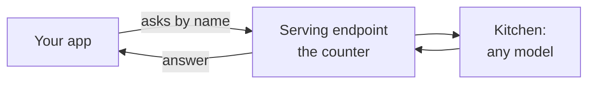
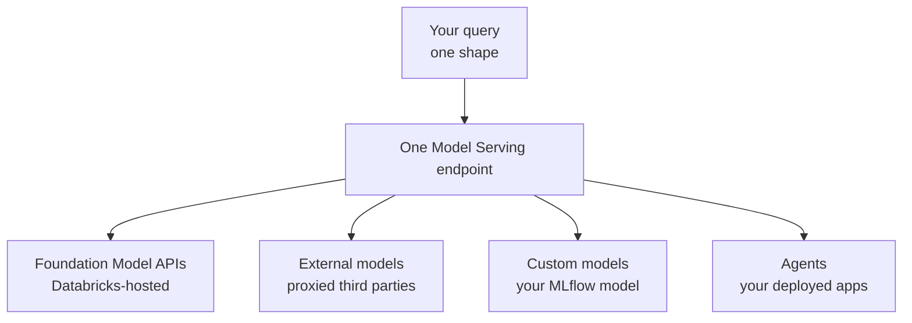
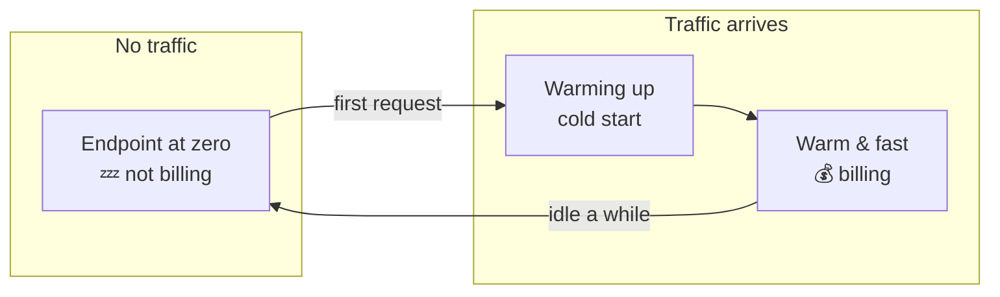
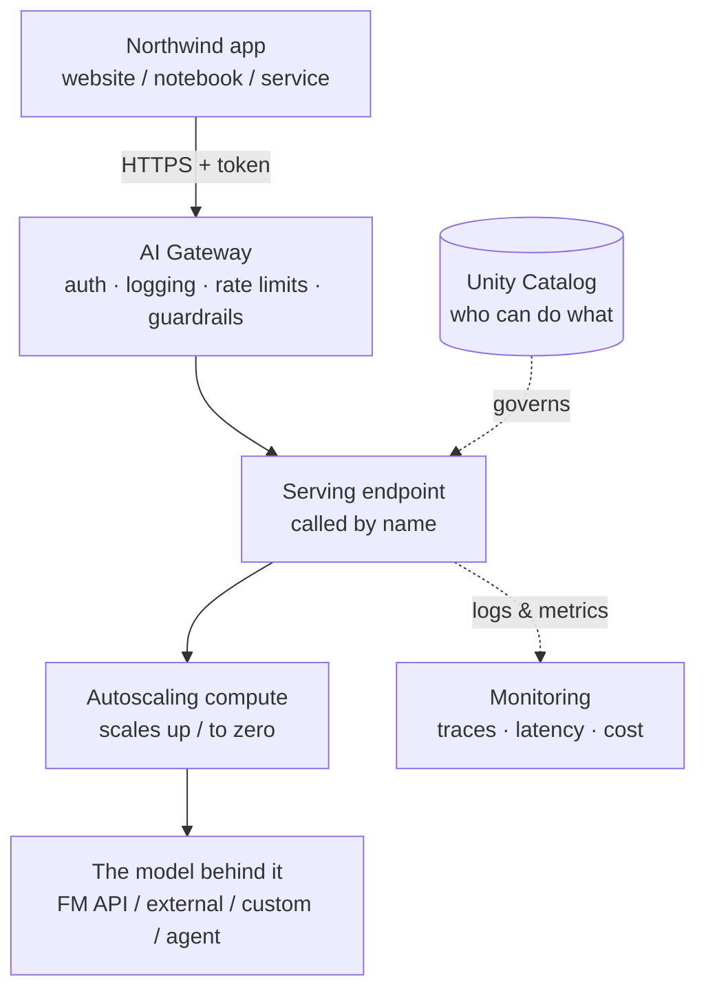

# Mosaic AI Model Serving

> Picture a busy restaurant. There's one counter at the front where you place your order. You don't walk into the kitchen. You don't need to know whether your dish is grilled, baked, or ordered in from the bakery next door. You just say what you want at the counter, and it comes out. Mosaic AI Model Serving is that counter for AI: one window, and behind it, any dish the kitchen can make.

Take a breath. This lesson is going to feel familiar, and that's on purpose.

You already run a **serving layer** every day. When someone wants data, they don't SSH into a cluster and read Parquet files by hand. They send a query to a SQL warehouse, and it answers. The warehouse is always reachable, it scales up when things get busy, and it's governed so not everyone can see everything.

Model Serving is the exact same idea, pointed at AI. It's the front counter that hands out answers from models. If you understand "a SQL warehouse serves queries," you already understand the shape of this. Let's fill in the details gently.

## Learning Objectives

By the end of this lesson, you will be able to:

- Explain what a **serving endpoint** is, in plain terms, and why it's the "serving layer" of the Databricks AI platform.
- Name the **four kinds of things** one Model Serving endpoint can host: Foundation Model APIs, external models, custom models, and agents.
- Describe the **unified query interface** and why your calling code barely changes no matter what's behind the endpoint.
- Explain **autoscaling** and **scale-to-zero**, including the one tradeoff (cold starts) you pay for the savings.
- Say how **Unity Catalog** and the **AI Gateway** keep a serving endpoint governed and safe.

## Prerequisites

- [The Databricks AI Platform Map](/docs/orientation/databricks-ai-platform-map) — the big picture of where all the pieces live. Model Serving is the "front door" on that map.
- [Calling Foundation Models](/docs/llm-foundations/calling-foundation-models) — you've already called a model once. This lesson explains the system that answered you.

You do **not** need to have deployed anything. This is the lesson that explains *where* everything you deploy later will actually run.

## Estimated Reading Time

About 15 minutes.

## Business Motivation

Let's be honest about why a company pays for this.

Imagine you've built something clever with AI. Maybe a support assistant, maybe a model that scores transactions for fraud. It works great in your notebook. Now someone asks the obvious question: **"How does the rest of the company actually use it?"**

A notebook isn't an answer. Your teammates can't call your laptop. The mobile app can't import your Python cell. You need the model to live somewhere that is:

- **Always on**, so any app can reach it at any hour.
- **Reachable over HTTP**, because that's the one language every app, website, and service already speaks.
- **Scalable**, so it survives a Monday-morning traffic spike without falling over.
- **Governed**, so you know who called it, and you can shut off access if you need to.

Building all of that yourself, servers, load balancers, autoscaling, logging, auth, is weeks of platform work. Model Serving gives it to you as a managed service. You bring the model; Databricks runs the front counter.

:::note
Throughout this lesson we'll use **Northwind Trust**, a fictional financial services company. Their team wants to put a customer-support assistant in front of real customers. Model Serving is how they'll do it.
:::

## Intuition

Here's the whole idea in one picture: **a restaurant counter.**

There's a single window where orders come in. Behind it, the kitchen might grill a steak, reheat a soup, or hand you a cake that came from the bakery next door. You, standing at the counter, don't care which. You order in the same way every time, and food comes out.

An **endpoint** is that window. Whatever is behind it, a giant foundation model, a third-party API, your own custom model, or a full agent, you talk to it the same way, by its name.

And here's the part your finance team loves: **scale-to-zero**. Think of the lights in a meeting room that turn themselves off when nobody's inside. When no one is sending requests, the endpoint can power down its compute to zero and stop charging you. The moment a request arrives, the lights flick back on. You pay for customers, not for an empty room.



*Figure 1: You order at the counter (the endpoint) by name. What happens in the kitchen is the endpoint's job, not yours.*

## Theory

Let's name things clearly.

A **serving endpoint** is a named, always-available REST API that hosts one or more models. "REST API" just means: you send it an HTTPS request, it sends back a response. Every app already knows how to do that. The endpoint has a **name** (for example `northwind-support-assistant`), and you call it by that name. You never think about which server or cluster is actually running.

Mosaic AI Model Serving is the **unified system** that runs all of these endpoints. "Unified" is the key word. Before systems like this, teams ran a different tool for each kind of model. Model Serving collapses that into one place. One endpoint can front any of **four things**:

1. **Foundation Model APIs** — large, ready-to-use models (like Llama or Claude-family models) that Databricks hosts for you. Nothing to deploy; just call them.
2. **External models** — third-party models (say, from OpenAI or Anthropic) that Databricks *proxies* on your behalf. Your traffic goes through Databricks to reach them, so it's governed and logged like everything else.
3. **Custom models** — your own model, trained or fine-tuned by you and logged with MLflow. You deploy it and it becomes an endpoint.
4. **Agents** — the multi-step AI apps you'll build in later lessons. When you deploy one, it lands here too.

The important mental model for a data engineer: **Model Serving is the serving layer of the AI platform.** It's to models what a SQL warehouse is to tables. The warehouse doesn't care whether a table is a managed Delta table or a view over external files; you `SELECT` from it the same way. Model Serving doesn't care whether the thing behind the endpoint is a foundation model or your own custom model; you query it the same way.



*Figure 2: One Model Serving endpoint can host any of four kinds of AI. The thing that changes is behind the counter; the way you order stays the same.*

## Deep Dive

Let's slow down on the three ideas that trip up newcomers: the unified query interface, autoscaling, and governance.

### The unified query interface

Here's the quietly brilliant part. No matter which of the four kinds of thing sits behind your endpoint, you query it with the **same request shape**. Databricks speaks an **OpenAI-compatible** interface for chat-style models. That's a fancy way of saying: the request looks like a list of messages (a "system" instruction, then a "user" question), and the response comes back as a message.

Why does that matter to you? Two big wins:

- **Swap without rewriting.** Northwind can start on a Databricks-hosted foundation model, then later switch the endpoint to their own fine-tuned custom model. The app calling it barely changes, because the request shape is the same.
- **Reuse what the ecosystem built.** Because it's OpenAI-compatible, the standard `openai` Python client works. You don't learn a bespoke SDK.

Think of it like SQL. Postgres, Spark, and DuckDB are wildly different engines, but you talk to all of them in SQL. The OpenAI-compatible interface is "SQL for chat models."

### Autoscaling and scale-to-zero

An endpoint runs on compute behind the scenes. **Autoscaling** means Databricks adds or removes that compute automatically based on how much traffic is arriving. Monday-morning surge? It scales up. Quiet afternoon? It scales down. You don't babysit it.

**Scale-to-zero** is the extreme, money-saving end of that dial: when an endpoint sits idle long enough, it can drop all the way to *zero* compute and stop billing. Lights off in the empty room.

There's exactly one tradeoff to know, and it's fair. When a request arrives at a scaled-to-zero endpoint, the lights have to turn back on first, warm up the compute, load the model. That first request waits longer than usual. This wait is called a **cold start**. After that, the endpoint is warm and fast again.

So the rule of thumb writes itself: scale-to-zero is great for dev, testing, and bursty internal tools where a few extra seconds now and then is fine. For a customer-facing endpoint that must feel instant, you'd keep a minimum amount of compute always warm instead.



*Figure 3: Scale-to-zero. Idle costs nothing; the first request after idle pays a one-time cold-start wait; then it's warm.*

### Governance: Unity Catalog and the AI Gateway

An always-on door to a powerful model is exactly the kind of thing your security team worries about. Databricks handles that in two layers you should know by name.

**Unity Catalog** is the same governance layer you already use for tables and files. It tracks *who is allowed to do what*. Custom models are registered in Unity Catalog, so permissions on a model work just like permissions on a table: you grant access, you revoke it, and you get lineage and an audit trail for free.

The **AI Gateway** is a control layer that sits in front of serving endpoints. Think of it as the manager standing at the counter, watching every order. It can:

- **Log** every request and response for audit.
- **Rate-limit** callers so one runaway app can't run up your bill.
- **Set guardrails**, like blocking certain content or masking sensitive data.

You'll go deeper on the AI Gateway in a later lesson. For now, hold this: the gateway is *how you keep an open endpoint safe and accountable* without changing your model.

## Architecture

Let's put the pieces on one map so you can see how a request actually flows.



*Figure 4: A request from Northwind's app passes through the AI Gateway, hits the named endpoint, runs on autoscaling compute, and reaches the model. Unity Catalog governs access; monitoring records what happened.*

Read it left to right, the way a request travels:

1. An app sends an **authenticated** HTTPS request to the endpoint by name.
2. The **AI Gateway** checks auth, applies rate limits and guardrails, and logs it.
3. The **endpoint** routes the request to its compute.
4. **Autoscaling compute** runs the actual model (warming up first if it was at zero).
5. The **model** produces the answer, which travels back the same way.
6. **Unity Catalog** decided whether that caller was allowed in the first place; **monitoring** recorded latency, cost, and traces.

## Internal Working

You don't need to manage any of this, but a peek behind the counter builds confidence.

- **The endpoint is a stable name, not a machine.** Underneath, Databricks may run one container or fifty, and may replace them at any time. Your app never notices because it only ever talks to the name. This is the same indirection a load balancer gives you, just managed for you.
- **Autoscaling watches a signal.** The system watches incoming request load and adjusts the number of running replicas (copies of the model ready to answer). More load, more replicas. Sustained zero load, and it can drop to zero replicas, which is scale-to-zero.
- **A cold start is model-load time.** The slow part of waking up isn't the machine booting; it's loading the model's weights into memory and getting it ready to answer. Bigger models take longer to warm. That's why the tradeoff exists.
- **Governance is checked at the edge.** Auth and permission checks happen before your request ever reaches the model, at the gateway and Unity Catalog layer. A caller without permission is turned away at the door, not deep inside the kitchen.

## Step-by-Step Walkthrough

Let's follow Northwind Trust from "I have a model" to "the whole company can call it."

1. **Pick what to serve.** Northwind starts simple: a Databricks-hosted Foundation Model API. No deployment needed; it's already an endpoint they can call.
2. **Find the endpoint's name.** In the Databricks UI under *Serving*, every endpoint is listed by name. Northwind notes theirs.
3. **Get credentials.** Their app needs a token to authenticate, exactly like connecting to any governed service.
4. **Query by name.** The app sends an OpenAI-shaped chat request to the endpoint name. An answer comes back.
5. **Later: swap in a custom model.** Once Northwind fine-tunes their own model, they log it to Unity Catalog and create a new endpoint from it. The calling code changes by one line: the endpoint name.
6. **Turn on governance.** They enable AI Gateway logging and set a rate limit, so no single caller can overwhelm the endpoint or run up the bill.
7. **Set scaling.** For an internal test endpoint, they enable scale-to-zero to save money. For the customer-facing one, they keep a warm minimum so customers never feel a cold start.

Notice that steps 4 and 5 are almost identical from the app's point of view. That's the unified interface doing its job.

## Hands-on Examples

You'll do full deployments in later lessons. Here, let's just *see* the two things you do most: query an endpoint, and (briefly) create one. Reading the code is enough for now; you don't have to run it.

## Code Examples

### Example 1: Query an endpoint by name with the OpenAI client

Northwind wants to ask their serving endpoint a question. Because the endpoint is OpenAI-compatible, they use the standard `openai` Python client and just point it at Databricks.

```python
from openai import OpenAI

# Point the standard OpenAI client at your Databricks workspace.
# base_url ends in /serving-endpoints; the token authenticates you.
client = OpenAI(
    api_key="YOUR_DATABRICKS_TOKEN",
    base_url="https://YOUR-WORKSPACE.cloud.databricks.com/serving-endpoints",
)

# "model" here is the ENDPOINT NAME, not a hardcoded model id.
response = client.chat.completions.create(
    model="northwind-support-assistant",
    messages=[
        {"role": "system", "content": "You are a helpful support agent for Northwind Trust."},
        {"role": "user", "content": "How do I reset my online banking password?"},
    ],
)

print(response.choices[0].message.content)
```

Let's walk through what just happened:

- **We used the plain `openai` client.** No special Databricks SDK required. That's the payoff of the OpenAI-compatible interface, the tools you may already know just work.
- **`base_url` points at your workspace.** The `/serving-endpoints` path is the front counter. Every endpoint in your workspace lives under it.
- **`model` is the endpoint *name*.** This is the line that surprises people. You're not naming a specific model like `gpt-4`; you're naming *your endpoint*. Whatever is behind that name, a foundation model, a custom model, an agent, answers.
- **`messages` is the standard chat shape.** A `system` message sets the behavior; a `user` message asks the question. This same shape works across the whole ecosystem.
- **The answer** comes back at `response.choices[0].message.content`, ready to show a customer.

The magic to internalize: if Northwind later swaps the endpoint's contents from a hosted foundation model to their own fine-tuned model, **this code doesn't change**. Only what's behind the name changed.

### Example 2: A brief look at creating an endpoint

You'll rarely create endpoints for Foundation Model APIs (they already exist). But when you deploy your *own* model, you create one. Here's the shape of it, so it isn't a mystery later.

```python
from databricks.sdk import WorkspaceClient
from databricks.sdk.service.serving import (
    EndpointCoreConfigInput,
    ServedEntityInput,
)

w = WorkspaceClient()

# Create an endpoint that serves a custom model registered in Unity Catalog.
w.serving_endpoints.create(
    name="northwind-support-assistant",
    config=EndpointCoreConfigInput(
        served_entities=[
            ServedEntityInput(
                # A model you logged to Unity Catalog: catalog.schema.model
                entity_name="northwind.ml.support_model",
                entity_version="1",
                workload_size="Small",
                scale_to_zero_enabled=True,  # lights off when idle
            )
        ]
    ),
)
```

Reading it top to bottom:

- **`WorkspaceClient()`** is the Databricks SDK's handle to your workspace. It picks up your credentials automatically when you run inside Databricks.
- **`name`** is the endpoint name your apps will call, the same `northwind-support-assistant` from Example 1.
- **`entity_name` / `entity_version`** point at a model registered in **Unity Catalog**, using the familiar `catalog.schema.name` three-level path. Governance comes along for free.
- **`workload_size`** picks how much compute each replica gets. Start small.
- **`scale_to_zero_enabled=True`** turns on the lights-off-when-idle behavior. Great for this internal assistant; you'd reconsider it for a latency-sensitive customer endpoint.

That's the whole idea of "deploying a model": you're really just creating an endpoint that points at a governed model. You'll do this for real in the custom-models lesson.

## Production Considerations

When Northwind takes this to real customers, a few things graduate from "nice" to "necessary":

- **Keep customer-facing endpoints warm.** Turn *off* scale-to-zero (or set a warm minimum) for anything a customer waits on live, so nobody eats a cold start mid-conversation.
- **Set explicit scaling bounds.** Give autoscaling a sensible maximum so a traffic spike scales up but doesn't scale into a surprise bill.
- **Version deliberately.** When you update a custom model, you deploy a new version behind the same endpoint name. Roll traffic over gradually and watch quality before sending everyone to the new version.
- **Separate environments.** Have a dev endpoint (scale-to-zero, cheap) and a prod endpoint (warm, governed). Don't test on the endpoint customers are using.

## Performance Considerations

- **Cold start is the headline latency risk.** It only bites the first request after idle. Warm endpoints, or accept the tradeoff where it's fine (batch jobs, internal tools).
- **Bigger models are slower to warm and to answer.** Match the model size to the job. Northwind's support assistant may not need the largest model available.
- **Batch when you can.** If you're scoring thousands of rows, sending them efficiently beats one slow request at a time. (You'll see batch patterns in later lessons.)
- **Watch the p95, not just the average.** As a data engineer you already know averages lie. The tail latency (the slow requests) is what customers remember.

## Security Considerations

- **Everything authenticates.** No token, no answer. Treat serving tokens like database credentials: scoped, rotated, never hardcoded in a shared repo.
- **Unity Catalog governs access.** Grant the endpoint (and the model behind it) only to the principals that need it. Revoking is as easy as granting.
- **Route third parties through external models.** When Northwind calls an outside provider, doing it as a *proxied external model* means the traffic is logged and governed like everything else, instead of leaking out an ungoverned side door.
- **Use the AI Gateway for guardrails.** Rate limits stop abuse and runaway costs; content guardrails and sensitive-data masking keep the endpoint from becoming a liability.
- **Audit trails are your friend.** Logged requests and responses are what let you answer "who asked the model what, and when", the question your auditor will eventually ask.

## Common Mistakes

- **Thinking `model` means a model id.** In the query call, `model` is the **endpoint name**. Passing a raw provider model id here is the number-one beginner slip.
- **Leaving scale-to-zero on for a live customer endpoint.** Customers hit the cold start and think your product is slow. Keep customer-facing endpoints warm.
- **Hardcoding tokens.** A leaked serving token is a leaked front-door key. Use secrets management, not string literals.
- **Assuming every model type needs its own tool.** It doesn't. One Model Serving endpoint hosts all four kinds; that's the whole point of "unified."
- **Forgetting governance until launch day.** Turn on logging and access controls early, not after security asks why they can't see who called what.

## Best Practices

- **Call endpoints by name, everywhere.** Never bake the underlying model choice into your app. The name is your stable contract; what's behind it can change freely.
- **Match scaling to the audience.** Scale-to-zero for dev and bursty internal tools; warm minimums for anything customer-facing.
- **Register models in Unity Catalog.** You get permissions, lineage, and versioning for free, the same governance you already trust for data.
- **Front endpoints with the AI Gateway.** Logging, rate limits, and guardrails from day one, not as an afterthought.
- **Reuse the OpenAI-compatible interface.** One request shape across foundation, external, custom, and agent endpoints keeps your code simple and swappable.

## Interview Questions

1. **What is Mosaic AI Model Serving, and what four kinds of things can a single endpoint host?**
   It's the unified system that hosts AI as scalable REST endpoints. One endpoint can front Foundation Model APIs, external (proxied third-party) models, custom (your own MLflow-logged) models, or deployed agents.

2. **Why is the "unified query interface" valuable? Give a concrete benefit.**
   Because you query every endpoint with the same OpenAI-compatible request shape, your calling code doesn't change when you swap what's behind the endpoint, for example moving from a hosted foundation model to your own fine-tuned model. You also get to reuse standard ecosystem tools like the `openai` client.

3. **Explain scale-to-zero and its main tradeoff.**
   When an endpoint is idle long enough, it drops to zero compute and stops billing; the first request after idle then pays a one-time cold-start delay while the model loads. Great for dev and bursty workloads; avoided for latency-sensitive customer endpoints.

4. **How do Unity Catalog and the AI Gateway each contribute to governance?**
   Unity Catalog controls *who can access* the model and endpoint, with permissions, lineage, and audit like tables. The AI Gateway sits in front of endpoints to log traffic, enforce rate limits, and apply guardrails.

5. **A data engineer asks, "how is this different from a SQL warehouse?" How do you frame it?**
   It's the same idea for a different payload. A SQL warehouse is an always-on, autoscaling, governed service that serves queries over tables; Model Serving is an always-on, autoscaling, governed service that serves requests over models. You call both by name and don't manage the machines.

## Quiz

**Question 1:** In the query code `client.chat.completions.create(model="northwind-support-assistant", ...)`, what is `"northwind-support-assistant"`?

<details>
<summary>Show answer</summary>

It's the **endpoint name**, not a provider's model id. You call a Model Serving endpoint by its name, and whatever is behind that name (a foundation model, custom model, external model, or agent) answers.

</details>

**Question 2:** Northwind enables scale-to-zero on their public customer-support endpoint and customers start complaining the assistant is "slow to wake up." What's happening, and what should they do?

<details>
<summary>Show answer</summary>

Customers are hitting **cold starts**, the one-time delay after idle while the endpoint warms compute and loads the model. For a customer-facing endpoint, they should turn off scale-to-zero (or keep a warm minimum) so it's always ready. Scale-to-zero is better suited to dev and bursty internal tools.

</details>

**Question 3:** Which two systems keep a serving endpoint governed, and what does each do?

<details>
<summary>Show answer</summary>

**Unity Catalog** controls access, who is allowed to use the model and endpoint, with lineage and audit, just like tables. The **AI Gateway** sits in front of endpoints to log requests, enforce rate limits, and apply content guardrails.

</details>

**Question 4:** True or false: you need a different serving tool for foundation models, your own custom models, and agents.

<details>
<summary>Show answer</summary>

**False.** Mosaic AI Model Serving is unified, one system hosts all four kinds (Foundation Model APIs, external models, custom models, and agents) as endpoints you query the same way. That "one counter for every dish" design is the whole point.

</details>

## Key Takeaways

- If you get the SQL-warehouse analogy, you already get this: same idea, aimed at models instead of tables.
- A **serving endpoint** is a named, always-on REST API for a model. You call it **by name** and never manage the machines.
- **One** Model Serving endpoint can host any of four things: **Foundation Model APIs, external models, custom models, and agents.**
- The **unified, OpenAI-compatible query interface** means your calling code barely changes when you swap what's behind the endpoint.
- **Autoscaling** handles load; **scale-to-zero** saves money when idle, with a one-time **cold-start** delay as the tradeoff.
- **Unity Catalog** governs access; the **AI Gateway** logs, rate-limits, and guards. Turn them on early.
- Everything you deploy in later lessons, custom models and agents, runs **here**.

## Glossary

- **Serving endpoint:** A named, always-available REST API that hosts one or more models; you query it by name.
- **Mosaic AI Model Serving:** The unified Databricks system that runs those endpoints for foundation, external, custom, and agent workloads.
- **REST API:** A way to talk to a service over HTTPS requests and responses, the common language every app already speaks.
- **OpenAI-compatible interface:** A standard request/response shape for chat models, so standard clients and the same code work across endpoints.
- **Foundation Model APIs:** Large, ready-to-use models that Databricks hosts for you, no deployment required.
- **External models:** Third-party models that Databricks proxies on your behalf, so they're governed and logged.
- **Custom model:** Your own model, logged with MLflow and registered in Unity Catalog, deployed as an endpoint.
- **Autoscaling:** Automatically adding or removing compute for an endpoint based on incoming traffic.
- **Scale-to-zero:** Dropping an idle endpoint to zero compute (and zero cost); the next request pays a cold start.
- **Cold start:** The one-time delay while a scaled-to-zero endpoint warms up and loads its model.
- **Unity Catalog:** Databricks' governance layer for who can access what, with lineage and audit, covering models too.
- **AI Gateway:** A control layer in front of endpoints for logging, rate limiting, and guardrails.

## Further Reading

- [Databricks Model Serving documentation](https://docs.databricks.com/aws/en/machine-learning/model-serving/)

## Next Lesson

➡️ [Foundation Model APIs in Depth](/docs/serving/foundation-model-apis) — now that you know the counter, let's look closely at the ready-to-use dishes: the Foundation Model APIs Databricks hosts for you.
