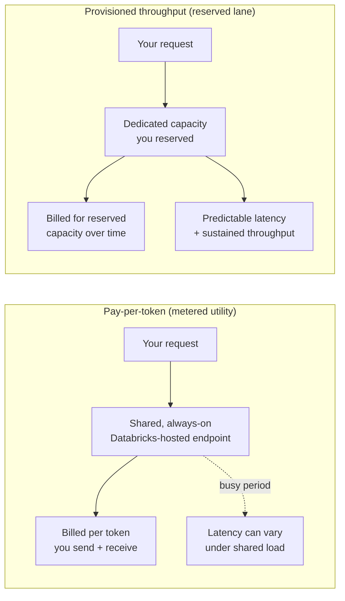
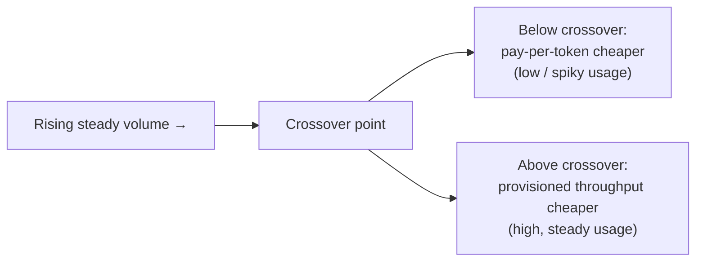
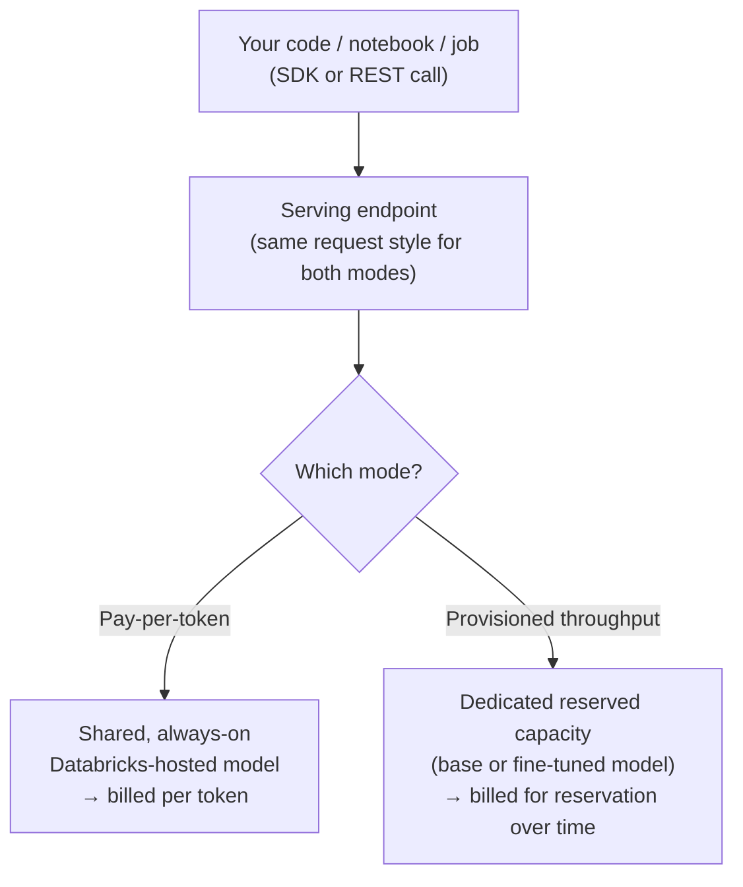

# Foundation Model APIs in Depth

> Imagine your electricity bill. Some months you barely use anything, and you pay almost nothing. Other months you run the air conditioning nonstop, and the metered bill climbs. Now imagine a factory that runs machines all day, every day. At some point that factory stops paying per kilowatt-hour on the open market and instead signs a fixed contract for a dedicated power line. Same electricity. Very different way of paying. Foundation Model APIs on Databricks work exactly like this, and by the end of this lesson you will know which "billing plan" fits your workload.

You already met Foundation Model APIs briefly in Part 1. This lesson goes deeper. Do not worry if the earlier intro felt quick. We will rebuild the whole idea slowly, and by the end you will be able to look at a real workload and say, with confidence, "this one should be metered" or "this one needs a reserved lane."

## Learning Objectives

By the end of this lesson, you will be able to:

- Explain the two Foundation Model API modes in plain language: **pay-per-token** and **provisioned throughput**.
- Describe how each mode is billed and when idle time costs you money (and when it does not).
- Estimate a rough tokens-per-day number for a workload from simple inputs like "rows per day" and "tokens per row."
- Reason about the trade-off between metered cost and reserved cost, so you can pick a mode on purpose instead of by accident.
- Understand why latency behaves differently on shared endpoints versus dedicated capacity.
- Know why fine-tuned models and strict service-level agreements (SLAs) usually require provisioned throughput.

## Prerequisites

You should be comfortable with these first. If any feels shaky, a quick review will make this lesson easier:

- [Mosaic AI Model Serving](/docs/serving/model-serving) — what an endpoint is and how serving works on Databricks.
- [Calling Foundation Models](/docs/llm-foundations/calling-foundation-models) — how you actually send a request to a model and read the response.

You do **not** need any machine learning background. If you can read a Python function and estimate "roughly how many rows per day," you are ready.

## Estimated Reading Time

About 20 to 25 minutes, plus a little time if you try the code.

## Business Motivation

Here is the situation almost every data team hits.

You build something with a large language model (LLM). Maybe it summarizes support tickets, or classifies product reviews, or extracts fields from messy text. In the beginning, traffic is tiny. A few requests here and there while you experiment. You want to pay almost nothing and move fast.

Then it works. Leadership loves it. Now it runs every night against millions of rows, or it powers a live feature that customers hit all day long. Suddenly two new questions matter a lot:

1. **Cost.** At high, steady volume, paying per request can quietly become expensive.
2. **Predictability.** When a shared service is busy, your requests might wait longer. A nightly batch that "usually finishes by 6am" is not good enough when a report is due at 6am sharp.

Foundation Model APIs give you two modes precisely because these two phases of life need different things. Picking the right mode can be the difference between a cheap, snappy pipeline and an expensive, unpredictable one. That is the whole point of this lesson.

## Intuition

Let us anchor everything on one simple analogy. Keep it in your head for the rest of the lesson.

- **Pay-per-token** is a **metered utility bill**. Like water or electricity, you pay only for what you actually use. Turn it off and the meter stops. There is no monthly commitment. It is shared infrastructure, so it is always on and ready, but you share the pipes with everyone else.

- **Provisioned throughput** is **renting your own dedicated lane**. Think of a private toll lane next to a crowded highway. You pay to reserve it whether or not a car is on it right now. In exchange, you never sit in shared traffic, and you know exactly how fast you can go.

That is 90% of the concept. Everything else is detail.



*Figure 1: The two modes at a glance. Pay-per-token shares infrastructure and bills by usage. Provisioned throughput reserves dedicated capacity and bills for the reservation.*

## Theory

Let us define the few terms you need. Nothing scary here.

**Token.** LLMs do not read whole words. They read chunks called tokens. A token is roughly 3 to 4 characters of English text, or about three-quarters of a word. The sentence "Databricks is great" is a handful of tokens. Both the text you send in (**input tokens**) and the text the model writes back (**output tokens**) are counted.

**Pay-per-token mode.** Databricks hosts popular foundation models on **shared, always-on** endpoints. You send a request, you get a response, and you are billed based on how many input and output tokens were involved. There is **zero idle cost**. If you send nothing, you pay nothing. This is ideal for prototyping, spiky traffic, and low-volume workloads.

**Provisioned throughput mode.** Here you deploy a foundation model (a base model, or a **fine-tuned** version with your own custom weights) onto **dedicated capacity that you reserve**. You size that capacity in **throughput units**, which you can think of as roughly a tokens-per-second capacity. You are billed for that reserved capacity over time, whether or not you are using every second of it. In return you get **predictable latency** and **higher sustained throughput**. This is the mode for production workloads, strict SLAs, compliance needs, and custom models.

:::note[Going deeper (optional)]
"Throughput units" are an abstraction. The exact tokens-per-second a unit gives you depends on the specific model and can change, so always check the current Databricks documentation for the model you plan to use rather than memorizing a number. The mental model — "more units equals more tokens per second of guaranteed capacity" — is what matters and stays true.
:::

## Deep Dive

Now the part that Part 1 did not cover: **how to actually choose.** There are three things to weigh.

### 1. Volume: how much will you send?

Pay-per-token cost grows with every token. Twice the tokens, roughly twice the bill. It never stops climbing because there is no ceiling and no reservation.

Provisioned throughput cost is mostly flat. You pay for the reserved capacity over time. Whether you push 10% or 95% of that capacity through it, the bill for the reservation is similar.

So there is a **crossover point**. Below some volume, metered is cheaper because you are barely using anything. Above it, the metered bill overtakes the flat reserved cost, and reserving becomes the better deal.



*Figure 2: As steady volume rises, metered cost keeps climbing while reserved cost stays roughly flat. Past the crossover point, reserving capacity wins.*

### 2. Latency: how fast, and how reliably fast?

On a **shared** pay-per-token endpoint, you share capacity with other users. Most of the time it is fine. But during busy periods, your requests can wait a little longer. The average is good; the worst case is less predictable.

On **dedicated** provisioned throughput, the capacity is yours. Nobody else is in your lane. Latency is far more predictable, which is exactly what you need when a job has a hard deadline or a live feature must respond within a promised time.

### 3. Special requirements

Some things simply require provisioned throughput:

- **Fine-tuned or custom models.** Your own weights are not on the shared always-on endpoints. You deploy them onto dedicated capacity.
- **Strict SLAs and compliance.** When you must guarantee latency or isolation, a reserved lane gives you that guarantee.

## Architecture

Here is how the pieces fit together on Databricks. Both modes are reached the same way: through a **serving endpoint** with a familiar API. What differs is what sits behind the endpoint.



*Figure 3: Both modes live behind a serving endpoint. Your calling code barely changes. The billing and the capacity behind the endpoint are what differ.*

The happy consequence: because the calling interface is so similar, you can often **start on pay-per-token while prototyping and switch to provisioned throughput later** without rewriting your application logic.

## Internal Working

You do not need deep internals, but a little intuition helps you reason about cost and speed.

- When you send a request, the model processes your input tokens, then **generates output tokens one at a time**. Longer prompts and longer answers both mean more work and more tokens.
- On pay-per-token, the meter counts those input and output tokens and that is your charge for the call.
- On provisioned throughput, your reserved units define how many tokens per second the dedicated capacity can sustain. If you try to push more than your reservation can handle, requests queue up. If you reserve far more than you use, you pay for idle capacity. **Right-sizing is the whole game.**

:::note[Going deeper (optional)]
This is why "tokens per second" matters more than "requests per second." Two requests can be wildly different in cost and time if one has a 50-token answer and the other has a 2,000-token answer. When you size capacity, always think in tokens, not in request counts.
:::

## Step-by-Step Walkthrough

Let us reason through a real decision the way you would on the job. Meet our fictional company.

**Northwind Trust** runs a **nightly batch job** that summarizes the day's customer interactions. It has grown a lot. Here is how the team thinks it through:

1. **Estimate the volume.** They process about **2,000,000 rows per night**. Each row sends roughly **600 input tokens** and gets back about **150 output tokens**. That is 750 tokens per row.
2. **Compute tokens per night.** 2,000,000 rows times 750 tokens equals **1.5 billion tokens per night**, every night.
3. **Check the pattern.** This is not spiky. It is **high and steady**, night after night. That is a strong signal toward reserving capacity.
4. **Check the deadline.** The summaries must be ready by 6am for the morning report. That is a hard SLA. Shared-endpoint latency variability makes the team nervous.
5. **Compare cost.** They estimate the metered bill for 1.5 billion tokens a night, then compare it to reserving enough throughput units to finish the job comfortably before 6am. At this volume, the reserved lane comes out cheaper **and** more predictable.
6. **Decision.** Northwind Trust moves the nightly job to **provisioned throughput**. They keep a small **pay-per-token** endpoint around for ad-hoc experiments and one-off analyst queries, where paying per use is perfect.

Notice what made this easy: they turned a vague worry into two numbers (tokens per night and required finish time) and then chose on purpose.

## Hands-on Examples

Let us make the estimation concrete before we touch any endpoint. This tiny function is the single most useful tool in this lesson.

```python
def tokens_per_day(rows_per_day, input_tokens_per_row, output_tokens_per_row):
    """Back-of-envelope: estimate total tokens processed per day."""
    per_row = input_tokens_per_row + output_tokens_per_row
    total = rows_per_day * per_row
    return total

# Northwind Trust's nightly job
total = tokens_per_day(
    rows_per_day=2_000_000,
    input_tokens_per_row=600,
    output_tokens_per_row=150,
)
print(f"Estimated tokens per night: {total:,}")
```

Let us narrate that. The function just adds input and output tokens to get a per-row cost in tokens, then multiplies by rows per day. Plugging in Northwind Trust's numbers prints `Estimated tokens per night: 1,500,000,000`. That one number — 1.5 billion tokens a night — is what drives the whole decision. High and steady means "consider reserving."

## Code Examples

Now the real thing. We will (1) query a pay-per-token endpoint, (2) look at how you would conceptually deploy and query a provisioned throughput endpoint, and (3) turn our token estimate into a rough cost comparison.

### Example 1: Query a pay-per-token endpoint

```python
from openai import OpenAI
import os

# The Databricks SDK / OpenAI-compatible client points at your workspace.
client = OpenAI(
    api_key=os.environ["DATABRICKS_TOKEN"],
    base_url="https://<your-workspace-host>/serving-endpoints",
)

response = client.chat.completions.create(
    model="databricks-meta-llama-3-3-70b-instruct",  # a pay-per-token model name
    messages=[
        {"role": "system", "content": "You summarize customer messages in one sentence."},
        {"role": "user", "content": "The delivery was late and the box was damaged, but support was helpful."},
    ],
    max_tokens=60,
)

print(response.choices[0].message.content)
print("Tokens used:", response.usage.total_tokens)
```

Let us narrate. You create a client pointed at your workspace's serving endpoints, using a personal access token. You call a **pay-per-token** model by name, send a system instruction plus the user's message, and cap the answer at 60 tokens. You get back a summary and — importantly — a `usage` object telling you how many tokens the call cost. That `total_tokens` number is exactly what you are billed on in this mode. No endpoint to create, no capacity to reserve, nothing running when you are idle.

:::note[Going deeper (optional)]
Model names and available models change over time. Always check the current [Foundation Model APIs documentation](https://docs.databricks.com/aws/en/machine-learning/foundation-model-apis/) for the exact model identifiers and which are offered in pay-per-token versus provisioned throughput. The *shape* of the call stays the same.
:::

### Example 2: Conceptually deploy and query a provisioned throughput endpoint

The querying code looks almost identical. The difference is that **you create the endpoint first** and reserve capacity for it. Conceptually:

```python
# --- Step A: create a provisioned throughput endpoint (conceptual) ---
# You choose the model (base or fine-tuned) and reserve capacity in
# throughput units. This is often done via the UI, the SDK, or REST.

from databricks.sdk import WorkspaceClient
from databricks.sdk.service.serving import (
    EndpointCoreConfigInput,
    ServedEntityInput,
)

w = WorkspaceClient()

w.serving_endpoints.create(
    name="northwind-nightly-summarizer",
    config=EndpointCoreConfigInput(
        served_entities=[
            ServedEntityInput(
                entity_name="system.ai.meta_llama_v3_3_70b_instruct",  # a UC model
                entity_version="1",
                # Reserve capacity. Higher = more tokens/second sustained.
                min_provisioned_throughput=980,
                max_provisioned_throughput=2940,
            )
        ]
    ),
)
```

Let us narrate the deploy step. You ask Databricks to stand up a **dedicated** endpoint named `northwind-nightly-summarizer`, backed by a specific model version from Unity Catalog. The two throughput numbers set the floor and ceiling of reserved capacity — roughly the minimum and maximum tokens-per-second the lane can sustain. These specific numbers are illustrative; the valid ranges depend on the model, so read them off the current docs or the UI when it shows you supported values. Once this endpoint is ready, that capacity is yours, and the bill accrues for the reservation over time.

```python
# --- Step B: query it (nearly identical to pay-per-token) ---
response = client.chat.completions.create(
    model="northwind-nightly-summarizer",  # your dedicated endpoint name
    messages=[
        {"role": "system", "content": "You summarize customer messages in one sentence."},
        {"role": "user", "content": "The delivery was late and the box was damaged, but support was helpful."},
    ],
    max_tokens=60,
)
print(response.choices[0].message.content)
```

Let us narrate the query step. Notice how little changed: you point `model` at **your endpoint name** instead of a shared model name. Everything else is the same. That is the payoff of the shared interface — you can graduate from prototype to production without rewriting your calling code.

### Example 3: A back-of-envelope cost comparison

```python
def monthly_metered_cost(tokens_per_day, price_per_million_tokens, days=30):
    """Rough metered cost. Treats input+output at one blended price for simplicity."""
    millions_per_month = (tokens_per_day * days) / 1_000_000
    return millions_per_month * price_per_million_tokens

def monthly_reserved_cost(reserved_cost_per_day, days=30):
    """Flat cost of a reserved lane, regardless of exact usage."""
    return reserved_cost_per_day * days

# Plug in YOUR OWN current prices from the Databricks pricing page.
PRICE_PER_MILLION = 1.00        # placeholder blended $/million tokens
RESERVED_PER_DAY = 300.00       # placeholder $/day for the reserved capacity

metered = monthly_metered_cost(1_500_000_000, PRICE_PER_MILLION)
reserved = monthly_reserved_cost(RESERVED_PER_DAY)

print(f"Metered (pay-per-token):   ${metered:,.0f} / month")
print(f"Reserved (provisioned):    ${reserved:,.0f} / month")
print("Cheaper:", "reserved" if reserved < metered else "metered")
```

Let us narrate. The first function scales your daily token estimate up to a month and multiplies by a price per million tokens. The second is just a flat daily reservation cost times the days. With these **placeholder** numbers, the metered path costs about `$45,000/month` while the reserved lane costs `$9,000/month`, so the script prints `Cheaper: reserved`. The exact answer depends entirely on real prices, which change — so **always plug in current numbers from the Databricks pricing page.** The technique, not the placeholders, is what you keep.

:::note[Going deeper (optional)]
A more careful model prices **input** and **output** tokens separately, since output is often priced higher. For a first-pass decision, a blended price is usually good enough to see which side of the crossover you are on. Refine only if you are near the line.
:::

## Production Considerations

- **Start metered, then measure.** Prototype on pay-per-token, log your real token usage from the `usage` field, and use those real numbers to decide if and when to reserve.
- **Watch the crossover.** Revisit the metered-versus-reserved math when volume grows. What was cheap to meter last quarter may be expensive today.
- **Keep both.** It is common and healthy to run a reserved endpoint for the big steady workload and keep pay-per-token around for experiments and low-volume tasks.
- **Fine-tuned models need reservation.** If you fine-tune a model on your own data, plan for provisioned throughput from the start.

## Performance Considerations

- **Think in tokens per second, not requests per second.** Size reserved capacity from your peak tokens-per-second need, including output length.
- **Shorter outputs finish faster and cost less.** Cap `max_tokens` to what you actually need. A tighter prompt and a shorter answer help both speed and cost in either mode.
- **Batch jobs and deadlines.** For a nightly job with a hard finish time, reserve enough throughput to complete comfortably before the deadline, and leave a little headroom for slow nights.
- **Shared-endpoint variability.** Under heavy shared load, pay-per-token latency can wobble. For latency-sensitive, always-on features, that variability is the main reason to reserve.

## Security Considerations

- **Protect your token.** Your Databricks personal access token or service principal credential is a secret. Store it in a secret manager or environment variable, never in code or notebooks that get shared.
- **Isolation.** Dedicated provisioned throughput capacity gives you stronger isolation, which can matter for compliance and sensitive data.
- **Governance.** Deploying models (especially fine-tuned ones) through Unity Catalog lets you control who can access which model, keeping your serving surface auditable.
- **Least privilege.** Give jobs only the endpoint access they need. A prototyping token should not be able to touch production endpoints.

## Common Mistakes

- **Leaving a big job on pay-per-token forever.** It felt free while prototyping, then the monthly bill quietly ballooned. Recompute the crossover as you scale.
- **Reserving too much capacity.** A reserved lane you barely use is money burned on idle capacity. Right-size from real token measurements.
- **Reserving too little capacity.** Under-provisioning makes requests queue and blows past your deadline. Leave headroom.
- **Estimating in requests instead of tokens.** Two requests can differ hugely in tokens. Always size in tokens.
- **Forgetting output tokens.** People often estimate only the prompt and forget the answer, which is frequently the larger and pricier half.
- **Hardcoding model names and prices.** Both change. Read current values from the docs and pricing page.

## Best Practices

- Turn every "should we reserve?" question into two numbers: **tokens per day** and **required latency/deadline.**
- Log real `usage` data early so your decisions rest on measurements, not guesses.
- Use pay-per-token for spiky, low-volume, and experimental work. Use provisioned throughput for high, steady volume, strict SLAs, and custom models.
- Keep the calling code identical across modes so switching is a config change, not a rewrite.
- Re-evaluate on a schedule. Volume drifts; the right mode drifts with it.

## Interview Questions

1. **Explain the two Foundation Model API modes and when you would choose each.** (Look for: metered/no-commitment for spiky and low volume; reserved dedicated capacity for high steady volume, strict SLAs, and custom models.)
2. **A workload processes 3 million rows/day at 800 tokens each. How would you decide between the two modes?** (Look for: compute tokens/day = 2.4B, check steadiness, check latency needs, compare metered cost to reserved cost, note the crossover.)
3. **Why can pay-per-token latency be less predictable than provisioned throughput?** (Look for: shared infrastructure and contention under load versus dedicated, reserved capacity.)
4. **What does "throughput units" mean, and why size in tokens per second rather than requests per second?** (Look for: units approximate sustained tokens/second; requests vary wildly in token count, so tokens are the true unit of work.)
5. **Why do fine-tuned models generally require provisioned throughput?** (Look for: custom weights are not on the shared always-on endpoints; they run on dedicated reserved capacity.)

## Quiz

**Q1. Which mode has zero idle cost?**

<details>
<summary>Show answer</summary>

Pay-per-token. You pay only for the tokens you actually send and receive. If you send nothing, you pay nothing.

</details>

**Q2. A job runs at high, steady volume every night and has a hard 6am deadline. Which mode fits best, and why?**

<details>
<summary>Show answer</summary>

Provisioned throughput. High steady volume tends to be cheaper on reserved capacity than metered, and the dedicated lane gives predictable latency so you can reliably hit the deadline.

</details>

**Q3. You process 500,000 rows/day, each using 400 input tokens and 100 output tokens. How many tokens per day is that?**

<details>
<summary>Show answer</summary>

500,000 rows times (400 + 100) tokens = 500,000 times 500 = **250,000,000 tokens per day**. Remember to include output tokens, not just the prompt.

</details>

**Q4. Why should you size reserved capacity in tokens per second rather than requests per second?**

<details>
<summary>Show answer</summary>

Because requests vary enormously in size. One request might produce a 50-token answer and another a 2,000-token answer. Tokens per second measures the actual work the capacity must sustain, so it is the honest unit for sizing.

</details>

## Summary

Foundation Model APIs come in two modes, and now you can tell them apart with confidence. **Pay-per-token** is a metered utility: shared, always-on, billed by tokens, zero idle cost, perfect for prototyping and spiky or low-volume work. **Provisioned throughput** is a reserved lane: dedicated capacity you size in throughput units, billed over time, giving predictable latency and sustained throughput, and required for fine-tuned models and strict SLAs. Choosing well comes down to two numbers — tokens per day and required latency — plus a quick metered-versus-reserved cost comparison to find your crossover point. Northwind Trust used exactly that reasoning to move its big nightly job to provisioned throughput while keeping a metered endpoint for experiments.

## Key Takeaways

- Pay-per-token = metered utility. Provisioned throughput = reserved dedicated lane.
- Metered cost climbs with volume; reserved cost is roughly flat. There is a crossover point.
- Estimate tokens/day = rows/day times (input + output tokens per row). Never forget output tokens.
- Dedicated capacity gives predictable latency; shared endpoints can wobble under load.
- Fine-tuned models and strict SLAs need provisioned throughput.
- Size reserved capacity in tokens per second, and right-size it from real measurements.
- Model names and prices change — always confirm current values in the docs.

## Glossary

- **Token:** The chunk of text an LLM reads and writes, roughly three-quarters of a word.
- **Input tokens / output tokens:** The tokens you send in versus the tokens the model writes back. Both are billed.
- **Pay-per-token:** Metered mode on shared, always-on endpoints. Billed per token, zero idle cost.
- **Provisioned throughput:** Dedicated reserved capacity you deploy a model onto. Billed for the reservation over time.
- **Throughput unit:** A unit of reserved capacity, roughly a sustained tokens-per-second amount. More units means more capacity.
- **Crossover point:** The volume at which reserved capacity becomes cheaper than metered usage.
- **SLA (service-level agreement):** A promise about performance, such as a guaranteed response time or deadline.
- **Fine-tuned model:** A base model further trained on your own data, producing custom weights.

## Further Reading

- [Foundation Model APIs on Databricks](https://docs.databricks.com/aws/en/machine-learning/foundation-model-apis/)
- [Mosaic AI Model Serving](/docs/serving/model-serving)
- [Calling Foundation Models](/docs/llm-foundations/calling-foundation-models)

## Next Lesson

➡️ [External and Custom Models](/docs/serving/external-and-custom-models)
