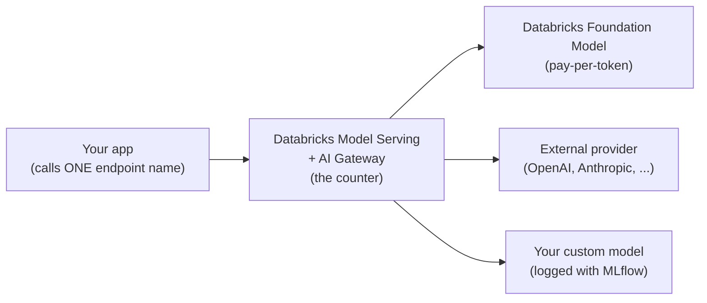
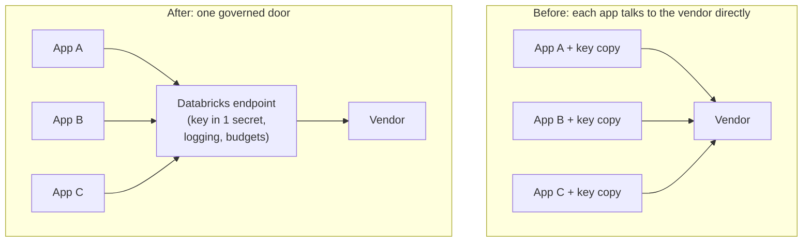
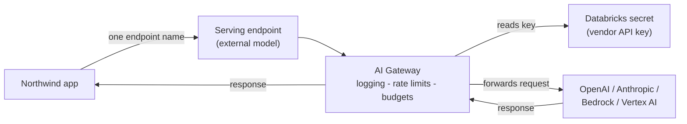

# External and Custom Models

> "Our app calls OpenAI, and my legal team wants to know where the API key lives. Can we put Databricks in the middle so every call is logged?" That is exactly what this lesson is about.

Let's start with a friendly promise. If the last two lessons made sense, this one will feel like a natural next step. You already know Databricks can serve models. Now you'll learn two more kinds of "backends" you can put behind that same serving door. No deep math here, just two clear ideas and a couple of gentle diagrams. Take your time, and know that plenty of experienced engineers meet these concepts for the very first time in a lesson just like this one.

## Learning Objectives

By the end of this lesson, you will be able to:

- Explain what an **external model** is and why you would route a third-party provider (like OpenAI or Anthropic) through Databricks.
- Explain what a **custom model** is and when you would bring your own model.
- Describe the unifying idea: **one governed serving layer, many backends**.
- Store a provider API key safely in a Databricks secret instead of in code.
- Create an external-model endpoint that proxies a vendor.
- Log a simple custom model with MLflow and deploy it to Model Serving (at a conceptual level).

## Prerequisites

Before starting, you should be comfortable with:

- [Mosaic AI Model Serving](/docs/serving/model-serving) - what a serving endpoint is.
- [Foundation Model APIs in Depth](/docs/serving/foundation-model-apis) - how Databricks-hosted, pay-per-token models work.

That is all. If those two feel familiar, you are ready.

## Estimated Reading Time

About 22 to 28 minutes, plus a little extra if you try the hands-on examples.

## Business Motivation

Imagine a fictional company called **Northwind Trust**, a mid-sized financial firm. Two very real situations land on their desk.

**Situation one.** A team has built a great app using a specific vendor model, say OpenAI's GPT. It works. But the security team has questions. Where is the API key? Who can see the traffic? Is there a spending limit? Right now the answer is "the key is in an environment variable, and nobody is watching the spend." That makes people nervous.

**Situation two.** The data science team fine-tuned their own fraud-scoring model. It is not a chatbot. It is their own recipe. They want to serve it to other applications with the same reliability, logging, and access controls that everything else gets.

Both problems have the same shape. Northwind wants **one front door** for models, no matter what sits behind it. They want keys stored safely, every call logged, spending capped, and access governed. External models solve situation one. Custom models solve situation two. Same door, different kitchens.

## Intuition

Here are the two ideas in plain, everyday language.

**External model = a governed pass-through window to an outside vendor's kitchen.** You are not cooking. You are handing the order through a controlled window to a restaurant across the street (OpenAI, Anthropic, and so on). But the window is yours. You check the receipts, you set a daily budget, and you keep the vendor's key locked in your own drawer. Your customers only ever see your window. They never talk to the vendor directly.

**Custom model = bringing your own recipe to be cooked and served at the same counter.** You made the dish yourself (you trained or fine-tuned the model). You hand the recipe to the kitchen, and the kitchen cooks and serves it from the very same counter your other food comes from. Customers order the same way, from the same counter.

The counter is the important part. It is the same in both cases.



<p align="center"><em>Diagram 1: One serving interface fronts three kinds of backends. Your app only knows the endpoint name.</em></p>

## Theory

Let's define the two terms carefully, then name what they share.

**External models.** You create a Databricks serving endpoint whose job is to *proxy* a third-party provider. "Proxy" just means "pass the request along on your behalf." Supported providers include OpenAI (and Azure OpenAI), Anthropic, Cohere, Amazon Bedrock, Google Cloud Vertex AI, and AI21 Labs. There is also a "custom" provider option for any service that speaks the OpenAI API format. The vendor's API key is stored in a **Databricks secret**, not in your code. Every request flows through the **AI Gateway**, so it inherits governance: logging, rate limits, usage tracking, and budgets. Your application calls one endpoint name and does not know or care which vendor is behind it.

**Custom models.** You log your own model with **MLflow**, register it in **Unity Catalog**, and deploy it to Model Serving. "Your own model" can mean many things: a fine-tuned LLM, a Python function wrapped as a `pyfunc`, or a classic machine-learning model like an XGBoost classifier. Databricks serves it behind the same kind of endpoint, with either an OpenAI-compatible interface or a plain REST interface.

**The unifying theme.** Foundation Model APIs, external models, and custom models are all hosted by the *same* Model Serving system. That means one place to manage endpoints, one place for governance, and one calling pattern for your apps. You learn the serving layer once and reuse it for every backend.

:::note[Going deeper (optional)]
An external-model endpoint config uses a `task` field that tells the Gateway what kind of request this is: `llm/v1/chat` for chat, `llm/v1/completions` for text completion, or `llm/v1/embeddings` for embeddings. This lets Databricks translate between providers that have slightly different request shapes, so your app can keep speaking one dialect.
:::

## Deep Dive

Let's slow down on *why* the "one door" design matters so much.

When each app talks to a vendor directly, three problems multiply with every new app:

1. **Keys spread everywhere.** Each app has its own copy of the vendor key. Rotating a leaked key means hunting through many codebases.
2. **No shared view of spend or usage.** Nobody can answer "how much did we spend on this vendor last month?" without stitching together logs.
3. **Governance is copy-pasted.** Rate limits, audit logging, and content guardrails get re-implemented (badly) in each app.

Routing through Databricks flips this. The key lives in one secret. Spend and usage are tracked centrally by the AI Gateway. Governance is configured once on the endpoint. And here is the quietly powerful part: because your app calls an endpoint *name* and not a vendor, you can **swap the backend without changing app code**. Move from one provider to another, or from an external model to a custom model, and the app never notices.



<p align="center"><em>Diagram 2: Direct vendor access scatters keys and governance. One governed door centralizes both.</em></p>

## Architecture

Here is how the pieces fit together for the external-model case at Northwind Trust.



<p align="center"><em>Diagram 3: The Gateway reads the key from the secret and forwards the call. The app never touches the vendor or the key.</em></p>

For the custom-model case, the picture is similar, except the box on the right is your own model running on Databricks compute, and the "secret + vendor" part is replaced by a model artifact stored in Unity Catalog.

## Internal Working

Let's walk through what actually happens on a single request, step by step, for an external model.

1. Your app sends a request to the endpoint by its name (for example, `northwind-chat`).
2. Model Serving receives it and hands it to the **AI Gateway**.
3. The Gateway checks governance: are you within the rate limit and budget? Does the request pass any guardrails?
4. The Gateway fetches the vendor key from the **Databricks secret**. Your app never sees this.
5. The Gateway translates your request into the vendor's exact format (based on the `task` type) and forwards it.
6. The vendor responds. The Gateway logs the call (usage, tokens, latency) and returns the answer to your app.

For a **custom model**, steps 4 and 5 change: instead of fetching a key and calling a vendor, Model Serving loads your model from Unity Catalog onto compute and runs it directly. Everything else, the naming, the governance, the logging, stays the same.

:::note[Going deeper (optional)]
Custom-model endpoints can scale automatically with traffic, and can even "scale to zero" (spin down to no compute when idle) to save money. For production workloads that need constant uptime, you would turn scale-to-zero off. A brand-new model version can take around 10 minutes to become ready, and updates roll out with zero downtime so the old version keeps serving until the new one is healthy.
:::

## Step-by-Step Walkthrough

Here is the mental checklist for each path. Read it once; you do not need to memorize it.

**To serve an external model:**

1. Store the vendor's API key in a Databricks secret.
2. Create a serving endpoint with an `external_model` config that names the provider, the model, the task, and the secret reference.
3. (Optional) Turn on AI Gateway governance features like rate limits and usage tracking.
4. Point your app at the endpoint name.

**To serve a custom model:**

1. Log your model with MLflow (add a signature and an input example).
2. Register the model in Unity Catalog.
3. Create a serving endpoint from that registered model version, choosing a compute size.
4. Point your app at the endpoint name.

Notice how steps 4 are identical. That is the whole point.

## Hands-on Examples

Let's make Northwind Trust concrete. Suppose their compliance team has approved **Anthropic's Claude** as the vendor, and they want all access to run through Databricks.

First, someone with permission stores the vendor key as a secret. This is usually done once, by an admin, using the Databricks CLI. In prose: you create a secret **scope** (a named folder for secrets) and put the key inside it under a **key name**. From then on, everyone refers to the secret by `scope/key`, never by the raw value.

Once the secret exists, you are ready to create the endpoint in the next section.

## Code Examples

### Example 1: Create an external-model endpoint

This creates a Databricks endpoint that proxies Anthropic. The key is referenced from a secret, not pasted in.

```python
import mlflow.deployments

# The "databricks" deploy client talks to Model Serving.
client = mlflow.deployments.get_deploy_client("databricks")

client.create_endpoint(
    name="northwind-chat",  # the ONE name your app will call
    config={
        "served_entities": [
            {
                "external_model": {
                    "name": "claude-3-5-sonnet-20241022",  # the vendor's model
                    "provider": "anthropic",               # the vendor
                    "task": "llm/v1/chat",                 # chat-style requests
                    "anthropic_config": {
                        # NOTE: the key is READ from a secret, not written here.
                        "anthropic_api_key": "{{secrets/northwind/anthropic_key}}"
                    },
                }
            }
        ]
    },
)
```

Let's narrate this. We ask Databricks for a deploy client, then call `create_endpoint`. The `name` is what your app uses forever. Inside `external_model`, `provider` and `name` say which vendor and model to call, and `task` tells the Gateway this is chat traffic. The important line is `anthropic_api_key`: the `{{secrets/northwind/anthropic_key}}` syntax means "look up the key from the secret scope `northwind`, key `anthropic_key`." The real key value never appears in this code, in your notebook history, or in version control. Once this runs, any app can call `northwind-chat` and get Claude, fully governed.

### Example 2: Log and deploy a custom model (conceptual)

Now the fraud team's own model. We wrap simple Python logic as a `pyfunc`, log it, register it in Unity Catalog, and serve it.

```python
import mlflow
from mlflow.pyfunc import PythonModel

# 1) Define a tiny custom model. In real life this would call a
#    trained model; here we keep it simple to show the shape.
class RiskScorer(PythonModel):
    def predict(self, context, model_input):
        # model_input is a DataFrame; return a score per row.
        return [0.9 if amount > 10000 else 0.1
                for amount in model_input["amount"]]

# 2) Log the model to MLflow and register it in Unity Catalog.
with mlflow.start_run():
    mlflow.pyfunc.log_model(
        artifact_path="risk_scorer",
        python_model=RiskScorer(),
        registered_model_name="northwind.fraud.risk_scorer",  # catalog.schema.name
        input_example={"amount": [500, 25000]},  # helps create a signature
    )
```

Let's narrate. We define `RiskScorer`, a class with a `predict` method. That method is the "recipe": given input rows, it returns a score. We then log it with `mlflow.pyfunc.log_model`. The `registered_model_name` uses the three-part Unity Catalog name (`catalog.schema.name`), which both saves the model and registers it in one step. The `input_example` lets MLflow infer a **signature** (the expected input and output shape), which Unity Catalog requires. After this runs, the model exists in the catalog, versioned and governed.

To serve it, you create an endpoint from that registered version. Conceptually:

```python
from mlflow.deployments import get_deploy_client

client = get_deploy_client("databricks")

client.create_endpoint(
    name="northwind-risk",
    config={
        "served_entities": [
            {
                "entity_name": "northwind.fraud.risk_scorer",  # the UC model
                "entity_version": "1",
                "workload_size": "Small",     # compute size
                "scale_to_zero_enabled": True # spin down when idle (dev-friendly)
            }
        ]
    },
)
```

Let's narrate this last one. Instead of an `external_model`, we point `entity_name` at the Unity Catalog model and pick a version. `workload_size` chooses how much compute to give it, and `scale_to_zero_enabled` lets it spin down when nobody is calling it (nice for saving money in development). Once ready, apps call `northwind-risk` exactly the way they call `northwind-chat`. Same counter, different dish.

## Production Considerations

- **Use Unity Catalog for custom models.** It gives you versioning, lineage, and access control for free. Signatures are required there, so always log an input example.
- **Turn off scale-to-zero for anything that needs constant uptime.** Scale-to-zero is great for dev, but a cold start adds latency, which you may not want in production.
- **Expect roughly 10 minutes** for a newly registered custom model version to become servable. Plan deploys accordingly.
- **Requests have a hard timeout** (around 597 seconds). Long-running work should be redesigned, not stretched to the limit.
- **Set budgets and rate limits on external models** through the AI Gateway so a runaway loop cannot run up a large vendor bill.

## Performance Considerations

- **External models add one hop.** Your request goes to Databricks, then to the vendor. This adds a small amount of latency in exchange for governance. It is almost always worth it, but measure it.
- **Custom-model latency depends on your compute size.** A bigger `workload_size` (or a GPU size for large models) serves faster but costs more. Right-size to your traffic.
- **Cold starts matter.** With scale-to-zero on, the first request after idle time waits for compute to start. Keep a minimum warm for latency-sensitive apps.
- **Batch where you can.** For custom models, sending multiple rows in one request is far more efficient than one request per row.

## Security Considerations

- **Keys live in secrets, never in code.** Use the `{{secrets/scope/key}}` reference. Never paste a raw key into a notebook, a config file, or version control.
- **Rotate keys centrally.** Because the key is in one secret, rotating it updates every app at once. No code changes needed.
- **Govern access through Unity Catalog and the Gateway.** Control who can call which endpoint, and let the Gateway log every call for audit.
- **Deleting an external endpoint deletes its stored credentials**, which keeps stale keys from lingering.
- **Guardrails on the Gateway** can screen requests and responses, adding a safety layer in front of any backend.

## Common Mistakes

- **Pasting the API key as plaintext.** It works, but it leaks. Always use the secret reference.
- **Assuming the app must know the backend.** It should not. Apps call the endpoint name only, so you can swap backends freely.
- **Forgetting the signature on a custom model.** Unity Catalog needs it; provide an `input_example`.
- **Leaving scale-to-zero on for a production, uptime-critical endpoint.** Cold starts will bite you.
- **Choosing the wrong `task` for an external model.** Chat, completions, and embeddings are different; the task must match how your app calls the endpoint.
- **Re-implementing rate limits in the app** when the Gateway already offers them.

## Best Practices

- **Name endpoints for their role, not their backend** (for example, `northwind-chat`), so swapping vendors does not make the name a lie.
- **Store one secret per vendor per environment** (dev, staging, prod) and keep them separate.
- **Enable AI Gateway logging and budgets from day one**, not after the first surprise bill.
- **Log custom models with clear signatures and input examples** so consumers know exactly what to send.
- **Test a backend swap in staging** to prove your app truly does not depend on the vendor.
- **Keep one calling pattern across all your endpoints** so your app code stays uniform whether it hits an FM, an external model, or a custom model.

## Interview Questions

1. **What is an external model in Databricks, and what problem does it solve?**
   It is a serving endpoint that proxies a third-party provider. It centralizes the vendor key in a secret and routes every call through the AI Gateway for logging, rate limits, and budgets, so apps get governance for free and can swap providers without code changes.

2. **How is a custom model served on Databricks, from training to endpoint?**
   You log the model with MLflow (with a signature), register it in Unity Catalog, then create a serving endpoint from that registered version, choosing a compute size. Apps then call the endpoint by name.

3. **Where does the vendor API key live for an external model, and why does that matter?**
   In a Databricks secret, referenced as `{{secrets/scope/key}}`. It matters because the key never appears in code or logs, can be rotated in one place, and is deleted when the endpoint is deleted.

4. **What is the unifying idea across Foundation Model APIs, external models, and custom models?**
   All three are hosted by the same Model Serving system with the same governance and the same calling pattern. One serving layer, many backends.

5. **Why can you swap an external provider without changing application code?**
   Because the app calls an endpoint name, not a vendor. The backend and the key live in the endpoint config, so changing them leaves the app untouched.

## Quiz

**Question 1.** Where should a third-party provider's API key be stored when creating an external-model endpoint?

<details>
<summary>Show answer</summary>

In a **Databricks secret**, referenced with the `{{secrets/scope/key}}` syntax. Never pasted into code as plaintext.

</details>

**Question 2.** True or false: your application needs to know whether the backend is a Databricks foundation model, an external provider, or a custom model.

<details>
<summary>Show answer</summary>

**False.** The app calls one endpoint name. The backend is configured on the endpoint, so it can change without touching app code.

</details>

**Question 3.** What are the main steps to serve your own model as a custom model?

<details>
<summary>Show answer</summary>

Log it with MLflow (with a signature), register it in Unity Catalog, then create a serving endpoint from that registered version and pick a compute size.

</details>

**Question 4.** Which component applies logging, rate limits, and budgets to requests flowing through an external-model endpoint?

<details>
<summary>Show answer</summary>

The **AI Gateway**. It sits in front of the backend and applies governance to every call.

</details>

## Summary

You learned two ways to serve models that are not Databricks pay-per-token foundation models. **External models** proxy a third-party vendor through Databricks, keeping the key in a secret and every call governed by the AI Gateway, so you can swap providers without touching app code. **Custom models** let you bring your own MLflow-logged model, register it in Unity Catalog, and serve it on the same platform. The big idea tying it all together: **one governed serving layer, many backends**, all called the same way.

## Key Takeaways

- External model = a governed pass-through to an outside vendor. Key in a secret, calls through the Gateway.
- Custom model = your own MLflow model, registered in Unity Catalog and served on the same counter.
- Apps call an **endpoint name**, never a vendor, so backends can be swapped freely.
- Foundation Model APIs, external models, and custom models share one serving system and one calling pattern.
- Keys go in secrets, governance goes on the endpoint, models go in Unity Catalog.

## Glossary

- **External model** - a serving endpoint that proxies a third-party provider through Databricks.
- **Custom model** - your own model, logged with MLflow and served on Databricks.
- **AI Gateway** - the governance layer that adds logging, rate limits, budgets, and guardrails to endpoints.
- **Databricks secret** - a securely stored value (like an API key) referenced as `{{secrets/scope/key}}`.
- **Unity Catalog** - Databricks' governance layer for data and models, providing versioning and access control.
- **pyfunc** - an MLflow flavor that wraps arbitrary Python logic as a servable model.
- **Signature** - the declared input and output shape of a model, required for Unity Catalog.
- **Task** (`llm/v1/chat`, etc.) - tells the Gateway what kind of request an external endpoint handles.
- **Scale-to-zero** - spinning an endpoint's compute down to nothing when idle to save cost.

## Further Reading

- [External models in Mosaic AI Model Serving](https://docs.databricks.com/aws/en/machine-learning/foundation-models/external-models/)
- [Deploy custom models with Model Serving](https://docs.databricks.com/aws/en/machine-learning/model-serving/custom-models)

## Next Lesson

➡️ [Performance and Cost Tuning](/docs/serving/performance-and-cost)
