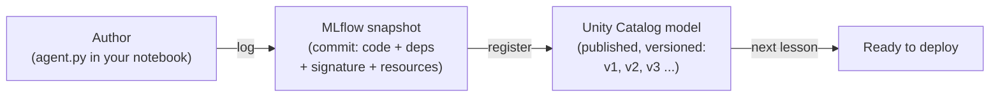
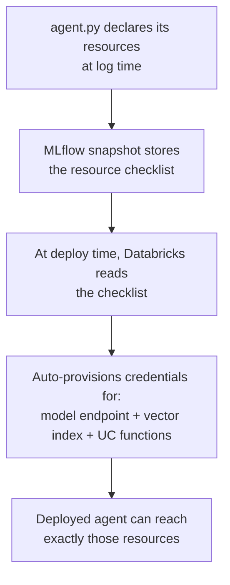
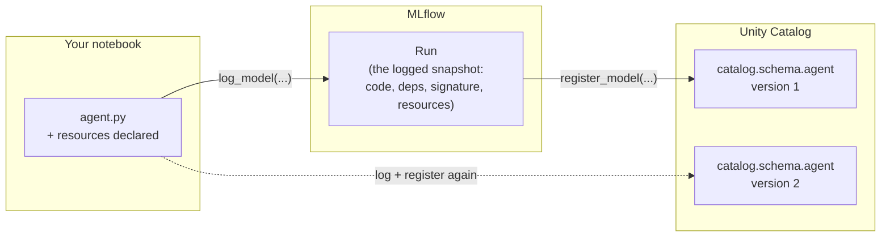

# Logging and Registering Agents

> Imagine you have written a really useful script. It runs perfectly on your laptop. Now a teammate asks for it, and you email them the file. But it breaks on their machine, because they have a different library version, and they never got the config file that sits next to it. Frustrating, right? Logging and registering an agent is how Databricks makes sure that never happens to your agent. It packs up everything the agent needs, stamps it with a version, and puts it somewhere everyone can find it by name.

Take a breath. This lesson is going to feel familiar, and that is on purpose.

You already do a version of this every day. When you finish a piece of work, you do not just leave it in a scratch file. You `git commit` it, so there is a permanent, reproducible snapshot. Then you push it somewhere shared, so other people and other systems can pull it down by name. Logging and registering an agent is exactly those two habits, applied to an AI agent instead of a code change.

If you can picture "commit, then publish," you already understand the shape of this whole lesson. Let us fill in the details gently.

## Learning Objectives

By the end of this lesson, you will be able to:

- Explain in plain words what it means to **log** an agent, and why it is like taking a versioned snapshot (a git commit) of your agent.
- Explain what it means to **register** an agent to Unity Catalog, and why it is like publishing that snapshot to a governed company catalog with a version label.
- Describe the four things logging captures: **code, dependencies, the input/output signature, and the resources** the agent depends on.
- Explain why declaring **resources** (a model endpoint, a vector search index, Unity Catalog function tools) is the step that lets the deployed agent get the right credentials later.
- Use MLflow "models from code" to log an agent and register it to a **three-level Unity Catalog name**, and read the version number you get back.

## Prerequisites

- [The Agent Development Lifecycle](/docs/building-agents/agent-dev-lifecycle) — the big-picture map of how an agent goes from idea to production. Logging and registering is the step that moves you from "it works in my notebook" to "it is a real, deployable artifact."
- [Authoring an Agent with ResponsesAgent](/docs/building-agents/authoring-agents) — you need an agent to package. This lesson assumes you have one written as a Python file.

You do **not** need to have deployed anything yet. Deployment is the next lesson. This lesson is the packaging step that comes right before it.

## Estimated Reading Time

About 15 minutes.

## Business Motivation

Let us be honest about why a company cares about this step.

You have built an agent. Maybe it is a customer-support assistant. It works beautifully in your notebook. Now the questions start coming:

- "Which exact version is running in production right now?"
- "Can we roll back to last week's version, the one before the change that broke things?"
- "Who is allowed to deploy this? Who approved it?"
- "When it calls the database, what credentials does it use, and who granted them?"

If your agent only lives as loose code in a notebook, you cannot answer any of those questions cleanly. There is no version number. There is no permanent record of exactly which libraries it used. There is no single governed place that says "this is the agent, here is who owns it."

Logging and registering fix all of that in two moves:

- **Logging** creates a reproducible snapshot. Anyone, or any system, can rebuild the exact agent later, byte for byte.
- **Registering** puts that snapshot in Unity Catalog, Databricks' governed catalog. Now the agent has a name, a version, an owner, permissions, and lineage.

This is the same discipline you already trust for data and code. You are just applying it to an agent.

:::note
Throughout this lesson we will use **Northwind Trust**, a fictional financial-services company. Their team has written a customer-support agent, and they want to get it ready to deploy safely. This lesson is the step that makes it deployable.
:::

## Intuition

Here is the whole idea in one picture, using tools you already know.

**Logging is `git commit`.** When you commit, git does not just save your file. It captures a complete, frozen snapshot: the code, and a record of the exact state, with a hash you can always come back to. Logging an agent does the same. It freezes the agent code, the list of libraries it needs, the shape of its inputs and outputs, and a list of the external things it talks to.

**Registering is `git push` to a shared, governed repo.** A commit on your laptop helps only you. Pushing it to a central place gives it an address other people and systems can reach by name, with permissions on who can do what. Registering the logged agent to Unity Catalog gives it a proper name and a version number in the company catalog.


*Figure 1: The path every agent takes. You author it, log it into MLflow (a snapshot), register that snapshot into Unity Catalog (a named, versioned model), and it is then ready to deploy.*

That flow, **author to log to register to ready-to-deploy**, is the backbone of this whole lesson. Keep it in your head and everything else is a detail.

## Theory

Let us define the two words carefully, because they do genuinely different jobs.

### Logging

When you **log** an agent, MLflow (the open-source experiment-and-model tracking tool built into Databricks) records a snapshot of it as an **MLflow model**. That snapshot captures four things:

1. **The code** — the actual logic of your agent.
2. **The dependencies** — the list of Python packages and versions it needs to run, so the environment can be rebuilt exactly.
3. **The signature** — the shape of the agent's inputs and outputs. Think of it as the schema, or the function type signature. It says "this agent takes messages like *this* and returns responses like *that*."
4. **The resources** — a list of the external Databricks things the agent depends on, such as the model endpoint it calls, a vector search index it queries, and any Unity Catalog functions it uses as tools.

The snapshot lands in an MLflow **run**, which is just a recorded experiment attempt. At this stage the agent is captured and reproducible, but it does not yet have a permanent, governed home.

### Registering

When you **register** the logged agent, you copy that snapshot into **Unity Catalog** as a **registered model**. Two things happen that matter a lot:

- It gets a **three-level name**: `catalog.schema.model_name`. That is the same naming pattern you already use for tables in Unity Catalog. Now your agent is addressable the same way your data is.
- It gets a **version number**. The first time you register, you get **version 1**. Register again under the same name and you get **version 2**, and so on. Old versions do not disappear, so rollback is always possible.

Along with the name and version, you inherit everything Unity Catalog gives your tables: permissions (who can read or deploy it), an owner, and lineage (a record of what it depends on and what depends on it).

## Deep Dive

### Why "models from code" is the recommended way

There are, historically, two ways to log a model. The older way pickles (serializes) a live Python object in memory. The newer, recommended way for agents is called **MLflow "models from code."**

Instead of freezing an object in memory, models-from-code captures **a Python file as the agent's code**, plus the list of packages it needs. At deploy time, Databricks re-runs that file to rebuild the agent fresh.

Why is this better for agents? A few plain reasons:

- **Agents are not simple objects.** They hold connections to model endpoints, tools, and retrievers. Trying to pickle all of that is fragile and often fails. Re-running a clean file is far more reliable.
- **It is readable.** The logged artifact is literally your code, which you can inspect, diff, and reason about, exactly like a git commit.
- **It matches how you already work.** You already keep logic in files under version control. This keeps that habit.

So the mental model is: your agent lives in a file like `agent.py`, and logging points MLflow at that file.

### Why declaring `resources` is the quietly important part

This is the part beginners skip and then get mysteriously stuck on at deploy time, so let us slow down here.

Your agent does not work alone. To answer a customer, the Northwind Trust support agent probably needs to:

- Call a **model serving endpoint** (the actual LLM that generates text).
- Query a **vector search index** (to look up relevant support articles).
- Call one or more **Unity Catalog functions** as tools (for example, a function that looks up an account balance).

Each of those is a governed resource that requires permission to use. When your agent runs later on a server, it is not "you" anymore, so it cannot borrow your personal credentials. It needs its own.

By **declaring these resources when you log the agent**, you hand Databricks a checklist: "this agent will need to talk to these specific things." At deploy time, Databricks reads that checklist and automatically provisions the right credentials so the deployed agent can reach exactly those resources, and nothing more.


*Figure 2: Declaring resources is a checklist you write at log time. Databricks reads it at deploy time and wires up the right credentials automatically. Forget to declare a resource, and the deployed agent will not be allowed to call it.*

:::note[Going deeper (optional)]
The mechanism here is often called **automatic authentication passthrough** (sometimes "on-behalf-of" authentication). At deploy time Databricks mints short-lived credentials scoped to exactly the resources you declared. This is why declaring resources is a security feature, not just bookkeeping: the deployed agent is granted the *least privilege* it needs. You do not have to understand the token mechanics to use it correctly. Just declare every external thing your agent touches.
:::

## Architecture

Here is where the pieces sit relative to each other. Notice that logging and registering touch two different systems: **MLflow** for the snapshot, and **Unity Catalog** for the governed, versioned model.


*Figure 3: Two systems, two jobs. MLflow holds the reproducible snapshot. Unity Catalog holds the named, versioned, governed model. Each time you log and register, a new version appears in the catalog while old ones stay put.*

## Internal Working

Let us narrate what actually happens, step by step, so it stops feeling like magic.

1. **You point MLflow at your agent file.** You call a log function and give it the path to `agent.py`. MLflow does not run the whole agent for real; it captures the file and its environment.
2. **MLflow builds the signature.** If your agent uses the `ResponsesAgent` interface, MLflow infers the input/output signature automatically. For other interfaces, you pass an `input_example` (a sample input), and MLflow reads its shape to generate the signature.
3. **MLflow records the dependencies.** It captures the list of packages so the environment can be rebuilt later.
4. **MLflow stores your resource checklist.** The `resources` you declared are saved alongside the snapshot.
5. **The snapshot lands in a run**, and you get back a small object that includes a **model URI** (the address of the logged snapshot, like `runs:/<run-id>/agent`).
6. **You register that URI to Unity Catalog.** You set the registry to Unity Catalog, then call register with the model URI and a three-level name. Unity Catalog copies the snapshot in and assigns a version number.
7. **You read the version back.** The registration returns the version (1, 2, 3, ...). That number is what you will point the deployment at in the next lesson.

## Step-by-Step Walkthrough

Here is the whole flow in words, before we look at code:

1. Write your agent in a file, for example `agent.py`. (You did this in the previous lesson.)
2. In a notebook, tell MLflow to use Unity Catalog as its model registry.
3. Declare the resources your agent uses: the model endpoint, the vector search index, any UC functions.
4. **Log** the agent with models-from-code, passing the file path, an input example, and the resources.
5. Grab the **model URI** from the object you get back.
6. **Register** that URI to a three-level Unity Catalog name.
7. Read the **version number** from the result. Done. Your agent is now a governed, versioned, deployable artifact.

## Hands-on Examples

Let us make it concrete with Northwind Trust's support agent. We will assume their agent lives in a file called `agent.py` and is written with `ResponsesAgent`.

We will build this up one small piece at a time, and narrate after every block. You do not need to memorize anything. Read for understanding.

## Code Examples

### Step 1: Point MLflow at Unity Catalog

```python
import mlflow

# Tell MLflow that "the registry" means Unity Catalog,
# not the older workspace-local registry.
mlflow.set_registry_uri("databricks-uc")
```

This one line matters. `"databricks-uc"` tells MLflow that when you register a model, it should go into **Unity Catalog** (the governed catalog you already use for tables), not the older workspace-only registry. Set this once, up front. If you forget it, your model would register to the wrong place and miss out on governance.

### Step 2: Declare the resources the agent depends on

```python
from mlflow.models.resources import (
    DatabricksServingEndpoint,
    DatabricksVectorSearchIndex,
    DatabricksFunction,
)

# The external Databricks things the Northwind Trust agent talks to.
resources = [
    # The LLM the agent calls to generate answers.
    DatabricksServingEndpoint(endpoint_name="databricks-meta-llama-3-3-70b-instruct"),
    # The vector search index of support articles it retrieves from.
    DatabricksVectorSearchIndex(index_name="northwind.support.kb_index"),
    # A Unity Catalog function tool that looks up an account balance.
    DatabricksFunction(function_name="northwind.support.get_account_balance"),
]
```

This is the checklist from Figure 2, written in code. We are telling Databricks: "This agent will call *this* model endpoint, query *this* vector index, and use *this* UC function as a tool." Notice the vector index and the function both use three-level Unity Catalog names, the same pattern you use for tables. Declaring these now is what lets the deployed agent get credentials for exactly these resources later, and nothing more.

### Step 3: Log the agent (the "commit")

```python
input_example = {
    "input": [{"role": "user", "content": "How do I reset my online banking password?"}]
}

with mlflow.start_run():
    logged_agent_info = mlflow.pyfunc.log_model(
        name="agent",                 # a short label for the artifact
        python_model="agent.py",      # models-from-code: point at the FILE
        input_example=input_example,  # MLflow uses this to build the signature
        resources=resources,          # the checklist from Step 2
        pip_requirements=[            # the dependencies, pinned
            "mlflow",
            "databricks-langchain",
            "databricks-agents",
        ],
    )
```

Let us narrate this, because it is the heart of the lesson.

- `mlflow.start_run()` opens an MLflow **run**, the container that will hold the snapshot.
- `python_model="agent.py"` is the **models-from-code** approach. We hand MLflow the *file*, not a live object. At deploy time Databricks will re-run this file to rebuild the agent cleanly.
- `input_example` gives MLflow a sample input. Because this agent uses `ResponsesAgent`, MLflow can largely infer the **signature** on its own, and the example makes it concrete and testable.
- `resources` attaches the checklist.
- `pip_requirements` pins the **dependencies** so the environment is reproducible.

When this finishes, `logged_agent_info` holds a handle to the snapshot, including its address.

:::note[Going deeper (optional)]
If your agent were built with LangChain rather than `ResponsesAgent`, you would use `mlflow.langchain.log_model(...)` with a `lc_model="agent.py"` argument instead of `mlflow.pyfunc.log_model(...)`. The idea is identical, only the flavor-specific function name changes. For `ResponsesAgent`-based agents, `pyfunc` is the common path and the signature is inferred for you.
:::

### Step 4: Read the model URI

```python
# The address of the logged snapshot, e.g. "runs:/<run-id>/agent"
print(logged_agent_info.model_uri)
```

The **model URI** is the address of the snapshot you just logged. Think of it as the commit hash you would hand to another command. We need it for the next step, registration.

### Step 5: Register the agent to Unity Catalog (the "publish")

```python
# The three-level name: catalog . schema . model
UC_MODEL_NAME = "northwind.support.support_agent"

registered = mlflow.register_model(
    model_uri=logged_agent_info.model_uri,
    name=UC_MODEL_NAME,
)

print(f"Registered {UC_MODEL_NAME} as version {registered.version}")
```

And there it is, the publish step.

- `model_uri` is the address from Step 4, telling Unity Catalog *which* snapshot to publish.
- `name` is the **three-level name**, `catalog.schema.model`. Same pattern as your tables.
- `registered.version` is the **version number** you get back. The first run prints `version 1`. Run this whole notebook again after a change, and you will get `version 2`, while version 1 stays safely in place for rollback.

Your agent is now a governed, versioned, addressable model. In the next lesson, you will deploy it by pointing at exactly this name and version.

## Production Considerations

- **Pin your dependencies.** Loose versions ("just install the latest") are the single most common cause of "it worked when I logged it, why is it different now?" Pin the versions you tested with in `pip_requirements`.
- **Log from a repeatable place.** Do not log from a messy scratch notebook. Log from code that lives in version control, so the snapshot maps to a known commit of your source.
- **Test the logged model before registering.** MLflow lets you load the logged model back and call it (`mlflow.pyfunc.load_model(...)`). Do a quick prediction on your `input_example` to confirm the snapshot actually runs before you publish it.
- **Use a consistent naming convention.** Pick a clear `catalog.schema.model` scheme (for example, `<domain>.<team>.<agent_name>`) and stick to it, exactly as you would for tables.

## Performance Considerations

Logging and registering are one-time packaging steps, not a hot path, so raw speed rarely matters. But a couple of things affect how long they take and how heavy the artifact is:

- **A large dependency list means slower environment rebuilds** at deploy time. Include only what the agent truly needs.
- **Big `input_example` payloads** add nothing useful. A small, representative example is best; it exists to define the signature, not to stress-test anything.
- **Signature inference is cheap** when you use `ResponsesAgent`, because MLflow knows the interface. Providing a clean `input_example` keeps it fast and unambiguous.

## Security Considerations

- **Declared resources = least privilege.** The deployed agent is granted credentials for exactly the resources you declared, and nothing else. Declaring resources carefully is a security control, not just plumbing.
- **Unity Catalog permissions apply to the model.** Treat deploy access like any other sensitive grant. Not everyone who can read the catalog should be able to deploy a new version.
- **Never bake secrets into the code.** Do not hard-code API keys or tokens in `agent.py`. Let the resource-declaration + credential-provisioning flow handle access, and use Databricks secrets for anything external.
- **Lineage is your audit trail.** Because the model is in Unity Catalog, you get lineage: what it depends on, and who did what. Lean on it during reviews.

## Common Mistakes

- **Forgetting `mlflow.set_registry_uri("databricks-uc")`.** Your model registers to the wrong place and misses governance. Set it first, always.
- **Not declaring a resource the agent uses.** The agent logs and registers fine, then fails *at runtime in production* with a permissions error, because it was never granted credentials for that endpoint, index, or function. If the agent touches it, declare it.
- **Pickling instead of using models-from-code.** Trying to log a live agent object is fragile. Point at the file (`python_model="agent.py"`).
- **Unpinned dependencies.** Leads to "works on my machine" surprises at deploy time.
- **Expecting registering to also deploy.** Registering publishes the artifact; it does not put it behind a live endpoint. Deployment is the next, separate step.
- **Reusing version numbers.** You cannot overwrite version 1. Every register creates a new version. Plan for that; it is a feature (rollback), not a bug.

## Best Practices

- **Log, then load and test, then register.** Confirm the snapshot runs before you publish it.
- **Declare every resource explicitly.** Endpoints, indexes, and UC functions. When in doubt, declare it.
- **Keep `agent.py` in version control**, and log from that known state.
- **Pin dependencies** to the versions you tested.
- **Adopt one clear three-level naming scheme** and reuse it across all agents.
- **Write down which version you registered.** You will pass that exact version to deployment next.

## Interview Questions

1. **What is the difference between logging an agent and registering it?** Logging captures a reproducible MLflow snapshot (code, dependencies, signature, resources), like a git commit. Registering publishes that snapshot to Unity Catalog as a named model with a version number, like pushing to a governed shared registry. Logging makes it reproducible; registering makes it governed, versioned, and addressable.

2. **What are the four things logging an agent captures?** The code, the dependencies (packages and versions), the input/output signature, and the resources the agent depends on (model endpoint, vector search index, Unity Catalog functions).

3. **Why is declaring `resources` important, and what breaks if you skip it?** Declaring resources tells Databricks which external assets the agent will call, so at deploy time it can auto-provision scoped credentials (least privilege). If you skip a resource, the deployed agent has no credential for it and fails at runtime with a permissions error, even though logging and registering succeeded.

4. **What is MLflow "models from code," and why is it recommended for agents?** It logs a Python file as the agent's code plus its environment, and re-runs the file at deploy time to rebuild the agent, rather than pickling a live object. It is recommended because agents hold connections and state that pickle poorly, and because the artifact stays readable and diffable.

5. **What do you get from registering to a three-level Unity Catalog name?** A `catalog.schema.model` address (same pattern as tables), a version number that increments on each register (enabling rollback), plus governance: permissions, an owner, and lineage.

## Quiz

**Question 1:** Logging an agent is most like which everyday developer action?

<details>
<summary>Show answer</summary>

A `git commit`: it takes a permanent, reproducible snapshot of the agent (its code, dependencies, signature, and resources) that you can always come back to.

</details>

**Question 2:** You logged and registered your agent successfully, but in production it fails with a permissions error when it tries to query the support-article index. What did you most likely forget?

<details>
<summary>Show answer</summary>

You most likely forgot to declare the vector search index in the `resources` list at log time. Because it was never declared, Databricks did not provision credentials for it, so the deployed agent cannot reach it.

</details>

**Question 3:** You register your agent for the very first time. What version number do you get, and what happens to it if you register again after a change?

<details>
<summary>Show answer</summary>

The first registration is **version 1**. Registering again under the same three-level name creates **version 2**, while version 1 stays in place. Old versions are never overwritten, which is what makes rollback possible.

</details>

**Question 4:** Why is MLflow "models from code" (`python_model="agent.py"`) preferred over pickling a live agent object?

<details>
<summary>Show answer</summary>

Agents hold connections to endpoints, tools, and retrievers that do not serialize (pickle) reliably. Models-from-code stores the Python file plus its environment and re-runs it at deploy time to rebuild the agent cleanly. It is also readable and diffable, like source code.

</details>

## Summary

You learned the packaging step that turns loose agent code into a real, deployable artifact. **Logging** takes a reproducible MLflow snapshot of your agent, capturing its code, dependencies, input/output signature, and the resources it depends on, just like a git commit. **Registering** publishes that snapshot to Unity Catalog as a model with a three-level name and a version number, giving it governance, versioning, and lineage, just like pushing to a governed registry. You saw why declaring `resources` is the quietly critical step: it is the checklist Databricks reads at deploy time to grant the agent exactly the credentials it needs. And you walked through the code end to end: set the registry, declare resources, log with models-from-code, read the model URI, and register to a three-level name.

## Key Takeaways

- **Log = commit.** A reproducible MLflow snapshot: code, dependencies, signature, resources.
- **Register = publish.** A named, versioned, governed model in Unity Catalog (`catalog.schema.model`).
- **Models-from-code** (point at `agent.py`) is the recommended way to log agents.
- **Declare every resource** the agent uses. It is how the deployed agent gets scoped credentials, and skipping it causes runtime permission failures.
- **Versions never overwrite.** Each register increments the version, enabling rollback.
- **This sets up one-line deployment**, which is the next lesson.

## Glossary

- **MLflow:** The open-source tracking and model-packaging tool built into Databricks. It records experiments and stores models.
- **Logging (a model):** Recording a reproducible snapshot of a model or agent into MLflow.
- **Registering (a model):** Publishing a logged snapshot into Unity Catalog as a named, versioned model.
- **Models from code:** An MLflow approach that logs a Python file (plus its environment) as the model, and re-runs it at deploy time.
- **Signature:** The declared shape (schema) of a model's inputs and outputs.
- **Resources:** The external Databricks assets an agent depends on (serving endpoints, vector search indexes, Unity Catalog functions), declared at log time.
- **Unity Catalog:** Databricks' governance layer for data and AI assets, using three-level `catalog.schema.object` names.
- **Three-level name:** The `catalog.schema.model` address pattern, the same one used for tables.
- **Model URI:** The address of a logged snapshot in MLflow, for example `runs:/<run-id>/agent`.
- **Model version:** The incrementing number (1, 2, 3, ...) assigned each time you register under the same name.

## Further Reading

- [Databricks: Log and register AI agents](https://docs.databricks.com/aws/en/generative-ai/agent-framework/log-agent)

## Next Lesson

You now have a governed, versioned artifact sitting in Unity Catalog. The next step is to put it behind a live endpoint so real apps can call it, and it turns out to be almost a single line.

➡️ [Deploying Agents](/docs/llmops/deploy-agents)
