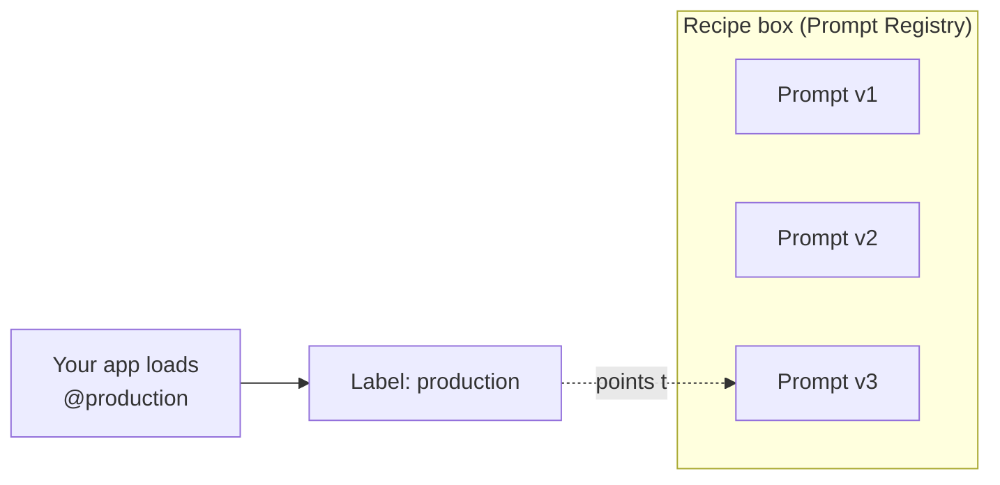
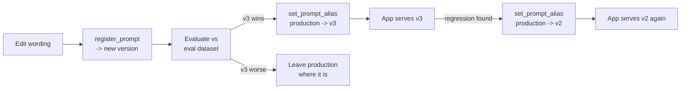
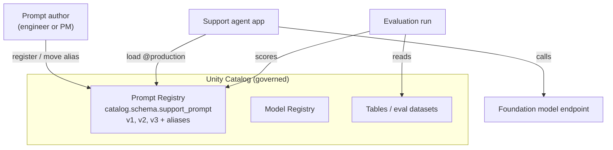

# Prompt Registry: Versioning Prompts

> You already put your code in Git. You review it, tag releases, and roll back when a change goes wrong. A prompt controls your AI's behavior just as much as code does - so it deserves the exact same treatment. This lesson gives your prompts version control.

Take a breath. If you have ever committed a change, tagged a release, and later rolled back to a known-good version, you already understand the heart of this lesson. A prompt registry is that same instinct, pointed at prompts instead of source files. You do not need to be an AI expert. You just need to like knowing exactly what changed, when, and how to undo it - and you clearly do, because you are reading this.

## Learning Objectives

By the end of this lesson, you will be able to:

- Explain, in plain terms, why a prompt is effectively code and deserves version control.
- Register a prompt as a versioned asset in Unity Catalog and read back its versions.
- Use an alias (like `production`) so your app loads "the production prompt" without hardcoding a version number.
- Load a prompt by name and alias inside an application.
- Move an alias to promote a new prompt version - and move it back to roll one back - with no code deploy.
- Describe how to evaluate prompt versions against an evaluation dataset.
- Explain what prompt auto-optimization does at a high level.

## Prerequisites

- You have read [Prompting Fundamentals](/docs/llm-foundations/prompting-fundamentals), so template variables and system prompts feel familiar.
- You have read [Building Evaluation Datasets](/docs/evaluation/evaluation-datasets), because we will reuse that idea to compare prompt versions.
- You are comfortable with Python strings, functions, and dictionaries.
- You have used Git before. That is the only mental model you truly need.

## Estimated Reading Time

About 22 minutes.

## Business Motivation

Here is the everyday problem. It is Friday afternoon. Someone at Northwind Trust edits the support agent's system prompt to fix one annoying answer. The change goes straight into the app code and ships. On Monday, three other answers are quietly worse, and nobody can say what the prompt used to be, who changed it, or how to get the old one back.

You have felt the code version of this pain. The fix was version control: every change is recorded, every release is labeled, and rolling back is one command.

Prompts deserve the same safety net, for three reasons:

- A prompt is a lever on behavior. A single sentence in a system prompt can change tone, accuracy, and safety for every user.
- Prompts change often. Product managers, support leads, and prompt engineers all want to tweak wording - far more often than they touch code.
- Right now, prompts are usually buried inside code. So changing a prompt means a code deploy, and there is no clean history of just the prompt.

The MLflow Prompt Registry fixes this. It stores prompts as versioned, governed assets in Unity Catalog. You register a prompt, it gets a version number, and you can review it, evaluate it, promote it, and roll it back - separately from your application code.

## Intuition

Two simple pictures will carry you through this whole lesson.

**Picture one: Git for your prompts.** Every time you save a new wording, you get a new version - v1, v2, v3 - with a commit message explaining why. Nothing is ever overwritten. You can always look back at exactly what v1 said.

**Picture two: labeled recipe cards.** Imagine a box of recipe cards for your support agent's system prompt. Each card is a version. You clip a sticky label that says `production` onto the card you are currently serving to customers. To change what customers get, you do not rewrite a card - you just move the label to a different card. To roll back, you move the label back. The cards never change; only the label moves.

That sticky label is called an **alias**, and it is the single most important idea in this lesson.



*Figure 1: Your app asks for "the production prompt." An alias is a movable label that decides which version that means today. Move the label, change the behavior - no code change.*

## Theory

Let us name the pieces cleanly.

- A **prompt** is a named, reusable text template. It can contain **template variables** - placeholders you fill in at runtime. In the MLflow Prompt Registry, variables use double braces, like `{{question}}`.
- A **prompt version** is one immutable snapshot of that template. Register a new wording and you get the next version number. Old versions never change.
- An **alias** is a movable, human-friendly name that points at one version - for example, `production` or `champion`. You move it whenever you want; the versions it points to stay frozen.
- The **registry** is where all of this lives. On Databricks, prompts are stored in **Unity Catalog**, so they are governed just like tables and models: named with a three-level path (`catalog.schema.prompt_name`), permissioned, and auditable.

The big payoff is **decoupling**. Your application code does not say "use version 7." It says "use whatever `production` points to." That one indirection is what lets a non-engineer promote a better prompt, and lets you roll back in seconds, without ever redeploying the app.

:::note[Going deeper (optional)]
This is the same pattern you may know from container image tags (`myapp:latest`) or from the MLflow Model Registry's model aliases. A fixed version is the immutable artifact; the alias is the pointer you move. If that clicks for you, you already understand aliases completely.
:::

## Deep Dive

Why not just keep prompts in a text file in your Git repo? You could, and that is better than nothing. But the registry gives you things a plain file cannot:

- **Governance in Unity Catalog.** Access control, lineage, and audit history come for free, alongside your data and models. You can answer "who changed the production support prompt, and when?"
- **Aliases decoupled from deploys.** With a file in Git, changing the prompt means a commit, a build, and a deploy. With an alias, you move a pointer. The app picks up the new version on its next load - no rebuild.
- **First-class evaluation.** Because each version is an addressable asset, you can run your evaluation dataset against v2 and v3 and compare scores before promoting.
- **Template variables as a contract.** A registered prompt declares its variables, so the app and the prompt agree on what gets filled in.
- **Auto-optimization.** MLflow can take a prompt plus examples and propose an improved version for you.

Here is the lifecycle we will build, and the star of the show - promoting and rolling back an alias:



*Figure 2: The full loop. New versions are evaluated before promotion. Promotion is just moving the `production` alias forward. Rollback is moving it back. The app code never changes.*

## Architecture

Where does the registry sit relative to your running agent? It sits beside your models and data, in Unity Catalog, and your app reads from it at runtime.



*Figure 3: The Prompt Registry lives inside Unity Catalog next to your tables and models. Authors write to it; the app reads from it; evaluation runs compare versions against a dataset.*

The key architectural idea: the prompt is no longer trapped inside the application binary. It is a shared, governed asset that the app fetches. Authorship and deployment of prompts become independent of your code release cycle.

## Internal Working

You do not need to know the internals to use the registry, but a light peek builds confidence.

- **Registering** a prompt writes an immutable version record: the template text, the declared variables, a commit message, and metadata (who, when). Version numbers increment automatically. Nothing overwrites an older version.
- **Aliases** are stored as a small mapping from a name (`production`) to a version number. Moving an alias just rewrites that one mapping. That is why promotion and rollback are instant and cheap.
- **Loading** by `name@alias` resolves the alias to a version, then returns that frozen template. Loading by `name/version` skips the alias and pins an exact version.
- **Template variables** are validated at format time: when you fill the template, MLflow checks that you supplied the variables the prompt declared.

:::note[Going deeper (optional)]
Because versions are immutable and aliases are mutable pointers, the registry gives you both reproducibility and flexibility at once. A trace logged in production can record "used support_prompt v2," so months later you can reproduce exactly what the model saw - even though `production` has since moved to v5. This ties directly into what you saw in Part 5 on tracing.
:::

## Step-by-Step Walkthrough

Here is the mental checklist for adopting the registry, before we touch code:

1. **Register** your current prompt as v1, with a clear commit message.
2. **Point** the `production` alias at v1.
3. **Load** the prompt in your app by `name@production` instead of hardcoding the text.
4. **Improve** the wording and register it as v2 (and later v3).
5. **Evaluate** the new version against your evaluation dataset from Part 6.
6. **Promote** by moving `production` to the winning version.
7. **Roll back**, if needed, by moving `production` back to the previous version.

Notice that steps 6 and 7 are the same operation - moving a label - in opposite directions. That symmetry is the whole point.

## Hands-on Examples

We will follow **Northwind Trust**, a fictional bank whose support agent answers customer questions about accounts and cards. Their system prompt currently lives inline in the app, and every wording tweak triggers a full deploy. We will move that prompt into the registry and make changes safe.

Throughout, the prompt name is the three-level Unity Catalog path `main.support.northwind_support`. Read that as `catalog.schema.prompt_name`.

## Code Examples

Let us build the whole flow, one small step at a time. Each block is followed by a plain-English explanation.

**Step 1: Register the current prompt as version 1.**

```python
import mlflow

initial_template = """You are Northwind Trust's support assistant.
Answer only using the provided context. Be concise and polite.
If you are unsure, say so and offer to connect a human agent.

Context: {{context}}
Customer question: {{question}}"""

pv = mlflow.genai.register_prompt(
    name="main.support.northwind_support",
    template=initial_template,
    commit_message="Initial support system prompt, migrated from app code.",
)

print(pv.name, "version", pv.version)  # -> main.support.northwind_support version 1
```

What just happened: you took the prompt that used to live inside the app and registered it as a governed asset. It got version number 1. The `{{context}}` and `{{question}}` parts are template variables - placeholders the app will fill at runtime. The commit message is your "why," just like a Git commit.

**Step 2: Point the `production` alias at version 1.**

```python
mlflow.genai.set_prompt_alias(
    name="main.support.northwind_support",
    alias="production",
    version=1,
)
```

What just happened: you clipped the `production` label onto version 1. From now on, "the production support prompt" means version 1 - until you decide to move the label.

**Step 3: Load the prompt by alias inside the app.**

```python
def build_messages(context: str, question: str):
    prompt = mlflow.genai.load_prompt(
        name_or_uri="prompts:/main.support.northwind_support@production"
    )
    system_text = prompt.format(context=context, question=question)
    return [{"role": "system", "content": system_text}]

messages = build_messages(
    context="Debit card replacements ship in 5 to 7 business days.",
    question="How long until my new card arrives?",
)
```

What just happened: this is the important one. Your app no longer contains the prompt text at all. It asks the registry for whatever `@production` points to, then fills in the template variables with `format(...)`. Change the production prompt later and this code does not change one character.

Notice the URI shape: `prompts:/NAME@ALIAS`. The `@production` part is the alias. If you wanted an exact version instead, you would write `prompts:/main.support.northwind_support/1`.

**Step 4: Register an improved version 2.**

```python
improved_template = """You are Northwind Trust's support assistant.
Answer only using the provided context. Be warm, concise, and polite.
Always give the specific timeframe or number from the context when one exists.
If you are unsure, say so clearly and offer to connect a human agent.

Context: {{context}}
Customer question: {{question}}"""

pv2 = mlflow.genai.register_prompt(
    name="main.support.northwind_support",
    template=improved_template,
    commit_message="Ask model to surface specific timeframes; warmer tone.",
)

print("Registered version", pv2.version)  # -> Registered version 2
```

What just happened: you improved the wording and registered it as version 2. Crucially, `production` is still pointing at version 1. Your customers are unaffected. Version 2 exists, but it is not live yet. This is the safety you were missing on that Friday afternoon.

**Step 5: Evaluate version 2 against your evaluation dataset.**

```python
# Reuse the evaluation dataset idea from Part 6:
# a list of {"question": ..., "expected_facts": [...]} rows.
eval_dataset = load_northwind_eval_dataset()  # your Part 6 dataset

def predict_with_version(version: int):
    def _fn(question: str, context: str = ""):
        prompt = mlflow.genai.load_prompt(
            name_or_uri=f"prompts:/main.support.northwind_support/{version}"
        )
        system_text = prompt.format(context=context, question=question)
        return call_support_model(system_text, question)  # your model call
    return _fn

results_v2 = mlflow.genai.evaluate(
    data=eval_dataset,
    predict_fn=predict_with_version(2),
    scorers=northwind_scorers(),  # e.g. correctness / groundedness judges
)
```

What just happened: you ran your regression suite for AI answers - the evaluation dataset from Part 6 - against version 2 specifically, by loading it with `/2` (an exact version, not the alias). You would run the same against version 1 and compare scores. Now promotion is a data-driven decision, not a Friday guess.

**Step 6: Promote version 2 to production.**

```python
mlflow.genai.set_prompt_alias(
    name="main.support.northwind_support",
    alias="production",
    version=2,
)
```

What just happened: version 2 won the evaluation, so you moved the `production` label to it. That is the entire deploy. The next time the app calls `load_prompt(... @production)`, it gets version 2. No rebuild, no code release, no downtime.

**Step 7: Roll back to version 1.**

```python
mlflow.genai.set_prompt_alias(
    name="main.support.northwind_support",
    alias="production",
    version=1,
)
```

What just happened: suppose a real customer interaction reveals a problem version 2 introduced. You move the `production` label back to version 1. You are instantly back to the known-good prompt. Version 2 is not deleted - it is still there to fix and re-promote later. This is the calm, one-line recovery that inline prompts never gave you.

:::note[Going deeper (optional): auto-optimizing prompts]
MLflow also offers **Prompt Optimization**: give it a prompt plus labeled examples (and a scorer), and it proposes an improved prompt version for you, then you evaluate and, if it wins, promote it like any other version. Think of it as a helpful editor that drafts a better recipe card - you still taste-test it against your evaluation dataset before moving the `production` label. It does not replace evaluation; it feeds it.
:::

## Production Considerations

- **One alias per meaning.** Common aliases are `production` and something like `staging` or `champion`/`challenger`. Keep the set small and their meanings obvious.
- **Aliases are per environment.** Your dev, staging, and prod catalogs each carry their own `production` alias, so you can test an alias move in staging before doing it in prod.
- **Log the version in your traces.** Record which prompt version served each request. When you debug a bad answer weeks later, you will know exactly what the model saw, even if the alias has since moved.
- **Cache thoughtfully.** Loading a prompt on every single request adds a lookup. Many apps cache the resolved prompt for a short time. Just make the cache short enough that an alias move takes effect quickly - that speed is the whole benefit.
- **Treat alias moves as deployments.** Moving `production` changes real behavior. Give it the same review, change record, and announcement you would give a code deploy - even though no code changed.

## Performance Considerations

- **Resolution is cheap, but not free.** Resolving `@production` to a version is a fast metadata lookup, not a model call. Still, do not do it inside a tight inner loop if you can load once and reuse.
- **Prefer alias for prod, version for reproducibility.** Load `@production` in live serving so you inherit alias moves. Load `/2` (a pinned version) in evaluation and batch jobs where you need the result to be exactly reproducible.
- **Warm the cache at startup.** Loading the production prompt once when your service starts avoids a first-request latency spike.

## Security Considerations

- **Prompts are governed assets.** Because they live in Unity Catalog, use its permissions: let a broad group read prompts, but restrict who can register new versions and, especially, who can move the `production` alias. Moving that alias changes what every user sees.
- **Audit alias moves.** Unity Catalog records who changed what and when. This matters for a regulated organization like Northwind Trust - you can prove exactly which prompt was live during any incident.
- **Never bake secrets into a prompt.** Template variables are for runtime content, not for API keys or credentials. Keep secrets in a secret scope, not in prompt text.
- **Review prompts like code.** A prompt is an instruction to a powerful model. Review new versions for prompt-injection resistance and safety wording before promoting, just as you would review a code change.

## Common Mistakes

- **Hardcoding a version in the app.** Loading `/7` in production defeats the point. Load `@production` so you can promote and roll back without touching code.
- **Editing "the prompt" in place mentally.** There is no editing - only new versions. Register a new version; do not think of it as overwriting the old one.
- **Promoting without evaluating.** Moving `production` to a fresh, untested version is the Friday-afternoon mistake in a new outfit. Evaluate first.
- **Forgetting the double braces.** The registry uses `{{variable}}`. A single brace or a Python f-string brace will not be treated as a template variable.
- **Deleting versions to "clean up."** Old versions are your rollback targets and your audit trail. Leave them.
- **No environment separation.** Testing alias moves directly in the production catalog removes your safety net. Practice in staging first.

## Best Practices

- **Migrate every inline prompt into the registry.** If a prompt shapes behavior, it belongs under version control.
- **Write real commit messages.** "Ask model to surface specific timeframes" tells future-you why v2 exists. "Update" does not.
- **Load by alias in serving, by version in tests.** Aliases for flexibility; pinned versions for reproducibility.
- **Gate promotion on evaluation.** Tie the `production` move to a passing evaluation run against your Part 6 dataset.
- **Keep a rollback runbook.** One line: "to roll back the support prompt, set alias `production` to the previous version." Make sure the on-call engineer knows it.
- **Restrict who can move `production`.** Fewer hands on the biggest lever.

## Interview Questions

1. **Why is a prompt considered "code," and what does that imply for how you manage it?** A prompt directly controls model behavior - tone, accuracy, safety - so a wording change is a behavior change. That implies it deserves version control, review, evaluation, rollback, and access control, exactly like source code.

2. **What is the difference between a prompt version and an alias, and why does that distinction matter?** A version is an immutable snapshot; an alias is a movable pointer to one version. The distinction gives you both reproducibility (versions never change) and flexibility (move the alias to change what is live) without redeploying code.

3. **How does the Prompt Registry let you change production behavior without a code deploy?** The app loads the prompt by `name@production`. Promotion is moving the `production` alias to a new version; the app picks it up on its next load. No rebuild or release is involved.

4. **How would you evaluate two prompt versions before deciding which to promote?** Load each by pinned version, run each against a fixed evaluation dataset with scorers (for example correctness and groundedness judges), and compare scores. Promote the winner by moving the alias. This ties directly to the Part 6 evaluation dataset.

5. **A newly promoted prompt is causing bad answers in production. Walk through your response.** Roll back immediately by moving the `production` alias to the previous known-good version - a one-line change, no deploy. The bad version stays in the registry. Then investigate using traces that recorded the version, fix the wording as a new version, re-evaluate, and re-promote.

## Quiz

**Question 1:** Your app should load the support prompt using which reference, and why?

<details>
<summary>Show answer</summary>

By alias - `prompts:/main.support.northwind_support@production`. Loading by alias means you can promote or roll back by moving the alias, with no change to application code. Pinning an exact version in production would force a code change every time the prompt changes.

</details>

**Question 2:** You improved a prompt and registered it as version 3. Are customers now getting version 3?

<details>
<summary>Show answer</summary>

No. Registering a new version does not change what is live. Customers keep getting whatever the `production` alias points to until you explicitly move the alias to version 3. That separation is exactly what makes new versions safe to create.

</details>

**Question 3:** How do you roll back a bad prompt, and what happens to the bad version?

<details>
<summary>Show answer</summary>

Move the `production` alias back to the previous known-good version with `set_prompt_alias`. It is a one-line, instant change and requires no code deploy. The bad version is not deleted - it stays in the registry so you can fix it and re-promote later, and so your audit history stays intact.

</details>

**Question 4:** What is prompt auto-optimization, in one sentence, and does it remove the need to evaluate?

<details>
<summary>Show answer</summary>

MLflow Prompt Optimization proposes an improved prompt version from your existing prompt plus labeled examples and a scorer. It does not remove the need to evaluate - you still run the proposed version against your evaluation dataset before moving the `production` alias to it.

</details>

## Key Takeaways

- A prompt is code: version it, review it, evaluate it, roll it back.
- Versions are immutable snapshots; aliases are movable labels pointing at a version.
- Your app loads `@production` and never hardcodes prompt text or version numbers.
- Promote by moving the alias forward; roll back by moving it back - no deploy either way.
- Evaluate new versions against a fixed dataset before promoting.
- Everything lives in Unity Catalog, so prompts are permissioned and auditable.

## Glossary

- **Prompt:** A named, reusable text template that instructs a model, often containing template variables.
- **Template variable:** A placeholder in a prompt, written `{{name}}`, filled in at runtime.
- **Prompt version:** An immutable snapshot of a prompt's template, numbered automatically on registration.
- **Alias:** A movable, human-friendly name (like `production`) that points to one prompt version.
- **Prompt Registry:** The MLflow component that stores versioned, governed prompts in Unity Catalog.
- **Promotion:** Moving an alias to a newer version to make it live.
- **Rollback:** Moving an alias back to an earlier version to undo a change.
- **Prompt optimization:** An MLflow feature that proposes improved prompt versions from examples and a scorer.

## Further Reading

- [Databricks docs: MLflow Prompt Registry](https://docs.databricks.com/aws/en/mlflow3/genai/prompt-version-mgmt/prompt-registry/)
- [Databricks docs: MLflow 3 for GenAI](https://docs.databricks.com/aws/en/mlflow3/genai/)

## Next Lesson

You can now version, promote, and roll back a single prompt safely. Next, we zoom out to the whole agent and automate these moves in a pipeline.

➡️ [CI/CD and Rollback for Agents](/docs/llmops/cicd-and-rollback)
