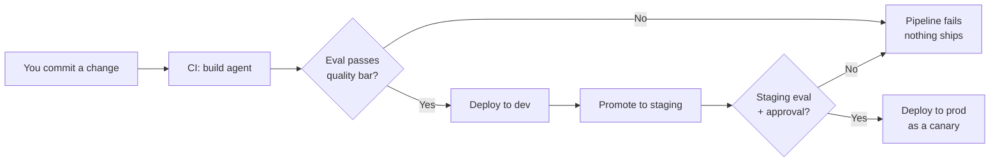
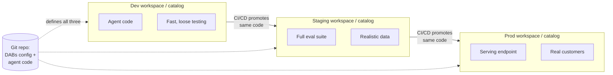

# CI/CD and Rollback for Agents

> You already know the golden rule of shipping pipelines: never push straight to prod, and always keep a way back. That exact discipline works for AI agents too. This lesson shows you how.

Think about the last time you shipped a data pipeline. You didn't edit the production job by hand at 5pm on a Friday. You committed your change, let it run through dev and staging, watched some checks go green, and only then let it touch real data. And if something looked wrong, you rolled back.

Good news: shipping an AI agent is the same story. Same instincts, same safety nets. You are not learning a brand-new discipline. You are pointing a discipline you already have at a new kind of thing. Let's do it together.

## Learning Objectives

By the end of this lesson, you will be able to:

- Explain why agents should be shipped like software, not hand-edited in production.
- Define an agent and its serving endpoint **as code** using Databricks Asset Bundles (DABs).
- Promote a change through **dev → staging → prod** with a CI/CD pipeline.
- **Gate** each promotion on an automated evaluation step so a quality regression never reaches users.
- Roll out a new version gradually with **traffic-splitting / canary** releases.
- **Roll back** instantly by routing traffic back to the last known-good version or moving a prompt alias back.

## Prerequisites

This lesson builds directly on three earlier ones. If any feels fuzzy, a quick reread will make everything here click:

- [Logging and Registering Agents](/docs/llmops/log-and-register) - because rollback depends on having **versioned** models to roll back *to*.
- [Deploying Agents](/docs/llmops/deploy-agents) - because we're going to promote and route traffic to those deployments.
- [Monitoring Quality in Production](/docs/evaluation/production-monitoring) - because a canary is only safe if you're watching the dashboard while it runs.

You'll also be more comfortable if you've seen offline evaluation from Part 6. We lean on it as the "quality gate" here.

## Estimated Reading Time

About 20-25 minutes, plus a little longer if you try the hands-on snippets.

## Business Motivation

Let's talk about why this matters, using a bank you'll meet throughout this lesson.

**Northwind Trust** runs a customer-support agent that answers questions about accounts, transfers, and card disputes. Thousands of customers talk to it every day. The team wants to ship a smarter version that handles disputes better.

Here's the fear. What if the new version is *worse* in some way nobody noticed? Maybe it gives a confidently wrong answer about a wire transfer. At a bank, that's not a typo. That's a complaint, a compliance question, and a very bad afternoon.

So Northwind wants three things, and they're exactly what a good data engineer wants for a pipeline:

1. **Repeatability.** Anyone on the team can reproduce a release. No secret clicks in a UI.
2. **A safety gate.** A bad change gets stopped *before* it reaches customers.
3. **A fast undo.** If something slips through, flipping back to the good version takes seconds, not a stressful hour.

CI/CD plus canary rollout plus rollback gives them all three. That's the whole lesson in one sentence.

## Intuition

Before any code, let's build the mental picture with three everyday analogies. Keep these in your head and the rest is just detail.

- **Promotion = moving a recipe up the kitchen.** You perfect a dish in the test kitchen (dev), cook it for a small tasting panel (staging), and only then add it to the real menu (prod). Same recipe, more trusted rooms.
- **Canary = let a few customers taste it first.** Instead of serving the new dish to everyone at once, you send it to 1 table out of 10. If they love it, you serve more tables. If a plate comes back, you've upset one table, not the whole restaurant.
- **Rollback = flip back to the last good version.** The old dish is still in the kitchen, ready to go. You don't have to re-cook it. You just start serving it again.

That's it. Promote carefully, taste-test with a few, and keep the old version warm.

## Theory

Now the slightly more formal version. Two ideas do the heavy lifting.

**Idea 1: Everything is code, checked into git.**

Instead of clicking buttons to create an agent, an endpoint, or a job, you *describe* them in configuration files. Those files live in your repository next to your agent code. A tool reads the files and makes reality match them. On Databricks, that tool is **Databricks Asset Bundles (DABs)**.

Why this matters: if your whole deployment is text in git, then a release is just "apply this text to this workspace," and a rollback is just "apply the previous text." Boring and reproducible, which is exactly what you want.

**Idea 2: Promotions are gated by an automated check.**

A **CI/CD pipeline** (for example, GitHub Actions) watches your repository. When you open a pull request or merge, it runs steps automatically: build, test, evaluate, deploy. The key step for us is **evaluation**. Before the pipeline is allowed to promote your agent to the next environment, it runs your offline eval suite from Part 6. If the score is below your quality bar, the pipeline **fails and stops**. The change never moves forward.

This is the same idea as a failing unit test blocking a merge. You already trust that pattern. We're just making "answer quality" one of the things that can fail the build.

:::note[Going deeper (optional)]
"Environments" can mean separate **workspaces** (a dev workspace, a staging workspace, a prod workspace) or separate **catalogs** in Unity Catalog within fewer workspaces (a `dev` catalog, a `staging` catalog, a `prod` catalog). DABs supports both through **targets** - named sets of settings you switch between. Beginners can just think "dev / staging / prod" and not worry about which physical shape it takes. The concept is identical.
:::

## Deep Dive

Let's connect this to things you already built in earlier lessons, because that's what makes safe rollout *possible*.

Rollback is only clean when three things are true, and you set all three up already:

1. **Versioned models (Part 8, Lesson 1).** Every time you register your agent in Unity Catalog, it gets a new version number: version 3, version 4, and so on. The old versions don't disappear. So "the last good version" is a real, callable thing.
2. **Versioned prompts (Part 8, Lesson 3).** Your prompts are versioned too, and you point at them through an **alias** (a friendly name like `production` that points at a specific version). Moving the alias back to the previous version is an instant prompt rollback, no redeploy needed.
3. **Monitoring (Part 6).** You can *see* whether the new version is doing well in production. Without this, a canary is just guessing.

Put them together and you get a powerful property: **you can undo a release without rebuilding anything.** The old model version is still registered. The old prompt version is still there. Rolling back is a routing decision, not a construction project.

Here's the flow, end to end.



*Diagram 1: A change only moves forward when the automated evaluation gate says yes. A red gate stops the release cold - just like a failing test blocks a merge.*

## Architecture

Let's zoom out and look at the environments themselves. This is the "recipe moving up the kitchen" picture, drawn for real.



*Diagram 2: One git repository defines all three environments. The **same** code and bundle config flow left to right - only the target settings (which workspace, which catalog, how much traffic) differ. Nothing is hand-built in prod.*

The important insight: the three environments are not three different codebases. They're one codebase applied with three different sets of settings. That's why a change that works in staging behaves the same way in prod.

## Internal Working

What actually happens when the pipeline runs? Let's narrate the machinery in plain terms.

1. **DABs reads your bundle.** It parses your `databricks.yml`, figures out which **target** you asked for (say, `staging`), and merges the base settings with that target's overrides.
2. **DABs computes the difference.** It compares "what you described" against "what exists in that workspace," and plans the changes - create this endpoint, update this job, register this model.
3. **DABs applies the plan.** It calls the Databricks APIs to make reality match your files. This is the `databricks bundle deploy` step.
4. **The CI runner orchestrates the order.** Your GitHub Actions workflow decides *when* to run eval, *when* to deploy, and *whether* to continue based on exit codes. A non-zero exit code from the eval step stops everything after it.
5. **Model Serving handles the traffic split.** Once a new model version is deployed to an endpoint, the endpoint config says what percentage of requests go to each served version. Changing those percentages is how you canary and how you roll back.

:::note[Going deeper (optional)]
A **served entity** on a Model Serving endpoint points at one specific model version. An endpoint can host several served entities at once, each with a **traffic percentage**. The percentages must add up to 100. When you "roll back," you're editing those percentages so the old served entity gets 100 again. No new model is built; you're just changing a routing table.
:::

## Step-by-Step Walkthrough

Here's the whole release of Northwind's new dispute-handling agent, start to finish, as a story you can follow.

1. **A data engineer edits the agent** and improves the dispute-handling prompt. They commit and open a pull request.
2. **CI runs on the PR.** It builds the agent and runs the offline eval suite from Part 6 against a fixed test set. The correctness score must be at least 0.85 to pass. It scores 0.88. Green.
3. **Merge to `main` triggers promotion to staging.** The bundle deploys to the staging catalog. A larger eval runs against more realistic data. Still green.
4. **A human approves the prod release.** (Optional, but banks like a human in the loop.)
5. **Prod deploys as a canary.** The new version (say, version 5) is added to the prod endpoint with **10%** of traffic. The old version (version 4) keeps **90%**.
6. **The team watches monitoring** (Part 6) for an hour. Latency, error rate, and a quality signal on real traffic.
7. **The quality signal dips.** The new version is giving vague answers on certain dispute types. Not a disaster, because only 10% of customers hit it - but not good enough to ramp.
8. **Rollback.** The team sets version 4 back to 100% and version 5 to 0%. Within seconds, every customer is back on the known-good version. Crisis averted, one afternoon saved.

Notice step 7 only affected 1 in 10 customers, and step 8 took seconds. That's the entire payoff of this lesson.

## Hands-on Examples

Want to feel it? Here's a tiny mental exercise before we look at code.

- You have prod endpoint `northwind-support-agent`. It serves model version 4 at 100%.
- You add version 5 at 10% and drop version 4 to 90%. That's your canary.
- Watch the dashboard. If good after an hour, go 50/50, then 100% to version 5.
- If bad at any point, set version 4 back to 100%. Done.

Every step is just "which percentages are on the endpoint right now." Hold that thought as we read the real configs.

## Code Examples

Let's look at four small, real-shaped pieces. Read each one, then read the plain-English explanation right under it. Nothing here needs to be memorized.

**1. A minimal Databricks Asset Bundle for the agent and its endpoint**

```yaml
# databricks.yml - describes the agent deployment as code
bundle:
  name: northwind-support-agent

# Named environments. Same code, different settings.
targets:
  dev:
    default: true
    workspace:
      host: https://dev.example.databricks.com
    variables:
      catalog: dev
      traffic_new: 100        # in dev, just run the new version
  staging:
    workspace:
      host: https://staging.example.databricks.com
    variables:
      catalog: staging
      traffic_new: 100
  prod:
    workspace:
      host: https://prod.example.databricks.com
    variables:
      catalog: prod
      traffic_new: 10         # start as a 10% canary in prod

variables:
  catalog:
    description: Unity Catalog to deploy into
  traffic_new:
    description: Percent of traffic to send to the new model version

resources:
  jobs:
    evaluate_agent:
      name: evaluate-${bundle.target}
      tasks:
        - task_key: run_eval
          notebook_task:
            notebook_path: ./eval/run_offline_eval.py
```

Reading this together: the `targets` block is the heart of it. `dev`, `staging`, and `prod` are the three "rooms" our recipe moves through. Each one sets its own `catalog` and its own `traffic_new` percentage. Notice prod starts at **10** - that's the canary baked right into config. The `resources` block declares a job that runs our evaluation notebook. Because this is all text in git, promoting to staging is one command with a different `--target`, and there's a written record of exactly what shipped.

**2. A CI step that runs evaluation and blocks on failure**

```yaml
# .github/workflows/deploy.yml - the promotion pipeline
jobs:
  eval-and-deploy:
    runs-on: ubuntu-latest
    steps:
      - uses: actions/checkout@v4

      - name: Install Databricks CLI
        run: curl -fsSL https://raw.githubusercontent.com/databricks/setup-cli/main/install.sh | sh

      - name: Deploy bundle to staging
        run: databricks bundle deploy --target staging

      # This is the quality gate. If eval fails, the job stops here.
      - name: Run offline evaluation (quality gate)
        run: |
          databricks bundle run evaluate_agent --target staging
          # The notebook exits non-zero if the score is below the bar.
          # A non-zero exit code fails this step, so no promotion happens.

      - name: Promote to prod (only reached if eval passed)
        run: databricks bundle deploy --target prod
```

Here's the story of this file. GitHub checks out your code, installs the Databricks CLI, and deploys the bundle to staging. Then comes the gate: it runs the evaluation job. Your eval notebook is written to **exit with an error code** if the quality score is below your bar. Because each step only runs if the previous one succeeded, a failing eval means the "Promote to prod" step **never runs**. That's the whole safety net.

**3. A traffic-split (canary) config on the serving endpoint**

```json
{
  "served_entities": [
    {
      "name": "agent-v4",
      "entity_name": "prod.northwind.support_agent",
      "entity_version": "4"
    },
    {
      "name": "agent-v5",
      "entity_name": "prod.northwind.support_agent",
      "entity_version": "5"
    }
  ],
  "traffic_config": {
    "routes": [
      { "served_model_name": "agent-v4", "traffic_percentage": 90 },
      { "served_model_name": "agent-v5", "traffic_percentage": 10 }
    ]
  }
}
```

Let's decode this. The endpoint now hosts **two** versions of the agent at the same time: the trusted version 4 and the new version 5. The `traffic_config` is the routing table - it says 90% of customers get version 4 and 10% get version 5. That 10% is your canary: a few customers taste the new dish first. To ramp up, you'd change these numbers to 50/50, then 0/100. The percentages always add up to 100.

**4. A rollback action**

```json
{
  "traffic_config": {
    "routes": [
      { "served_model_name": "agent-v4", "traffic_percentage": 100 },
      { "served_model_name": "agent-v5", "traffic_percentage": 0 }
    ]
  }
}
```

And here's the undo button. To roll back, you send this new `traffic_config` to the endpoint. Version 4 goes back to 100%, version 5 drops to 0%. Every customer is instantly back on the known-good version. You did not rebuild or redeploy anything - version 4 was still there the whole time. This is why versioning (from Lesson 1) is the quiet hero of the whole story.

:::note[Going deeper (optional)]
If the *only* thing that changed was the prompt, you don't even need a new model version. Because prompts are versioned with **aliases** (Part 8, Lesson 3), rolling back can be as simple as moving the `production` alias from prompt version 5 back to version 4. Same idea - point the friendly name at the last good thing - applied at the prompt layer instead of the model layer.
:::

## Production Considerations

A few things that matter once real customers are involved:

- **Fallbacks.** Configure what happens if the new version errors or times out. A common pattern is to route failed requests to the stable version so a customer never sees a hard failure.
- **Ramp on a schedule, not a whim.** Decide in advance: 10% for one hour, then 50% for one hour, then 100%. Write it down so nobody has to make a judgment call under pressure.
- **Define "bad" before you start.** Pick the exact metric and threshold that triggers a rollback (for example, "correctness signal drops below 0.80" or "error rate above 2%"). Automating the trip-wire beats eyeballing a chart.
- **Keep the old version registered.** Don't delete version 4 the moment version 5 goes to 100%. Keep it around for a while so rollback stays instant.

## Performance Considerations

- **Two versions cost more compute.** During a canary, the endpoint may keep both versions warm. That's a temporary cost, not a permanent one - it ends when you finish the ramp.
- **Watch tail latency on the new version.** A smarter agent that's slower can pass a quality gate but still frustrate users. Include latency in what you monitor during the canary.
- **Cold starts.** A version that hasn't served traffic in a while may be slow on its first requests. Send a trickle of traffic (even 1-5%) to keep a canary responsive before you ramp.

## Security Considerations

- **Least-privilege for the CI runner.** The pipeline's service principal should only be able to touch the environments it deploys. The staging deploy shouldn't hold prod credentials it doesn't need.
- **Secrets stay in secret stores.** Never put tokens or keys in `databricks.yml` or the workflow file. Reference them from a secret manager.
- **Approvals and audit trails.** For regulated settings like a bank, require a human approval for prod promotion and keep the git history as your audit log of who shipped what, when.
- **Unity Catalog governance carries over.** Because models and prompts live in Unity Catalog, the same access controls and lineage you already use for data apply to your agent versions.

## Common Mistakes

- **Editing prod by hand.** The classic "quick fix" in the UI. Now prod doesn't match git, and your next deploy silently overwrites the fix. Always change the config, not the running thing.
- **Skipping the eval gate "just this once."** That's the release that breaks. The gate is most valuable exactly when you're in a hurry.
- **Canarying to 100% too fast.** Jumping from 10% to 100% in five minutes defeats the purpose. Give monitoring time to catch a slow-burn problem.
- **Deleting the old version immediately.** Now rollback means rebuilding, and your "instant undo" is gone.
- **No defined rollback trigger.** If nobody agreed on what "bad" means, everyone hesitates during an incident. Decide the threshold in calm times.

## Best Practices

- **Ship agents like software.** Code in git, promoted by CI/CD, never touched by hand in prod.
- **Make evaluation a required check**, exactly like a unit test that must pass to merge.
- **Always canary in prod.** Start small (5-10%), watch, then ramp on a written schedule.
- **Keep the last known-good version warm and registered** so rollback is a routing change, not a rebuild.
- **Version everything** - models and prompts - so "the last good version" always exists and is one command away.
- **Automate the rollback trigger** where you can, so the system protects customers even when you're asleep.

## Interview Questions

1. **Why should an AI agent be deployed with CI/CD instead of clicking through the serving UI?** *(Look for: reproducibility, an audit trail, an automated quality gate, and easy rollback because everything is code in git.)*
2. **What is a canary release, and how would you implement one on Databricks Model Serving?** *(Look for: send a small traffic percentage to the new model version via `traffic_config`, watch monitoring, then ramp; the old version keeps the rest of the traffic.)*
3. **Walk me through rolling back an agent that started misbehaving after a release.** *(Look for: set the previous version's traffic back to 100% and the new one to 0%; note that the old version must still be registered; mention prompt-alias rollback as an alternative when only the prompt changed.)*
4. **How do you stop a quality regression from ever reaching production?** *(Look for: an automated offline evaluation step in CI that exits non-zero below a quality bar, blocking promotion; gating at both staging and prod.)*
5. **What has to be true for rollback to be fast and clean?** *(Look for: versioned models, versioned prompts with aliases, retained old versions, and monitoring to know when to trigger it.)*

## Quiz

**Q1: In a Databricks Asset Bundle, what is a "target"?**

<details>
<summary>Show answer</summary>

A named set of settings for one environment - like `dev`, `staging`, or `prod`. The same code and bundle deploy to each target with different overrides (which workspace, which catalog, how much traffic). You pick one with `--target` when you deploy.

</details>

**Q2: During a 10% canary, a customer's request can be served by which model version(s)?**

<details>
<summary>Show answer</summary>

Either the new version or the old one. With a 90/10 split, roughly 90% of requests hit the old (stable) version and about 10% hit the new one. That's the point - only a small slice of customers is exposed to the new version while you watch monitoring.

</details>

**Q3: You need to roll back after a bad release. Do you have to rebuild and redeploy the old agent?**

<details>
<summary>Show answer</summary>

No. As long as the old version is still registered and served on the endpoint, rollback is just a routing change: set the old version's `traffic_percentage` back to 100 and the new one to 0. Nothing is rebuilt. If only the prompt changed, you can instead move the prompt alias back to the previous version.

</details>

**Q4: Why does the CI evaluation step "block" a promotion, and how does that work mechanically?**

<details>
<summary>Show answer</summary>

Because the eval notebook exits with a non-zero (error) code when the quality score is below your bar. In a CI pipeline, a failing step stops the steps that come after it, so the "promote to prod" step never runs. It's the same mechanism as a failing unit test blocking a merge.

</details>

## Key Takeaways

- Ship agents like software: code in git, promoted by CI/CD, never hand-edited in prod.
- Gate every promotion on automated evaluation; a failing eval blocks the release.
- Canary first - send a small percentage of traffic to the new version, then ramp on a schedule.
- Rollback is a routing change, not a rebuild, because old versions stay registered.
- Versioning (models and prompts) plus monitoring is the foundation that makes safe rollout and instant rollback work.

## Glossary

- **CI/CD** - Continuous Integration / Continuous Delivery. Automated pipelines (for example, GitHub Actions) that build, test, and deploy your code when it changes.
- **Databricks Asset Bundles (DABs)** - a way to define Databricks resources (agents, jobs, endpoints) as code and deploy them across environments.
- **Target** - a named environment configuration in a bundle, such as `dev`, `staging`, or `prod`.
- **Quality gate** - an automated check (here, an evaluation step) that must pass before a release can move forward.
- **Canary release** - rolling out a new version to a small percentage of traffic first, then ramping up.
- **Traffic split** - the routing table on a serving endpoint that decides what percentage of requests each model version receives.
- **Fallback** - a configured backup path (for example, the stable version) used when the new version errors or times out.
- **Rollback** - returning to a previous known-good version, done by re-routing traffic or moving a prompt alias back.
- **Served entity** - a specific model version hosted on a serving endpoint, each with its own traffic percentage.
- **Alias** - a friendly, movable name (like `production`) that points at a specific model or prompt version.

## Further Reading

- Databricks Asset Bundles: https://docs.databricks.com/aws/en/dev-tools/bundles/
- Model Serving endpoints: https://docs.databricks.com/aws/en/machine-learning/model-serving/
- Manage traffic to serving endpoints: https://docs.databricks.com/aws/en/machine-learning/model-serving/manage-serving-endpoints
- CI/CD on Databricks: https://docs.databricks.com/aws/en/dev-tools/ci-cd/

## Next Lesson

You've now shipped, watched, and rolled back an agent like a pro. Time to put the whole picture together and get ready to talk about it.

➡️ [Part 8 · Interview Prep](/docs/llmops/interview-prep)
