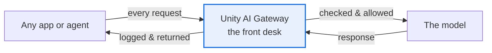
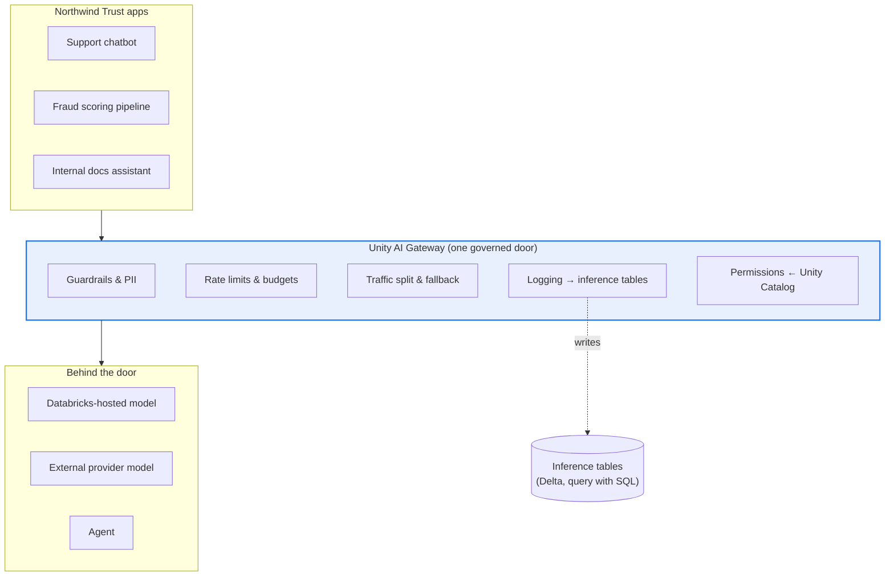
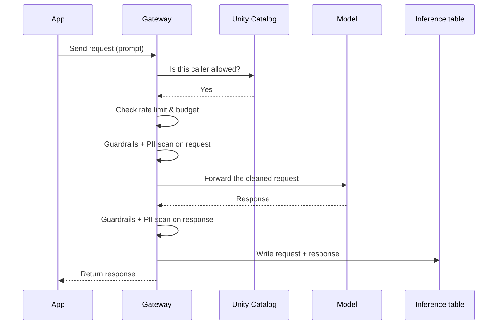

# The Unity AI Gateway

> Picture the lobby of a large office building. There's one front desk near the entrance. Every visitor signs in there, shows ID, gets a badge, and only then walks to whatever floor they need. Nobody sneaks in a side door. Because everyone passes one desk, security can enforce the rules once, at the door, instead of trusting every single room upstairs to lock itself. The Unity AI Gateway is that front desk for AI: one checkpoint every request goes through before it reaches any model.

Take a breath. This lesson is an overview, not a deep technical slog, and it's built on an instinct you already trust every day.

You already govern your data in one place. Nobody at your company reads raw files by hand and hopes for the best. Data access goes through **Unity Catalog**, where permissions, lineage, and audit live in one governed layer. You enforce the rules once, centrally, instead of scattering them across a hundred scripts.

The Unity AI Gateway is that exact same instinct, pointed at AI traffic. It's the one governed door in front of your models. If you understand "all data access goes through Unity Catalog," you already understand the shape of this. Let's fill in the details gently.

## Learning Objectives

By the end of this lesson, you will be able to:

- Explain, in plain terms, what the **Unity AI Gateway** is and why it's the "single front door" for all AI traffic.
- Name the things the Gateway **centralizes**: guardrails and safety, PII handling, rate limits, budgets, traffic splitting and fallbacks, request and response logging, and permissions via Unity Catalog.
- Describe why a **single choke point** is a win for security, cost, and audit.
- Map the Gateway onto ideas you already know as a data engineer: an API gateway, a policy engine, and an audit log, all for AI.
- Recognize that later lessons go deeper on guardrails, auth, and cost, and know where this overview fits.

## Prerequisites

- [The Databricks AI Platform Map](/docs/orientation/databricks-ai-platform-map) — the big picture of where all the pieces live. The Gateway sits right in front of the serving layer on that map.
- [Mosaic AI Model Serving](/docs/serving/model-serving) — the "front counter" that hosts your models. The Gateway is the security desk standing in front of that counter.

You do **not** need to have configured anything. This lesson explains *why* the Gateway exists and *what* it controls. The hands-on details come later.

## Estimated Reading Time

About 15 minutes.

## Business Motivation

Let's be honest about why a company cares about this.

Imagine Northwind Trust, a fictional financial services company. Over one busy year, different teams shipped AI into production. The support team built a chatbot. The fraud team wired a model into their scoring pipeline. A data scientist stood up an internal "ask the docs" assistant. Each team did its own thing, in its own app.

Now the Chief Risk Officer walks in with four very reasonable questions:

- **"Are we sure none of these leak customer account numbers?"** (safety and PII)
- **"What did we spend on AI last month, and which team?"** (cost)
- **"If a regulator asks, can we show every question a customer asked and every answer we gave?"** (audit)
- **"If one model provider goes down, does everything break?"** (reliability)

If each of the three apps handles its own safety, its own logging, its own spend limits, then the honest answer to every question is "we'd have to go ask each team, and hope they built it right." That's the nightmare. You're trusting every room in the building to lock its own door.

The Unity AI Gateway makes the answer simple: **all AI traffic goes through one governed door, so you set the rules once and they apply everywhere.** One place to enforce safety. One place to see spend. One place that logs everything. One place to add a backup model. That's the whole pitch.

:::note
Throughout this lesson we'll follow **Northwind Trust** as they put all of their AI behind one governed gateway.
:::

## Intuition

Here's the whole idea in one picture: **a security checkpoint at the building entrance.**

You can trust every office upstairs to lock its own door, check its own visitors, and keep its own logbook — some do it well, some forget, and one careless room puts the whole building at risk. Or you put **one desk at the entrance:** everyone signs in there, the rules live in one spot, you can see the whole logbook, and you can change a policy once and have it cover everyone instantly.

The Gateway is the second way. Every request to any model goes through it first. Before a request reaches a model, the Gateway can check it for unsafe content, strip out sensitive data, confirm the caller is allowed and hasn't blown past their limits, and write the whole exchange to a log. Only then does the request continue to the model.



*Figure 1: Nothing reaches a model directly. Every request and every response passes back through the one desk.*

## Theory

Let's put a few plain-language names to the idea.

The Gateway is a **control plane**. That's a fancy term for "the layer that decides and enforces, sitting in front of the layer that does the work." Model Serving is the layer that *does the work* (it hosts and runs models). The Gateway is the layer that *sets and enforces the rules* about who may use those models and how.

Here is what the Gateway centralizes. Read this as a checklist of "things you no longer have to build into every app":

- **Guardrails and safety** — content filters that block unsafe or off-topic requests and responses.
- **PII handling** — detecting and masking personal data (account numbers, emails) so it doesn't leak into a model or a log.
- **Rate limits** — a ceiling on how many requests a user or app can send, so nobody accidentally (or maliciously) floods a model.
- **Budgets and spend caps** — limits on how much money can be spent, per user or overall, so a runaway loop doesn't produce a shocking bill.
- **Traffic splitting and fallbacks** — sending some requests to model A and some to model B, and automatically failing over to a backup if one goes down.
- **Request and response logging** — writing every call and its answer to **inference tables** (governed Delta tables) for audit and cost tracking.
- **Permissions via Unity Catalog** — who is even allowed to call this model, governed by the same catalog you already use for data.

The single most important word in that list is **once**. You configure each of these one time, at the Gateway, and it applies to every app behind it.

## Deep Dive

Let's connect this to instincts you already have as a data engineer, because you've built the non-AI version of all three of these before.

**The Gateway is an API gateway.** You've probably sat behind one. A traditional API gateway is the single entry point in front of a fleet of microservices. It handles authentication, rate limiting, and routing so each service doesn't have to. The Gateway does exactly this for model endpoints: one entry point, auth and limits handled centrally, routing to the right model behind it.

**The Gateway is a policy engine.** Think of a firewall or a row-level-security rule. You write the policy once in a central place, and it's enforced on every request automatically, not re-implemented in each application. The Gateway's guardrails and PII rules work the same way.

**The Gateway is an audit log.** You already land access logs in a table so you can answer "who touched what, when." The Gateway does this for AI: every prompt and every response can be written to an inference table, which is just a Delta table you can query with SQL like any other.

So the Gateway isn't a new, alien concept. It's three tools you already trust (a gateway, a policy engine, an audit log) fused into one layer and pointed at model traffic.

:::note[Going deeper (optional)]
The Gateway governs **all three kinds of things you can put behind a serving endpoint**: Databricks-hosted models (like Foundation Model APIs), external models (a third-party provider you've connected), and agents. That's important. It means even a model running in someone else's cloud is still governed by *your* policies, because your app talks to it through your Gateway, not directly. The choke point holds no matter where the model physically lives.
:::

## Architecture

Here is the layered picture. The key thing to notice is that the Gateway sits *between* your apps and every model, so there's no way around it.



*Figure 2: All model traffic funnels through the Gateway (guardrails, rate limits, budgets, logging) before reaching any model. The policies live in the door; the models live behind it.*

Notice that all three very different apps share the same door and the same rules. Northwind sets a PII policy once, and all three apps are covered. That's the payoff of the single choke point.

## Internal Working

What actually happens, step by step, when a request arrives? Think of it as the front-desk routine.



*Figure 3: The Gateway's routine on a single request. Permission, limits, safety, forward, safety again, log, return.*

Walking through it in plain words:

1. An app sends a request. It goes to the Gateway, not straight to the model.
2. The Gateway asks Unity Catalog whether this caller is even allowed to use this model.
3. It checks the caller hasn't blown past their rate limit or budget.
4. It scans the request for unsafe content and sensitive data (PII) before the model ever sees it.
5. Only now does it forward the (cleaned) request to the model.
6. The model answers. The Gateway scans the *response* too, because models can generate unsafe content, not just receive it.
7. It writes the whole exchange to an inference table for audit and cost tracking.
8. It returns the answer to the app.

If any check fails, the Gateway can stop the request right there, and the model never sees it. That's the enforcement part of "policy engine."

## Step-by-Step Walkthrough

Let's make it concrete with Northwind Trust. Here's how they'd think about adopting the Gateway, in order.

1. **Put serving in place first.** Their models already live on Mosaic AI Model Serving endpoints. Good, that's the counter. The Gateway is the desk in front of it.
2. **Turn on logging first.** Before enforcing anything, they enable request and response logging. Now they can *see* what's happening, which model, how often, how much text. You can't govern what you can't see.
3. **Add rate limits.** They cap requests per user so a buggy retry loop in the chatbot can't hammer a model thousands of times a minute.
4. **Add budgets.** They set a monthly spend cap so an experiment can't quietly run up a five-figure bill over a weekend.
5. **Add guardrails and PII handling.** They switch on safety filters and PII masking so account numbers never reach an external provider or land in a log in the clear.
6. **Add a fallback.** They configure a backup model so that if the primary provider has an outage, traffic quietly fails over instead of erroring out.

Notice the order: **see first, then limit, then protect, then harden.** You don't have to do it all on day one.

## Hands-on Examples

You won't run much code in *this* lesson, and that's intentional. Most of the Gateway is configuration you set in the Databricks UI or a config block, not application logic you write. When Northwind's chatbot calls a model, the chatbot code doesn't change at all; the governance is applied by the door the request passes through. The snippets below show the *shape* of enabling a couple of these features. Treat them as illustrative; the exact fields evolve, so always confirm against the current docs.

## Code Examples

Let's look at two small, conceptual examples of *configuring the door*.

**Example 1: Enabling a rate limit on an endpoint's Gateway (conceptual).**

```json
{
  "rate_limits": [
    {
      "calls": 100,
      "renewal_period": "minute",
      "key": "user"
    }
  ]
}
```

This config says: allow each **user** up to **100 calls per minute**. Read it left to right. `calls` is the ceiling, `renewal_period` is how often the counter resets, and `key` is *who* the limit applies to (here, per user; it could also be per endpoint). If a user exceeds it, the Gateway rejects the extra calls instead of forwarding them. Northwind uses this so one misbehaving app can't starve everyone else.

**Example 2: Enabling usage logging to an inference table (conceptual).**

```json
{
  "usage_tracking_config": {
    "enabled": true
  },
  "inference_table_config": {
    "enabled": true,
    "catalog_name": "northwind",
    "schema_name": "ai_governance"
  }
}
```

This turns on two things. `usage_tracking_config` records who called and how much, for cost tracking. `inference_table_config` writes the actual requests and responses into a governed Delta table, here in the `northwind.ai_governance` schema. Once this is on, Northwind's audit team can answer the regulator's question with plain SQL:

```sql
SELECT request_time, requester, request, response
FROM northwind.ai_governance.chatbot_payload
WHERE request_time >= current_date() - INTERVAL 30 DAYS
ORDER BY request_time DESC;
```

That's the beautiful part for a data engineer: the AI audit log is **just a table**. You already know how to query, join, and dashboard a Delta table, so you already know how to audit AI. No new skill required.

## Production Considerations

A few things to keep in mind once real traffic is flowing.

- **Turn on logging from day one.** It's far easier to have the history and not need it than to wish you'd been logging when an incident hits.
- **Storage grows.** Inference tables capture every prompt and response, so they can get large. Plan retention, just like any other high-volume Delta table.
- **The Gateway is shared infrastructure.** Because everything funnels through it, treat its configuration as production infrastructure: review changes, don't let people casually flip policies off.
- **Start permissive on limits, then tighten.** Set generous rate limits first so you don't accidentally throttle legitimate traffic, then lower them once you know normal usage.

## Performance Considerations

A natural worry: "If every request passes through one desk, doesn't that slow things down, or become a single point of failure?"

Fair question. Two honest points:

- The Gateway's checks (permissions, limits, safety scans) do add a small amount of processing to each request. In practice this is minor compared to the time the model itself takes to generate an answer. Guardrails that call *another* model to scan content add more, so enable the ones you actually need.
- Databricks runs the Gateway as managed, scaled infrastructure, so it isn't a fragile single machine. But it *is* a single logical path, which is exactly why **fallbacks** exist: they keep you serving even when a backend model is down.

The trade is the same one you make with Unity Catalog for data: a tiny bit of overhead in exchange for governance you'd otherwise have to build, badly, ten times over.

## Security Considerations

This is where the Gateway earns its keep.

- **No side doors.** The security value comes from the fact that apps go *through* the Gateway. If a team can call a model directly, bypassing it, your policies don't apply. Governance depends on the choke point actually being the only point.
- **PII never leaves in the clear.** With PII handling on, sensitive data is masked before it reaches a model, which matters enormously when the model is an external provider running in someone else's cloud.
- **Least privilege via Unity Catalog.** The same catalog permissions you use for tables gate who can call which model. Grant access deliberately.
- **Logs are sensitive too.** Inference tables contain real prompts and responses, so secure them like any table holding customer data. The audit log is an asset *and* a liability if it leaks.

## Common Mistakes

Gentle warnings, so you can sidestep them:

- **Letting apps bypass the Gateway.** The most common failure. If some code calls a model directly, all your careful policies simply don't apply to it. Close the side doors.
- **Enforcing before observing.** Slapping on tight rate limits or aggressive guardrails before you've watched real traffic, then wondering why legitimate users are blocked. See first, limit later.
- **Forgetting the response side.** Assuming safety only means scanning what users *send*. Models can generate unsafe content too. Scan both directions.
- **Ignoring log growth.** Turning on payload logging and never thinking about retention, until the table is enormous and expensive.
- **Treating it as app code.** Trying to re-implement rate limits or safety inside each application. That's the exact duplication the Gateway exists to eliminate.

## Best Practices

- **One door, no exceptions.** Route every model call through the Gateway. Make direct access the thing that requires justification, not the default.
- **Observe, then govern.** Turn on logging first, learn your traffic, then apply limits and guardrails with real numbers behind them.
- **Configure once, centrally.** Set policy at the Gateway, not in a dozen apps. That's the whole reason it exists.
- **Reuse your data instincts.** Govern model access with Unity Catalog exactly as you govern tables, and audit AI by querying inference tables exactly as you query any Delta table.
- **Add fallbacks for anything customer-facing.** Reliability is cheap insurance once the door is already in place.

## Interview Questions

1. **What is the Unity AI Gateway, and why would a company route all model traffic through it?**
   It's the governance control plane that sits in front of model serving endpoints. Routing all traffic through it creates a single choke point where policy (safety, limits, budgets, logging, permissions) is enforced once, centrally, instead of being re-implemented and hoped-for in every app.

2. **Name several things the Gateway centralizes.**
   Guardrails and safety filtering, PII handling, rate limits, budgets and spend caps, traffic splitting and fallbacks, request and response logging to inference tables, and permissions via Unity Catalog.

3. **How would you explain the Gateway to another data engineer in terms they already know?**
   It's an API gateway plus a policy engine plus an audit log, but for AI traffic. It's the same instinct as putting all data access behind Unity Catalog: govern in one central layer, not in scattered scripts.

4. **Why is a single choke point valuable for security, cost, and audit?**
   Security: one place to enforce safety and permissions, with no side doors. Cost: one place to see and cap spend. Audit: one place that logs every request and response, queryable as a table. Change a policy once and it covers every app.

5. **Does the Gateway govern external and third-party models, or only Databricks-hosted ones?**
   All of them, Databricks-hosted models, external provider models, and agents alike. As long as apps call through the Gateway, your policies apply even to a model running in someone else's cloud.

## Quiz

**Question 1:** In the building analogy, what does the Unity AI Gateway represent?

<details>
<summary>Show answer</summary>

The single security checkpoint (front desk) at the building entrance that every visitor passes through. It's the alternative to trusting every room to lock its own door.

</details>

**Question 2:** You want to answer "which prompts did customers send our chatbot last month?" What Gateway feature makes this possible, and how do you query it?

<details>
<summary>Show answer</summary>

Request and response logging to **inference tables**. Because those are governed Delta tables, you answer the question with ordinary SQL, no new skill required.

</details>

**Question 3:** A teammate says, "Let's just build rate limiting into each of our three AI apps." Why is that the wrong instinct?

<details>
<summary>Show answer</summary>

It duplicates work three times and relies on every team getting it right. The Gateway lets you configure the limit **once**, centrally, and have it apply to all apps. Enforcing policy once in one place is the entire reason the Gateway exists.

</details>

**Question 4:** True or false: the Gateway only scans requests going *to* the model, not the responses coming back.

<details>
<summary>Show answer</summary>

False. It scans both directions. Models can generate unsafe content or leak sensitive data in their responses, so guardrails and PII handling apply to the response as well as the request.

</details>

## Key Takeaways

- The Gateway is **one governed door** in front of all model traffic; nothing reaches a model without passing through it.
- It **centralizes** guardrails/safety, PII handling, rate limits, budgets, traffic splitting/fallbacks, request/response logging, and permissions.
- You **configure policy once**, centrally, instead of duplicating it in every app.
- The audit log is **just a Delta table** (an inference table), so your existing SQL skills already let you audit AI.
- It governs **all** model types, including external and third-party models, as long as apps call through it.
- Same instinct as **Unity Catalog** for data: govern in one central layer, not in scattered scripts.

## Glossary

- **Unity AI Gateway** — the governance control plane in front of Mosaic AI Model Serving endpoints, where AI policy is centrally enforced.
- **Control plane** — the layer that sets and enforces rules, sitting in front of the layer that does the work (here, the models).
- **Choke point** — a single required path that all traffic must pass through, which is exactly what makes central enforcement possible.
- **Guardrails** — safety filters that block or modify unsafe or off-topic requests and responses.
- **PII** — personally identifiable information (account numbers, emails); the Gateway can detect and mask it.
- **Rate limit** — a ceiling on how many requests a user or app may send in a time window.
- **Budget / spend cap** — a limit on how much money may be spent, per user or overall.
- **Traffic splitting** — sending portions of requests to different model backends.
- **Fallback** — automatically routing to a backup model when the primary is unavailable.
- **Inference table** — a governed Delta table where the Gateway logs requests and responses, queryable with SQL for audit and cost tracking.
- **Unity Catalog** — Databricks' governance layer for data and AI assets; the Gateway uses it for permissions.

## Further Reading

- [Mosaic AI Gateway documentation](https://docs.databricks.com/aws/en/ai-gateway/) — the official overview of the Gateway and its features.
- [Mosaic AI Model Serving documentation](https://docs.databricks.com/aws/en/machine-learning/model-serving/) — the serving layer the Gateway sits in front of.

## Next Lesson

You now know *what* the Gateway is and *why* it exists. Next we open up its most important feature and see how it actually keeps things safe.

➡️ [Guardrails and Safety](/docs/governance/guardrails-and-safety)
