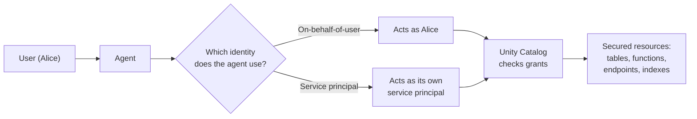
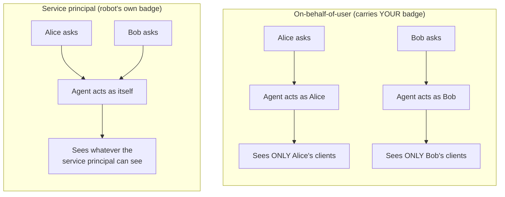
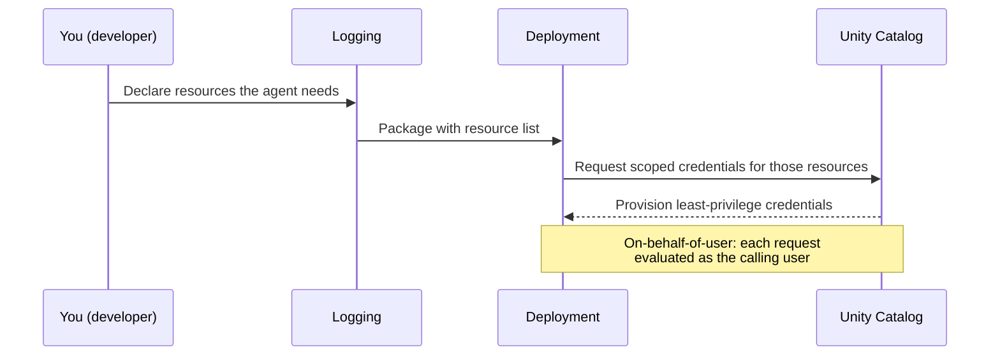

# Authentication and Permissions

> Picture a helpful assistant who walks around your office opening filing cabinets for people. Before you let them loose, there is one question you really want answered: *whose keys are they carrying?* That single question decides which drawers they can open and which stay locked. Today we answer it for AI agents.

Take a breath. This lesson has an intimidating title, but the idea underneath is friendly and familiar. You already reason about identity and permissions every day as a data engineer. We are just going to point that same instinct at agents. By the end, you will be comfortable with the two ways an agent can "prove who it is," and you will know which one to reach for when different people are allowed to see different data.

## Learning Objectives

After this lesson you will be able to:

- Explain what it means for an agent to *act as* an identity, and why that identity decides what data it can reach.
- Describe the two authentication models in plain words: **service principal** and **on-behalf-of-user**.
- Choose the right model for a given situation (especially when different users must see different data).
- Connect agent identity to Unity Catalog grants like `SELECT`, `EXECUTE`, `USE`, and endpoint or index access.
- Declare the resources an agent needs at logging time, so deployment can hand it scoped, least-privilege credentials.

## Prerequisites

You will get the most out of this lesson if you have already met:

- [The Unity AI Gateway](/docs/governance/unity-ai-gateway) — how Databricks puts a governed front door in front of models and tools.
- [Retrieval Tools](/docs/agents-tools-mcp/retrieval-tools) — how agents fetch data, and the golden rule that an agent must never return something the user is not allowed to see.

If those still feel fuzzy, that is okay. We will re-explain the important parts as we go.

## Estimated Reading Time

About 18 to 22 minutes, plus a little longer if you pause to try the code.

## Business Motivation

Let us make this concrete with a story we will use all lesson.

**Northwind Trust** is a wealth management firm. Financial advisors use a chat agent to ask questions like "summarize my client's recent transactions" or "which of my clients are overexposed to tech stocks?"

Here is the catch that keeps compliance officers up at night: **an advisor must only ever see their own clients' data.** Advisor Alice must never, under any circumstances, see Advisor Bob's clients. This is not a nice-to-have. It is a legal and regulatory line.

Now, the agent is the thing actually reaching into the database. So the whole question of "can Alice see Bob's clients?" collapses into one technical question: **who is the agent when it runs Alice's query?** If the agent uses one shared identity that can read *everyone's* data, then a clever prompt from Alice could pull Bob's clients. If instead the agent runs *as Alice*, the database itself refuses to hand over Bob's rows — no matter how the question is phrased.

That is why authentication is not a dry checkbox. It is the difference between a safe product and a data breach.

## Intuition

Let us build the mental picture before any technical terms.

Imagine your agent is an assistant walking the halls of Northwind Trust, opening filing cabinets (databases, tables, tools) on request. There are two ways to equip this assistant:

**Option 1: Give the assistant your badge.** When Alice asks a question, the assistant borrows *Alice's* badge. It can only open the drawers Alice can open. When Bob asks, it borrows Bob's badge. The assistant never has more access than the person standing in front of it. This is **on-behalf-of-user**.

**Option 2: Give the assistant its own badge.** The assistant is like a robot employee with a single company badge of its own. It opens the same set of drawers for everyone, because it always uses its own badge, not the visitor's. This is **service principal** authorization.

Neither is "bad." A robot with its own badge is simple and predictable — great when everyone is allowed to see the same data anyway. But at Northwind Trust, where Alice and Bob must see different things, the "carry the visitor's badge" approach is the safe one.

:::tip[Keep these two pictures in your head]
On-behalf-of-user = **the agent carries YOUR badge**, so it can only open doors you can open.
Service principal = **a robot worker with its own limited badge**, the same for everyone.
:::

## Theory

Now the slightly more formal version. Do not worry — it is the same two pictures with names attached.

Everything an agent touches — a table, a function, a vector search index, a model serving endpoint — is a **secured resource**. In Databricks, **Unity Catalog** is the system that decides who may do what to those resources. It does this with **grants**. A grant is a small rule like:

- `SELECT` on a table — you may read its rows.
- `EXECUTE` on a function — you may run it.
- `USE CATALOG` / `USE SCHEMA` — you may "enter" that catalog or schema to reach objects inside.
- Access to query a **model serving endpoint** or a **vector search index**.

Grants are attached to an **identity** (a user or a service principal). So access always flows like this:

**identity → grants in Unity Catalog → what you can touch.**

An agent is not magic. When it runs, it runs *as some identity*. That identity's grants are exactly what the agent can reach. So the entire security question is: **which identity does the agent use?**

There are two answers, and they are the two models we sketched:

1. **Service principal (system authorization).** The agent has its *own* identity — a service principal — with its own grants. Every user of the agent shares that one identity's access.
2. **On-behalf-of-user.** The agent acts *as the calling user*. It temporarily takes on that user's grants, so each user only ever reaches data they are personally allowed to see.

That is the whole theory. The rest of the lesson is about seeing it clearly and using it well.

## Deep Dive

Let us slow down on each model and really understand the trade-offs.

### Service principal (the robot with its own badge)

A **service principal** is a non-human identity — think of it as a "robot employee." It has a name, it can be granted permissions, and it does not belong to any one person.

When an agent uses service-principal authorization, it authenticates as this robot for *every* request, from *every* user. The upside is that it is **simple**: you grant the service principal exactly the permissions the agent needs, and you are done. There is no per-user juggling.

The catch is right there in the description: **the agent can access everything that identity can access, for all users.** If Alice and Bob both use an agent whose service principal can read the whole clients table, then from a data-access standpoint, Alice and Bob can both reach the whole table through the agent — even though Bob was never supposed to see Alice's clients.

So service principals are a great fit when:

- All users of the agent are allowed to see the same data anyway, **or**
- The agent only touches data that is safe for everyone (public reference data, a shared product catalog, a company FAQ).

And they are a **poor** fit when different users must see different slices of data. That is Northwind Trust's exact problem.

:::caution[The over-privileged robot]
The classic mistake is giving the service principal broad access "to be safe," then exposing the agent to many users. Now every user inherits that broad access. A service principal should be granted **only** what the agent genuinely needs — nothing more. We call this **least privilege**, and it is the guiding rule of this whole lesson.
:::

### On-behalf-of-user (the agent carries your badge)

With **on-behalf-of-user** authentication, the agent does not use its own permissions for the sensitive work. Instead, when Alice calls the agent, the agent acts **as Alice**. Unity Catalog then applies *Alice's* grants. When Bob calls, it acts as Bob, and applies Bob's grants.

The beautiful consequence: **User A can never see User B's data through the agent**, because the database itself will not return rows that A is not allowed to read. You do not have to hand-code "if user is Alice, filter to Alice's clients." The permission system you already trust does the filtering for you. This is exactly the guarantee you want for multi-tenant apps, row-level security, and per-user data isolation.

The cost is a little more setup and a few more moving parts (the agent has to be able to obtain and use the caller's credentials safely). But for cases like Northwind Trust, that cost is absolutely worth it.

### Bringing it back to the retrieval rule

In the retrieval lessons you learned a golden rule: **an agent must never return something the user is not allowed to see.** Authentication is *how* you actually enforce that rule at the data layer. On-behalf-of-user makes the rule automatic — the data store simply refuses to return forbidden rows. With a service principal, you are responsible for making sure the identity's grants never include anything a given user should not see.

## Architecture

Here is the picture of how identity, grants, and resources fit together.



*Figure 1: Every path to data passes through Unity Catalog, which checks the grants of whichever identity the agent is currently using. The identity is the fork in the road.*

Now the head-to-head comparison you have been waiting for.



*Figure 2: With on-behalf-of-user, each caller is naturally walled off from the others. With a service principal, everyone shares the same access — safe only if that access is safe for all of them.*

## Internal Working

How does Databricks actually wire this up? The key idea is that you tell the platform what the agent needs **ahead of time**, and the platform provisions **scoped credentials** to match.

The flow has two moments that matter:

1. **At logging time (when you package the agent):** you *declare the resources* the agent will use — for example, "this agent needs to query the `clients` table and run the `get_portfolio` function and call this vector search index." This declaration is like a shopping list of exactly what the agent touches.

2. **At deployment time:** Databricks reads that list and provisions **scoped, short-lived credentials** for precisely those resources — no more. If you chose on-behalf-of-user, the deployment is set up so that requests carry the calling user's identity, and Unity Catalog evaluates *their* grants on those resources.



*Figure 3: You declare the shopping list once; deployment turns it into narrowly scoped credentials. This is least privilege built into the process.*

The important takeaway: **declaring resources is not busywork.** It is what lets the platform hand your agent the smallest possible set of keys.

## Step-by-Step Walkthrough

Let us design Northwind Trust's advisor agent from scratch, one decision at a time.

1. **Ask the key question.** Do different users need to see different data? Yes — Alice and Bob must be isolated. That immediately points us toward **on-behalf-of-user**.

2. **List the resources the agent touches.** Say it needs to read a `clients` table, read a `transactions` table, and run a `get_portfolio` function. Write these down; this becomes the declared resource list.

3. **Decide the auth model.** Because of step 1, we choose on-behalf-of-user for the sensitive data. The agent will act as whichever advisor is chatting.

4. **Set up Unity Catalog grants on the underlying data.** Grant each advisor `SELECT` only on the rows/objects they are allowed to see (often via row filters or per-advisor views), plus `EXECUTE` on the function and `USE` on the catalog and schema. Now the database itself enforces isolation.

5. **Log the agent with its declared resources.** This tells Databricks the shopping list.

6. **Deploy.** Databricks provisions scoped credentials and wires up on-behalf-of-user so each request runs as the caller.

7. **Verify.** Log in as Alice, ask for "all clients," and confirm you see only Alice's. Then check as Bob. If isolation holds, the design works.

Notice that the *security guarantee* comes from steps 3 and 4 together: the agent acts as the user, and the user's grants are correctly scoped.

## Hands-on Examples

Let us walk through the three things you will actually write. Read the code, then read the narration under it — the narration is where the understanding lives.

The snippets below use MLflow's agent APIs and Unity Catalog SQL. Treat the exact class and parameter names as illustrative; the *shape* of what you do is the durable lesson. When in doubt, check the official docs linked at the end.

### Example 1: Declaring the resources an agent needs (at logging time)

```python
from mlflow.models.resources import (
    DatabricksServingEndpoint,
    DatabricksFunction,
    DatabricksVectorSearchIndex,
    DatabricksTable,
)

# The "shopping list" of everything this agent will touch.
resources = [
    DatabricksServingEndpoint(endpoint_name="northwind-chat-llm"),
    DatabricksTable(table_name="northwind.trust.clients"),
    DatabricksTable(table_name="northwind.trust.transactions"),
    DatabricksFunction(function_name="northwind.trust.get_portfolio"),
    DatabricksVectorSearchIndex(index_name="northwind.trust.policy_docs_index"),
]
```

Here we build a list of the exact resources the agent depends on: one model serving endpoint, two tables, one function, and one vector search index. Think of it as declaring, up front, "these are the only doors this agent will ever try to open." Being specific here is what lets the platform later hand out narrowly scoped keys instead of a master key. Vague lists lead to over-privileged agents; precise lists support least privilege.

### Example 2: Logging the agent with that resource list

```python
import mlflow

with mlflow.start_run():
    mlflow.pyfunc.log_model(
        name="northwind_advisor_agent",
        python_model="agent.py",     # your agent code
        resources=resources,          # the shopping list from Example 1
    )
```

Now we log (package) the agent and pass in the `resources` list. This is the moment the declaration "sticks" to the model. When you later deploy this logged model, Databricks reads that attached list and provisions credentials scoped to exactly those endpoints, tables, functions, and indexes. Nothing you forgot to declare will be silently available, and nothing extra will be handed over.

### Example 3: Choosing on-behalf-of-user authentication (conceptual)

```python
# Conceptual: when deploying, you indicate the agent should act
# with the CALLING USER'S permissions rather than its own identity.
#
# The precise API surface can change, so confirm names in the docs.
# The intent you are expressing is:
#
#   "For each request, authenticate as the user who made it,
#    and let Unity Catalog evaluate THAT user's grants."
#
# Result: Alice's requests see only Alice's clients;
#         Bob's requests see only Bob's clients.
#
# If you instead do nothing special, the agent uses its own
# service principal identity (system authorization) for everyone.
```

This one is intentionally conceptual, because the exact function names evolve. The idea you are expressing is a single, powerful sentence: *"For every request, run as the person who made it."* Choose this when users must be isolated. If you skip it, you get the default — the agent uses its own service principal, and everyone shares that identity's access. Either way, be deliberate: the choice is a security decision, not a default to accept blindly.

## Code Examples

Here are the Unity Catalog grants that make the whole thing safe. These are ordinary SQL statements — comfortable territory for a data engineer.

### Grant an advisor access to only what they need

```sql
-- Let advisors "enter" the catalog and schema (needed to reach objects).
GRANT USE CATALOG ON CATALOG northwind TO `advisors`;
GRANT USE SCHEMA  ON SCHEMA  northwind.trust TO `advisors`;

-- Allow reading the tables the agent uses...
GRANT SELECT ON TABLE northwind.trust.clients      TO `advisors`;
GRANT SELECT ON TABLE northwind.trust.transactions TO `advisors`;

-- ...and executing the portfolio function.
GRANT EXECUTE ON FUNCTION northwind.trust.get_portfolio TO `advisors`;
```

Step by step: the first two lines let members of the `advisors` group *enter* the catalog and schema — without `USE`, they cannot even see what is inside. The next two grant read access to the two tables. The last grants permission to run the function. These are the four grant types you will use most: `USE`, `SELECT`, `EXECUTE`, and (below) access to query endpoints and indexes.

### Enforce row-level isolation so each advisor sees only their clients

```sql
-- A row filter function: keep a row only if it belongs to the current user.
CREATE OR REPLACE FUNCTION northwind.trust.only_my_clients(advisor_email STRING)
RETURN advisor_email = current_user();

-- Attach the filter to the clients table.
ALTER TABLE northwind.trust.clients
SET ROW FILTER northwind.trust.only_my_clients ON (advisor_email);
```

This is the piece that makes on-behalf-of-user shine. The `only_my_clients` function returns true only for rows whose `advisor_email` matches `current_user()` — the identity of whoever is running the query. We attach it as a **row filter** on the `clients` table. Now, because the agent runs *as Alice*, `current_user()` is Alice, so the table returns only Alice's rows. Bob gets only Bob's. The isolation is enforced by the data store, not by hopeful application code. If you had used a service principal, `current_user()` would always be the robot — and the filter could not tell Alice from Bob.

### Grant access to an endpoint and a vector search index

```sql
-- Allow querying the model serving endpoint and the vector index.
GRANT EXECUTE ON FUNCTION northwind.trust.get_portfolio TO `advisors`;
-- Endpoint / index access is managed via the serving and vector search
-- permissions UIs or APIs; grant "can query" to the advisors group only.
```

Model serving endpoints and vector search indexes are secured resources too. Grant "can query" to the `advisors` group and no one broader. The principle is the same everywhere: give the smallest audience the smallest capability that still lets the agent do its job.

## Production Considerations

- **Match the model to the data-sharing reality.** Multi-tenant or per-user data almost always means on-behalf-of-user. Shared, non-sensitive data can use a service principal.
- **Keep the declared resource list accurate.** If the agent starts using a new table, add it to the list and re-log. Stale lists cause runtime "permission denied" surprises or, worse, tempt people to over-grant.
- **Name your service principals clearly** (e.g., `sp-northwind-advisor-agent`) so audits are readable, and review their grants regularly.
- **Test isolation as part of CI.** Have an automated check that logs in as two different test users and confirms each sees only their own data through the agent.
- **Fail closed.** If the agent cannot determine the caller's identity in an on-behalf-of-user setup, it should refuse rather than fall back to a broad identity.

## Performance Considerations

Authentication choices are mostly about safety, but a couple of performance notes are worth knowing:

- **On-behalf-of-user adds a small amount of per-request work** to obtain and apply the caller's credentials. In practice this is minor compared to model inference time, so do not let it scare you off the safer model.
- **Row filters and column masks run on every query.** Keep filter functions simple (a comparison like `current_user()` is cheap). Heavy logic inside a filter runs for every row scan, so keep it lean.
- **Scoped credentials are short-lived** and refreshed automatically; this is a feature, not a bottleneck, but be aware that very long-running operations rely on that refresh working.

## Security Considerations

This whole lesson is a security lesson, so here we simply concentrate the rules:

- **Least privilege, always.** Grant the minimum. It is far easier to add a grant later than to discover a leak.
- **Prefer on-behalf-of-user whenever users must be isolated.** It moves enforcement into Unity Catalog, which is much harder to bypass than app-level filtering.
- **Never let a prompt widen access.** With on-behalf-of-user, no clever question from Alice can reveal Bob's rows, because the data layer refuses. Do not rely on the model to "be careful."
- **Audit service-principal grants regularly.** These are the identities most likely to quietly accumulate too much access.
- **Honor the retrieval golden rule at the data layer.** "Never return what the user cannot see" should be enforced by grants and filters, not by trust in the model.

:::note[Going deeper (optional)]
Row filters and column masks are part of Unity Catalog's **attribute-based access control**. Combined with on-behalf-of-user auth, they let you express rich rules — "advisors see their own clients, managers see their team's, auditors see masked columns" — entirely in governance, so the agent inherits all of it for free. You do not need this to start; reach for it when your access rules get interesting.
:::

## Common Mistakes

- **Using a service principal for multi-user, sensitive data.** The single most common and most dangerous mistake. Everyone inherits the robot's access.
- **Over-granting the service principal "to be safe."** Broad grants plus many users equals a broad leak. Safety comes from *narrow* grants.
- **Forgetting `USE CATALOG` / `USE SCHEMA`.** People grant `SELECT` but forget the `USE` grants, then wonder why access fails. You need to be able to enter the room before you can open a drawer in it.
- **Relying on the model to filter data.** Prompts can be manipulated; grants cannot. Enforce in Unity Catalog.
- **Letting the declared resource list drift** from what the agent actually uses.

## Best Practices

- Start every design by asking: *do different users need different data?* Let the answer pick your model.
- Declare resources precisely and keep the list current.
- Grant to **groups** (like `advisors`), not individuals, so access is manageable.
- Use row filters and column masks for per-user isolation, and pair them with on-behalf-of-user.
- Write an automated isolation test and run it in CI.
- Review grants and service principals on a schedule.

## Interview Questions

1. **An agent is used by many users who each may only see their own data. Which authentication model do you choose, and why?** (Expect: on-behalf-of-user, because the agent acts as the caller and Unity Catalog enforces each user's grants, guaranteeing isolation.)
2. **What is a service principal, and what is the main risk of using one for a multi-user agent?** (A non-human identity with its own grants; the risk is that every user shares that identity's access, so it can over-expose data.)
3. **Explain how declaring resources at logging time relates to least privilege.** (Declaring the exact resources lets deployment provision scoped credentials for only those resources, rather than broad access.)
4. **How do Unity Catalog grants (`SELECT`, `EXECUTE`, `USE`) and row filters combine to isolate users under on-behalf-of-user auth?** (Grants allow the operations; row filters using `current_user()` limit which rows each user sees; because the agent runs as the user, filters apply per user.)
5. **Why is enforcing the "never return what the user can't see" rule at the data layer safer than in the agent's prompt or code?** (The data layer cannot be talked around by prompt manipulation; grants and filters are authoritative.)

## Quiz

<details>
<summary>1. With on-behalf-of-user authentication, whose permissions does the agent use when Alice sends a request?</summary>

Alice's permissions. The agent acts as the calling user, so Unity Catalog evaluates Alice's grants — she sees only what she is personally allowed to see.

</details>

<details>
<summary>2. Northwind Trust advisors must never see each other's clients. Which model fits, and what extra Unity Catalog feature helps enforce it?</summary>

On-behalf-of-user, paired with a **row filter** that uses `current_user()`. Because the agent runs as each advisor, the filter returns only that advisor's rows.

</details>

<details>
<summary>3. True or false: giving a service principal broad access is a safe default because "the agent is trusted."</summary>

False. Every user of the agent inherits the service principal's access. Broad grants plus many users equals broad exposure. Grant the minimum (least privilege).

</details>

<details>
<summary>4. Why do you declare an agent's resources at logging time?</summary>

So deployment can provision **scoped, least-privilege credentials** for exactly those resources — no more. It is how least privilege is baked into the deployment process.

</details>

## Summary

An agent is only ever as powerful as the identity it acts as. That is the heart of everything here. You met two models: the **service principal**, a robot with its own badge that is simple but shared by all users; and **on-behalf-of-user**, where the agent carries the caller's badge so each person sees only their own data. You saw how Unity Catalog grants (`USE`, `SELECT`, `EXECUTE`, endpoint and index access) plus row filters turn those models into real, enforced isolation, and how declaring resources at logging time gives you least privilege by design. For Northwind Trust, on-behalf-of-user plus a `current_user()` row filter is the clean, safe answer.

## Key Takeaways

- The agent's **identity** decides what it can see. Ask "whose badge?" first.
- **Service principal** = the agent's own identity; simple, but shared across all users. Safe only when the data is safe for everyone.
- **On-behalf-of-user** = the agent acts as the caller; each user is naturally isolated. Essential for multi-tenant and row-level security.
- Enforce access at the **data layer** with Unity Catalog grants and row filters, not in the prompt.
- **Declare resources at logging time** so deployment provisions scoped, least-privilege credentials.
- **Least privilege** is the guiding rule everywhere.

## Glossary

- **Identity:** The "who" that an action runs as — a user or a service principal.
- **Service principal:** A non-human identity (a "robot employee") with its own grants.
- **On-behalf-of-user:** An auth model where the agent acts with the calling user's permissions.
- **Unity Catalog:** Databricks' governance layer that decides who may do what to data and resources.
- **Grant:** A permission rule (e.g., `SELECT`, `EXECUTE`, `USE`) attached to an identity.
- **Row filter:** A rule that limits which rows an identity can see, often using `current_user()`.
- **Least privilege:** Granting only the minimum access needed to do the job.
- **Scoped credentials:** Short-lived, narrowly limited credentials provisioned for exactly the declared resources.

## Further Reading

- [Databricks: Authenticate an agent to Databricks resources](https://docs.databricks.com/aws/en/generative-ai/agent-framework/agent-authentication)

## Next Lesson

➡️ [Cost, Rate Limits, and Budgets](/docs/governance/cost-and-budgets)
