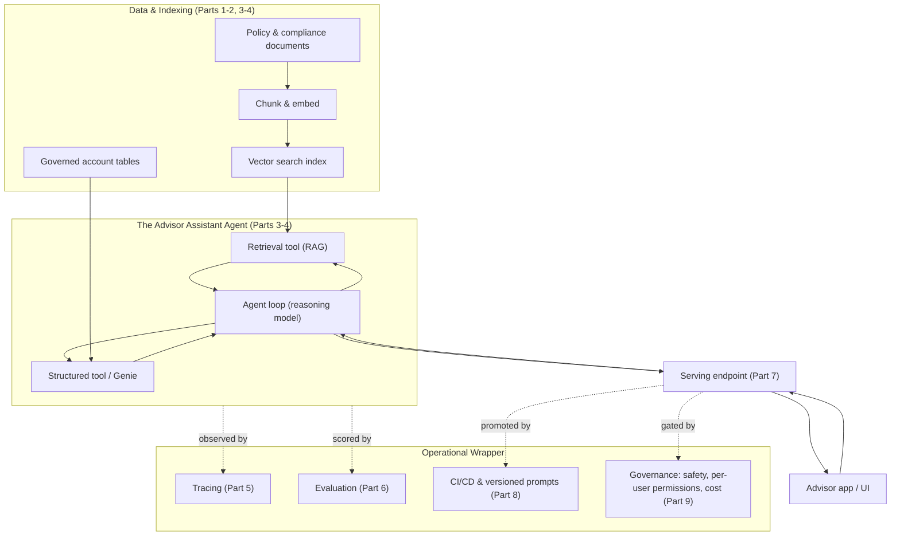
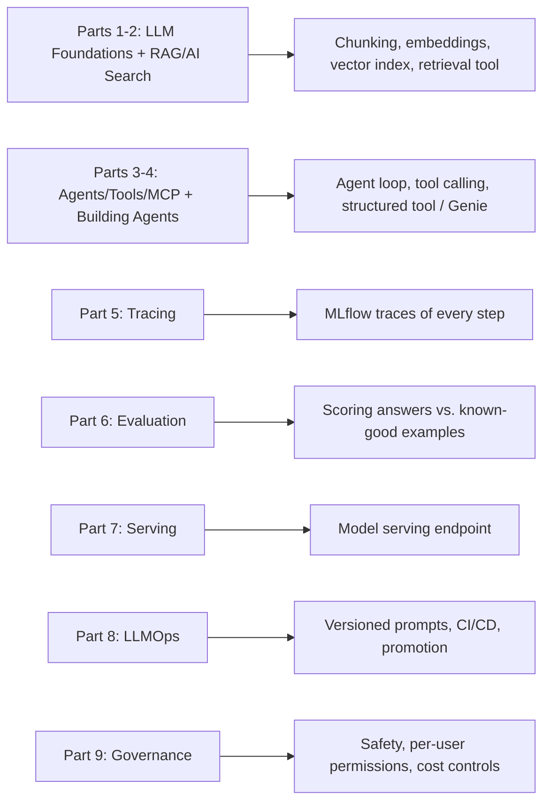

# Capstone Overview: The Advisor Assistant

> You have carried a lot of new ideas up a long hill. Chunking. Embeddings. Vector search. Tools. Agent loops. Traces. Evaluation. Serving. CI/CD. Governance. Each one was a single step. Now you get to stand at the top and look back at the trail, and then you get to build something real out of every step you took. This is the capstone. You are ready for it.

Take a breath. Let's start by celebrating.

When you began this course, "AI" was probably a fuzzy word. Maybe it felt like magic, or like something other people did. Look at you now. You can explain what an embedding is. You know why we chunk documents. You know what a tool is, why an agent loops, and how a trace lets you see inside the loop. You know the difference between "it ran" and "it's actually good," and you know how to measure the difference. You know how to put a model behind an endpoint, ship it safely with version control, and wrap the whole thing in governance.

That is a complete mental model of a production AI system. Most people never get there. You did.

This lesson does not build anything yet. It is the **blueprint**. We are going to define one realistic project, draw the whole thing on one page, and then point at each piece and say "you already learned that, in Part N." By the end you will see that the capstone is not a scary new mountain. It is the same trail you already walked, assembled into one working system.

## Learning Objectives

By the end of this lesson, you will be able to:

- Describe the **Advisor Assistant** capstone project in plain business terms: who uses it, what it does, and why Northwind Trust wants it.
- Read the **full end-to-end architecture** of the agent, from raw data all the way to a running app, and explain each box in your own words.
- Name the agent's **two tools** and say which one answers document questions and which one answers account-fact questions.
- **Map every component** of the capstone back to the Part of the course that taught it, so nothing feels new.
- Explain the roles of **tracing, evaluation, serving, CI/CD, and governance** as the wrapper around the agent, not as afterthoughts.
- Know exactly **what the next two lessons will do**: build the agent, then evaluate, deploy, and govern it.

## Prerequisites

This capstone assumes **everything** that came before it. That is the point. If a term below feels rusty, that is completely normal, and this overview will remind you where each idea lives.

- [Start Here](/docs/intro) — the course introduction and how the parts fit together.
- [The Databricks AI Platform Map](/docs/orientation/databricks-ai-platform-map) — the big picture of where every piece lives on the platform. Keep this open in another tab; the capstone is basically that map brought to life.

You do **not** need to memorize anything. You do **not** need to have built a project before. If you have read the earlier parts, even once, you have what you need. We will re-introduce each idea gently as it appears.

## Estimated Reading Time

About 18 minutes.

## Business Motivation

Let's meet our company again.

**Northwind Trust** is a fictional financial services firm. It employs **financial advisors** — the people who sit with clients, answer their questions, and manage their accounts. These advisors are busy, and their day is full of two kinds of questions.

The first kind sounds like this:

- "What's our policy on early withdrawal penalties for a retirement account?"
- "Are we allowed to recommend this product to a client in this state?"
- "What does compliance require me to disclose before I open this account?"

Those answers live in **documents** — policy PDFs, compliance manuals, product guides. Today an advisor has to hunt through a shared drive, or ping the compliance team and wait.

The second kind sounds like this:

- "What's the current balance on the Rodriguez family account?"
- "When did this client last make a contribution?"
- "How many accounts does this household have with us?"

Those answers live in **governed database tables** — the tables your data platform already manages. Today an advisor files a request or asks an analyst to run a query.

Both kinds of questions slow the advisor down and pull other teams away from their work. Northwind Trust wants one internal assistant that an advisor can simply ask, in plain English, and get a trustworthy answer to **either** kind of question — and often both at once, like "Given this client's account, are they eligible for early withdrawal under our current policy?"

That is the **Advisor Assistant**. An internal agent that helps financial advisors by combining what the documents say with what the client's account actually shows.

:::note
Northwind Trust is the same fictional company we have followed throughout the course. The capstone is the assistant they finally get to ship.
:::

Why does the business care enough to fund this?

- **Speed.** Advisors get answers in seconds instead of waiting on other teams.
- **Consistency.** Everyone gets the answer the current policy actually gives, not a half-remembered version.
- **Leverage.** The compliance team and the analysts stop being a help desk and get their time back.
- **Trust and safety.** Because it is financial services, every answer must be governed: correct, permission-aware, auditable, and cost-controlled. This is not a toy chatbot. It is a regulated tool.

That last point is the reason the capstone is more than "an agent with two tools." The agent is the engine. The tracing, evaluation, serving, CI/CD, and governance around it are the seatbelts, the dashboard, and the brakes that make it safe to drive on a real road.

## Intuition

Here is the whole project in one everyday picture.

Imagine a brand-new **expert assistant** you just hired to sit next to your advisors. This assistant is fantastic at language but knows nothing specific about Northwind Trust on day one. To make them genuinely useful, you give them two things:

1. **A well-organized library.** All the policy and compliance documents, sorted so the assistant can flip straight to the right page instead of reading every book. That is your **retrieval tool**.
2. **A phone line to the records department.** When someone asks about a specific client's account, the assistant picks up the phone and asks the official system for the facts. That is your **structured tool**.

Now the assistant can handle a real question. Someone asks, "Can the Rodriguez family take an early withdrawal without a penalty?" The assistant thinks: "I need two things. First, what does our policy say about early withdrawals? Let me check the library. Second, what kind of account do the Rodriguezes have and how old is it? Let me phone the records department." It gathers both, combines them, and answers.

That "think, fetch, think again, answer" behavior is the **agent loop**. The assistant is not just looking one thing up; it is reasoning about what it needs and going to get it.

And because this is a bank, you do not just hire the assistant and walk away. You put a **camera** on their desk so you can review any conversation later (tracing). You give them a **weekly performance review** with a scorecard (evaluation). You seat them at an official **front desk** so anyone in the company can reach them (serving). You require that any change to how they work goes through **proper review before it takes effect** (CI/CD). And you set **house rules**: they only see what a given advisor is allowed to see, they never say something unsafe, and they do not run up an unlimited bill (governance).

That is the entire capstone. A smart assistant with a library and a phone line, wrapped in the discipline of a regulated workplace. Every part of that picture maps to something you already learned.

## Theory

Let's name the ideas precisely, still gently.

The Advisor Assistant is a **RAG-powered, tool-using agent**. Break that phrase apart:

- **RAG** stands for **Retrieval-Augmented Generation**. Instead of hoping the language model already memorized Northwind's policies (it did not, and it would make things up if it tried), we **retrieve** the relevant policy text at question time and hand it to the model as context. The model then **generates** its answer grounded in that real text. RAG is how we stop the assistant from guessing.
- **Tool-using** means the model does not answer from its own head alone. It can call out to **tools** — small, well-defined functions — to fetch facts it does not have. Our assistant has two tools.
- **Agent** means there is a **loop**. The model decides which tool to call, reads the result, decides whether it needs another call, and only answers when it has enough. It is a controller, not a single prompt.

The two tools are the heart of it, and they answer two very different kinds of questions:

| Tool | What it answers | Where the answer comes from | Course Part |
| --- | --- | --- | --- |
| **Retrieval tool** | Fuzzy, language questions ("what does our policy say about...") | Unstructured documents, chunked and indexed in a vector search index | Parts 1-2 |
| **Structured tool** | Precise, factual questions ("what is this client's balance") | Governed tables, queried through a structured lookup or Genie | Parts 3-4 |

Why two tools instead of one? Because the two questions have two different shapes. Policy questions are about **meaning** — you want the passage that is *about* early withdrawals, even if it does not use those exact words. That is what vector search and embeddings are for. Account questions are about **exact facts** — a balance is a number in a row, not a paragraph to interpret. You would never want the assistant to "summarize" someone's balance from fuzzy text; you want the real number from the real table. Matching the tool to the shape of the question is the core design decision of the whole capstone.

Everything else — tracing, evaluation, serving, CI/CD, governance — is the **operational wrapper** that turns "a clever agent on my laptop" into "a trustworthy system in production." In a regulated industry, the wrapper is not optional. It is most of the job.

## Deep Dive

Let's walk through the life of a single question, so the architecture on the next page feels familiar before you even see it.

An advisor types: *"Is the Rodriguez family eligible for a penalty-free early withdrawal?"*

1. **The request arrives at the serving endpoint.** This is the front desk. It authenticates the advisor and passes the question to the agent. (Part 7)
2. **Governance checks happen at the door.** Before anything runs, the gateway confirms this advisor is allowed to use the assistant, applies safety guardrails, and starts counting cost against a budget. Crucially, it also carries *who is asking*, so the agent can later respect per-user permissions on data. (Part 9)
3. **The agent loop begins.** The language model reads the question and reasons: "I need the policy on early-withdrawal penalties, and I need the Rodriguez account details." (Parts 3-4)
4. **The agent calls the retrieval tool.** It searches the vector index of policy documents and pulls back the chunks that are about early-withdrawal penalties. (Parts 1-2)
5. **The agent calls the structured tool.** It queries the governed accounts table — respecting this advisor's permissions — for the Rodriguez family's account type and age. (Parts 3-4)
6. **The agent reasons over both** and writes a grounded answer: "Based on Policy 4.2 and their account, which is a Traditional IRA held for 3 years, an early withdrawal *would* incur a penalty because the account holder is under 59½..."
7. **The whole thing is traced.** Every step above — each model call, each tool call, each result — is recorded as a trace, so you can open this exact conversation later and see what happened. (Part 5)
8. **The answer returns through the endpoint** to the advisor's app. (Part 7)

Running quietly alongside all of this:

- **Evaluation** periodically scores the assistant against a set of known question-and-answer examples, so you know it is *good*, not just *running*. (Part 6)
- **CI/CD** governs how any change — a new prompt, a new tool, a new model — gets tested and promoted before it ever reaches advisors. (Part 8)

## Architecture

Here is the full end-to-end architecture on one page. Read the diagram once, then read the narration under it, then read the diagram again. It will click.



*Diagram: The full Advisor Assistant. On the left, data becomes searchable: documents are chunked, embedded, and stored in a vector index, while account facts stay in governed tables. In the middle, the agent loop reaches out to two tools — the retrieval tool reads the vector index, the structured tool reads the governed tables. An advisor reaches the agent only through the serving endpoint, which is gated by governance and promoted by CI/CD. The whole agent is observed by tracing and scored by evaluation.*

Let's narrate it, following the arrows.

**Bottom-up on the left (getting data ready).** Policy documents cannot be searched as-is, so we **chunk** them into bite-sized passages and **embed** each chunk into a vector, then store those vectors in a **vector search index**. That index is what the retrieval tool searches. Separately, the **governed account tables** already exist in your platform; we do not re-shape them, we just let a tool query them. Two data sources, two shapes, exactly as the Theory section promised.

**The middle (the agent).** The **agent loop** is the reasoning model in charge. It can call the **retrieval tool** (which reads the vector index) and the **structured tool** (which reads the governed tables). The arrows go both ways: the agent calls a tool, the tool returns a result, the agent reads it and decides what to do next. That back-and-forth is the loop.

**The path to the user.** An advisor never talks to the agent directly. They talk to the **app**, which talks to the **serving endpoint**, which hands the question to the agent and hands the answer back. One controlled door in and out.

**The wrapper (the dashed lines).** **Tracing** observes every step inside the agent. **Evaluation** scores the agent's answers against known-good examples. **Governance** gates the endpoint — checking permissions, applying safety rules, and counting cost. **CI/CD** controls how new versions get promoted to that endpoint. The dashed lines mean "watches over" or "controls," not "passes data through."

If you can explain that diagram to a colleague, you understand the capstone.

## Internal Working

Now the same picture, but organized by **which Part of the course taught each piece**. This is the map that makes the capstone feel like a reunion instead of a final exam.



*Diagram: Every capstone component traces back to a Part. Reading left to right, each Part of the course on the left produced a specific capability on the right that the Advisor Assistant now uses.*

Here is the same mapping as a checklist you can keep next to you:

| Capstone component | What it does in the Advisor Assistant | Taught in |
| --- | --- | --- |
| Chunking & embeddings | Turns policy documents into searchable passages | Part 1 (LLM Foundations), Part 2 (RAG & AI Search) |
| Vector search index | Stores those passages so the retrieval tool can find them by meaning | Part 2 (RAG & AI Search) |
| Retrieval tool | Answers policy/compliance questions from documents | Parts 1-2 |
| Structured tool / Genie | Answers client account-fact questions from governed tables | Part 3 (Agents, Tools, MCP), Part 4 (Building Agents) |
| Agent loop | Reasons about the question and combines both tools | Parts 3-4 |
| Tracing | Records every model and tool call for later inspection | Part 5 (Tracing) |
| Evaluation | Scores answer quality against a known-good set | Part 6 (Evaluation) |
| Serving endpoint | The governed front door advisors reach the agent through | Part 7 (Serving) |
| Versioned prompts + CI/CD | Tests and promotes changes safely before advisors see them | Part 8 (LLMOps) |
| Governance | Enforces safety, per-user permissions, and cost limits | Part 9 (Governance) |

Read that table slowly. Every row is something you already learned. The capstone is the assembly, not new invention.

## Step-by-Step Walkthrough

Here is the plan for the whole capstone, across this lesson and the next two. This lesson is step 0: the blueprint. You are here.

1. **Define requirements and architecture** (this lesson). Decide what the assistant must do, draw the system, and map each piece to a Part. Done by the end of this page.
2. **Prepare the retrieval side** (next lesson). Point the retrieval tool at a vector index of policy documents. You already know how to chunk, embed, and index; here you wire it into a tool the agent can call.
3. **Prepare the structured side** (next lesson). Give the agent a structured tool that queries the governed account tables, respecting the caller's permissions.
4. **Assemble the agent loop** (next lesson). Give the reasoning model both tools and a clear instruction prompt, so it knows when to reach for the library and when to phone the records department.
5. **Turn on tracing** (next lesson, then Part-5 depth). Confirm every step is recorded so you can debug and audit.
6. **Evaluate** (third lesson). Build a small set of known question-and-answer pairs and score the assistant's answers, so "it works" becomes "it works *and* it's good."
7. **Serve and deploy** (third lesson). Put the agent behind an endpoint, and put changes to it behind versioned prompts and CI/CD.
8. **Govern** (third lesson). Wrap the endpoint in safety guardrails, per-user permissions, and cost controls.

Notice the shape: **this lesson plans, the next lesson builds the agent, the third lesson makes it production-grade** (evaluate, deploy, govern). Three clean stages. You are about to do the fun part.

## Hands-on Examples

There is no cluster work in this lesson — it is the blueprint, so your "hands-on" is a design exercise. Do these on paper or in your head. They are quick wins that prove you already think like the architect of this system.

**Exercise 1: Route the question.** For each advisor question, decide which tool the agent should call: retrieval, structured, or both.

- "What's our disclosure policy for opening a joint account?" → *retrieval*
- "What's the balance on account 4471?" → *structured*
- "Given the balance on account 4471, is this client above the threshold that requires extra disclosure?" → *both*

**Exercise 2: Spot the wrapper.** Someone asks, "Can we prove to a regulator exactly what the assistant told advisor Dana last Tuesday?" Which part of the wrapper answers this? (Answer: **tracing** — it recorded every conversation.)

**Exercise 3: Draw it from memory.** Close this page and sketch the architecture: data → index and tables → two tools → agent loop → endpoint → app, with tracing, evaluation, governance, and CI/CD around it. If you can draw it, you own it.

## Code Examples

This lesson is intentionally light on code — the building happens next. But it helps to see the *shape* of what you will assemble, so the next lesson feels like filling in blanks rather than starting cold.

At a very high level, the agent is a reasoning model handed a list of tools:

```python
# Pseudocode blueprint — the real, runnable version is in the next lesson.

# Tool 1: answer policy questions from documents (RAG). Parts 1-2.
def policy_retrieval_tool(question):
    # search the vector index of chunked policy docs, return top passages
    ...

# Tool 2: answer account-fact questions from governed tables. Parts 3-4.
def account_lookup_tool(account_id, caller_identity):
    # query the governed table, respecting the caller's permissions
    ...

# The agent: a reasoning model that can call either tool in a loop. Parts 3-4.
advisor_assistant = build_agent(
    model="a reasoning chat model",
    tools=[policy_retrieval_tool, account_lookup_tool],
    instructions="Use the policy tool for policy questions and the "
                 "account tool for client facts. Combine both when needed. "
                 "Never guess a policy or a number — always look it up.",
)
```

Notice three things, because they are the whole design:

- There are exactly **two tools**, matching the two kinds of questions.
- The account tool takes a **caller identity**, because permissions matter — the agent must only return data the asking advisor is allowed to see (Part 9).
- The instruction says **never guess** — always look it up. That single sentence is what keeps a financial assistant honest.

Everything else in the next lessons — tracing, evaluation, serving, governance — wraps around this small core.

## Production Considerations

Because this is the capstone, it is worth naming what "production-ready" actually demands, so the later lessons make sense.

- **Two data sources, kept separate.** Documents feed the retrieval tool; tables feed the structured tool. Do not try to jam account numbers into the vector index or summarize policies from a table. Keep each question type on the tool built for it.
- **Freshness.** Policies change. The vector index must be re-built when documents update, or the assistant will confidently cite last year's rules. Plan for a refresh, not a one-time load.
- **Identity flows all the way through.** The advisor's identity must travel from the app, through the endpoint, into the structured tool, so per-user permissions are enforced at the data layer, not just at the front door.
- **Everything is observable.** If you cannot open a trace and see why the assistant said what it said, you cannot debug it and you cannot pass an audit. Tracing is not optional in this domain.

## Performance Considerations

You do not need to tune anything here, but keep these instincts in mind for the build.

- **Each tool call costs time.** An agent that calls two tools is doing at least three model turns plus two lookups. That is fine, but it is why you will care about latency at the serving layer (Part 7).
- **Retrieve tightly.** Returning the top few relevant chunks beats dumping twenty. Tighter retrieval means faster, cheaper, more accurate answers.
- **Cache what is stable.** Policy answers change slowly. There is room to cache common questions so the assistant is not re-reasoning identical requests all day. (You will meet these levers in the serving and governance lessons.)
- **Cost scales with reasoning.** More loop steps means more model calls means more spend. This is exactly why the governance layer counts cost against a budget.

## Security Considerations

This is a financial assistant, so security is front and center, not a footnote.

- **Per-user permissions.** Advisor Dana must only see the accounts Dana is allowed to see. The structured tool must enforce this at the data layer using the caller's identity — not by trusting the model to behave. (Part 9)
- **Safety guardrails.** The assistant must refuse unsafe or out-of-scope requests and must not leak sensitive data like full account numbers in its answers. Guardrails live at the governed gateway. (Part 9)
- **Grounding as a safety feature.** Because answers are grounded in retrieved policy text and real table values, the assistant is far less likely to fabricate a rule or a number. RAG is a correctness *and* a safety control here.
- **Auditability.** Every question and answer is traced, so a regulator's "show me what it said" can always be answered. (Part 5)

## Common Mistakes

Gentle heads-up on the traps, so you can sidestep them in the build.

- **Using one tool for everything.** Trying to answer account-balance questions from the document index (or vice versa) gives wrong answers. Match the tool to the question shape.
- **Skipping evaluation.** "It ran and gave an answer" is not "it gave the *right* answer." Without evaluation you are shipping hope. (Part 6)
- **Forgetting identity.** Wiring the structured tool to return any account to anyone is a serious security hole. Carry the caller's identity through. (Part 9)
- **Treating governance as an add-on at the end.** Safety, permissions, and cost are part of the design, not a bolt-on. The architecture already reserves a place for them.
- **Loading documents once and never refreshing.** A stale index confidently quotes outdated policy. Plan for updates.

## Best Practices

- **Match each tool to the shape of its question** — meaning-based to retrieval, fact-based to structured. This one decision drives the whole design.
- **Ground every answer.** Retrieve real text and pull real numbers; instruct the model to never guess.
- **Make everything observable from day one.** Turn on tracing before you need it, not after something breaks.
- **Evaluate before you deploy, and keep evaluating.** A scorecard turns "I think it's good" into "I can show it's good."
- **Put changes behind CI/CD.** No prompt or tool change reaches advisors without review and testing. (Part 8)
- **Design governance in, not on.** Permissions, safety, and cost belong in the blueprint — which is exactly why they are already on your diagram.

## Interview Questions

These are the kind of open-ended **design** questions you would face in an interview. Try answering each in a few sentences before moving on.

1. **"Design an internal assistant that answers both policy questions from documents and account-fact questions from a database. How would you structure it?"** Talk through a tool-using agent with two tools — a RAG retrieval tool over a vector index for the documents, and a structured lookup tool over governed tables for the facts — with an agent loop that decides which to call and combines the results.

2. **"Why use two separate tools instead of one? Why not put everything in the vector index?"** Because the two question types have different shapes. Policy questions are about meaning and are best served by semantic search; account facts are exact values that must come from the source of truth, never be summarized or approximated. Matching tool to question shape protects both accuracy and trust.

3. **"This handles customer financial data. What does 'production-ready' require beyond a working agent?"** Per-user permission enforcement at the data layer, safety guardrails, full tracing for audit, evaluation against known-good answers, a governed serving endpoint, cost controls, and CI/CD so changes are tested before they reach users.

4. **"How would you prove to a regulator that the assistant behaved correctly for a specific advisor on a specific day?"** Point to tracing: every conversation, every model call, and every tool call is recorded, so you can reconstruct exactly what was asked and answered, and evaluation results show ongoing quality.

5. **"How do you keep the assistant from confidently citing outdated policy?"** Ground answers in retrieved text rather than model memory, and refresh the vector index whenever the underlying documents change so retrieval always reflects current policy.

## Quiz

Test yourself. Try to answer before opening each one.

<details>
<summary>The Advisor Assistant has two tools. What does each one do, and where does its answer come from?</summary>

The **retrieval tool** answers policy and compliance questions from **documents**, which are chunked, embedded, and stored in a **vector search index**. The **structured tool** (or Genie) answers client account-fact questions from **governed database tables**. One is meaning-based, the other is fact-based.

</details>

<details>
<summary>Which Parts of the course taught the retrieval tool, and which taught the agent loop?</summary>

The **retrieval tool** (chunking, embeddings, vector search) comes from **Parts 1-2** (LLM Foundations and RAG & AI Search). The **agent loop and tool calling** come from **Parts 3-4** (Agents, Tools, MCP and Building Agents).

</details>

<details>
<summary>Name the four things the "operational wrapper" adds around the agent, and the Part that taught each.</summary>

**Tracing** (Part 5) records every step. **Evaluation** (Part 6) scores answer quality. **Serving** (Part 7) puts the agent behind an endpoint, with **CI/CD and versioned prompts** (Part 8) controlling promotion. **Governance** (Part 9) enforces safety, per-user permissions, and cost. Together they turn a working agent into a trustworthy production system.

</details>

<details>
<summary>An advisor asks, "Given this client's account balance, does our policy require extra disclosure?" Which tool(s) does the agent use, and why?</summary>

**Both.** It uses the **structured tool** to get the exact account balance from the governed table, and the **retrieval tool** to find what the policy says about disclosure thresholds. Then the agent loop combines the fact and the policy to answer. This "combine both" case is exactly why we built an agent instead of a single lookup.

</details>

## Key Takeaways

- The Advisor Assistant is a **RAG-powered, tool-using agent** with exactly **two tools**: a document retrieval tool and a structured account-lookup tool.
- **Match the tool to the question's shape** — meaning-based questions go to retrieval, fact-based questions go to the structured tool. This is the core design decision.
- The **agent loop** lets the model decide which tool to call, read the result, and combine both when a question needs it.
- The **operational wrapper** — tracing, evaluation, serving, CI/CD, governance — is what makes the agent safe for a regulated business. It is part of the design, not an afterthought.
- **Every component maps back to a Part** of the course. The capstone is assembly, not new material.
- The plan is three stages: **blueprint (this lesson), build the agent (next), then evaluate, deploy, and govern (after that).**

## Glossary

- **Advisor Assistant** — the capstone project: an internal agent that helps Northwind Trust's financial advisors answer policy and account questions.
- **RAG (Retrieval-Augmented Generation)** — retrieving relevant real text at question time and giving it to the model so its answer is grounded in facts instead of guesses.
- **Retrieval tool** — the tool that searches the vector index of policy documents to answer language-based policy and compliance questions.
- **Structured tool** — the tool that queries governed database tables (or uses Genie) to answer exact client account-fact questions.
- **Genie** — the Databricks natural-language interface to governed tables, one way to implement the structured tool.
- **Agent loop** — the reasoning cycle in which the model decides which tool to call, reads the result, and repeats until it can answer.
- **Vector search index** — the store of embedded document chunks that the retrieval tool searches by meaning.
- **Tracing** — the recording of every model and tool call in a run, used for debugging and audit.
- **Evaluation** — scoring the assistant's answers against known-good examples to measure quality.
- **Serving endpoint** — the governed front door through which the app reaches the agent.
- **CI/CD** — the practice of testing and promoting changes (like new prompts) before they reach users.
- **Governance** — the enforcement of safety, per-user permissions, and cost controls around the agent.
- **Operational wrapper** — the collective term used here for tracing, evaluation, serving, CI/CD, and governance around the agent.

## Further Reading

- [Mosaic AI Agent Framework overview](https://docs.databricks.com/aws/en/generative-ai/agent-framework/build-genai-apps)
- [Retrieval-Augmented Generation on Databricks](https://docs.databricks.com/aws/en/generative-ai/retrieval-augmented-generation)
- [Mosaic AI Vector Search](https://docs.databricks.com/aws/en/generative-ai/vector-search)
- [AI/BI Genie](https://docs.databricks.com/aws/en/genie/)
- [Mosaic AI Agent Evaluation](https://docs.databricks.com/aws/en/generative-ai/agent-evaluation/)

## Next Lesson

You have the blueprint. Now let's build the thing. In the next lesson you will wire up the two tools, assemble the agent loop, and watch it answer a real advisor question for the first time.

➡️ [Building the Capstone Agent](/docs/capstone/build)
