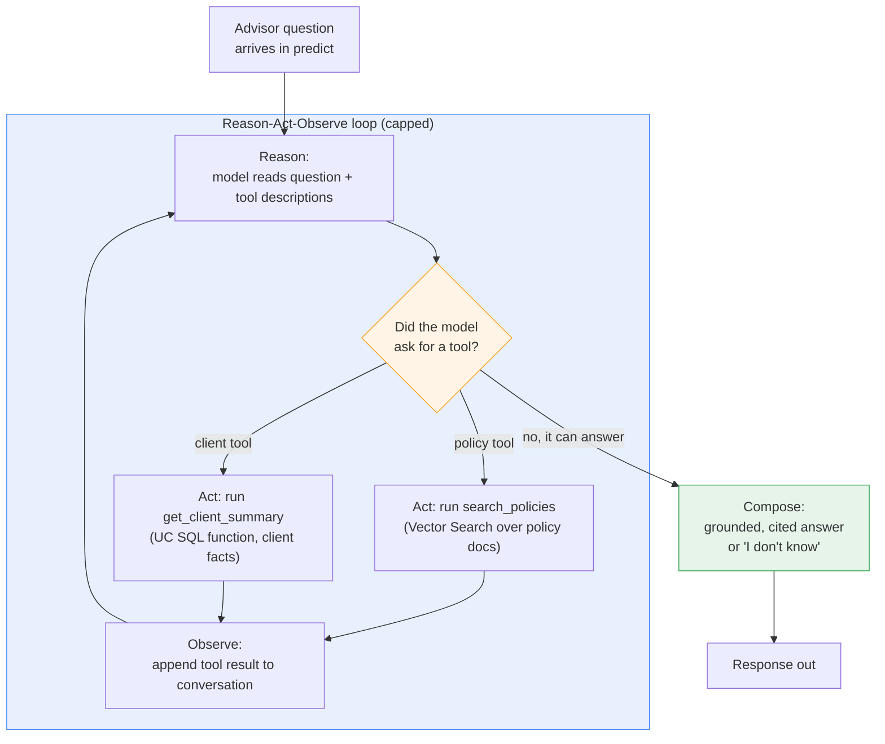
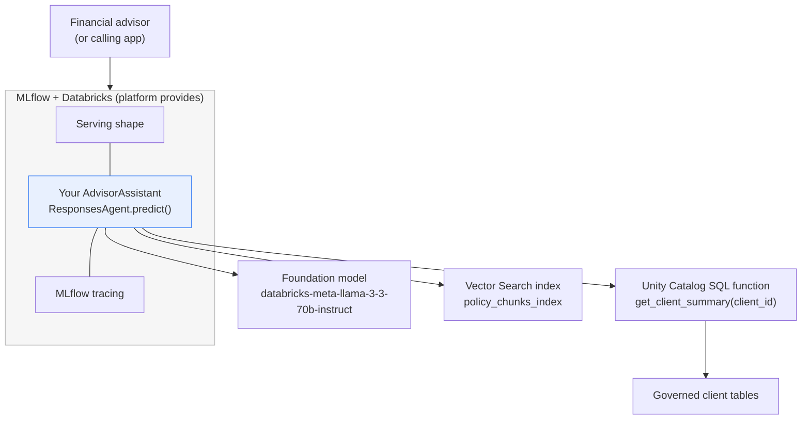

# Building the Capstone Agent

> You have gathered every ingredient across this course: retrieval, tools, function calling, and the `ResponsesAgent` interface. Today you cook the actual meal. By the end of this lesson you will have a real, running agent, Northwind Trust's Advisor Assistant, that answers a financial advisor's questions using only facts it can look up, and cites its sources. You have done all the hard parts already. Now you just connect them.

Take a breath. This is a code-heavy build lesson, and that is exactly what you signed up for. We will move slowly, narrate every code block, and pause to celebrate each milestone. You are building a real agent today. You are ready.

## Learning Objectives

By the end of this lesson, you will be able to:

- Define the two tools your agent needs: an unstructured retrieval tool (Vector Search over policy documents) and a structured tool (a Unity Catalog SQL function for client facts).
- Describe both tools to the model so function calling can choose between them.
- Implement a `ResponsesAgent` subclass whose `predict` method runs the reason-act-observe loop.
- Compose a grounded, cited answer and enforce the "only answer from retrieved or queried facts, otherwise say I don't know" rule.
- Turn on MLflow tracing so every run is fully observable.
- Test the agent locally on a policy question, a client-data question, and a compound question that needs both tools.

## Prerequisites

Before this lesson, it helps to have read:

- [Capstone Overview](/docs/capstone/overview) — the business scenario and what you are building.
- [Authoring an Agent with ResponsesAgent](/docs/building-agents/authoring-agents) — the one-class, one-method pattern you will reuse here.
- [Retrieval Tools](/docs/agents-tools-mcp/retrieval-tools) — how an agent pulls real context from a Vector Search index.

If you have seen those, you are in great shape. If some feel fuzzy, that is fine. We re-explain each piece as we use it.

## Estimated Reading Time

About 40 minutes.

## Business Motivation

Let's ground this in a real job to be done.

**Northwind Trust** is a wealth management firm. Their financial advisors spend a surprising amount of their day answering two kinds of questions:

- **Policy questions.** "What is the early-withdrawal penalty on a retirement account?" The answer lives in long policy PDFs. This is *unstructured* text.
- **Client-fact questions.** "What is the balance and risk profile for client NW-10432?" The answer lives in database tables. This is *structured* data.

And often, the real question is **both at once**: "Given this client's holdings, are they allowed to make an early withdrawal, and what would the penalty be?" Answering that means looking up the client's facts *and* reading the policy, then combining them.

A plain language model cannot do this. It has never seen Northwind's private policies or client accounts, and if it guesses, it could give an advisor wrong, even non-compliant, information. That is a serious risk in a regulated industry.

What Northwind wants is an **Advisor Assistant**: an agent that looks up real policy text, queries real client facts, combines them, and answers only from what it actually retrieved, citing its sources. If the answer is not in the retrieved material, it must say so plainly rather than invent one. That is the agent you are about to build.

## Intuition

Before any code, let's build the mental picture.

Imagine a careful, junior research assistant sitting at a desk. On the desk are two things:

- A **filing cabinet** full of policy documents. When asked a policy question, the assistant walks to the cabinet, pulls the most relevant pages, and reads them.
- A **client rolodex** (a database). When asked about a specific client, the assistant looks up that client's card and reads the facts.

The assistant follows one strict rule: **only answer from what is on the desk.** If neither the cabinet nor the rolodex has the answer, the assistant says, "I don't know, that isn't in our records," rather than guessing.

Your agent is exactly this assistant. The filing cabinet is a **Vector Search index** over policy docs. The rolodex is a **Unity Catalog SQL function** that returns client facts. The "which one do I reach for?" decision is **function calling**: the model reads the question and asks your code to run the right tool. And the strict rule is a line in your **system prompt** plus the discipline of your code.

That is the whole idea. Two tools, a model that chooses between them, and a rule that keeps everyone honest.

## Theory

Let's name the pieces properly so the code feels familiar.

**A tool is a function the model can ask your code to run.** You describe each tool to the model as a small JSON schema: its name, what it does, and what arguments it takes. The model never runs anything itself. It only *asks*. Your code decides whether and how to run the tool. That separation is what keeps the agent safe.

Your agent has two tools:

1. **`search_policies` (unstructured retrieval).** It takes a plain-English query and returns the top few policy passages from a Vector Search index, each with its document title so we can cite it. This is retrieval-augmented generation: fetch relevant text, then let the model answer from it.

2. **`get_client_summary` (structured lookup).** It takes a `client_id` and returns that client's facts (name, balance, risk profile, account type) from a governed Unity Catalog SQL function. Structured, exact, auditable.

**Function calling** is how the model picks. You hand the model both tool descriptions along with the user's question. The model reads the question and responds in one of three ways:

- "I can answer directly." (Rare here, because we insist on grounding.)
- "Please run `search_policies` with this query."
- "Please run `get_client_summary` with this `client_id`."

It can even ask for both, in sequence, for a compound question. Your code runs whatever it asks, feeds the results back, and asks again, until the model has enough to write a final, grounded answer.

The **`ResponsesAgent`** is MLflow's standard interface for agents. You subclass it and implement one method, `predict`, which takes the conversation in and returns the reply out. Inside `predict` you run the loop above. Because the interface is standard, the platform gives you tracing, serving, and deployment almost for free.

## Deep Dive

Let's look closely at the loop inside `predict`, because it is the heart of the whole agent. It is often called the **reason-act-observe** loop:

1. **Reason.** Send the conversation plus both tool descriptions to the foundation model. The model reasons about what it needs.
2. **Act.** If the model asks for a tool, your code runs it. If it does not ask for a tool, the model has decided it can answer, and we skip to step 4.
3. **Observe.** Your code appends the tool's result back into the conversation as an observation, then loops to step 1. Now the model can reason again with the new fact in hand.
4. **Compose.** When the model stops asking for tools, it writes the final answer, grounded in everything observed, with citations.

For a policy-only question, the loop runs once around: reason, act (`search_policies`), observe, compose. For a client-only question, the same but with `get_client_summary`. For a **compound** question, the loop runs twice around, gathering both a client fact and a policy passage before composing.

Two design rules keep this trustworthy:

- **The "say I don't know" rule.** The system prompt tells the model: only use facts from tool results; if the facts needed are not there, say you don't know. This is your guardrail against confident-but-wrong answers, called hallucinations.
- **A turn limit.** The loop could, in theory, run forever if a confused model keeps asking for tools. We cap it. A cap is cheap insurance.

Here is that internal flow, the diagram you should keep in your head for the rest of the lesson.



*Figure 1: The agent's internal decision and tool flow. The model reasons about the question, may ask for the retrieval tool and/or the structured tool, observes each result, and only then composes a grounded, cited answer, or says "I don't know" when the facts aren't there.*

## Architecture

Let's zoom out to see where your agent sits and what it talks to.

Your `ResponsesAgent` is a small unit in the middle. Above it, MLflow and Databricks provide serving and tracing. Below it, two data sources: the Vector Search index for policy text, and Unity Catalog for the client-facts function and the underlying tables.



*Figure 2: The capstone architecture. You author only the blue box. It calls one foundation model to reason, one Vector Search index for unstructured policy text, and one Unity Catalog function for structured client facts. MLflow wraps it with serving and tracing.*

The takeaway: your responsibility is small and clear. You write one class. Everything it reaches, the model, the index, the function, is a governed Databricks resource you already know how to create.

## Internal Working

How does one `predict` call actually flow through the system? Let's trace a compound question step by step, in words, before the code.

An advisor asks: *"Client NW-10432 wants an early withdrawal. Are they allowed, and what's the penalty?"*

1. `predict` reads the message and prepends the system prompt (Northwind's voice plus the "say I don't know" rule).
2. It calls the model with both tool descriptions attached.
3. The model reasons: *"I need this client's facts first."* It asks for `get_client_summary("NW-10432")`.
4. Your code runs the Unity Catalog function, gets back the client's account type and balance, and appends that as an observation.
5. It calls the model again. Now the model reasons: *"I have the account type. I still need the early-withdrawal policy."* It asks for `search_policies("early withdrawal penalty retirement account")`.
6. Your code queries the Vector Search index, gets the top policy passages with their titles, and appends them as an observation.
7. It calls the model a third time. Now the model has both the client facts and the policy text. It writes a grounded answer and cites the policy document.
8. `predict` returns that answer.

MLflow tracing sits quietly around all of this: because your agent follows the standard interface, every model call, tool call, and timing is recorded as a single trace you can open and inspect. You will turn that on with one line.

## Step-by-Step Walkthrough

Here is the plan for the rest of the lesson. We build the Advisor Assistant in five small steps:

1. **Define the retrieval tool** (`search_policies`) over the Vector Search index.
2. **Define the structured tool** (`get_client_summary`) that calls a Unity Catalog SQL function.
3. **Describe both tools** to the model and wire function calling.
4. **Implement the `ResponsesAgent`** whose `predict` runs the reason-act-observe loop, composes a grounded and cited answer, and enforces "say I don't know."
5. **Turn on tracing and test locally** on three realistic questions.

Each step is small. Take them one at a time, and read the narration under every code block before moving on.

## Hands-on Examples

Before the full code, a tiny dry run in words for each of the three question types, so the code has something to hang onto.

- **Policy only:** *"What is the early-withdrawal penalty on a retirement account?"* The model asks for `search_policies`, reads the returned passage, and answers with a citation. One trip around the loop.
- **Client only:** *"What is the risk profile for client NW-10432?"* The model asks for `get_client_summary`, reads the facts, and answers. One trip around the loop.
- **Compound:** *"Can client NW-10432 make an early withdrawal, and what's the penalty?"* The model asks for `get_client_summary`, then `search_policies`, then composes. Two trips around the loop.
- **Unanswerable:** *"What's the weather in Chicago?"* Neither tool helps. The model, held to the rule, replies that it doesn't have that information. Zero useful tools, honest answer.

Now let's write it.

## Code Examples

We build this up piece by piece. All of this lives in one file, `advisor_assistant.py`. Read each block, then read the narration below it.

### Step 0: Imports and clients

First, the setup: the libraries, the model client, and the Vector Search client.

```python
# advisor_assistant.py
import json

import mlflow
from databricks.sdk import WorkspaceClient
from databricks.vector_search.client import VectorSearchClient
from mlflow.pyfunc import ResponsesAgent
from mlflow.types.responses import ResponsesAgentRequest, ResponsesAgentResponse

# Turn on tracing for every OpenAI-style call the agent makes. One line.
mlflow.openai.autolog()

# The OpenAI-compatible client, already pointed at your Databricks models.
# WorkspaceClient() picks up your identity automatically when on Databricks.
openai_client = WorkspaceClient().serving_endpoints.get_open_ai_client()

# The Vector Search client, for querying the policy index.
vs_client = VectorSearchClient()

LLM_ENDPOINT = "databricks-meta-llama-3-3-70b-instruct"
MAX_TURNS = 4  # cap the reason-act-observe loop so it can never run forever
```

Let's walk through the setup.

- The imports bring in everything we need: `json` for parsing tool arguments, `mlflow` for tracing, the Databricks SDK's `WorkspaceClient`, the `VectorSearchClient`, and the `ResponsesAgent` base class with its request and response types.
- `mlflow.openai.autolog()` is your one-line observability. From now on, every model call the agent makes is recorded as a trace. Placing it at import time means it is on before any request arrives.
- `openai_client` is the OpenAI-compatible client. `WorkspaceClient().serving_endpoints.get_open_ai_client()` hands you a standard client already wired to your workspace's hosted models. No API keys to manage; your identity is picked up for you.
- `vs_client` is how we talk to the Vector Search index.
- `LLM_ENDPOINT` names the reasoning model. `MAX_TURNS` is our safety cap on the loop. Four is plenty: a compound question needs two tool trips, so four leaves comfortable headroom.

### Step 1: The retrieval tool (unstructured)

Now the first tool, which searches the policy documents. This is ordinary Python that queries the Vector Search index you built earlier.

```python
POLICY_ENDPOINT = "northwind_vs_endpoint"
POLICY_INDEX = "northwind.rag.policy_chunks_index"


def search_policies(query: str, num_results: int = 3) -> str:
    """Return the top policy passages for a plain-English query,
    each labeled with its source document so the model can cite it."""
    index = vs_client.get_index(
        endpoint_name=POLICY_ENDPOINT,
        index_name=POLICY_INDEX,
    )
    results = index.similarity_search(
        query_text=query,
        columns=["chunk_text", "doc_title"],
        num_results=num_results,
    )

    # similarity_search returns rows; format them into a clean, citable string.
    rows = results.get("result", {}).get("data_array", [])
    if not rows:
        return "NO_POLICY_MATCHES"

    passages = []
    for row in rows:
        chunk_text, doc_title = row[0], row[1]
        passages.append(f"[Source: {doc_title}]\n{chunk_text}")
    return "\n\n".join(passages)
```

Let's narrate this carefully, because grounding and citation both start here.

- `POLICY_ENDPOINT` and `POLICY_INDEX` name the Vector Search index over your chunked policy documents.
- `search_policies` takes a plain-English `query` and asks the index for the closest `num_results` passages. Because the index manages embeddings, you pass plain text and Databricks turns it into a vector with the same model that built the index. No mismatch possible.
- We request two columns: `chunk_text` (the passage) and `doc_title` (so we can cite the source). That `doc_title` is what makes a *cited* answer possible.
- If there are no matches, we return the sentinel `"NO_POLICY_MATCHES"`. That is deliberate: it gives the model a clear signal that the cabinet was empty, which supports the "say I don't know" rule.
- Otherwise we format each hit as `[Source: <title>]` followed by the text. Handing the model the source label in the observation is what lets it cite cleanly in the final answer.

### Step 2: The structured tool

Now the second tool, which looks up a client's facts by calling a governed Unity Catalog SQL function named `get_client_summary`.

```python
def get_client_summary(client_id: str) -> str:
    """Look up one client's facts by calling the governed
    Unity Catalog SQL function northwind.crm.get_client_summary."""
    ws = WorkspaceClient()
    resp = ws.statement_execution.execute_statement(
        warehouse_id="YOUR_SQL_WAREHOUSE_ID",
        statement="SELECT northwind.crm.get_client_summary(:cid) AS summary",
        parameters=[{"name": "cid", "value": client_id}],
    )

    rows = resp.result.data_array if resp.result else None
    if not rows:
        return "NO_CLIENT_FOUND"
    return rows[0][0]  # the summary string the SQL function returned
```

Let's walk through it.

- `get_client_summary` takes a `client_id` and runs a SQL statement that calls the Unity Catalog function `northwind.crm.get_client_summary(...)`. Because it is a *governed* UC function, permissions and auditing are handled by Unity Catalog, not by your Python. That is the whole point of a structured tool: exact facts, with governance built in.
- We use the SDK's `statement_execution.execute_statement` against a SQL warehouse. Note the **parameterized** query: the `client_id` is passed as a bound parameter, never string-concatenated into the SQL. That is your defense against SQL injection.
- If no row comes back, we return `"NO_CLIENT_FOUND"`, another honest sentinel that supports the "say I don't know" rule.
- Otherwise we return the summary string the function produced, for example: *"NW-10432: Jordan Lee, Retirement (IRA), balance 210,400, risk profile Conservative."*

:::note[Going deeper (optional)]

In production you would more often register `get_client_summary` as a **Unity Catalog function tool** (or expose the tables through **Genie**) so the agent framework calls it directly and governs it for you. We call it explicitly here so you can see every moving part. The mental model is identical either way: the model asks, your governed function answers.

:::

### Step 3: Describe both tools to the model

The model can only choose a tool it knows exists. So we describe both as JSON schemas and register a small dispatch table.

```python
TOOLS = [
    {
        "type": "function",
        "function": {
            "name": "search_policies",
            "description": (
                "Search Northwind Trust policy documents for passages "
                "relevant to a plain-English question. Use for questions "
                "about rules, penalties, fees, eligibility, or procedures."
            ),
            "parameters": {
                "type": "object",
                "properties": {
                    "query": {
                        "type": "string",
                        "description": "A plain-English search query.",
                    }
                },
                "required": ["query"],
            },
        },
    },
    {
        "type": "function",
        "function": {
            "name": "get_client_summary",
            "description": (
                "Look up one client's facts (name, account type, balance, "
                "risk profile) by client id. Use for questions about a "
                "specific client, e.g. 'NW-10432'."
            ),
            "parameters": {
                "type": "object",
                "properties": {
                    "client_id": {
                        "type": "string",
                        "description": "The client id, e.g. 'NW-10432'.",
                    }
                },
                "required": ["client_id"],
            },
        },
    },
]

# Map tool names to the real Python functions, so we can dispatch by name.
TOOL_FUNCTIONS = {
    "search_policies": search_policies,
    "get_client_summary": get_client_summary,
}
```

Here is what we just did.

- `TOOLS` is the list of tool *descriptions*. Each entry gives the model a name, a plain-English description of when to use the tool, and the arguments it accepts. The model reads these to decide which tool fits the question. Notice how the descriptions hint at *when* to reach for each: policy questions versus a specific client. Clear descriptions are the single biggest lever on whether the model picks the right tool.
- `TOOL_FUNCTIONS` maps each tool name back to the real Python function. When the model asks for `"search_policies"`, we look it up here and call it. This little dictionary keeps the dispatch code clean, no long chain of if-statements.

### Step 4: The ResponsesAgent and its predict loop

Now the centerpiece. We subclass `ResponsesAgent`, write the system prompt that carries Northwind's voice and the "say I don't know" rule, and implement `predict` as the reason-act-observe loop.

```python
SYSTEM_PROMPT = (
    "You are the Advisor Assistant for Northwind Trust, a wealth "
    "management firm. You help financial advisors.\n\n"
    "STRICT RULES:\n"
    "1. Answer ONLY using facts returned by your tools "
    "(search_policies, get_client_summary). Do not use outside "
    "knowledge and never invent policy details or client facts.\n"
    "2. If the tools do not return the facts needed, reply exactly: "
    "'I don't know based on Northwind's records.' Do not guess.\n"
    "3. When you use a policy passage, cite its source document "
    "(the [Source: ...] label) in your answer.\n"
    "4. Be warm, clear, and concise."
)


class AdvisorAssistant(ResponsesAgent):
    def predict(self, request: ResponsesAgentRequest) -> ResponsesAgentResponse:
        # 1. Read the conversation and prepend the system prompt.
        messages = [{"role": "system", "content": SYSTEM_PROMPT}]
        messages += [m.model_dump() for m in request.input]

        # 2. Run the reason-act-observe loop, capped at MAX_TURNS.
        for _ in range(MAX_TURNS):
            completion = openai_client.chat.completions.create(
                model=LLM_ENDPOINT,
                messages=messages,
                tools=TOOLS,
            )
            choice = completion.choices[0].message

            # No tool requested -> the model is ready to answer. Done.
            if not choice.tool_calls:
                break

            # The model asked for one or more tools. Run each and observe.
            messages.append(choice.model_dump())
            for call in choice.tool_calls:
                fn = TOOL_FUNCTIONS[call.function.name]
                args = json.loads(call.function.arguments)
                result = fn(**args)
                messages.append(
                    {
                        "role": "tool",
                        "tool_call_id": call.id,
                        "content": result,
                    }
                )
            # Loop again: the model now reasons with the new observations.

        # 3. Compose: return whatever the model finally wrote.
        answer = choice.content or "I don't know based on Northwind's records."
        return ResponsesAgentResponse(
            output=[
                {
                    "type": "message",
                    "role": "assistant",
                    "content": [{"type": "output_text", "text": answer}],
                }
            ]
        )


from mlflow.models import set_model

set_model(AdvisorAssistant())
```

This is the heart of the agent, so let's narrate it slowly.

- `SYSTEM_PROMPT` is where the "say I don't know" rule and the citation rule live. Rule 1 forbids outside knowledge. Rule 2 gives the model an exact sentence to use when the facts are missing, so it never fills the gap with a guess. Rule 3 tells it to cite the `[Source: ...]` labels our retrieval tool provides. This prompt is your primary guardrail against hallucination.
- Step 1 reads the incoming conversation from `request.input` and prepends the system prompt. `m.model_dump()` turns each message into the plain dictionary the model client expects.
- Step 2 is the loop, and it is exactly Figure 1 in code. Each pass calls the model with both tool descriptions attached (`tools=TOOLS`). If the model returns no `tool_calls`, it has decided it can answer, so we `break`. If it did ask for tools, we append its request to the conversation, then run each requested tool: we look up the real function in `TOOL_FUNCTIONS`, parse the arguments, call it, and append the result as a `tool` message (the "observe" step). Then the loop repeats so the model can reason again with the new fact in hand.
- The `for _ in range(MAX_TURNS)` wrapper is the cap. Even if a confused model kept asking for tools, the loop cannot run more than four times. Safety without complexity.
- Step 3 composes. Whatever the model wrote on its final pass is the answer. The `or` fallback covers the rare case where the model returns no text, defaulting to the honest "I don't know."
- Finally, `set_model(AdvisorAssistant())` marks this object as *the* agent, so MLflow's models-from-code logging knows what to serve. That one line is easy to forget and important to include.

### Step 5: Test it locally

Before deploying anything, call the agent right on your machine with the three question types. We call `predict` directly here for clarity.

```python
agent = AdvisorAssistant()


def ask(question: str):
    response = agent.predict(
        ResponsesAgentRequest(
            input=[{"role": "user", "content": question}]
        )
    )
    print(question)
    print("->", response.output[0]["content"][0]["text"])
    print()


# 1. Policy-only question -> uses search_policies
ask("What is the early-withdrawal penalty on a retirement account?")

# 2. Client-only question -> uses get_client_summary
ask("What is the risk profile for client NW-10432?")

# 3. Compound question -> uses both tools, in sequence
ask("Client NW-10432 wants an early withdrawal. Are they allowed, "
    "and what would the penalty be?")

# 4. Unanswerable -> neither tool helps, model says it doesn't know
ask("What's the weather in Chicago today?")
```

Let's read what to expect.

- The `ask` helper wraps a question in a `ResponsesAgentRequest`, calls `predict`, and prints the assistant's text out of the standard response envelope.
- Watch for the right behavior on each: a citation on the policy answer (Q1), an exact fact on the client answer (Q2), and on the compound question (Q3) two tool calls combined into one grounded, cited answer, your agent reasoning across structured and unstructured data.
- Question 4 should produce "I don't know based on Northwind's records." Seeing the guardrail hold is as important as seeing the others succeed.

If you run these and see the right tool fire for each, with citations on the policy answers and an honest "I don't know" on the last one, congratulations. You have built a real, grounded, multi-tool agent. Take a moment. That is a genuine milestone.

To confirm the loop worked as you expect, open the **MLflow trace** for any run. Because you called `mlflow.openai.autolog()` at the top, each run recorded its model calls and tool calls in order. For question 3 you should see two tool calls in the trace, exactly as the loop intended.

## Production Considerations

A few things to tighten before this leaves your laptop:

- **Register the tools in Unity Catalog.** Prefer a UC function tool (or Genie) over inline Python for `get_client_summary`, so permissions and audit come from the platform. Log the agent with models-from-code and register it in Unity Catalog.
- **Externalize configuration.** The endpoint names, index name, warehouse id, and prompt should be config, not buried constants, so you can change models or indexes without editing logic.
- **Keep the turn cap.** `MAX_TURNS` is not just a demo nicety. In production it protects you from runaway loops and runaway cost.
- **Version everything through MLflow.** Every log is a new version and a rollback path.

## Performance Considerations

- **Each loop pass is a model call.** A compound question means at least three model calls plus two tool calls. Keep tool descriptions sharp so the model does not take extra hops.
- **Tune `num_results`.** Returning three passages is a good default. Returning ten makes prompts longer, slower, and pricier without usually improving the answer.
- **The SQL warehouse has a cold start.** The first `get_client_summary` call may be slow if the warehouse was asleep. Use a warehouse that stays warm for interactive use.
- **Stream for perceived speed.** Implementing `predict_stream` lets advisors see the answer appear as it is written. It does not make the work faster, but it feels much faster.

## Security Considerations

- **Parameterize every query.** We passed `client_id` as a bound parameter, never concatenated into SQL. Do this always. It is your defense against SQL injection through a crafted question.
- **Least privilege for the agent's identity.** The agent should read only what it needs. It should never hold write access to client accounts.
- **Filter retrieval by entitlement.** If some policies are restricted, apply metadata filters in `search_policies` so an advisor only retrieves what they are allowed to see.
- **Mind what lands in traces.** Traces are wonderfully detailed, which means they can capture client data. Treat trace storage as sensitive and keep secrets out of prompts entirely.
- **Treat the user message as untrusted.** A question could try to talk the model out of its rules (prompt injection). Your governed tools and your code-side checks, not the prompt alone, are the real safety net.

## Common Mistakes

- **Forgetting to feed tool results back.** After running a tool you must append the result and loop, so the model can reason with it. Skip this and you have data but no answer.
- **No "say I don't know" rule.** Without it, the model fills gaps with plausible fiction. In finance, that is dangerous. The rule is not optional.
- **Dropping citations.** If the retrieval tool does not return the source title, the model cannot cite. Always fetch and pass the `doc_title`.
- **Omitting `set_model`.** Without it, models-from-code logging does not know which object is the agent.
- **No turn cap.** A confused model can loop indefinitely. Always cap it.
- **String-building SQL.** Concatenating a `client_id` into a query is an injection risk. Parameterize.

## Best Practices

- **Assemble from verified pieces.** Get each tool working alone first, then wire them into `predict`. Small, verified steps.
- **Write tool descriptions like you are onboarding a new hire.** The model chooses tools from their descriptions. Clear "use this when..." wording is the biggest quality lever.
- **Make the guardrail explicit.** Put the grounding rule, the exact "I don't know" sentence, and the citation rule in the system prompt.
- **Turn on tracing from line one.** `mlflow.openai.autolog()` costs nothing and saves hours.
- **Test the unanswerable case on purpose.** Proving the agent says "I don't know" is as valuable as proving it answers.

## Interview Questions

1. **Your agent uses two tools, one over policy PDFs and one over client tables. Why two different kinds of tool, and how does the model choose between them?**
   The policy docs are unstructured text, best served by a Vector Search retrieval tool that finds relevant passages by meaning. The client facts are structured data, best served by a governed SQL function that returns exact values. The model chooses via function calling: you describe both tools, and the model reads the question and asks for whichever fits, or both in sequence for a compound question.

2. **Walk me through what `predict` does for a compound question that needs both a client fact and a policy.**
   It prepends the system prompt, then loops. First model call: the model asks for `get_client_summary`; the code runs it and appends the result. Second model call: with the client fact in hand, the model asks for `search_policies`; the code runs it and appends the passages. Third model call: the model now has both observations and writes a grounded, cited answer, which `predict` returns.

3. **How does the agent avoid making up an answer, and where is that enforced?**
   Enforcement is in the system prompt: answer only from tool results, and if the facts are not there, say "I don't know based on Northwind's records." The tools also return explicit sentinels (`NO_POLICY_MATCHES`, `NO_CLIENT_FOUND`) so the model gets a clear "nothing found" signal rather than an empty result it might paper over.

4. **Why cap the loop with `MAX_TURNS`, and what would happen without it?**
   The reason-act-observe loop repeats whenever the model asks for another tool. A confused model could keep asking forever, running up latency and cost. The cap bounds the number of model and tool calls, guaranteeing the agent always terminates.

5. **How do you make this agent observable, and what would you look for in a trace?**
   Enable MLflow tracing with `mlflow.openai.autolog()`. In a trace you can see each model call, each tool call with its arguments and result, and timings. For a compound question you would expect to see two tool calls in order; if the wrong tool fired or a tool was skipped, the trace shows exactly where.

## Quiz

**Question 1:** Which tool should the agent use for "What is the fee for a wire transfer?" and which for "What is client NW-10432's balance?"

<details>

<summary>Show answer</summary>

The wire-transfer fee is a policy question, so the model uses `search_policies` (Vector Search over the unstructured policy docs). The balance is a specific-client fact, so it uses `get_client_summary` (the structured Unity Catalog SQL function).

</details>

**Question 2:** After the model asks to run a tool, what must your code do before the model can produce a final answer?

<details>

<summary>Show answer</summary>

Run the tool in your own code, append its result to the conversation as a `tool` message (the "observe" step), then call the model again so it can reason with the new fact. For a compound question this repeats before the model composes the final answer.

</details>

**Question 3:** The user asks something neither tool can answer. What should the agent do, and why?

<details>

<summary>Show answer</summary>

It should reply "I don't know based on Northwind's records" rather than guess. The system prompt forbids using outside knowledge and gives that exact sentence, which prevents hallucinated, potentially non-compliant answers in a regulated setting.

</details>

**Question 4:** What is the purpose of returning the `doc_title` from `search_policies`?

<details>

<summary>Show answer</summary>

It lets the agent cite its source. The retrieval tool formats each passage with a `[Source: ...]` label, and the system prompt instructs the model to include that citation in its answer, so advisors can verify where a policy statement came from.

</details>

## Key Takeaways

Everything you assembled here is a piece you had already learned; the win was wiring them into one coherent, trustworthy agent.

- Two tools cover two data shapes: a Vector Search retrieval tool for unstructured policy text, and a Unity Catalog SQL function for structured client facts.
- Function calling lets the model choose the right tool, or both, from your tool descriptions.
- `predict` is the reason-act-observe loop: reason with the model, act by running a tool, observe by appending its result, repeat, then compose.
- The "say I don't know" rule and citations live in the system prompt; they are your guardrails against hallucination.
- Return the source title from retrieval so the model can cite it.
- Cap the loop with a turn limit so it always terminates.
- Parameterize SQL and use governed UC functions so security and audit come from the platform.
- `mlflow.openai.autolog()` gives you full tracing in one line; open the trace to confirm the tools fired as intended.

## Glossary

- **Advisor Assistant:** Northwind Trust's capstone agent, which answers advisor questions from policy docs and client data.
- **Retrieval tool (unstructured):** A tool that searches a Vector Search index for text passages relevant to a query.
- **Structured tool:** A tool that returns exact facts from tables, here a governed Unity Catalog SQL function.
- **Function calling:** The mechanism by which the model asks your code to run a described tool.
- **ResponsesAgent:** MLflow's standard agent interface; you subclass it and implement `predict`.
- **Reason-act-observe loop:** The cycle inside `predict`: the model reasons, your code runs a tool (act), you append the result (observe), and it repeats until the model composes an answer.
- **Grounded answer:** An answer built only from facts the tools returned, not from the model's memory.
- **Citation:** A reference to the source document a policy statement came from.
- **Say I don't know rule:** The instruction to reply honestly when the needed facts are not in the tool results.
- **MLflow tracing:** Automatic recording of each model and tool call in a run, for observability.
- **set_model:** The call that marks which object in the file is the agent to serve.
- **Turn limit:** A cap on how many times the loop may repeat, so it always terminates.

## Further Reading

- [Author agents using MLflow ResponsesAgent (Databricks docs)](https://docs.databricks.com/aws/en/generative-ai/agent-framework/author-agent)
- [Unity Catalog function tools for agents (Databricks docs)](https://docs.databricks.com/aws/en/generative-ai/agent-framework/create-custom-tool)
- [Capstone Overview](/docs/capstone/overview)
- [Authoring an Agent with ResponsesAgent](/docs/building-agents/authoring-agents)
- [Retrieval Tools](/docs/agents-tools-mcp/retrieval-tools)

## Next Lesson

You have a working agent. Next you will prove it is good, ship it safely, and keep it compliant.

➡️ [Evaluate, Deploy, and Govern the Capstone](/docs/capstone/evaluate-deploy-govern)
