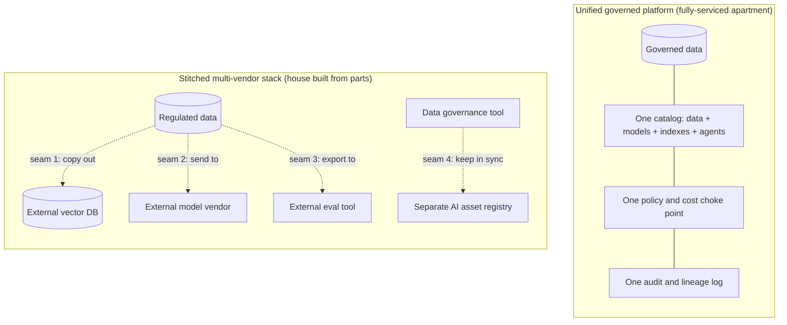
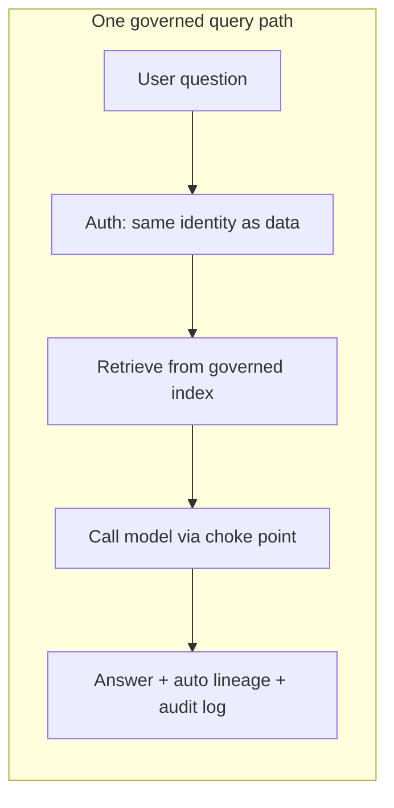

# Regulated Companies Without a Unified Platform

> Cascade Mutual, an insurer, wants to ship an AI assistant that answers questions about claims. The model is the easy part. The hard question in the room is not "which model?" — it's "who touched this data, what did the model say, and can we prove it to a regulator?" That question has the same answer whether or not you use Databricks. What differs is how much of the answer you build yourself.

Take a breath, because there's a comforting truth hiding in this lesson. If you're at a bank, an insurer, or a healthcare company and you do **not** use Databricks, you are not missing out on AI. Plenty of regulated firms ship excellent, compliant AI without it. The AI concepts you've learned — prompts, retrieval, agents, evaluation, tracing — are completely portable. What a unified platform gives you is not *magic AI*. It's a single, governed place where the boring-but-essential parts live: who can see what, where the data went, what the model said, and what it cost. This lesson is an honest look at what you must otherwise assemble yourself, and the trade-offs of doing so. No sales pitch. Just the map.

## Learning Objectives

By the end of this lesson, you will be able to:

- Explain why, for a regulated company, the hardest part of production AI is **governance**, not the model.
- Name the six things a unified platform provides in one place: governance, lineage, a policy and cost choke point, unified access control, a governed data boundary, and audit trails.
- Describe what a firm must **assemble and operate themselves** when they don't have a unified platform.
- Compare a **unified governed platform** with a **stitched-together multi-vendor stack**, and point to the "seams" a regulated firm must secure and audit.
- Frame the decision fairly as **build-versus-buy** — not "Databricks or fail."
- Recognize that cloud-native platforms and mature DIY stacks can meet the same bar with more integration work.

## Prerequisites

- [The Concepts Are Portable](/docs/beyond-databricks/concepts-are-portable) — the reassurance that your AI skills travel anywhere.
- [The Unity AI Gateway](/docs/governance/unity-ai-gateway) — the single front door for model traffic, so you know what a "choke point" looks like.
- [Authentication and Permissions](/docs/governance/auth-and-permissions) — how one identity model can span data and AI.

You do **not** need to have run a compliance audit before. If you've ever had to explain to an auditor where a number came from, you already have the instinct this lesson builds on.

## Estimated Reading Time

About 18 minutes.

## Business Motivation

Let's be honest about why this matters, in plain business terms.

For a regulated company, shipping AI is not blocked by the model. Good models are available to everyone, from many vendors, cheaply. The thing that actually holds up a launch — the thing that makes lawyers and risk officers nervous — is a set of questions that have nothing to do with how clever the model is:

- **Who is allowed to see this data, and did the AI respect that?** A claims assistant must never surface one customer's medical details to another customer's agent.
- **Where did this data go?** If regulated data was copied to three different vendors to make the feature work, that's three places it can leak and three contracts to prove it's safe.
- **What did the model actually say, and why?** When a regulator asks "why did you deny this claim," you need to reconstruct the exact data, prompt, and model behind that answer.
- **What did it cost, and who spent it?** Budgets and rate limits, but also the audit trail that shows spend was controlled.

Here's the key message, stated plainly: **the hardest part of regulated AI is governance, security, lineage, audit, access control, and cost control — over both the data and the AI on top of it.** A unified platform provides those in one governed place and, crucially, keeps the data and the AI together so data doesn't sprawl across vendors. Without such a platform, you can absolutely still meet the bar — many firms do, and do it well — but you assemble and operate that layer yourself. That means more integration work, more seams to secure, more places data can leak, and more to prove to auditors.

That's the whole trade-off. Everything below is detail.

## Intuition

Here's the simplest analogy, and it will carry the whole lesson.

Think about where you live.

- A **unified governed platform** is like buying a **fully-serviced apartment**. The plumbing, wiring, fire alarms, and security system are already installed, inspected, and connected to one building management office. You still furnish it and live your life — but the safety infrastructure came built-in and it all talks to one front desk.
- A **stitched-together stack** is like **building a house from parts you buy separately**. Great plumbing from one supplier, great wiring from another, a good alarm from a third. It can be a wonderful house — arguably more exactly what you want — but *you* are responsible for making the pipes meet the wires meet the alarm. Every joint between two parts is a **seam** you built, so every seam is a seam you must inspect and be able to vouch for.

Both are livable. Both can be safe. The difference is how much of the plumbing you own and how much you must personally prove is sound.

For a regulated insurer like Cascade Mutual, "prove it's sound" is not a metaphor. A regulator will literally ask them to demonstrate that every seam is secured and audited. In the apartment, they point to the building's certificate. In the self-built house, they document every joint themselves.

Neither is wrong. It's a choice about how you spend your effort and where you carry your risk.

## Theory

Let's name the six capabilities that make regulated AI safe. A unified platform bundles these; a DIY stack provides them across several tools. Same list either way — that's the point.

1. **Unified governance over data AND AI assets.** Not just tables and columns, but also models, tools, retrieval indexes, and agents — governed under one catalog with one set of rules. On Databricks this is Unity Catalog spanning both. Without it, you typically run one system for data governance and a separate one for AI assets, and you keep them in sync by hand.
2. **End-to-end lineage.** The ability to answer "which data, which model version, which prompt produced this specific answer?" When data and AI live in one place, lineage is mostly automatic. When they're spread across disconnected tools, lineage is something you reconstruct, often after the fact.
3. **A central policy and cost choke point.** One place all model traffic flows through, where you enforce guardrails, strip or block PII, set rate limits and budgets, and log every request. On Databricks this is the AI Gateway. Without it, you either put controls in each app (and hope no app forgets) or buy a separate gateway product and wire everything through it.
4. **Access control that spans data and AI with one identity model.** The same identity that governs who reads a table should govern who can call a model or query an index. Otherwise you reimplement permissions per system and reconcile them.
5. **A governed data boundary.** Regulated data ideally stays inside one governed perimeter. DIY often means data leaves that perimeter — copied into a separate vector database, sent to a separate model vendor, exported to a separate evaluation tool. Each hop raises egress, residency, and data-processing-agreement concerns.
6. **Audit trails and inference logging.** A durable record of every inference — inputs, outputs, who, when — that compliance can query. This is your evidence when a regulator comes asking.

:::note[Going deeper (optional)]
The reason "data and AI together" matters so much for regulated firms is **data residency and data-processing agreements (DPAs)**. Every time regulated data crosses a vendor boundary, someone in legal has to confirm that vendor is contractually allowed to process it, in the right region, with the right retention. One boundary is one contract to maintain. Five boundaries is five. This is administrative, not technical, but it's often the slowest part of a regulated launch — and it's exactly what a governed boundary reduces.
:::

## Deep Dive

So, concretely, **what is Cascade Mutual missing if they don't use Databricks?**

Honest answer: **not the AI**, and **not the ability to be compliant**. What they're missing is the *built-in, unified* version of the six capabilities above. They can still have every one of them. They just have to:

- **Choose** a tool for each capability (or build it).
- **Integrate** those tools so they hand off cleanly.
- **Secure** every handoff — every seam.
- **Operate** the whole assembly forever: patch it, monitor it, keep the contracts current.
- **Prove** to auditors that the assembly, as a whole, satisfies the rules.

To be completely fair, there are strong ways to do this without Databricks:

- **Cloud-native platforms** (AWS, Azure, GCP) offer governance, model gateways, lineage, and audit as managed services. Wired together thoughtfully, a cloud-native stack can absolutely clear the regulatory bar. It's still more assembly than a single unified platform, but far less than pure DIY.
- **Mature DIY stacks** built by strong platform teams meet the bar too. Many regulated firms have excellent home-grown governance. It works. It just represents real, ongoing engineering investment that someone has to fund and staff.

So this is a **build-versus-buy** decision, and reasonable teams land on both sides. The unified platform trades some flexibility and some vendor lock-in for less integration work and fewer seams. The assembled stack trades more work and more seams for more control and more choice. Neither is "the safe choice" or "the risky choice" in the abstract — the risk lives in how well you execute whichever path you pick.

## Architecture

Here is the comparison at the heart of this lesson. Two ways to arrange the same six capabilities.



**Narration.** On top is the unified platform. The governed data, the catalog of every asset, the single choke point for model traffic, and the audit log are all *inside one box*. There are connections, but they're internal — the building's own plumbing. On the bottom is the stitched stack. Same capabilities, but now they're separate vendors, and the dotted lines are **seams**: places where regulated data or governance state crosses a boundary you built. Seam 1 copies data out to a vector database. Seam 2 sends it to a model vendor. Seam 3 exports it to an evaluation tool. Seam 4 is the human effort of keeping two governance systems agreeing with each other. Every dotted line is something Cascade Mutual must secure, contract for, monitor, and be ready to explain. The stack can be perfectly safe — but *you* own each seam.

Now let's look at what a single request looks like in each world.



**Narration.** In the unified world, one request flows through one path. The identity that checks "are you allowed to see this data?" is the same one that gates the model call. Retrieval happens inside the governed boundary. The model call passes the single choke point, so guardrails and cost limits apply automatically. And the answer comes out with lineage and an audit entry already recorded — you didn't have to wire that up. The regulated-friendly bits are on by default.


**Narration.** Same request, assembled world. The app itself has to check permissions, because there's no shared identity across the pieces — so every app must get this right, and a new app is a new chance to get it wrong. The data was copied into an external vector database earlier (a residency question). The model call goes to an external vendor (a DPA question). Logging lands in yet another tool. And lineage — "which data and prompt produced this answer?" — isn't automatic; someone reconstructs it by correlating logs across systems. Again: **doable, and done well by many teams.** It's just more moving parts, and more to prove.

## Internal Working

Why does the unified path make lineage and audit "just happen," while the stitched path makes them work you do later? It comes down to where the metadata lives.

- In a unified platform, the catalog **records the relationships as a side effect of normal operation.** When a query reads a governed table and calls a governed model, the platform already knows both objects, so it can link them automatically. The lineage graph is a byproduct of everything sharing one metadata store.
- In a stitched stack, each tool records **only its own slice.** The vector DB knows about vectors. The model vendor knows about calls. The eval tool knows about scores. None of them knows about the others. To build end-to-end lineage, you export from each, agree on a shared key (a request ID you thread through every hop), and join it all together — usually in a data warehouse you maintain for exactly this purpose.

That shared-key threading is the quiet cost of the DIY path. It's not hard in principle. It's just something that must be *designed in from day one and never dropped*, because a missing request ID on one hop is a gap in your audit trail — and gaps are what auditors find.

:::note[Going deeper (optional)]
This is why "we'll add lineage later" rarely works in a stitched stack. Lineage can't be reconstructed for requests that already happened without the shared key. If app version 1 didn't thread a request ID through the vector DB and model call, those old requests are simply un-linkable. Unified platforms sidestep this because the linking key exists whether or not you thought to ask for it.
:::

## Step-by-Step Walkthrough

Let's walk Cascade Mutual through the decision, the way a real risk review would.

1. **List the six capabilities.** Governance, lineage, choke point, unified access control, governed boundary, audit. This is the checklist a regulator effectively holds them to.
2. **For each, ask: buy it bundled, or assemble it?** For a unified platform, most are checked by default. For a cloud-native or DIY stack, each is a decision: which tool, how integrated.
3. **Draw the data-flow and circle every boundary crossing.** Each crossing is a seam. Each seam gets a contract (DPA), a security review, and a monitoring plan.
4. **Decide who operates it.** A unified platform is operated largely by the vendor. An assembled stack is operated by Cascade Mutual's platform team — forever. That's a staffing and budget line, not just an architecture choice.
5. **Decide what you'll show the auditor.** Bundled: point to the platform's certifications plus your configuration. Assembled: document the whole assembly, seam by seam, and keep that documentation current as tools change.
6. **Pick the path that matches your team.** A firm with a strong platform team and a desire for control may rationally build. A firm that wants to spend its people on insurance products, not plumbing, may rationally buy. Both are defensible.

## Hands-on Examples

Let's make the "seams" concrete with Cascade Mutual's actual feature: a claims-question assistant.

**Unified path — one governed query path:**

- The claims data already lives in the governed catalog.
- The retrieval index is built from that data, inside the same boundary.
- A claims adjuster asks a question; their identity gates both the data and the model.
- The answer is logged with lineage automatically.
- Data never left the boundary. Seams to secure: essentially the ones inside the platform, covered by its certifications.

**Assembled path — the same feature, DIY:**

- Claims data is copied nightly into an external vector database so retrieval is fast. *(Seam 1: regulated data now lives in a second vendor.)*
- Questions are sent to an external model vendor's API. *(Seam 2: regulated context leaves the perimeter on every call.)*
- Answers and scores are pushed to an external evaluation tool for quality monitoring. *(Seam 3: a third vendor now holds regulated content.)*
- Permissions are enforced by the assistant app itself, since the pieces don't share an identity. *(Seam 4: every app reimplements this.)*
- Lineage is reconstructed by joining logs on a request ID threaded through all three vendors. *(Seam 5: the audit trail depends on this never being dropped.)*

Count them: one path with internal seams, versus five explicit seams to contract, secure, monitor, and prove. The feature is identical. The operational surface is not.

## Code Examples

We'll keep this conceptual on purpose — the point is the *shape* of the data flow, not real code. Here are the two paths as plain bulleted flows.

**One governed query path (unified):**

```text
question
  -> check identity (same one that governs the data)
  -> retrieve from governed index (data stays inside the boundary)
  -> call model through the single choke point (guardrails + budget applied)
  -> return answer
  -> lineage + audit recorded automatically
```

**Data spread across vendors (assembled):**

```text
question
  -> app-specific permission check (each app writes its own)
  -> query EXTERNAL vector DB      (data was copied here earlier)
  -> call EXTERNAL model vendor    (context leaves the perimeter)
  -> send result to EXTERNAL eval  (a third copy of regulated content)
  -> return answer
  -> LATER: gather logs from 3 vendors, join on a request id, rebuild lineage by hand
```

Read them side by side and the trade-off is visible without a single real API call: the unified flow keeps data in one place and records evidence for free; the assembled flow moves data three times and turns evidence into a build task. Both end with a correct answer for the adjuster. They differ entirely in what happened around that answer.

## Production Considerations

- **Seams don't rest.** Each vendor boundary needs monitoring, alerting, and a runbook for when it breaks. A unified platform collapses several of these into one operational surface.
- **Version drift across tools.** When five vendors each ship updates, you re-test the integration five times as often. Budget for it.
- **Data-copy freshness.** If the external vector DB is a nightly copy, retrieval can be a day stale — and stale regulated data has its own compliance implications. Decide the refresh cadence deliberately.
- **Who carries the pager?** Buying shifts much of the operational load to the vendor. Building keeps it in-house. This is a real cost either way; just be clear-eyed about which team it lands on.

## Performance Considerations

- **Extra hops cost latency.** Every seam is a network call. A request that touches an external vector DB and an external model vendor has more round-trips than one that stays inside a single platform. Usually fine — just measure it.
- **Data movement costs money and time.** Copying regulated data into a vector store is bandwidth and storage you pay for, plus the batch window to keep it fresh.
- **A single choke point can become a bottleneck — or a helpful control.** Routing all model traffic through one gateway adds a hop, but it's also the only place you can enforce a global rate limit. That's a feature, not just overhead.
- **Fair note:** a well-tuned assembled stack can be *faster* for a specific workload because you chose each part for that job. Flexibility cuts both ways.

## Security Considerations

- **More seams, more attack surface.** Every boundary crossing is a place credentials are exchanged and data is in transit. Fewer boundaries is simply fewer things to get wrong.
- **Data residency and DPAs multiply per vendor.** Each external tool holding regulated data needs its own contract, its own region check, its own retention policy. This is the slow part of most regulated launches.
- **One identity model beats several.** When the same identity gates data and AI, there's one place to revoke access. When each system has its own, a departing employee must be removed from all of them, and a miss is a gap.
- **Audit completeness is a security property.** If lineage depends on a request ID threaded across vendors, a dropped ID isn't just messy — it's a hole in the record you'll have to explain.
- **Buying is not automatically safer.** A misconfigured unified platform can leak just as surely as a sloppy stack. The platform reduces the *number* of things to secure; it doesn't secure them for you.

## Common Mistakes

- **Thinking the model is the hard part.** For a regulated firm it almost never is. The governance layer is the work.
- **Assuming "no Databricks" means "can't do compliant AI."** Plainly false. Many regulated firms do it beautifully without it.
- **Assuming "we'll assemble it" is free.** It's a real, ongoing engineering and legal investment. Fund it honestly or don't choose it.
- **Copying regulated data to a vendor before legal has cleared it.** The most common way a DIY AI project stalls — or leaks.
- **Adding lineage later.** In a stitched stack, past requests without a shared key can't be linked retroactively. Design it in from day one.
- **Treating this as a religious war.** It's build-versus-buy. Match the choice to your team and your risk appetite.

## Best Practices

- **Start from the six capabilities, not from a vendor.** Decide what you need to prove, then choose how to provide it.
- **Draw the data flow and circle every boundary crossing** before you build anything. Seams you can see are seams you can secure.
- **Minimize the number of places regulated data lives.** Fewer copies, fewer contracts, fewer leaks — regardless of platform.
- **Thread a request ID through every hop from day one** if you go the assembled route. Your future audit depends on it.
- **Use one identity model wherever you can.** One place to grant, one place to revoke.
- **Write down who operates each piece.** Ownership gaps are where reliability and compliance both fail.
- **Revisit the build-versus-buy call as you grow.** The right answer at ten users may differ at ten thousand.

## Interview Questions

1. **"For a regulated company, what is the hardest part of shipping production AI, and why isn't it the model?"** Look for: governance, security, lineage, audit, access control, and cost control over both data and AI — because models are widely available and portable, while proving compliance over data-plus-AI is the real, firm-specific work.
2. **"A firm doesn't use Databricks. What are they actually missing for AI, and what are they not?"** Strong answer: they're not missing the AI concepts (portable) or the ability to be compliant. They're missing the *built-in, unified* governance/lineage/audit/cost layer over data and AI — which they can still achieve by assembling and operating it themselves.
3. **"What is a 'seam' in a stitched-together AI stack, and why do regulators care?"** A seam is any boundary where regulated data or governance state crosses between vendors. Regulators care because each seam is a place data can leak and a thing the firm must secure, contract for, and prove is safe.
4. **"Why is end-to-end lineage easier on a unified platform than across separate tools?"** Because a unified platform records object relationships as a side effect of shared metadata, whereas separate tools each know only their own slice — so lineage must be reconstructed by threading a shared key across every hop.
5. **"Argue fairly for both sides of build-versus-buy for a regulated insurer."** Buy: fewer seams, less integration and operational load, vendor certifications to lean on. Build: more control, tool choice, no lock-in — at the cost of ongoing engineering and legal effort. The right answer depends on team strength and risk appetite, not on one being universally safer.

## Quiz

<details>
<summary>1. For a regulated company, what is usually the hardest part of production AI?</summary>

The governance layer — security, lineage, audit, access control, and cost control over both the data and the AI — not choosing or running the model. Good models are available to everyone; proving compliance is the firm-specific work.

</details>

<details>
<summary>2. True or false: a regulated firm cannot ship compliant AI without a unified platform like Databricks.</summary>

False. Many regulated firms ship excellent, compliant AI without it, using cloud-native services or mature DIY stacks. What a unified platform changes is how much of the governance layer comes built-in versus how much you assemble and operate yourself.

</details>

<details>
<summary>3. In the stitched multi-vendor diagram, what does a "seam" represent, and name one example.</summary>

A seam is a boundary where regulated data or governance state crosses between separate tools — something the firm must secure, contract for, monitor, and be able to prove is safe. Examples: copying data out to an external vector DB, sending context to an external model vendor, exporting results to an external eval tool, or keeping a data-governance system in sync with a separate AI-asset registry.

</details>

<details>
<summary>4. Why is it risky to "add lineage later" in an assembled stack?</summary>

Because end-to-end lineage in a stitched stack depends on a shared request ID threaded through every hop. Requests that already happened without that key can't be linked retroactively, leaving permanent gaps in the audit trail. Unified platforms avoid this because the linking metadata exists automatically.

</details>

## Summary

For a regulated company, the hard part of production AI is governance, security, lineage, audit, access control, and cost control — over both the data and the AI. A unified platform bundles those six capabilities in one governed place and keeps data and AI together so data doesn't sprawl across vendors. Without such a platform, a firm assembles and operates that same layer itself, across several tools, owning every seam between them. Both paths reach compliant, production AI. The difference is how much plumbing you own and how much you must personally prove is sound. It's a build-versus-buy decision — not "Databricks or fail."

## Key Takeaways

- The model is the easy part; **governance over data and AI is the hard part** for regulated firms.
- You are **not missing the AI** without a unified platform — the concepts are portable and compliance is achievable.
- What you'd otherwise assemble: **unified governance, end-to-end lineage, a policy/cost choke point, unified access control, a governed data boundary, and audit trails.**
- Every vendor boundary in a stitched stack is a **seam** you must secure, contract for, monitor, and prove.
- **Cloud-native platforms and mature DIY stacks meet the bar too** — with more integration and operational work.
- Treat it as **build-versus-buy**, matched to your team's strength and risk appetite.

## Glossary

- **Unified platform:** A system where data and AI assets are governed together in one place with shared identity, lineage, and audit. Example: Databricks with Unity Catalog, AI Gateway, and MLflow.
- **Seam:** A boundary where data or governance state crosses between separate tools in an assembled stack — a point you must secure and audit.
- **Lineage:** The record of which data, model version, and prompt produced a given answer.
- **Choke point:** A single path all model traffic flows through, where guardrails, PII handling, rate limits, budgets, and logging are enforced.
- **DPA (data-processing agreement):** A contract governing how a vendor may process your regulated data, including region and retention.
- **Data residency:** The requirement that regulated data stay within a specific region or perimeter.
- **Build-versus-buy:** The decision to assemble and operate a capability yourself versus obtaining it bundled from a platform.
- **Inference logging:** A durable record of each model request and response, used for audit and compliance.

## Further Reading

- [Unity Catalog on Databricks](https://docs.databricks.com/aws/en/data-governance/unity-catalog/index.html) — how one catalog governs data and AI assets together.
- [Data governance with Unity Catalog](https://docs.databricks.com/aws/en/data-governance/index.html) — the governance model behind unified lineage and access control.
- [Databricks AI Gateway](https://docs.databricks.com/aws/en/ai-gateway/index.html) — what a single policy and cost choke point provides.

## Next Lesson

➡️ [Building AI Apps Elsewhere](/docs/beyond-databricks/building-ai-elsewhere) — now that you can weigh the platform trade-off, let's look at actually building AI applications off Databricks and how the concepts you know map onto other tools.
