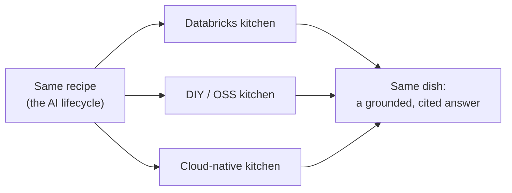
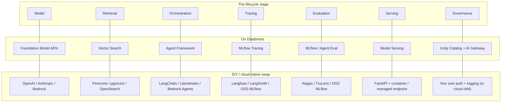
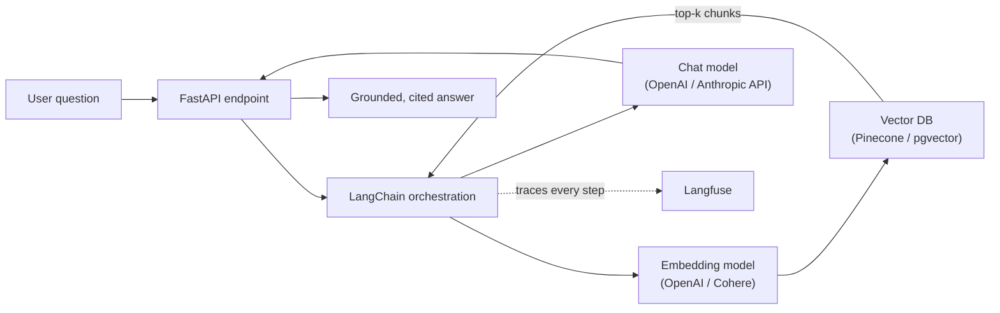

# Building AI Apps Elsewhere

> The same recipe cooks in a different kitchen. You already know how to make the dish — today you just learn where the oven and the knives live in someone else's kitchen.

Take a breath. If you have worked through this course, you have already built the hard thing: a RAG app and an agent, traced, evaluated, served, and governed. Everything in this lesson is that same work, done with different-branded tools. Nothing you learned expires the moment you leave Databricks. Let's prove it.

## Learning Objectives

By the end of this lesson, you will be able to:

- Explain why the AI app lifecycle (scope, build, trace, evaluate, serve, govern, monitor) is the **same** off Databricks.
- Name a representative **DIY / OSS stack** and a **cloud-native stack**, and map each piece to what you used on Databricks.
- Describe how a RAG app and an agent are assembled on a non-Databricks stack, step by step.
- Read a small, generic RAG code snippet and recognize that it looks almost identical to the one you already wrote.
- Be honest about what actually changes: more integration and operations work, and governance, lineage, security, and cost that are **not unified by default**.

## Prerequisites

You will get the most out of this lesson if you have already worked through:

- [The Concepts Are Portable](/docs/beyond-databricks/concepts-are-portable) — why the ideas, not the buttons, are what you really learned.
- [Building a RAG Pipeline End to End](/docs/rag-and-ai-search/rag-pipeline) — the RAG loop we are about to rebuild elsewhere.

If either feels fuzzy, that is completely fine. We reintroduce each piece as we use it. You do not need to memorize anything.

## Estimated Reading Time

About 20 to 25 minutes.

## Business Motivation

Let's ground this in a scene.

Imagine a small spin-off of **Northwind Trust** — a two-person prototyping team called **Northwind Labs**. Their job is to test ideas fast, before the parent firm commits budget. Northwind's production platform is Databricks, but Labs has been handed an AWS account and a mandate: *"Prove the advisor-assistant idea works, cheaply, this month."*

So the question lands on your desk: **can you rebuild the RAG assistant without Databricks?**

The honest answer is yes — and it is not even that different. The valuable skill is not clicking a specific vendor's buttons. It is knowing what pieces an AI app needs and how they fit together. That knowledge travels. This lesson shows you exactly how it travels, so that the next time someone hands you a different cloud, or a startup with no platform at all, you are not starting over. You are just relabeling the tools.

## Intuition

Here is the simplest way to picture it.

Think of a **recipe you already know by heart**. Say, a loaf of bread. You know the steps: mix, knead, prove, bake. Now walk into a friend's kitchen. Their oven has different dials. Their mixer is a different brand. The flour bin is on a different shelf. None of that changes the recipe. You still mix, knead, prove, bake. You just spend the first ten minutes finding where everything lives.

Building AI apps off Databricks is exactly that. The **recipe** — scope, build with a model plus retrieval plus tools, trace, evaluate, serve, govern, monitor — never changes. The **kitchen and the appliances** change. Your job is mostly to learn where the dials are.



*Figure 1: One recipe, three kitchens, the same dish. The lifecycle is fixed; only the appliances differ.*

Notice what the diagram is saying. The recipe on the left is single and shared. It branches into three kitchens in the middle. And on the right, all three produce the same result — a grounded, cited answer. That "same result" is the whole point of this part of the course.

## Theory

Every AI app, on any stack, is assembled from the same short list of parts. You have met all of them already. Here they are, named in the neutral, portable way the industry uses:

- **Model** — the LLM that generates text (and often a separate embedding model that turns text into vectors).
- **Retrieval** — a vector store plus a way to search it, so the app can look things up.
- **Orchestration** — the glue code that chains the steps: retrieve, build a prompt, call the model, maybe call a tool.
- **Tracing** — recording what happened on each request, step by step, so you can debug.
- **Evaluation** — scoring answer quality against a dataset, so you know if a change helped.
- **Serving** — putting the app behind an API endpoint so other software can call it.
- **Governance** — auth, access control, logging, cost tracking, safety guardrails, and lineage.
- **Monitoring** — watching quality, latency, and cost once real users arrive.

On Databricks these came bundled and wired together for you. Off Databricks, the same eight parts exist — you just pick a product (or a piece of open-source software) for each one and connect them yourself. That is the entire difference, and we are about to make it concrete.

## Deep Dive

Let's look at two representative stacks. Neither is the "right" one — they are just common, honest examples. Any real team mixes and matches.

### Stack A — Pure API plus open source (DIY)

This is the "assemble it yourself from the best free and paid parts" approach. It is popular with startups and small teams.

- **Model:** the OpenAI or Anthropic API for generation; an embedding model from OpenAI, Cohere, or an open model.
- **Orchestration / RAG:** LangChain or LlamaIndex — libraries that give you ready-made building blocks for retrieval and prompting.
- **Vector store:** Pinecone, Weaviate, Qdrant, or `pgvector` (which is just PostgreSQL with a vector column).
- **Tracing:** Langfuse or LangSmith.
- **Evaluation:** Ragas or TruLens.
- **Serving:** FastAPI (a Python web framework) running inside a container.
- **Governance:** your own auth, your own logging, your own cost tracking. You build it.

### Stack B — Cloud-native

This is the "use one cloud's managed AI services" approach. It bundles more governance for you, but it is specific to that cloud.

- **AWS:** Amazon Bedrock for models, OpenSearch or Kendra for retrieval, Bedrock Agents for orchestration, and Bedrock Guardrails for safety.
- **Azure:** Azure AI Foundry / Azure OpenAI for models and Azure AI Search for retrieval.
- **Google Cloud:** Vertex AI for models and Vertex AI Vector Search for retrieval.

:::note[Going deeper (optional)]
Two things worth knowing, because they mean even more of your skills carry over than you might expect.

First, **MLflow is open source.** The exact tracking, evaluation, and tracing APIs you learned on Databricks can run on a plain server, your laptop, or any cloud. You are not re-learning a concept — you are running the same library somewhere else.

Second, **MCP (Model Context Protocol) is an open standard.** The way you defined tools for an agent is portable. An MCP tool server you write can be called from an agent built on almost any of these stacks. The tool-calling skill you built is not Databricks-specific at all.
:::

### The map that matters

Here is the diagram to keep. It takes each stage of the lifecycle and shows the Databricks tool beside a typical DIY or cloud-native swap. Read it as "same job, different label."



*Figure 2: Same lifecycle, different tools. Each row is one job. The left column is the job, the middle is what you used on Databricks, the right is a common off-platform swap. Every row has a swap — nothing on the left is unique to one vendor.*

Read that last row carefully, because it is the honest catch. On Databricks, governance (row 7) was **one** thing — Unity Catalog and the AI Gateway covered permissions, lineage, logging, and cost in a single place. Off Databricks, that row usually becomes several separate tools, or code you write yourself. We come back to this in Production Considerations, because it is the difference that actually costs you effort.

## Architecture

Let's draw the DIY RAG app end to end, the way Northwind Labs would actually assemble it. Compare it to the pipeline diagram you saw in the RAG lesson — it is the same shape.



*Figure 3: The DIY RAG app. A question hits a FastAPI endpoint. LangChain embeds it, searches the vector DB for the top matching chunks, builds a prompt, and calls the chat model. Langfuse records every step (the dotted line). The endpoint returns a grounded, cited answer.*

Trace the arrows and you will recognize every hop. Embed the question, search for the closest chunks, hand those chunks and the question to the model, return the answer. That is the identical loop from [Building a RAG Pipeline End to End](/docs/rag-and-ai-search/rag-pipeline). The only new detail is that the endpoint, the vector DB, and the tracing tool are now three separate products you chose and connected, rather than three features of one platform.

## Internal Working

What is really happening inside that DIY flow, one layer down?

- **The embedding model** turns your question text into a vector — a list of numbers representing meaning. This is exactly what the embeddings lesson described. The API is different; the math is identical.
- **The vector DB** does a nearest-neighbor search: it finds the stored chunks whose vectors sit closest to your question's vector. Pinecone, Qdrant, and `pgvector` all do this; they just expose different function names.
- **The orchestration library** (LangChain or LlamaIndex) formats a prompt — a system message with your grounding rules, plus the retrieved chunks, plus the question — and sends it to the chat model. This is the same prompt assembly you did by hand.
- **The chat model** generates an answer from that prompt. Same idea as calling a foundation model on Databricks; the endpoint URL and auth header change.
- **Langfuse** receives a small record of each step — inputs, outputs, timing, token counts — and stores it so you can open a request later and see what happened. Same purpose as MLflow Tracing.

Nothing here is a new concept. Every box is a tool doing a job you already understand.

## Step-by-Step Walkthrough

Here is how Northwind Labs would build the DIY RAG assistant, and — in brackets — the Databricks step it replaces.

1. **Scope.** Decide the app answers advisor questions from Northwind's policy PDFs. *(Identical to Databricks. Scoping is a thinking step, not a tool step.)*
2. **Prepare data and embed.** Chunk the PDFs, run each chunk through the embedding model, and store the vectors in Pinecone or `pgvector`. *(Replaces creating a Vector Search index.)*
3. **Build the RAG chain.** Use LangChain to wire retrieval, prompt assembly, and the chat-model call into one function. *(Replaces the Agent Framework chain you authored.)*
4. **Add tools (if it is an agent).** Register tools — for example, a "look up account balance" function — using function calling, or expose them over MCP. *(Replaces Unity Catalog tools; MCP works either way.)*
5. **Trace.** Point the chain at Langfuse so every request is recorded. *(Replaces MLflow Tracing — and note, you could even use open-source MLflow here.)*
6. **Evaluate.** Run a Ragas evaluation over a small test set of questions and expected answers. *(Replaces Agent Evaluation / MLflow eval.)*
7. **Serve.** Wrap the chain in a FastAPI endpoint and put it in a container. *(Replaces Model Serving.)*
8. **Govern.** Add an auth check on the endpoint, log every call, and track token spend yourself. *(Replaces Unity Catalog + AI Gateway — and this is the step that grows the most, because you now assemble it.)*
9. **Monitor.** Watch Langfuse dashboards and your logs for quality, latency, and cost. *(Replaces production monitoring on Databricks.)*

Nine steps. Same nine you would run on Databricks. Steps 8 is where the extra work concentrates — hold that thought.

## Hands-on Examples

Two quick sketches, so both stacks feel real.

**DIY (Stack A).** Northwind Labs spins up a `pgvector` table in a small Postgres instance, embeds 300 policy chunks with the OpenAI embeddings API, writes a 40-line LangChain function, wraps it in FastAPI, and deploys the container to a cheap cloud VM. Langfuse (self-hosted, free) captures traces. A weekend's work for a prototype.

**Cloud-native (Stack B).** A different Northwind team on AWS uploads the same PDFs to an S3 bucket, points a Bedrock Knowledge Base at it (Bedrock handles chunking, embedding, and the vector store for them), attaches a Bedrock Guardrail for safety, and calls it from a Bedrock Agent. Less glue code, more managed. But it only runs on AWS, and the bill and the config live in AWS's console, not in a unified catalog.

Both produce the same advisor assistant. They differ in how much you assemble versus how much the cloud assembles for you.

## Code Examples

Here is the payoff moment. Below is a conceptual RAG snippet on a DIY stack, using a generic OpenAI-style client and a generic vector-DB client. Look at how close it is to the Databricks version you already wrote.

```python
# Illustrative pseudo-real code. Names are simplified to show the shape,
# not to copy-paste. Real LangChain / Pinecone code has a few more details.

from openai import OpenAI            # generic "OpenAI-style" chat + embedding client
from vectordb import VectorClient    # stand-in for Pinecone / Qdrant / pgvector

llm = OpenAI(api_key="...")           # the model
index = VectorClient(name="northwind-policies")   # the vector store

SYSTEM_PROMPT = (
    "Answer only using the provided policy context. "
    "If the answer is not in the context, say you don't know. "
    "Cite the source for each fact."
)

def answer_question(question: str) -> str:
    # 1. Embed the question
    q_vector = llm.embeddings.create(
        model="text-embedding-3-small",
        input=question,
    ).data[0].embedding

    # 2. Retrieve the top-k chunks (with their source metadata)
    hits = index.query(vector=q_vector, top_k=3)
    context = "\n\n".join(
        f"[Source: {h.metadata['source']}] {h.text}" for h in hits
    )

    # 3. Build the prompt and 4. call the chat model
    response = llm.chat.completions.create(
        model="gpt-4o-mini",
        temperature=0.0,
        messages=[
            {"role": "system", "content": SYSTEM_PROMPT},
            {"role": "user", "content": f"Context:\n{context}\n\nQuestion: {question}"},
        ],
    )
    return response.choices[0].message.content
```

Let's read it together, because the resemblance is the lesson.

- **Two clients, created once** — one for the model, one for the vector store. On Databricks you created a serving client and a Vector Search index handle. Same two objects, different constructors.
- **The same system prompt** — ground only in context, say "I don't know," cite sources. Word for word, this is the trust rule from the RAG lesson. It is not stack-specific at all.
- **Embed, then query, then prompt, then generate** — the exact four steps of the RAG loop. The function names (`embeddings.create`, `index.query`, `chat.completions.create`) differ from the Databricks SDK, but the sequence is identical.
- **`temperature=0.0`, `top_k=3`, source metadata kept for citations** — the same small choices you learned to make for trustworthy answers.

If you squint, you cannot tell which platform this runs on. That is exactly the point: the skill transferred. The only honest caveat is the comment at the top — real LangChain and Pinecone code has a few more setup lines, and this is simplified to show the shape.

## Production Considerations

Here is where the two kitchens genuinely diverge, and it would be dishonest to pretend otherwise.

- **You integrate and operate more yourself.** On Databricks, the parts were pre-wired. In a DIY stack, you are responsible for connecting eight tools, upgrading them, and keeping them talking to each other. When Pinecone changes an API or Langfuse ships a new version, that is your afternoon.
- **Governance is not unified by default.** This is the big one, and it ties straight back to the previous lesson. On Databricks, Unity Catalog gave you one place for permissions, lineage, and audit. In a DIY stack, permissions live in your FastAPI code, lineage lives nowhere unless you build it, and audit logs are scattered across each tool. Cloud-native stacks bundle more (AWS IAM, Bedrock Guardrails), but only for that one cloud, and still not in a single lineage view spanning your data and your models.
- **Cost is not centralized.** Your model bill is on OpenAI, your vector bill is on Pinecone, your serving bill is on your cloud VM. Nobody adds them up for you. You build cost tracking yourself, or fly partly blind.
- **You own uptime.** A self-hosted FastAPI endpoint is up because you keep it up.

None of this makes the DIY path wrong. Startups ship this way every day. It just means the effort that Databricks spent on integration and governance does not vanish — it moves onto your plate. Go in knowing that.

## Performance Considerations

The performance levers are the same ones you already know; only the dials move.

- **Retrieval speed** depends on your vector DB and its index settings. `pgvector` on a small box is fine for a prototype; Pinecone or a tuned OpenSearch cluster scales further. Same trade-off you weighed with Vector Search.
- **Model latency** depends on the provider and the model size. A smaller model answers faster and cheaper, exactly as it did on Databricks.
- **`top_k`** still trades recall for prompt size and cost. Start at 3.
- **Caching** repeated questions or embeddings saves money and time on any stack, and you now have to add it yourself.

The reasoning is identical to what you learned. You are just turning the dials in a different console.

## Security Considerations

Security concepts port directly; the responsibility shifts toward you.

- **Secrets.** Your API keys for OpenAI, Pinecone, and the rest must live in a secrets manager, never in code. On Databricks, secrets were a built-in feature. In a DIY stack, you wire up your cloud's secrets service yourself.
- **Auth on the endpoint.** Your FastAPI app needs its own authentication — who is allowed to call it. This was handled for you before; now it is a middleware you add.
- **Data residency and privacy.** When you send chunks to a third-party model API, that data leaves your walls. For a regulated firm like Northwind, that matters. Cloud-native options (Bedrock, Azure OpenAI) keep data inside the cloud tenant, which is often why regulated teams prefer them.
- **Guardrails.** Input and output safety filtering is a component you add — Bedrock Guardrails in cloud-native, or an open-source library / your own checks in DIY.

The threats are the same threats. The difference is that the mitigations are now yours to install.

## Common Mistakes

- **Assuming you have to relearn everything.** You do not. The concepts are portable. Reach for the mental model first, the SDK docs second.
- **Forgetting governance until launch day.** The most common and most painful mistake off-platform. Auth, logging, and cost tracking are not free here — plan them into the build, not after it.
- **Over-engineering the prototype.** Northwind Labs does not need Kubernetes to prove an idea. `pgvector` and one small VM are plenty. Match the stack to the stage.
- **Picking tools before knowing the job.** Choose the vector DB and model after you know your data size, latency needs, and privacy rules — not because a blog post recommended one.
- **Ignoring data residency.** Sending regulated data to an external model API without checking the privacy terms can be a compliance problem. Check first.

## Best Practices

- **Map before you build.** Write the eight-row table (model, retrieval, orchestration, tracing, eval, serving, governance, monitoring) and fill in your chosen tool for each. If a row is blank, you have a gap.
- **Keep open standards in the middle.** Prefer open-source MLflow for tracking and MCP for tools. They keep you portable and reduce lock-in.
- **Start with the smallest stack that proves the idea.** Scale the appliances later; get the recipe working first.
- **Build governance in from step one.** Even a prototype should have auth on the endpoint and a log of every call.
- **Reuse your test set.** The evaluation dataset you built on Databricks works with Ragas too. Quality is quality, wherever you measure it.

## Interview Questions

1. **A startup with no data platform asks you to build a RAG assistant. Where do you begin?** Start with the lifecycle, not the tools. Scope the app, then choose one component for each of the eight jobs: model, retrieval, orchestration, tracing, evaluation, serving, governance, monitoring. A representative DIY choice would be an OpenAI or Anthropic API model, LangChain for orchestration, a vector DB like Pinecone or `pgvector`, Langfuse for tracing, Ragas for eval, FastAPI for serving, and self-built auth and logging for governance.

2. **What is genuinely harder about building AI apps off a unified platform like Databricks?** Integration and governance. You wire together and operate eight separate tools yourself, and governance — permissions, lineage, audit, and cost — is no longer unified in one place. Cloud-native stacks bundle more of this than pure DIY, but only within a single cloud and still without a single lineage view across data and models.

3. **How much of what you learned on Databricks actually transfers to another stack?** Nearly all of it. The lifecycle is identical, and the concepts (embeddings, retrieval, prompting, grounding, tracing, evaluation) are the same. Two things are even literally portable: MLflow is open source, so the same tracking and eval APIs run anywhere, and MCP is an open tool standard usable across stacks.

4. **Compare a DIY stack to a cloud-native stack for a regulated company.** DIY (API model plus LangChain plus a vector DB plus Langfuse plus Ragas plus FastAPI) is cheap and flexible but leaves data residency, auth, and cost tracking entirely to you. Cloud-native (Bedrock, Azure OpenAI, or Vertex) bundles more governance and keeps data inside the cloud tenant, which regulated teams often need, but it is specific to that one cloud.

5. **Show me, in words, that DIY RAG code looks like Databricks RAG code.** Both create a model client and a vector-store handle once, use the same grounding system prompt, then run the same four steps: embed the question, retrieve the top-k chunks with source metadata, build a prompt from system rules plus chunks plus question, and call the chat model at low temperature. Only the SDK function names differ.

## Quiz

**Question 1.** In the "same recipe, different kitchen" analogy, what does the recipe represent, and what do the kitchen and appliances represent?

<details>

<summary>Show answer</summary>

The recipe is the AI app lifecycle — scope, build, trace, evaluate, serve, govern, monitor — which never changes. The kitchen and appliances are the specific tools (Databricks, a DIY stack, or a cloud-native stack), which do change.

</details>

**Question 2.** Name the eight lifecycle jobs and give one DIY tool for each.

<details>

<summary>Show answer</summary>

Model (OpenAI/Anthropic API), retrieval (Pinecone/pgvector), orchestration (LangChain/LlamaIndex), tracing (Langfuse/LangSmith), evaluation (Ragas/TruLens), serving (FastAPI in a container), governance (your own auth and logging), and monitoring (Langfuse dashboards and your logs).

</details>

**Question 3.** Which lifecycle stage grows the most when you leave a unified platform, and why?

<details>

<summary>Show answer</summary>

Governance. On Databricks, Unity Catalog and the AI Gateway unified permissions, lineage, audit, and cost in one place. Off-platform, those become several separate tools or code you write yourself, so it is not unified by default. Cloud-native stacks bundle more than DIY but only within one cloud.

</details>

**Question 4.** Two things you learned on Databricks are literally portable — the same software runs elsewhere. What are they?

<details>

<summary>Show answer</summary>

MLflow (open source), so the same tracking, tracing, and evaluation APIs run off Databricks; and MCP (Model Context Protocol), an open tool standard, so agent tools you define work across stacks.

</details>

## Summary

You just rebuilt the course, off-platform, in your head. The AI app lifecycle — scope, build with a model plus retrieval plus tools, trace, evaluate, serve, govern, monitor — is the same on any stack. A DIY stack assembles it from an API model, LangChain or LlamaIndex, a vector DB, Langfuse, Ragas, and FastAPI. A cloud-native stack uses Bedrock, Azure, or Vertex and bundles more governance, but only within one cloud. The RAG code looks nearly identical to what you wrote before — same clients, same grounding prompt, same four steps. The honest catch is that you integrate and operate more yourself, and governance, lineage, security, and cost are not unified for you by default. But the core skills? Completely transferable.

## Key Takeaways

- The lifecycle is identical everywhere; only the tools are swapped.
- Every AI app is eight jobs: model, retrieval, orchestration, tracing, evaluation, serving, governance, monitoring.
- DIY stack: API model + LangChain/LlamaIndex + vector DB + Langfuse + Ragas + FastAPI + your own governance.
- Cloud-native stack: Bedrock, Azure, or Vertex — more governance bundled, but cloud-specific.
- MLflow (open source) and MCP (open standard) make even more of your skills literally portable.
- The real cost off-platform is integration work and non-unified governance, security, lineage, and cost.
- The RAG code, and your skills, look nearly the same wherever you build.

## Glossary

- **Lifecycle:** The fixed sequence of stages every AI app goes through — scope, build, trace, evaluate, serve, govern, monitor.
- **DIY / OSS stack:** An AI app assembled from separately chosen open-source and API components.
- **Cloud-native stack:** An AI app built on one cloud's managed AI services (AWS Bedrock, Azure AI, Google Vertex AI).
- **Orchestration:** The glue code that chains retrieval, prompting, model calls, and tools; e.g. LangChain, LlamaIndex.
- **Vector DB:** A store that holds embeddings and finds the nearest ones; e.g. Pinecone, Weaviate, Qdrant, pgvector.
- **Langfuse / LangSmith:** Tools that record traces of each request for debugging, off Databricks.
- **Ragas / TruLens:** Libraries that score RAG and agent answer quality against a dataset.
- **FastAPI:** A Python web framework used to serve an app behind an API endpoint.
- **MLflow:** An open-source platform for tracking, tracing, and evaluating ML and AI, usable on or off Databricks.
- **MCP (Model Context Protocol):** An open standard for defining tools an agent can call, portable across stacks.
- **Bedrock / Azure OpenAI / Vertex AI:** The managed AI model services of AWS, Azure, and Google Cloud.
- **Unified governance:** Permissions, lineage, audit, and cost managed in one place — the thing you rebuild yourself off-platform.

## Further Reading

- [Databricks Generative AI overview](https://docs.databricks.com/aws/en/generative-ai/generative-ai)
- [Databricks Vector Search overview](https://docs.databricks.com/aws/en/generative-ai/vector-search)
- [MLflow Tracing on Databricks](https://docs.databricks.com/aws/en/mlflow/tracing)
- [Unity Catalog governance overview](https://docs.databricks.com/aws/en/data-governance/unity-catalog/)

(You may also explore LangChain, LlamaIndex, Pinecone, Langfuse, Ragas, Amazon Bedrock, Azure AI Foundry, and Google Vertex AI documentation directly — each vendor's own docs are the best guide to that tool.)

## Next Lesson

You have seen the whole picture now — the concepts, what a regulated company gives up off-platform, and how the same apps get built elsewhere. Time to turn all of it into interview-ready answers.

➡️ [Part 11 · Interview Prep](/docs/beyond-databricks/interview-prep)
