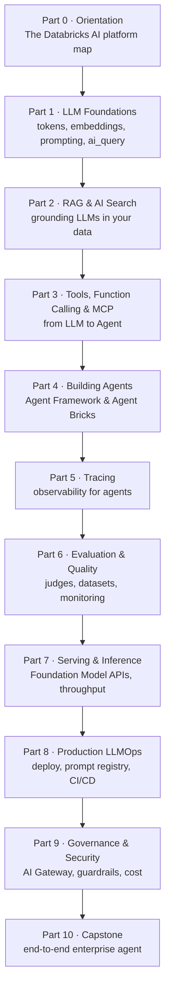

# Start Here

Welcome to **Databrickster** — a free, in-depth course that takes an experienced
**Data Engineer** from *"I've never really used AI"* all the way to *"I can design,
build, evaluate, deploy, govern, and operate production-grade AI Agents on
Databricks."*

This is **not** a documentation rewrite, a blog, or a course summary. It is a
structured learning platform. Every concept is explained the way a great professor
would explain it: define it, motivate it, connect it to something you already
know, then go deep — intuition → architecture → implementation → production →
optimization.

## Who this is for

You are the target reader if you are comfortable with most of this list:

- SQL, Spark, and the DataFrame API
- Delta Lake, the medallion architecture, and ETL/ELT pipelines
- Data warehousing and dimensional modeling
- Cloud platforms and Databricks (jobs, clusters, Unity Catalog basics)

…**and** you have gaps in AI, LLMs, RAG, agents, prompt engineering, evaluation,
and production AI systems. That's exactly who this course is written for. We never
assume AI knowledge, and we teach every new AI idea by anchoring it to a Data
Engineering concept you already own.

:::note[Cloud scope]
This course uses the **AWS** Databricks documentation as its canonical reference.
The AI concepts are identical across clouds; where a link or a setup step is
AWS-specific, we'll say so.
:::

## How each lesson is structured

Every lesson follows the same rhythm so you always know where you are:

**Learning Objectives · Prerequisites · Reading Time · Business Motivation ·
Intuition · Theory · Deep Dive · Architecture · Internal Working · Step-by-Step
Walkthrough · Hands-on Examples · Code · Production / Performance / Security
Considerations · Common Mistakes · Best Practices · Interview Questions · Quiz ·
Summary · Key Takeaways · Glossary · Further Reading · Next Lesson.**

Diagrams are everywhere (Mermaid + ASCII), and every code example is meant to be
runnable on current Databricks APIs.

## The learning roadmap

The official Databricks docs are organized by **product feature** — great as a
reference, but it assumes you already understand AI. We reorganized the *same
material* into a **dependency-ordered learning journey** and added the AI
foundations the docs assume you have.

| Part | Title | What you'll be able to do |
|------|-------|---------------------------|
| **0** | Orientation | Know where every Databricks AI product fits and why |
| **1** | LLM Foundations for Data Engineers | Explain tokens, embeddings, context windows, sampling; call an LLM from SQL |
| **2** | Grounding LLMs in Your Data: RAG & AI Search | Build a retrieval pipeline over your own data |
| **3** | From LLM to Agent: Tools, Function Calling & MCP | Give a model tools and understand the agent loop |
| **4** | Building Agents on Databricks | Author agents (ResponsesAgent) and use Agent Bricks |
| **5** | Observability: Tracing Agents | Instrument and debug nondeterministic systems with MLflow Tracing |
| **6** | Evaluation & Quality | Measure agent quality with datasets, LLM judges, and monitoring |
| **7** | Serving & Inference Deep Dive | Choose and tune Foundation Model APIs and serving |
| **8** | Deploying to Production (LLMOps) | Register, deploy, version prompts, and ship with CI/CD |
| **9** | Governance, Security & Cost | Govern with Unity AI Gateway; guardrails, PII, budgets, audit |
| **10** | Capstone | Build one enterprise agent end-to-end |

## How to use this site

- **Go in order.** Each Part builds on the previous one. If a lesson lists a
  prerequisite you haven't met, follow it first.
- **Do the hands-on sections.** Reading about agents is not the same as building
  one. Run the code in a Databricks workspace as you go.
- **Use the quizzes and interview questions** to check yourself before moving on.

Ready? Start with **[Part 0 — Orientation](/docs/category/part-0-orientation)**.

:::info[Independent project]
Databrickster is a free, independent educational resource. It is **not affiliated
with, endorsed by, or sponsored by Databricks, Inc.** "Databricks" and related
marks belong to their respective owners.
:::
